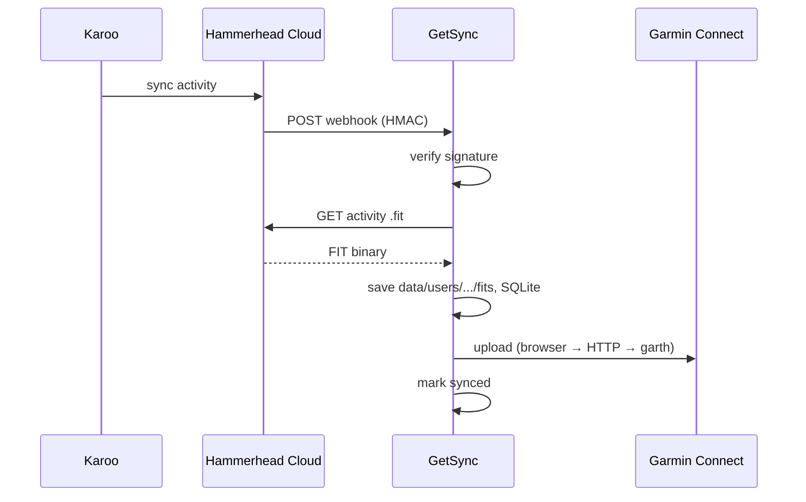

<p align="center">
  
</p>

<h1 align="center">GetSync</h1>

<p align="center">
  <a href="https://getsync.me">getsync.me</a> — синхронизация тренировок <strong>Hammerhead Karoo</strong> → <strong>Garmin Connect</strong>
</p>

<p align="center"><small>Документация: <strong>v0.7.0</strong> · обновлено 2026-05-27 · <a href="docs/DOC-CONVENTION.md">соглашение о документах</a></small></p>

<p align="center">
  
  <a href="https://github.com/segallar/getsync/actions/workflows/test.yml"></a>
</p>

---

После поездки Karoo загружает активность в Hammerhead Cloud. **GetSync** получает webhook, скачивает оригинальный `.fit` через официальный Hammerhead API и загружает его в Garmin Connect — без правок трека (GPS, мощность, пульс, каденс остаются как на Karoo).

Hammerhead и Garmin не синхронизируют активности между собой. Если история и аналитика ведутся в Garmin Connect, каждую поездку с Karoo приходилось переносить вручную — этот сервис делает это в фоне.

## Architecture

Webhook-сервис на FastAPI: Hammerhead шлёт событие → скачиваем `.fit` → загружаем в Garmin → фиксируем в SQLite.



1. Тренировка завершена → Karoo синхронизируется с Hammerhead Cloud  
2. Hammerhead шлёт webhook на `/webhooks/hammerhead`  
3. Сервис скачивает `.fit` (retry 5 / 15 / 30 с)  
4. FIT загружается в Garmin Connect (web JWT → Playwright → HTTP → garth-ng)  
5. ID активности в SQLite — повтор не создаёт дубликат  

### Stack

| Слой | Выбор |
|------|-------|
| Язык | Python 3.11+ |
| HTTP / webhook | FastAPI + uvicorn |
| Hammerhead | OAuth 2.0 API (`activity:read`) |
| Garmin Connect | Web JWT + Playwright → HTTP upload → garth-ng |
| Состояние | SQLite |
| CLI | typer (`getsync`) |
| Веб-UI | Jinja2 + HTMX |
| Деплой | nginx + systemd |

### Компоненты

| Модуль | Назначение |
|--------|------------|
| `hammerhead/` | OAuth, API client, скачивание FIT |
| `garmin/` | Web-сессия, upload (browser / HTTP / garth) |
| `credentials/` | Encrypted per-user secrets (**2.16**) |
| `mail/` | Исходящая почта: null / console / Resend (infra) |
| `sync/service.py` | id → FIT → upload → state, backfill |
| `web/app.py` | Webhook + веб-UI |
| `state/store.py` | SQLite: activities, sync_events |
| `data/` | tokens, FIT-кэш, garth session |

Подробнее: [docs/ARCHITECTURE.md](docs/ARCHITECTURE.md).

## Возможности

- Webhook от Hammerhead + ручной backfill (`getsync sync`); routing по `userId` → tenant
- Multi-tenant: несколько пользователей на одном инстансе, admin CRUD
- Загрузка в Garmin Connect (неофициальный web API + [garth-ng](https://pypi.org/project/garth-ng/))
- Кабинет: activities (календарь/список), settings, admin sync log + JWT log; скачивание `.fit`
- Саморегистрация `/register` при `REGISTRATION_OPEN`
- CLI: OAuth Hammerhead, сессия Garmin (`--save-credentials`), sync, `serve`, `mail test`
- Дедупликация и история в SQLite

## Требования

- Python **3.11+**
- Аккаунт [Hammerhead Developer](https://support.hammerhead.io/hc/en-us/articles/43558376710683-Creating-a-Developer-Account) (OAuth client, scope `activity:read`)
- Аккаунт Garmin Connect
- Для production: VPS, nginx (TLS), systemd — см. [docs/CI-CD.md](docs/CI-CD.md)

## Быстрый старт (локально)

```bash
git clone https://github.com/segallar/getsync.git
cd getsync

python3 -m venv .venv
source .venv/bin/activate
pip install -e .

cp .env.example .env
# заполнить HAMMERHEAD_* и GETSYNC_SECRETS_KEY; Garmin — в Settings / CLI per-user
```

### Hammerhead

```bash
getsync hammerhead auth      # OAuth в браузере → data/users/default/hammerhead_tokens.json
getsync hammerhead status
```

В [Developer Portal](https://www.hammerhead.io/pages/developer-platform) укажите redirect URI: `http://127.0.0.1:8765/callback`.  
Webhook URL (production): `https://app.getsync.me/webhooks/hammerhead` — секрет в `HAMMERHEAD_WEBHOOK_SECRET`.

Подробнее: [docs/API_HAMMERHEAD.md](docs/API_HAMMERHEAD.md).

### Garmin Connect

```bash
getsync garmin login           # интерактивный логин (garth-ng)
getsync garmin login --save-credentials   # сохранить в connections/garmin/ (2.16)
getsync garmin status          # upload_ready = валиден web JWT
getsync garmin refresh-web     # обновить web-сессию для upload
```

Для upload без интерактива можно импортировать cookies:

```bash
getsync garmin import-web-cookies '{"JWT_WEB":"...","session":"Fe26..."}'
```

Подробнее: [docs/API_GARMIN.md](docs/API_GARMIN.md).

### Синхронизация и сервер

```bash
getsync sync --since 2025-01-01
getsync sync --activity-id <id> [--force]

getsync serve                  # http://127.0.0.1:8080 — webhook + UI
```

Проверка: `curl -s http://127.0.0.1:8080/health`

## Конфигурация (`.env`)

| Переменная | Назначение |
|------------|------------|
| `HAMMERHEAD_*` | OAuth приложение + webhook (Developer Portal) |
| `GETSYNC_SECRETS_KEY` | Fernet для `data/users/…/secrets.enc` (авто-перелогин Garmin) |
| `SESSION_SECRET` / `SESSION_COOKIE_SECURE` | Cookie входа в `/app` |
| `DATA_DIR` | Каталог данных (по умолчанию `data`) |
| `REGISTRATION_OPEN` / `BOOTSTRAP_ADMIN_EMAIL` | Регистрация и первый admin |
| `MAIL_*` / `APP_PUBLIC_URL` | Почта Resend (опционально) |
| Garmin login/password | Только per-user (Settings), не в `.env` |

Полный список — [`.env.example`](.env.example).

Файлы данных (не коммитить): `data/getsync.db`, per-tenant `data/users/{id}/` (tokens, `activities/`, `connections/garmin/`, `garmin_web/`, `garth/`). См. [docs/STORAGE.md](docs/STORAGE.md), [docs/DATABASE.md](docs/DATABASE.md), [docs/CREDENTIALS.md](docs/CREDENTIALS.md).

## Веб-интерфейс

| Путь | Описание |
|------|----------|
| `/` | Лендинг (Login / Sign up) |
| `/register` | Регистрация (`REGISTRATION_OPEN=true`) |
| `/app/login` | Вход (cookie `getsync_session`) |
| `/app/` | → redirect `/app/activities` |
| `/app/activities` | Календарь/список, sync summary, скачивание FIT |
| `/app/settings` | Профиль, Hammerhead/Garmin connections |
| `/app/admin/` | Users (admin) |
| `/app/admin/sync-log` | Журнал sync (все tenants) |
| `/app/admin/log` | Garmin JWT log (admin) |
| `/app/log` | → redirect `/app/admin/sync-log` |

В production UI за nginx (TLS); `SESSION_COOKIE_SECURE=true`. Приложение слушает только `127.0.0.1`.

## Деплой и CI

- **CI:** GitHub Actions — test + deploy на `main` (`checkout@v6`, `setup-python@v6`, Node 24)
- **Ручной deploy:** rsync + systemd — [docs/CI-CD.md](docs/CI-CD.md)
- Юниты: `deploy/getsync.service`, `deploy/nginx/getsync.conf`

## Документация

| Документ | Содержание |
|----------|------------|
| [docs/README.md](docs/README.md) | Индекс документации, соглашения, URL production |
| [docs/ARCHITECTURE.md](docs/ARCHITECTURE.md) | Архитектура v1, tenants, компоненты, фазы |
| [docs/PLAN.md](docs/PLAN.md) | Roadmap · [VISION](docs/VISION.md) · [архив](docs/archive/) |
| [docs/VISION.md](docs/VISION.md) | Product vision, стратегия, 3 горизонта |
| [docs/DOMAIN-MODEL.md](docs/DOMAIN-MODEL.md) | Canonical domain model v0 |
| [docs/CREDENTIALS.md](docs/CREDENTIALS.md) | Per-user secrets, auto re-login Garmin |
| [docs/CI-CD.md](docs/CI-CD.md) | Сервер, nginx, certbot, deploy |
| [docs/API_HAMMERHEAD.md](docs/API_HAMMERHEAD.md) | OAuth, webhook, REST |
| [docs/API_GARMIN.md](docs/API_GARMIN.md) | Web JWT, upload, garth-ng |

## Ограничения

- Подтверждение email не реализовано — **2.6** / **2.1e** (`REGISTRATION_OPEN=false` на prod по умолчанию)
- Garmin **первичный** login — CLI; форма в Settings — **2.12**
- Только **активности** Hammerhead → Garmin (не маршруты / workouts)
- Garmin — через **неофициальный** API; возможны изменения со стороны Garmin
- Секреты в `.env` и `data/users/{id}/` на сервере, не в git

## Разработка

```bash
pip install -e .
python -m compileall -q getsync
python -m unittest discover -s tests -p "test_*.py" -v
```

## Статус

Production на [app.getsync.me](https://app.getsync.me) (Hetzner **breeze**). CI деплоит только на breeze. Staging vhost: [breeze.romansegalla.online](https://breeze.romansegalla.online). **v0.7:** дизайн кабинета (**2.10**), Garmin login в UI (**2.12**). Roadmap: [docs/PLAN.md](docs/PLAN.md) · ops: [docs/CI-CD.md](docs/CI-CD.md#тестовый-сервер-breeze).

---

**Disclaimer:** независимый проект, не аффилирован с Hammerhead или Garmin. Используйте на свой риск; соблюдайте ToS обеих платформ.
