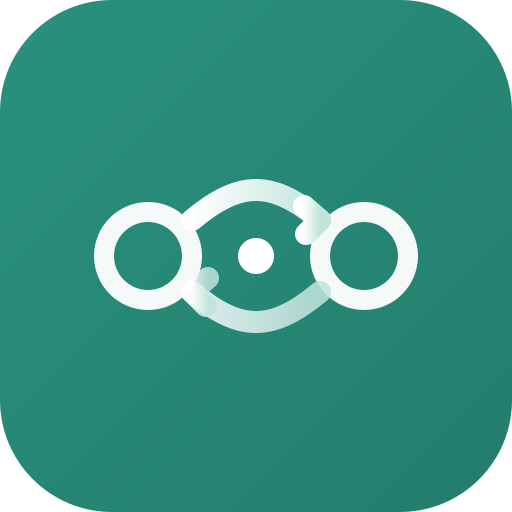
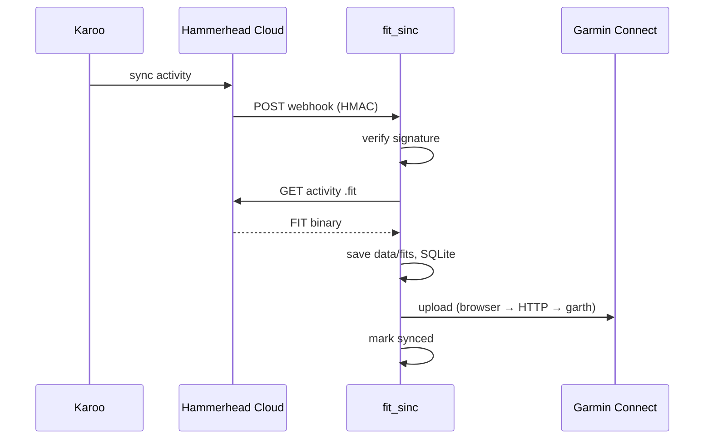

<p align="center">
  
</p>

<h1 align="center">fit_sinc</h1>

<p align="center">
  Автоматическая синхронизация велотренировок <strong>Hammerhead Karoo</strong> → <strong>Garmin Connect</strong>
</p>

<p align="center">
  
  <a href="https://github.com/segallar/fit-sinc/actions/workflows/test.yml"></a>
  <a href="https://github.com/segallar/fit-sinc/actions/workflows/deploy.yml"></a>
</p>

---

После поездки Karoo загружает активность в Hammerhead Cloud. **fit_sinc** получает webhook, скачивает оригинальный `.fit` через официальный Hammerhead API и загружает его в Garmin Connect — без правок трека (GPS, мощность, пульс, каденс остаются как на Karoo).

Hammerhead и Garmin не синхронизируют активности между собой. Если история и аналитика ведутся в Garmin Connect, каждую поездку с Karoo приходилось переносить вручную — этот сервис делает это в фоне.

## Architecture

Webhook-сервис на FastAPI: Hammerhead шлёт событие → скачиваем `.fit` → загружаем в Garmin → фиксируем в SQLite.



1. Тренировка завершена → Karoo синхронизируется с Hammerhead Cloud  
2. Hammerhead шлёт webhook на `/webhooks/hammerhead`  
3. Сервис скачивает `.fit` (retry 5 / 15 / 30 с)  
4. FIT загружается в Garmin Connect (web JWT → Playwright → HTTP → garth-ng)  
5. ID активности в SQLite — повтор не создаёт дубликат  

### Stack

| Слой | Выбор |
|------|-------|
| Язык | Python 3.11+ |
| HTTP / webhook | FastAPI + uvicorn |
| Hammerhead | OAuth 2.0 API (`activity:read`) |
| Garmin Connect | Web JWT + Playwright → HTTP upload → garth-ng |
| Состояние | SQLite |
| CLI | typer |
| Веб-UI | Jinja2 + HTMX |
| Деплой | nginx + systemd |

### Компоненты

| Модуль | Назначение |
|--------|------------|
| `hammerhead/` | OAuth, API client, скачивание FIT |
| `garmin/` | Web-сессия, upload (browser / HTTP / garth) |
| `sync/service.py` | id → FIT → upload → state, backfill |
| `web/app.py` | Webhook + веб-UI |
| `state/store.py` | SQLite: activities, sync_events |
| `data/` | tokens, FIT-кэш, garth session |

Подробнее: [docs/ARCHITECTURE.md](docs/ARCHITECTURE.md).

## Возможности

- Webhook от Hammerhead + ручной backfill (`fit_sinc sync`)
- Загрузка в Garmin Connect (неофициальный web API + [garth-ng](https://pypi.org/project/garth-ng/))
- Веб-панель: дашборд, список активностей, лог синхронизации, скачивание `.fit`
- CLI: OAuth Hammerhead, сессия Garmin, sync, `serve`
- Дедупликация и история в SQLite

## Требования

- Python **3.11+**
- Аккаунт [Hammerhead Developer](https://support.hammerhead.io/hc/en-us/articles/43558376710683-Creating-a-Developer-Account) (OAuth client, scope `activity:read`)
- Аккаунт Garmin Connect
- Для production: VPS, nginx (TLS), systemd — см. [docs/CI-CD.md](docs/CI-CD.md)

## Быстрый старт (локально)

```bash
git clone https://github.com/segallar/fit-sinc.git
cd fit-sinc

python3 -m venv .venv
source .venv/bin/activate
pip install -e .

cp .env.example .env
# заполнить HAMMERHEAD_* и при необходимости GARMIN_*
```

### Hammerhead

```bash
fit_sinc hammerhead auth      # OAuth в браузере, токены → data/hammerhead_tokens.json
fit_sinc hammerhead status
```

В [Developer Portal](https://www.hammerhead.io/pages/developer-platform) укажите redirect URI: `http://127.0.0.1:8765/callback`.  
Webhook URL (production): `https://<ваш-домен>/webhooks/hammerhead` — секрет в `HAMMERHEAD_WEBHOOK_SECRET`.

Подробнее: [docs/API_HAMMERHEAD.md](docs/API_HAMMERHEAD.md).

### Garmin Connect

```bash
fit_sinc garmin login           # интерактивный логин (garth-ng)
fit_sinc garmin status          # upload_ready = валиден web JWT
fit_sinc garmin refresh-web     # обновить web-сессию для upload
```

Для upload без интерактива можно импортировать cookies:

```bash
fit_sinc garmin import-web-cookies '{"JWT_WEB":"...","session":"Fe26..."}'
```

Подробнее: [docs/API_GARMIN.md](docs/API_GARMIN.md).

### Синхронизация и сервер

```bash
fit_sinc sync --since 2025-01-01
fit_sinc sync --activity-id <id> [--force]

fit_sinc serve                  # http://127.0.0.1:8080 — webhook + UI
```

Проверка: `curl -s http://127.0.0.1:8080/health`

## Конфигурация (`.env`)

| Переменная | Назначение |
|------------|------------|
| `HAMMERHEAD_CLIENT_ID` / `SECRET` | OAuth приложение Hammerhead |
| `HAMMERHEAD_WEBHOOK_SECRET` | HMAC для `X-Hmac-Signature` |
| `HAMMERHEAD_REDIRECT_URI` | По умолчанию `http://127.0.0.1:8765/callback` |
| `GARMIN_EMAIL` / `PASSWORD` | Опционально для CLI |
| `DATA_DIR` | Каталог данных (по умолчанию `data`) |

Файлы данных (не коммитить): `data/hammerhead_tokens.json`, `data/garth/`, `data/fits/`, `data/fit_sinc.db`.

## Веб-интерфейс

| Путь | Описание |
|------|----------|
| `/` | Дашборд, последние тренировки |
| `/activities` | Таблица HH/Garmin, фильтры |
| `/log` | Лог webhook / download / upload |
| `/session` | Статус Garmin web-сессии |
| `/activities/{id}/fit` | Скачать `.fit` |
| `POST /activities/{id}/retry` | Повторить sync |

В production UI обычно за nginx с Basic Auth; приложение слушает только `127.0.0.1`.

## Деплой и CI

- **CI:** GitHub Actions — **Tests** (push/PR) и **Deploy** (sirocco после Test на `main`; badges в шапке)
- **Ручной deploy:** rsync + systemd — [docs/CI-CD.md](docs/CI-CD.md)
- Юниты: `deploy/fit-sinc.service`, `deploy/nginx/fit.conf`

## Документация

| Документ | Содержание |
|----------|------------|
| [docs/ARCHITECTURE.md](docs/ARCHITECTURE.md) | Архитектура v1, компоненты, реализованные фазы |
| [docs/PLAN.md](docs/PLAN.md) | Roadmap v2, будущие фазы |
| [docs/5b-DECISIONS.md](docs/5b-DECISIONS.md) | Фаза 5b.0: регистрация, bootstrap admin |
| [docs/CI-CD.md](docs/CI-CD.md) | Сервер, nginx, certbot, deploy |
| [docs/API_HAMMERHEAD.md](docs/API_HAMMERHEAD.md) | OAuth, webhook, REST |
| [docs/API_GARMIN.md](docs/API_GARMIN.md) | Web JWT, upload, garth-ng |

## Ограничения

- **v1:** один логический пользователь (один Hammerhead + один Garmin); webhook `userId` пока не маршрутизируется
- Только **активности** Hammerhead → Garmin (не маршруты / workouts)
- Garmin — через **неофициальный** API; возможны изменения со стороны Garmin
- Секреты только в `.env` на сервере, не в git

## Разработка

```bash
pip install -e .
python -m compileall -q fit_sinc
python -m unittest discover -s tests -p "test_*.py" -v
```

## Статус

MVP (фазы 0–4) в production. Подробности реализации — [docs/ARCHITECTURE.md](docs/ARCHITECTURE.md). Планы: [docs/PLAN.md](docs/PLAN.md).

---

**Disclaimer:** независимый проект, не аффилирован с Hammerhead или Garmin. Используйте на свой риск; соблюдайте ToS обеих платформ.
