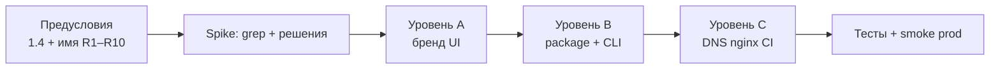

# 1.5 — Переименование приложения (бренд, пакет, домен)

> **ID roadmap:** **1.5** (фаза 9) · [PLAN.md](PLAN.md#фаза-9-переименование-приложения--15)  
> **Статус:** 🔄 **бренд утверждён** — **GetSync** · домен **getsync.me** (регистрация, DNS → prod)  
> **Зависимости:** **1.4** (снять nginx Basic Auth) — желательно до публичного cutover; **до** **2.1** (`/register`) и **3.4** (OAuth redirect URI)

---

## Цель

Сменить рабочее название **fit_sinc** на бренд **GetSync** ([getsync.me](https://getsync.me)) во всех слоях, где имя видно пользователю или влияет на интеграции — без потери данных и с предсказуемым деплоем.

**Не цель:** рефакторинг архитектуры, смена модели tenants, миграция на S3 (**3.3**) — только идентичность и связанные идентификаторы.

---

## Решения до старта (обязательно)

Зафиксировать в начале этого файла (таблица ниже — заполнить перед PR):

| # | Решение | Варианты | Выбрано |
|---|---------|----------|---------|
| R1 | **Публичное имя продукта** (UI, title, email) | FitSync, GetSync, … | **GetSync** |
| R2 | **Slug / CLI** (`fit_sinc` → …) | snake_case | **`getsync`** |
| R3 | **PyPI / package name** | kebab-case | **`get-sync`** |
| R4 | **Домен приложения** | поддомен / один host | **`app.getsync.me`** |
| R5 | **Домен лендинга (canonical)** | … | **`getsync.me`** |
| R6 | **GitHub repo** | переименовать / новый | **`getsync`** (после cutover; пока `fit-sinc`) |
| R7 | **Cookie сессии** | hard cut / dual | **`getsync_session`** + читать `fit_sinc_session` 14 дней |
| R8 | **Файл SQLite** | symlink / rename | **`getsync.db`**; symlink `fit_sinc.db` на prod до миграции |
| R9 | **Системный user / paths на VPS** | полный rename / как есть | **v1:** `fit_sinc`, `/opt/fit_sinc` (только DNS + бренд) |
| R10 | **Hammerhead redirect URI** | … | **`https://app.getsync.me/...`** (после **C**) |

**Tagline (черновик):** синхронизация тренировок из разных источников в выбранные сервисы.

**Рекомендация v1:** уровни **A → B → C**; на VPS пути **R9** не трогать в первом релизе; cookie **R7** dual read.

---

## Объём работ (три уровня)

| Уровень | Содержание | Оценка | Когда |
|---------|------------|--------|-------|
| **A — Бренд** | Тексты UI, logo, README, title, health `service`, nginx `auth_basic` message | ½ дня | Сразу после R1 |
| **B — Код** | Package `fit_sinc` → новый модуль, CLI, imports, tests, `pyproject.toml`, cookie, опционально `*.db` | 1 день | После R2–R3 |
| **C — Инфра** | DNS, certbot, nginx `server_name`, systemd unit, GitHub, Hammerhead webhook URL, CI paths | ½–1 день | После R4–R6 |

Уровни можно выпускать **поэтапно** (A → B → C), но OAuth (**3.4**) и публичный **2.1** — только после финального R4.

---

## Инвентарь: где сейчас «fit_sinc»

### Продукт и UI

| Место | Пример |
|-------|--------|
| Шаблоны Jinja | `<title>`, заголовки, «fit_sinc» в activities (колонка sync status) |
| [`assets/logo.svg`](../assets/logo.svg), [`fit_sinc/web/static/`](../fit_sinc/web/static/) | icon, favicon |
| [`deploy/www/index.html`](../deploy/www/index.html) | статический fallback лендинга |
| [`fit_sinc/web/app.py`](../fit_sinc/web/app.py) | `FastAPI(title="fit_sinc")`, health JSON |

### Код и конфигурация

| Место | Пример |
|-------|--------|
| Пакет Python | каталог [`fit_sinc/`](../fit_sinc/), все `from fit_sinc...` |
| CLI | [`pyproject.toml`](../pyproject.toml) → `fit_sinc = fit_sinc.cli:app` |
| Сессия | [`auth.py`](../fit_sinc/web/auth.py) → `session_cookie="fit_sinc_session"` |
| БД | [`config.py`](../fit_sinc/config.py) → `data/fit_sinc.db` |
| Логгер | `logging.getLogger("fit_sinc")` |
| Frontend | [`frontend/package.json`](../frontend/package.json) name (косметика) |

### Деплой и ops

| Место | Пример |
|-------|--------|
| systemd | [`deploy/fit-sinc.service`](../deploy/fit-sinc.service), user `fit_sinc` |
| nginx app | [`deploy/nginx/fit.conf`](../deploy/nginx/fit.conf) — `fit.romansegalla.online` |
| nginx landing | [`deploy/nginx/romansegalla.conf`](../deploy/nginx/romansegalla.conf) |
| CI | [`.github/workflows/`](../.github/workflows/), [`scripts/ci/deploy.sh`](../scripts/ci/deploy.sh) |
| VPS | `/opt/fit_sinc`, `.htpasswd_fit_sinc` |
| Hammerhead | `HAMMERHEAD_REDIRECT_URI`, webhook URL на prod |

### Документация

| Файл |
|------|
| [README.md](../README.md), [PLAN.md](PLAN.md), [ARCHITECTURE.md](ARCHITECTURE.md), [CI-CD.md](CI-CD.md), [UI.md](UI.md), API_*.md |

---

## Порядок выполнения



### Этап 0 — Предусловия

- [ ] **1.4** выполнен: вход только по session, Basic Auth снят (или дата cutover согласована).
- [x] Таблица решений **R1–R10** — **GetSync** + **getsync.me** (2026-05-26).
- [x] Домен **getsync.me** — регистрация в GoDaddy.
- [ ] DNS: делегировать зону на **Cloudflare** (NS в GoDaddy) — [CI-CD.md](CI-CD.md#dns-и-домены)
- [ ] Записи `A` `getsync.me`, `app.getsync.me` → sirocco; **app** — DNS only
- [ ] nginx + certbot; Hammerhead URI на `app.getsync.me`
- [ ] Проверить PyPI / trademark для `getsync` / `get-sync` (**R2–R3**).

### Этап 1 — Spike (½ вечера)

- [ ] `rg -i 'fit.sinc|fit_sinc|fit-sinc|romansegalla'` — актуальный список (дополнить инвентарь выше).
- [ ] Выбран сценарий: **только A**, **A+B**, или **A+B+C**.
- [ ] План отката: тег git до rename, бэкап `/opt/fit_sinc/data/`, snapshot DNS.

### Этап 2 — Уровень A (бренд)

- [ ] Новое имя и tagline в шаблонах: login, dashboard, layouts, forbidden, admin.
- [ ] Logo / favicon (или временно текстовый wordmark).
- [ ] README, PLAN (ссылки), UI.md — пользовательские названия.
- [ ] `FastAPI` title, `/health` → поле `service` с новым именем (старый alias опционально один релиз).
- [ ] Лендинг **2.11**: hero с финальным именем (согласовать с [PLAN.md §2.11](PLAN.md#главная-romansegallaonline-211)).

**Критерий готовности:** пользователь в браузере не видит «fit_sinc»; CLI и URL могут быть старыми.

### Этап 3 — Уровень B (код)

**Вариант B1 — полный rename пакета (рекомендуется до OAuth):**

- [ ] Новый каталог пакета `getsync/` (копия `fit_sinc/`).
- [ ] Массовая замена imports в `tests/`, `scripts/`.
- [ ] `pyproject.toml`: `name`, `[project.scripts]`, `package-data`.
- [ ] Удалить старый пакет после зелёных тестов.
- [ ] Cookie: `getsync_session` + читать `fit_sinc_session` 14 дней → только новый.
- [ ] `getsync.db`: на prod symlink `fit_sinc.db` → `getsync.db` или rename при cutover.

**Вариант B2 — только алиас CLI (не рекомендуется долго):**

- [ ] Новая команда `getsync` → тот же `cli:app`; `fit_sinc` deprecated warning.

**Критерий готовности:** `python -m unittest discover -s tests` зелёный; `getsync --help` работает.

### Этап 4 — Уровень C (инфра)

- [ ] certbot: `getsync.me`, `app.getsync.me`; nginx — см. [CI-CD.md](CI-CD.md#dns-и-домены)
- [ ] nginx: 301 с `fit.romansegalla.online` → новый host (минимум 6–12 мес).
- [ ] systemd: unit file, `Description`, `WorkingDirectory` (если R9).
- [ ] GitHub: rename repository или новый remote; обновить badges в README.
- [ ] Hammerhead Developer: redirect URI, webhook URL (если меняется host).
- [ ] GitHub Actions / deploy.sh: пути rsync, smoke `curl` на новый URL.
- [ ] `.env` на prod: `HAMMERHEAD_REDIRECT_URI`, любые URL в комментариях.

**Критерий готовности:** deploy из `main` на prod; smoke login + webhook test event.

### Этап 5 — QA и cutover

| Проверка | Как |
|----------|-----|
| Локально | venv, login, dashboard, admin, webhook HMAC test |
| CI | `test.yml` green |
| Prod | `/health`, `/app/login`, sync webhook, `garmin status` для tenant |
| Сессии | Старый cookie → re-login или авто-принятие (по R7) |
| SEO | canonical / OG на лендинге (**2.11.3**) |

**Окно обслуживания:** 15–30 мин — `systemctl stop`, rsync/deploy, migrate db filename, `systemctl start`, smoke.

---

## Cookie и сессии (детально)

Текущее: `fit_sinc_session`, ключ `user_id` в Starlette session.

| Стратегия | Плюсы | Минусы |
|-----------|-------|--------|
| **Hard cut** | Просто | Все разлогинены |
| **Dual cookie** (7–14 дней) | Плавно для prod | Чуть сложнее middleware |
| **Только rename cookie** | Минимум кода | Старое имя в DevTools |

**Рекомендация:** dual read в `install_sessions` / `user_context_from_session` одну версию, write только новое имя; убрать чтение старого в следующем релизе.

---

## Домены (целевые схемы)

### Целевая схема — GetSync (утверждено)

```text
getsync.me                 → лендинг (GET /), SEO, login CTA
app.getsync.me             → /app/*, /webhooks/*, /health, /static
```

**Портфель (301 → canonical):**

| Домен | Роль |
|-------|------|
| **getsync.me** | Canonical — владелец, регистрация 2026-05-26 |
| thefitsync.com | Редирект на getsync.me (когда настроен DNS) |
| fitnesssync.io | Редирект на getsync.me |
| fit.romansegalla.online | 301 → app.getsync.me (после cutover, ≥6 мес) |
| romansegalla.online | Личный сайт / ссылка в футере; не продукт |

**DNS:** регистратор **GoDaddy**, зона **Cloudflare** (NS с GoDaddy). Записи `A` `@` и `app` → IP sirocco; **`app` — DNS only** (без orange-cloud). Пошагово: [CI-CD.md § DNS](CI-CD.md#dns-и-домены).

- [ ] Cloudflare: site `getsync.me`, NS в GoDaddy, статус Active
- [ ] Записи `A` `@`, `app` → `134.209.133.187`, proxy выкл.
- [ ] nginx + certbot на sirocco

### Схема 1 — как сейчас (только бренд, interim)

```text
romansegalla.online          → лендинг (имя продукта в тексте)
fit.romansegalla.online      → /app, /webhooks, /health
```

Меняется только отображаемое имя; URL и сертификаты без изменений.

### Схема 2 — новый поддомен app

```text
romansegalla.online          → лендинг
app.<новый-домен>            → приложение
```

Нужны: DNS, certbot, 301 со старого, обновление Hammerhead.

### Схема 3 — один домен

```text
example.com/                 → лендинг
example.com/app              → кабинет (уже так в приложении)
```

Проверить cookie `Domain`, CORS, разделение static.

---

## Риски и откат

| Риск | Митигация |
|------|-----------|
| Простой sync во время деплоя | Деплой вне пиков; webhook 4xx кратко — HH retry |
| Сломанный OAuth HH | Обновить redirect URI **до** первого login после cutover |
| Потеря сессий | Dual cookie или предупреждение в UI |
| Сломанный CI | Проверить deploy на staging / dry-run rsync |
| Откат | Предыдущий git tag + старый nginx unit + symlink db |

**Откат:** восстановить `/opt/fit_sinc` из бэкапа, `systemctl restart fit-sinc`, вернуть DNS/nginx при смене домена.

---

## Оценка

| Сценарий | Срок |
|----------|------|
| **A только** (имя в UI, домен тот же) | ½ дня |
| **A + B** (бренд + package/CLI, домен тот же) | 1–1½ дня |
| **A + B + C** (смена домена и prod cutover) | 2–2½ дня |

---

## Связь с другими задачами

| ID | Связь |
|----|--------|
| **1.4** | Снять Basic Auth до публичного бренда на том же URL |
| **2.10** | Дизайн-система — лучше после **R1** (финальные цвета/wordmark) |
| **2.11** | Лендинг hero/SEO — после **R1**; полный **2.11.2** после **A** |
| **2.1** | `/register` — redirect URI и тексты «Создать аккаунт в …» |
| **3.4** | OAuth — `redirect_uri` фиксируется после **R4** |

---

## TODO (чеклист 1.5)

Сводный список; детали — по этапам выше.

- [x] Заполнить решения **R1–R10** (GetSync, getsync.me)
- [ ] Этап 0: предусловия
- [ ] Этап 1: spike / инвентарь
- [ ] Этап 2: уровень A (бренд)
- [ ] Этап 3: уровень B (код)
- [ ] Этап 4: уровень C (инфра)
- [ ] Этап 5: QA + cutover
- [ ] Обновить [PLAN.md](PLAN.md): **1.5** ✅, ссылка на этот документ

---

## История

| Дата | Изменение |
|------|-----------|
| 2026-05-25 | Первый план (отделён от PLAN.md) |
| 2026-05-26 | Утверждены **GetSync**, canonical **getsync.me** / **app.getsync.me** |
| 2026-05-26 | DNS: GoDaddy + Cloudflare (DNS only на `app`) — [CI-CD.md](CI-CD.md#dns-и-домены) |
