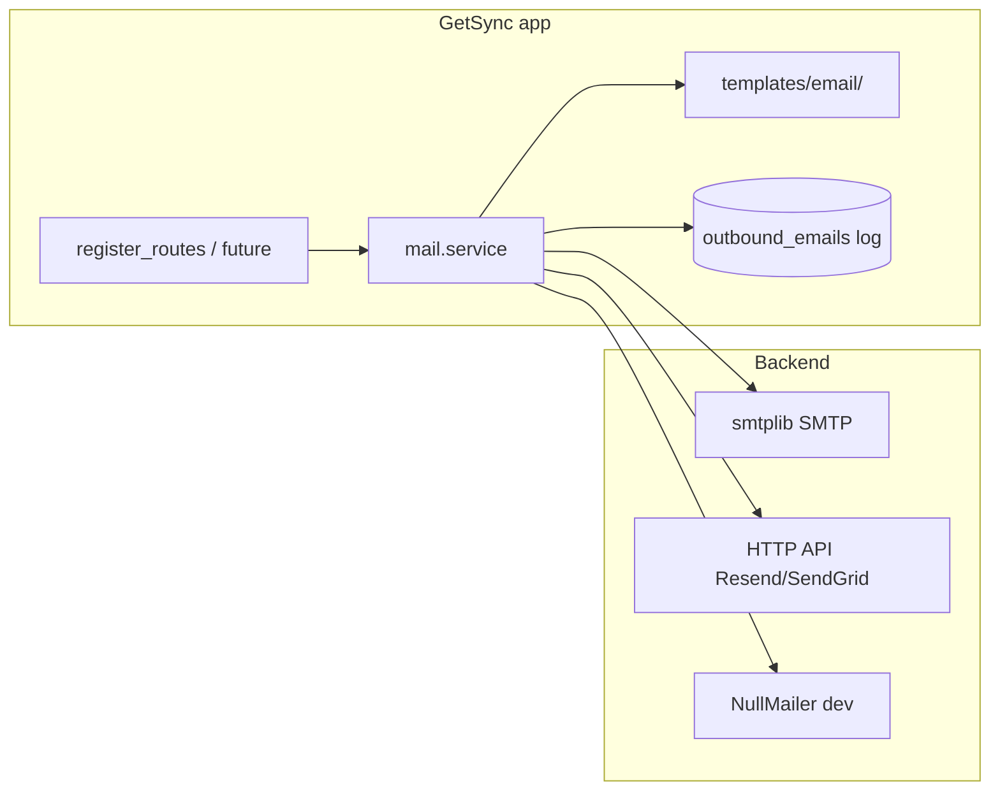

# 2.1e — Email: отправка и сценарии

> **Создано:** 2026-05-26 · **Обновлено:** 2026-05-26 · **Версия:** 0.7.0  
> **ID roadmap:** **2.1e** (verify при регистрации) · **2.6** (invite, captcha) · **2.4** / **6.1** (алерты user) · **3.8** (ops)  
> **Статус:** 📋 не реализовано в приложении (есть только ops-скрипт DNS notify)  
> **Связано:** [2.1-REGISTER.md](2.1-REGISTER.md) · [3.4-OAUTH-LOGIN.md](3.4-OAUTH-LOGIN.md) · [PLAN.md](PLAN.md)

---

## Цель

Единый способ **отправлять исходящую почту** из GetSync: подтверждение регистрации, позже — сброс пароля, invite, алерты. Сейчас в коде приложения **нет** mailer; единственный преcedent — bash-скрипт [`scripts/check-getsync-dns.sh`](../scripts/check-getsync-dns.sh) (Gmail SMTP для ops).

**Не цель v1:**

- Маркетинговые рассылки / newsletter
- Входящая почта (IMAP)
- Замена Telegram-алертов полностью (email — дополнение)

---

## Какие письма понадобятся

| ID | Тип | Кому | Когда | Roadmap |
|----|-----|------|-------|---------|
| **M1** | Подтверждение регистрации | user | `POST /register` | **2.1e** |
| **M2** | Повторная ссылка verify | user | «Отправить ещё раз» | **2.1e** |
| **M3** | Сброс пароля | user | forgot password | **2.6** |
| **M4** | Invite / magic link регистрации | invitee | admin или `invite_token` | **2.6** |
| **M5** | Смена email (confirm new) | user | Settings → Security | **2.6** / **5b.4** |
| **M6** | Sync error (digest) | user | N ошибок / cron | **2.4** / **6.1** |
| **M7** | Ops: sync down, disk, deploy | admin | systemd/cron | **3.8** |
| **M8** | Welcome / onboarding | user | после verify | опционально **2.6** |

Приоритет реализации: **M1–M2** → **M3–M4** → **M6** → **M7**.

---

## Архитектура отправки



**Правило:** весь код вызывает один интерфейс `send_email(to, subject, text, html=None, tags=[])`, не `smtplib` напрямую из роутов.

### Модуль (черновик)

```text
getsync/mail/
  __init__.py          # send_email(), get_mailer()
  config.py            # MailSettings из env
  backends/
    base.py
    smtp.py            # stdlib smtplib (как dns-notify)
    http_api.py        # Resend / SendGrid (опционально)
    null.py            # лог в stdout, тесты
  templates/
    verify_email.{txt,html}.jinja2
    password_reset.{txt,html}.jinja2
  tokens.py            # generate_url_safe_token, hash for DB
```

Лог **`outbound_emails`** (SQLite, опционально v1): `id`, `to`, `template`, `status`, `error`, `created_at` — для отладки без доступа к провайдеру.

---

## Как физически отправить (варианты провайдера)

### A. SMTP (универсальный)

Тот же подход, что в [`scripts/check-getsync-dns.sh`](../scripts/check-getsync-dns.sh):

| Параметр | Пример |
|----------|--------|
| Host | `smtp.gmail.com`, `smtp.sendgrid.net`, `smtp.mail.ru` |
| Port | `587` + STARTTLS или `465` SSL |
| Auth | user + password / App Password |

**Плюсы:** один код (`smtplib`), любой хостинг.  
**Минусы:** Gmail — лимиты, App Password; свой VPS IP — риск spam без SPF/DKIM.

**Для GetSync (pet, один VPS):** на старте **SMTP через транзакционный API** (ниже) надёжнее, чем «голый» IP sirocco.

### B. HTTP API (рекомендация для prod)

| Сервис | Free tier | Заметки |
|--------|-----------|---------|
| [Resend](https://resend.com) | ~100/день | простой API, домен getsync.me |
| [SendGrid](https://sendgrid.com) | 100/день | зрелый, SMTP relay тоже |
| [Amazon SES](https://aws.amazon.com/ses/) | дёшево | нужен AWS, чуть больше ops |
| [Postmark](https://postmarkapp.com) | trial | отличная deliverability |

**Рекомендация v1:** **Resend** или **SendGrid** — один HTTP POST, ключ в `.env`, без возни с IP reputation на DigitalOcean.

### C. Dev / CI

| Backend | Поведение |
|---------|-----------|
| `MAIL_BACKEND=null` | не шлёт; пишет subject/body в log |
| `MAIL_BACKEND=console` | print в stderr |
| [Mailpit](https://mailpit.axllent.org/) | локальный SMTP `1025`, UI `8025` |

В тестах — всегда `NullMailer`; отдельный integration test с mock HTTP.

---

## DNS и доставляемость (getsync.me)

Чтобы письма не попадали в spam:

| Запись | Назначение |
|--------|------------|
| **SPF** | TXT `@`: `v=spf1 include:_spf.resend.com ~all` (или провайдер) |
| **DKIM** | CNAME от панели Resend/SendGrid |
| **DMARC** | TXT `_dmarc`: `v=DMARC1; p=none; rua=mailto:...` → позже `quarantine` |
| **From** | `noreply@getsync.me` или `GetSync <hello@getsync.me>` |

Проверка: [mail-tester.com](https://www.mail-tester.com), логи провайдера.

**Reply-To:** для verify — `noreply@`; для support — `roman@…` или отдельный ящик (не обязательно тот же SMTP).

---

## Конфигурация (.env)

```env
# Общее
MAIL_BACKEND=smtp          # smtp | resend | sendgrid | null
MAIL_FROM="GetSync <noreply@getsync.me>"
MAIL_REPLY_TO=support@getsync.me
APP_PUBLIC_URL=https://app.getsync.me

# SMTP (backend=smtp) — можно те же creds что dns-notify, но лучше отдельный ящик/ключ
MAIL_SMTP_HOST=smtp.resend.com
MAIL_SMTP_PORT=587
MAIL_SMTP_USER=resend
MAIL_SMTP_PASSWORD=re_...
MAIL_SMTP_TLS=true
MAIL_SMTP_SSL=false

# Resend (backend=resend)
RESEND_API_KEY=re_...

# SendGrid (backend=sendgrid)
SENDGRID_API_KEY=SG....

# Лимиты
MAIL_RATE_LIMIT_PER_HOUR=20    # на IP/user для verify resend
```

**Не коммитить** в git; на sirocco — `/opt/getsync/.env`. Отдельно от `GETSYNC_DNS_SMTP_*` (ops-скрипт DNS может остаться на Gmail).

---

## 2.1e — подтверждение email (первый сценарий)

Детали политики UX — в [2.1-REGISTER.md § Email](2.1-REGISTER.md#email--отдельная-подфаза-21e-не-сделано).

### Поток

```text
POST /register
  → user создан, email_verified=0
  → token = secrets.token_urlsafe(32)
  → email_verify_token_hash = sha256(token) в БД
  → send_email(M1): ссылка {APP_PUBLIC_URL}/verify-email?token=...

GET /verify-email?token=
  → hash(token) == stored, not expired (72h)
  → email_verified=1, clear token
  → redirect /app/login?verified=1
```

**Политика UX (рекомендация B):** auto-login после register + баннер «Подтвердите почту»; sync/webhook **не** для `email_verified=0`.

### Шаблон M1 (черновик)

- Subject: `Confirm your GetSync account` / `Подтвердите email GetSync`
- Body: одна кнопка/ссылка, TTL 72 ч, текст «если не вы — ignore»
- HTML: простой Jinja, inline CSS, без тяжёлых картинок

### Задачи 2.1e

| ID | Задача | Оценка |
|----|--------|--------|
| 2.1e.0 | `getsync/mail/` + `MAIL_BACKEND=null` + тесты | ½ вечера |
| 2.1e.1 | Миграция: `email_verified`, `email_verify_token_hash`, `email_verify_sent_at` | ½ вечера |
| 2.1e.2 | SMTP или Resend backend + prod DNS | ½ вечера |
| 2.1e.3 | M1 на register + `GET /verify-email` | 1 вечера |
| 2.1e.4 | M2 resend + rate limit | ½ вечера |
| 2.1e.5 | Guard sync + banner в кабинете | ½ вечера |
| 2.1e.6 | i18n subject/body (en/ru/de) | ½ вечера |

**Итого 2.1e:** ~3–4 вечера (с DNS провайдера).

---

## Связь с OAuth (**3.4**)

Если Google/Apple вернули `email_verified=true`:

- при создании user → `email_verified=1` без M1;
- relay-email Apple — всё равно сохранять как `users.email`.

См. [3.4-OAUTH-LOGIN.md](3.4-OAUTH-LOGIN.md).

---

## 2.6 — расширение (после 2.1e)

| Функция | Письмо | Token table |
|---------|--------|-------------|
| Forgot password | M3 | `password_reset_token_hash`, TTL 1 h |
| Invite-only register | M4 | `invites` или signed JWT в URL |
| Change email | M5 | новый email + confirm link |

Общий паттерн: **одноразовый token**, hash в БД, тот же `send_email()`.

---

## Алерты (**2.4** / **6.1** / **3.8**)

| Канал | Когда |
|-------|--------|
| **Telegram** | primary для user sync errors (поле `users.telegram`) |
| **Email M6** | fallback если telegram пуст; digest 1 письмо / час max |
| **Email M7** | ops на admin email из env `OPS_ALERT_EMAIL` |

Не смешивать user mailer и ops: можно один backend, разные `MAIL_FROM` / templates.

---

## Безопасность

| Риск | Мера |
|------|------|
| Token leak in logs | Логировать только hash / last 4 chars |
| Email bombing | Rate limit per IP + per email (как register) |
| Header injection | `EmailMessage`, не склеивать raw headers |
| Open relay | SMTP auth always; не принимать входящую почту на app |
| Credential leak | API keys только в `.env` |
| Timing | одинаковый ответ «если email есть, отправили» на forgot password |

---

## Тестирование

| Уровень | Как |
|---------|-----|
| Unit | `NullMailer`, assert `send_email` called with template vars |
| Integration | mock `httpx` для Resend API |
| Manual | `./scripts/check-getsync-dns.sh --test-smtp` (ops) · Mailpit локально |
| Staging | `MAIL_BACKEND=resend`, real send на свой ящик |

```bash
# Локально с Mailpit (docker)
docker run -d -p 8025:8025 -p 1025:1025 axllent/mailpit
# .env: MAIL_SMTP_HOST=127.0.0.1 MAIL_SMTP_PORT=1025 MAIL_SMTP_TLS=false
```

---

## Ops на sirocco

| Шаг | Действие |
|-----|----------|
| 1 | Зарегистрировать домен `getsync.me` в Resend/SendGrid |
| 2 | Добавить DNS записи у GoDaddy |
| 3 | `MAIL_*` в `/opt/getsync/.env` |
| 4 | Smoke: register staging user → письмо → verify link |
| 5 | Мониторинг: лог `outbound_emails` или dashboard провайдера |

Существующий **DNS notify** ([`dns-notify.env.example`](../scripts/dns-notify.env.example)) — **не трогать**; это личное ops-уведомление, не product mail.

---

## Зависимости

| Задача | Зачем |
|--------|--------|
| **1.5 C** | `APP_PUBLIC_URL`, `noreply@getsync.me` |
| **1.4** | HTTPS для ссылок в письмах |
| **2.1** ✅ | register flow |
| **2.1e** | первый consumer mailer |
| **3.4** | skip verify если IdP verified |

**Порядок:** **1.5 C** (DNS) → **2.1e.0–2.1e.3** (mailer + verify) → **2.6** (password reset) → алерты.

---

## Чеклист MVP (2.1e)

- [ ] `getsync/mail/` + backends
- [x] Resend + SPF/DKIM на getsync.me (verified 2026-05-27)
- [ ] M1 verify на register
- [ ] `GET /verify-email`
- [ ] M2 resend + rate limit
- [ ] `email_verified` guard sync
- [ ] Баннер в кабинете
- [ ] Тесты с NullMailer
- [ ] Документация env в `.env.example` (без секретов)

---

## Связь с roadmap

- Register UX: [2.1-REGISTER.md](2.1-REGISTER.md)  
- Полный пакет invite/captcha: **2.6** в [PLAN.md](PLAN.md)  
- OAuth: [3.4-OAUTH-LOGIN.md](3.4-OAUTH-LOGIN.md)
