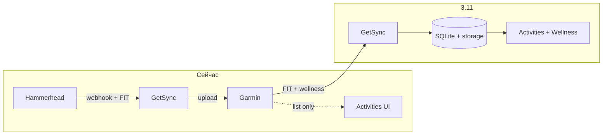

# 3.11 — Garmin Pull: FIT, шаги, сон

> **ID roadmap:** **3.11** · **3.11.1** spike · **3.11.2** FIT · **3.11.3** wellness · **3.11.4** UI  
> **Статус:** 📋 план · код частично: список активностей Garmin ✅, download FIT / wellness ❌  
> **Связано:** [API_GARMIN.md](API_GARMIN.md) · [STORAGE.md](STORAGE.md) · [CONNECTIONS.md](CONNECTIONS.md) · [PLAN.md](PLAN.md)

---

## Цель

Расширить роль **Garmin Connect** в GetSync: не только **приёмник** (upload HH→Garmin), но и **источник** данных:

1. **Скачивать `.fit`** активностей, которые уже лежат в Garmin (с устройства, ручной import, чужие sync).
2. **Сохранять ежедневные шаги** (steps + distance + goal).
3. **Сохранять сон за ночь** (длительность, стадии, score — по мере доступности API).

**Не цель v1:**

- Замена Garmin Connect / Garmin Health как основного приложения
- Полный wellness-пакет (HRV time-series, Body Battery поминутно, вес, stress) — только backlog
- Официальный Garmin Connect Developer Program (Activity API для партнёров) — остаёмся на неофициальном `garth-ng`
- Real-time push с часов (только pull по расписанию / кнопке)

---

## Текущее состояние

| Возможность | Статус | Где в коде |
|-------------|--------|------------|
| Upload FIT → Garmin | ✅ | [`getsync/garmin/session.py`](../getsync/garmin/session.py) |
| Список активностей Garmin в UI | ✅ | [`getsync/garmin/activities.py`](../getsync/garmin/activities.py), browse |
| Download FIT с Hammerhead | ✅ | [`getsync/hammerhead/client.py`](../getsync/hammerhead/client.py) |
| Download FIT **с** Garmin | ❌ | `fit_available` для `source=garmin` почти всегда false |
| Шаги / сон | ❌ | [API_GARMIN.md](API_GARMIN.md): «scope v1 — только upload» |



---

## Источники данных (garth-ng)

Все вызовы — **per tenant**, после `garmin_resume(ctx)` (OAuth в `data/users/{id}/garth/`).  
Web `JWT_WEB` может понадобиться для download-proxy — проверить в **spike 3.11.1**.

### A. FIT активности

| Способ | Endpoint / API | Заметки |
|--------|----------------|---------|
| **Original FIT** | `GET /download-service/files/activity/{id}` | Ответ часто **ZIP** с одним `.fit` внутри |
| TCX / GPX | `/download-service/export/tcx/activity/{id}` | fallback, если original недоступен |
| Список id | `garth.data.Activity.list()` | уже используется |

Референсы: [garmin-connect-export](https://github.com/pe-st/garmin-connect-export), `garth.download(path)`.

**Edge cases:**

- Активность введена вручную в Connect → original FIT **может отсутствовать** (404) — не считать ошибкой sync.
- Дубликат HH+Garmin: та же поездка — два `source` в каталоге; FIT может отличаться (Garmin-обработка).

### B. Шаги (ежедневно)

```python
import garth
from garth.stats import DailySteps

# последние 7 дней до end (date)
rows = DailySteps.list(end="2026-05-26", period=7)
# total_steps, total_distance, step_goal + calendar_date в базовом Stats
```

API: `/usersummary-service/stats/steps/daily/{start}/{end}`.

### C. Сон (ежедневно)

Два уровня детализации:

| Уровень | API | Поля (пример) |
|---------|-----|----------------|
| **Краткий score** | `garth.stats.DailySleep.list(end, period)` | `value` — sleep score за день |
| **Полная ночь** | `garth.data.DailySleepData.get(date)` | `sleep_time_seconds`, deep/light/rem, start/end, scores |

Для MVP wellness достаточно **DailySleepData** за календарный день (одна основная ночь + nap).

---

## Аутентификация

| Операция | OAuth `garth/` | Web `JWT_WEB` |
|----------|----------------|---------------|
| `Activity.list` | ✅ работает | — |
| `DailySteps` / `DailySleepData` | ✅ ожидается | — |
| Download FIT (proxy) | **spike** | возможно нужен, как upload |

**Spike 3.11.1:** на реальном аккаунте проверить:

```python
garth.download(f"/download-service/files/activity/{activity_id}")
# vs connect.garmin.com/modern/proxy/... с cookies из garmin_web
```

Если OAuth недостаточно — обёртка через `web_session` (Bearer `JWT_WEB`), по аналогии с upload.

**Зависимость:** стабильная Garmin-сессия у tenant → **2.12** (login в UI) или CLI `getsync garmin login`.

---

## Хранение

### FIT (как у Hammerhead)

Уже заложено в [STORAGE.md](STORAGE.md):

```text
data/users/{user_id}/activities/garmin/{activity_id}.fit
```

SQLite `activities`:

- `(user_id, source='garmin', activity_id)` — уже есть для browse
- `storage_key` = `activities/garmin/{id}.fit` после download
- `sync_status` для garmin-pull: `imported` | `no_file` | `error`

### Wellness (новые таблицы)

```sql
-- 3.11.3.1
CREATE TABLE daily_steps (
  user_id TEXT NOT NULL,
  calendar_date TEXT NOT NULL,   -- YYYY-MM-DD, TZ пользователя
  total_steps INTEGER,
  total_distance_m INTEGER,
  step_goal INTEGER,
  fetched_at TEXT NOT NULL,
  PRIMARY KEY (user_id, calendar_date)
);

CREATE TABLE daily_sleep (
  user_id TEXT NOT NULL,
  calendar_date TEXT NOT NULL,   -- дата «ночи» в Garmin
  sleep_time_sec INTEGER,
  deep_sleep_sec INTEGER,
  light_sleep_sec INTEGER,
  rem_sleep_sec INTEGER,
  awake_sec INTEGER,
  sleep_score INTEGER,
  sleep_start_gmt TEXT,
  sleep_end_gmt TEXT,
  raw_json TEXT,                 -- опционально: полный DTO для debug
  fetched_at TEXT NOT NULL,
  PRIMARY KEY (user_id, calendar_date)
);
```

**Timezone:** ключ `calendar_date` — в **timezone пользователя** (`users.timezone`), как календарь активностей.

**Retention:** хранить всё локально; при росте — архив/S3 (**3.3**), не обязательно в v1.

---

## Модули (черновик)

```text
getsync/garmin/
  activities.py          # list — есть
  download.py            # download_fit(activity_id) → bytes  NEW
  wellness.py            # fetch_steps, fetch_sleep       NEW
  pull_service.py        # orchestration, backfill        NEW

getsync/wellness/        # опционально, если логика разрастётся
  store.py               # CRUD daily_steps / daily_sleep
```

Публичный контракт:

```python
def download_garmin_fit(activity_id: int, *, ctx: UserContext) -> bytes | None: ...
def sync_garmin_wellness_day(day: date, *, ctx: UserContext) -> WellnessDayResult: ...
def backfill_garmin_wellness(start: date, end: date, *, ctx: UserContext) -> int: ...
```

---

## Сценарии sync

### 1. FIT — on demand

| Триггер | Поведение |
|---------|-----------|
| Кнопка «Download .fit» в UI | если нет локально → pull → `storage_key` |
| CLI `getsync garmin download-fit --activity-id N` | ops / backfill |
| Фоновый backfill | опционально post-MVP |

### 2. FIT — batch backfill

```text
getsync garmin backfill-fit --since 2026-01-01 --limit 100
  → Activity.list paginate
  → skip if storage_key exists
  → download + put_fit('garmin', id)
  → rate limit ~1 req/s
```

### 3. Wellness — ежедневно

```text
Cron / фон в getsync serve (раз в сутки, ~06:00 user TZ):
  → вчера + сегодня (сон может доехать утром)
  → DailySteps + DailySleepData
  → upsert daily_steps / daily_sleep
```

| Параметр | Значение |
|----------|----------|
| Первый запуск | backfill 30–90 дней (`--since`) |
| Частота | 1×/день + кнопка «Refresh» в UI |
| Ошибка auth | flash в Settings, не падать весь serve |

---

## UI (3.11.4)

Минимум после backend:

| Экран | Что показать |
|-------|--------------|
| **Activities** | Download .fit для `source=garmin` (как HH) |
| **UI** (Activities или отдельный блок) | шаги сегодня / 7 дней, goal ring |
| **Sleep** | последняя ночь: часы, score, deep/rem |
| **Calendar** (опционально) | иконки 🚶 / 😴 под датой |

i18n: строки в `app_i18n.py` (**2.5**).

**Не в v1:** графики HRV, Body Battery, сравнение с Hammerhead.

---

## Подфазы и оценки

| ID | Задача | Оценка |
|----|--------|--------|
| **3.11.1** | Spike: download FIT + wellness API, OAuth vs JWT_WEB | ½–1 вечер |
| **3.11.2.1** | `download.py`: ZIP→FIT, ошибки 404 | 1 вечер |
| **3.11.2.2** | CLI `garmin download-fit`, `backfill-fit` | ½ вечера |
| **3.11.2.3** | UI: download .fit для garmin rows | ½ вечера |
| **3.11.2.4** | Тесты mock HTTP | ½ вечера |
| **3.11.3.1** | Миграция `daily_steps`, `daily_sleep` | ½ вечера |
| **3.11.3.2** | `wellness.py` + store + daily job | 1–2 вечера |
| **3.11.3.3** | CLI `garmin sync-wellness --since` | ½ вечера |
| **3.11.4.1** | Widget steps + sleep в кабинете | 1–2 вечера |
| **3.11.4.2** | Settings: «Sync wellness now», last fetched | ½ вечера |

**Итого:** ~5–8 вечеров (FIT-only ~2–3, wellness+UI ~3–5).

**Рекомендуемый порядок:** **3.11.1** → **3.11.2** → **3.11.3** → **3.11.4**.

---

## Связь с хабом (2.8 / 3.1)

После **3.11** Garmin становится полноценным **Source** в [CONNECTIONS.md](CONNECTIONS.md):

| Роль | Было | Станет |
|------|------|--------|
| Garmin | только **destination** | **source + destination** |

Правила вида «Garmin FIT → S3» или «Garmin activity → Strava» — уже через **3.1** rule engine, не в 3.11.

Wellness (steps/sleep) — **отдельный домен** от `ActivityRecord`; в **2.8** spike можно добавить `WellnessDayRecord`, но реализация не блокирует 3.11.

---

## Риски

| Риск | Mitigation |
|------|------------|
| Garmin меняет download/wellness API | Тонкая обёртка; pin `garth-ng`; лог raw_json |
| 403/401 на download без web session | Spike; fallback JWT_WEB |
| Нет FIT у manual activity | `sync_status=no_file`, не error |
| Rate limit | backoff, 1 req/s backfill, cache list |
| ToS неофициального API | личное использование; не commercial scale |
| TZ / «ночь» vs календарный день | хранить `calendar_date` как Garmin; показывать в user TZ |
| Дубли HH+Garmin | не merge автоматически в 3.11; link по времени — backlog **3.10** |

---

## Тестирование

| Уровень | Подход |
|---------|--------|
| Unit | mock `httpx` / `garth.download`, ZIP fixture |
| Integration | локальный `garth login`, один activity id (manual, не в CI) |
| CI | только mocks; без сети к Garmin |
| Regression | `fit_available=true` для garmin row после download |

---

## Env / конфиг (черновик)

```env
# Фоновый wellness sync (опционально)
GARMIN_WELLNESS_SYNC_ENABLED=true
GARMIN_WELLNESS_BACKFILL_DAYS=90
GARMIN_FIT_BACKFILL_RATE_SEC=1.0
```

---

## Чеклист MVP

### 3.11.2 — FIT

- [ ] Spike auth для download
- [ ] `download_garmin_fit()` + storage `activities/garmin/`
- [ ] CLI backfill
- [ ] Download в UI
- [ ] Тесты

### 3.11.3 — Wellness

- [ ] Таблицы `daily_steps`, `daily_sleep`
- [ ] Daily job / CLI backfill
- [ ] Guard при expired Garmin session

### 3.11.4 — UI

- [ ] Widget шагов/сна в UI (не отдельный Dashboard)
- [ ] i18n EN/RU/DE

---

## Зависимости

| Задача | Зачем |
|--------|--------|
| **2.12** | Garmin login в Settings (не CLI) |
| **STORAGE** ✅ | `put_fit('garmin', …)` |
| **browse** ✅ | список activity id |
| **2.8** / **3.1** | опционально — унификация Source; не блокер |

**Порядок в roadmap:** после **v0.7** (**2.10** / **2.13**); параллельно с **2.8** возможен **3.11.1**.

---

## Ссылки

- Garmin upload (существующее): [API_GARMIN.md](API_GARMIN.md)
- FIT storage: [STORAGE.md](STORAGE.md)
- garth-ng stats: [PyPI garth-ng](https://pypi.org/project/garth-ng/)
- Похожие проекты (идеи schema): [GarminDB](https://github.com/tcgoetz/GarminDB), [garmin-health-data](https://github.com/diegoscarabelli/garmin-health-data)
