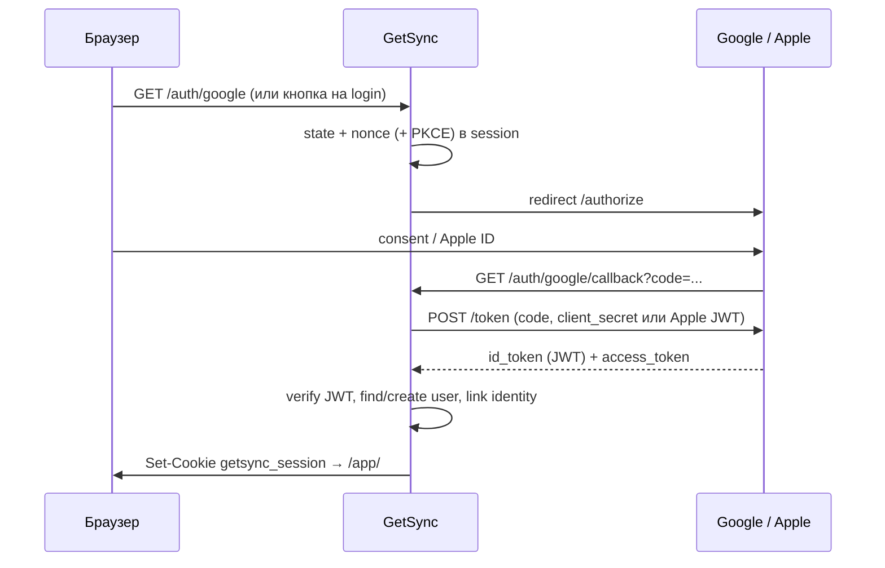

# 3.4 — Внешняя авторизация (Google, Apple, OIDC)

> **Создано:** 2026-05-26 · **Обновлено:** 2026-05-26 · **Версия:** 0.7.0  
> **ID roadmap:** **3.4** (фаза 10) · **10.0–10.3** в [PLAN.md](PLAN.md)  
> **Статус:** 📋 не реализовано (план)  
> **Связано:** [2.1-REGISTER.md](2.1-REGISTER.md) · [PLAN.md § 3.4](PLAN.md#34--oauthoidc) · [ARCHITECTURE.md](ARCHITECTURE.md) · [auth.py](../getsync/web/auth.py)

---

## Цель

Дать пользователю **войти в кабинет** через Google и (опционально) Apple **в дополнение** к email+password, без смены tenant-модели и без замены OAuth Hammerhead/Garmin.

**Не цель 3.4:**

- OAuth Hammerhead / Garmin (уже есть — токены API, не login) — см. [API_HAMMERHEAD.md](API_HAMMERHEAD.md), [API_GARMIN.md](API_GARMIN.md)
- Enterprise SSO (SAML, LDAP)
- «Только social login» без fallback на пароль (на v1 пароль остаётся)

---

## Чем login-OAuth отличается от Hammerhead OAuth

| | Login (Google/Apple) | Hammerhead (Settings) |
|---|----------------------|------------------------|
| Зачем | Кто ты в GetSync | Доступ к API Hammerhead |
| Результат | `user_id` + cookie `getsync_session` | `hammerhead_tokens.json` |
| Хранение | SQLite `user_oauth_identities` | `data/users/{id}/` |
| Redirect | `/auth/google/callback` | `/app/settings/hammerhead/callback` |

После успешного OIDC вызываем тот же [`login_user()`](../getsync/web/auth.py), что и после `/app/login`.

---

## Как это работает (OIDC)

Общая схема для Google и Apple:



**Идентификатор пользователя у провайдера:** claim `sub` в `id_token` — стабильный, **не email**.

---

## Google Sign-In

### Регистрация приложения

1. [Google Cloud Console](https://console.cloud.google.com/) → проект GetSync  
2. **OAuth consent screen** (External / Internal)  
3. **Credentials** → OAuth client ID → **Web application**  
4. **Authorized redirect URIs** (точное совпадение):

| Окружение | Redirect URI |
|-----------|----------------|
| Production | `https://app.getsync.me/auth/google/callback` |
| Staging | `https://<staging-host>/auth/google/callback` |
| Local | `http://127.0.0.1:8080/auth/google/callback` |

5. Scopes (минимум): `openid`, `email`, `profile`

### Проверка `id_token`

- JWKS: `https://www.googleapis.com/oauth2/v3/certs`  
- `aud` = наш `GOOGLE_CLIENT_ID`  
- `iss` ∈ `https://accounts.google.com`, `accounts.google.com`  
- `exp`, `nonce` (если используем OpenID nonce)

### Полезные claims

| Claim | Использование |
|-------|----------------|
| `sub` | PRIMARY KEY связи (`provider=google`) |
| `email` | поиск/слияние аккаунта |
| `email_verified` | если `true` → можно считать email подтверждённым (**2.1e**) |
| `name`, `picture` | опционально `display_name` при создании user |

---

## Sign in with Apple

### Регистрация

1. [Apple Developer](https://developer.apple.com/) — Program ($99/год)  
2. **Identifiers** → App ID + **Services ID** (web)  
3. **Keys** → Sign in with Apple → скачать `.p8` (один раз)  
4. **Return URLs** — те же паттерны, что у Google:

`https://app.getsync.me/auth/apple/callback`

### Отличия от Google

| Тема | Apple |
|------|--------|
| Client secret | **JWT**, подписанный вашим `.p8` (Team ID, Key ID, Services ID); ротация ~каждые 6 мес |
| Email | Может быть **Hide My Email** (`@privaterelay.appleid.com`) |
| Имя | `given_name` / `family_name` — **только при первом** consent; сохранить сразу в БД |
| App Store | Если есть «Sign in with Google» на iOS — Apple **требует** кнопку Apple рядом |

### Token endpoint

- `https://appleid.apple.com/auth/token`  
- `client_id` = Services ID (не App ID)  
- `client_secret` = сгенерированный ES256 JWT

---

## Решения (зафиксировать до кода)

| # | Решение | Рекомендация v1 |
|---|---------|-----------------|
| O1 | URL login | `GET /auth/{provider}` → redirect IdP |
| O2 | URL callback | `GET /auth/{provider}/callback` |
| O3 | Идентификация | `user_oauth_identities(provider, subject)` UNIQUE |
| O4 | Email collision | Если email занят другим user **без** link — ошибка + «войдите паролем и привяжите в Settings» |
| O5 | Новый user | Только если `REGISTRATION_OPEN=true` **или** invite (**2.6**); иначе «нет доступа» |
| O6 | `password_hash` | NULL для OAuth-only; пароль можно задать позже в Settings |
| O7 | `email_verified` | `1` если IdP вернул `email_verified=true` (**2.1e**) |
| O8 | Unlink | Settings → Security: отвязать provider, если остаётся пароль или другой provider |
| O9 | Admin | OAuth **не** выдаёт `is_admin` |
| O10 | Библиотека | **authlib** + `httpx` (или `Authlib` Starlette integration) |

---

## Схема данных

### Таблица `user_oauth_identities`

```sql
CREATE TABLE user_oauth_identities (
    provider TEXT NOT NULL,           -- 'google' | 'apple'
    subject TEXT NOT NULL,            -- IdP sub
    user_id TEXT NOT NULL REFERENCES users(id) ON DELETE CASCADE,
    email_at_link TEXT,               -- snapshot email от IdP
    created_at TEXT NOT NULL,
    PRIMARY KEY (provider, subject)
);
CREATE INDEX idx_oauth_user ON user_oauth_identities(user_id);
```

### Изменения `users`

```sql
-- password_hash: NOT NULL → nullable для OAuth-only
-- опционально для 2.1e:
-- email_verified INTEGER NOT NULL DEFAULT 0
```

Slug / `display_name` при первом OAuth: из `email` или `name`, как в [register_routes.py](../getsync/web/register_routes.py).

---

## Роуты и UI

### Публичные (без session)

| Method | Path | Действие |
|--------|------|----------|
| GET | `/auth/google` | Redirect → Google (+ `state`, PKCE) |
| GET | `/auth/google/callback` | Verify → user → `login_user` → `/app/` |
| GET | `/auth/apple` | Redirect → Apple |
| GET | `/auth/apple/callback` | POST/GET per Apple docs → session |

Добавить в [`auth.py`](../getsync/web/auth.py) public paths (как `/register`).

### UI (после **2.10.2** или минимально на login/register)

| Экран | Элемент |
|-------|---------|
| `/app/login` | Кнопки «Continue with Google» / «Sign in with Apple» под формой |
| `/register` | Те же кнопки («Sign up with …») |
| `/app/settings` → Security | Привязать / отвязать provider; список linked accounts |

Разделитель «or» между формой и social-кнопками — как на типичных SaaS.

---

## Безопасность

| Угроза | Мера |
|--------|------|
| CSRF на callback | `state` в session, проверка на callback |
| Token substitution | Verify JWT signature + `aud` + `iss` + `exp` |
| Replay | Одноразовый `code`, короткий TTL |
| Session fixation | Новая session после login (как сейчас) |
| Secret leak | Client secrets только в `.env` / GitHub Secrets |
| Apple key | `.p8` не в git; `APPLE_PRIVATE_KEY` multiline env |

**PKCE:** обязателен для public clients; для server-side web client Google — рекомендуется.

---

## Конфиг (.env)

```env
# Google
GOOGLE_OAUTH_ENABLED=false
GOOGLE_CLIENT_ID=
GOOGLE_CLIENT_SECRET=

# Apple
APPLE_OAUTH_ENABLED=false
APPLE_SERVICES_ID=me.getsync.app          # Services ID
APPLE_TEAM_ID=
APPLE_KEY_ID=
APPLE_PRIVATE_KEY=                        # содержимое .p8 (или path на сервере)

# Общее
APP_PUBLIC_URL=https://app.getsync.me     # base для redirect_uri
OAUTH_ALLOWED_PROVIDERS=google            # comma: google,apple
```

Флаги `*_ENABLED` — чтобы на prod не светить кнопки без credentials.

---

## Подфазы (оценка)

| ID | Задача | Оценка |
|----|--------|--------|
| **3.4.0** / **10.0** | Миграция БД, модуль `getsync/web/oauth_login/`, Google flow end-to-end | 1 вечер |
| **3.4.1** / **10.1** | Кнопки на login/register, i18n строки | ½ вечера |
| **3.4.2** / **10.2** | Settings: link/unlink, политика collision | 1 вечер |
| **3.4.3** / **10.3** | Apple provider + ротация client_secret JWT | 1 вечер |
| **3.4.4** / **10.3** | Тесты: mock IdP, state/nonce, collision, disabled user | ½ вечера |

**Итого:** ~3–4 вечера (Google+Apple); **Google only** — ~2 вечера.

---

## Зависимости

| Задача | Зачем |
|--------|--------|
| **1.5 C** | ✅ `app.getsync.me` в redirect URI |
| **1.4** | HTTPS, `SESSION_COOKIE_SECURE=true` |
| **2.1** ✅ | Регистрация / login UI |
| **2.1e** | `email_verified` — опционально синхронизировать с IdP |
| **2.6** | Invite-only режим без `REGISTRATION_OPEN` |
| **2.10.2** | Визуал кнопок в едином стиле (можно раньше — минимальные btn на site layout) |

**Порядок:** **1.5 C** → **3.4.0–3.4.1** (Google) → **3.4.2** (link) → **3.4.3** (Apple, по необходимости).

---

## Структура кода (черновик)

```text
getsync/web/oauth_login/
  __init__.py
  providers/
    base.py       # Protocol: authorize_url, exchange, parse_id_token
    google.py
    apple.py      # client_secret JWT builder
  routes.py       # /auth/{provider}, /auth/{provider}/callback
  service.py      # find_or_create_user, link_identity
  store.py        # user_oauth_identities CRUD
```

Регистрация router в [`getsync/web/app.py`](../getsync/web/app.py) рядом с `register_routes`.

---

## Тесты

| Сценарий | Ожидание |
|----------|----------|
| Google callback, новый email, `REGISTRATION_OPEN=true` | user создан, session, redirect `/app/` |
| Google callback, существующий `sub` | login существующего user |
| Email занят, другой `sub`, не linked | 409 / страница «войдите и привяжите» |
| `REGISTRATION_OPEN=false`, новый sub | отказ без создания user |
| Invalid `state` | 403 |
| Disabled user | login отклонён |
| Unlink последнего метода без пароля | ошибка |

Mock: подмена `httpx` token endpoint + фикстурный `id_token` (unsigned test key или patch verify).

---

## Ops / чеклист перед prod

- [ ] Redirect URI в Google Console = prod URL (**после 1.5 C**)
- [ ] Apple Services ID + Return URL
- [ ] Secrets в `/opt/getsync/.env`, не в git
- [ ] `GOOGLE_OAUTH_ENABLED=true` только когда credentials проверены
- [ ] Smoke: login Google → `/app/` → logout → login снова
- [ ] Документировать в [CI-CD.md](CI-CD.md) только vars names (без значений)

---

## Чеклист готовности 3.4 (MVP = Google login)

- [ ] **3.4.0** schema + Google OIDC
- [ ] **3.4.1** кнопка на `/app/login` и `/register`
- [ ] **3.4.2** link в Settings (минимум)
- [ ] **3.4.4** тесты
- [ ] prod redirect URIs
- [ ] **3.4.3** Apple — опционально, отдельный релиз

---

## Связь с roadmap

- Сводная таблица: [PLAN.md — 3.4](PLAN.md#34--oauthoidc)  
- Email verify после social: [2.1e-EMAIL.md](2.1e-EMAIL.md) · [2.1-REGISTER.md § Email](2.1-REGISTER.md#email--отдельная-подфаза-21e-не-сделано)  
- Cutover домена: [1.5-RENAME.md](archive/1.5-RENAME.md)
