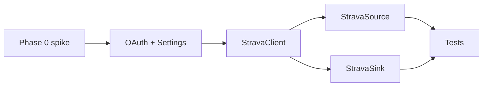

# Strava API (GetSync)

> **Создано:** 2026-05-28 · **Обновлено:** 2026-05-28 · **Версия:** 0.7.0  
> **Roadmap:** **3.9.3c** — OAuth + source/sink adapters (stub **3.9.3b** ✅)  
> **Официально:** https://developers.strava.com/docs/reference/ · OAuth: https://developers.strava.com/docs/authentication/  
> **Связано:** [CONNECTIONS.md](CONNECTIONS.md) · [CREDENTIALS.md](CREDENTIALS.md) · [ACTIVITY-HUB.md](ACTIVITY-HUB.md) · [API_HAMMERHEAD.md](API_HAMMERHEAD.md)

GetSync подключает Strava как **source + sink** через официальный OAuth2 REST API (без browser emulation). Один OAuth-flow с объединёнными scope покрывает ingest в catalog и upload FIT.

---

## Роль в activity hub

| Механизм | Направление | Эндпоинт / действие |
| -------- | ----------- | ------------------- |
| Pull (OAuth) | source → catalog | `GET /athlete/activities` |
| Push upload | catalog/FIT → sink | `POST /uploads` + poll `GET /uploads/{id}` |
| Export FIT (опц.) | source artifact | `GET /activities/{id}/export_original` |

Delivery `* → strava` через rule engine — **3.1** / **3.9.5**, не в минимальном **3.9.3c**. Минимум **3.9.3c**: connect в Settings, refresh ingest, ручной/тестовый upload через adapter.

---

## OAuth 2.0

### Базовые URL

| Сервис | URL |
| ------ | --- |
| Authorize | `https://www.strava.com/oauth/authorize` |
| Token | `https://www.strava.com/oauth/token` |
| Deauthorize | `https://www.strava.com/oauth/deauthorize` |
| REST API | `https://www.strava.com/api/v3` |

### Scopes (один connect для source + sink)

| Scope | Зачем GetSync |
| ----- | ------------- |
| `read` | Базовый доступ (Strava добавляет автоматически) |
| `activity:read` | Публичные активности |
| `activity:read_all` | Private / «Only You» — нужен для полного hub ingest |
| `activity:write` | Upload FIT, правка активностей |

**Рекомендуемая строка scope:**

```text
read,activity:read,activity:read_all,activity:write
```

Минимум для upload-only: `activity:write`. Для hub ingest без private — можно урезать до `activity:read`, но product default — полный набор выше.

### 1. Authorize (браузер пользователя)

```
GET https://www.strava.com/oauth/authorize
  ?client_id={CLIENT_ID}
  &response_type=code
  &redirect_uri={REDIRECT_URI}
  &approval_prompt=auto
  &scope=read,activity:read,activity:read_all,activity:write
  &state={SIGNED_STATE}
```

**Redirect URI (кабинет):** `{APP_PUBLIC_URL}/app/settings/strava/callback`  
**Redirect URI (CLI, локально):** `http://127.0.0.1:8765/callback` (как у Hammerhead)

Зарегистрировать оба URI в [Strava API settings](https://www.strava.com/settings/api) для dev/prod приложений.

**Успех:** `{redirect_uri}?code={code}&scope=...&state={state}`  
**Отказ:** `{redirect_uri}?error=access_denied&state={state}`

### 2. Token exchange

```
POST https://www.strava.com/oauth/token
Content-Type: application/x-www-form-urlencoded

client_id=...
client_secret=...
grant_type=authorization_code
code=...
redirect_uri=...   # must match authorize
```

**Ответ 200 (важные поля):**

```json
{
  "token_type": "Bearer",
  "access_token": "...",
  "refresh_token": "...",
  "expires_at": 1735689600,
  "expires_in": 21600,
  "athlete": { "id": 12345678 }
}
```

Сохранять: `access_token`, `refresh_token`, `expires_at` (или `expires_in` + `obtained_at`), `athlete.id`.

### 3. Refresh token

```
POST https://www.strava.com/oauth/token

client_id=...
client_secret=...
grant_type=refresh_token
refresh_token=...
```

Strava возвращает **новый** `refresh_token` — всегда перезаписывать файл токенов (rolling refresh).

### 4. Deauthorize (disconnect)

```
POST https://www.strava.com/oauth/deauthorize
  ?access_token={access_token}
```

После успеха — удалить локальный файл токенов.

---

## REST: ingest (source)

### List activities

```
GET https://www.strava.com/api/v3/athlete/activities
  ?page=1
  &per_page=50
  &after={unix_start}    # optional
  &before={unix_end}     # optional
Authorization: Bearer {access_token}
```

Пагинация: пока массив не пуст и `page <= N` (как HH scan, `MAX_SCAN_PAGES=25`).

**Mapping → `NormalizedActivity`:**

| Strava field | NormalizedActivity |
| ------------ | ------------------ |
| `id` | `activity_id` (string) |
| `name` | `name` |
| `start_date` / `start_date_local` | `activity_date` (ISO date part) |
| `distance` | `distance` (meters) |
| `moving_time` | `duration` (seconds) |
| `type` / `sport_type` | `activity_type` |
| — | `source="strava"` |
| — | `sync_status="not synced"` (delivery — позже через rules) |

### Export original FIT (stretch / **3.9.3c+**)

```
GET https://www.strava.com/api/v3/activities/{id}/export_original
Authorization: Bearer {access_token}
```

Не у всех активностей есть оригинальный файл (manual, third-party без upload). Ошибки 404 — норма; ingest metadata без FIT.

---

## REST: egress (sink)

### Upload

```
POST https://www.strava.com/api/v3/uploads
Authorization: Bearer {access_token}
Content-Type: multipart/form-data

file=@activity.fit
data_type=fit
external_id=getsync:{user_id}:{catalog_key}
name=...              # optional
activity_type=ride    # optional, override autodetect
```

**`external_id`:** стабильный idempotency key из catalog (`storage_key` или `{source}:{activity_id}`), чтобы Strava не создавала дубликаты при повторном upload.

### Poll status

```
GET https://www.strava.com/api/v3/uploads/{upload_id}
Authorization: Bearer {access_token}
```

| `status` | Действие |
| -------- | -------- |
| `Your activity is still being processed.` | sleep 1s, retry (cap ~60s) |
| `There was an error processing your activity.` | `UploadResult(status="error", …)` |
| `Your activity is ready.` | success; `activity_id` в ответе |

Среднее время обработки ~8s; poll ≤1 Hz (рекомендация Strava).

---

## Rate limits

| Лимит | Значение (default app) |
| ----- | ---------------------- |
| 15 min | ~100 requests |
| Daily | ~1000 requests |

При `429` — exponential backoff; в scan/upload логировать и не падать весь refresh (partial errors в `ActivityPage.errors`).

---

## Конфигурация (.env)

```bash
# Strava OAuth app — https://www.strava.com/settings/api
STRAVA_CLIENT_ID=
STRAVA_CLIENT_SECRET=
STRAVA_SCOPE=read,activity:read,activity:read_all,activity:write
# CLI
STRAVA_REDIRECT_URI=http://127.0.0.1:8765/callback
# Кабинет (production)
# STRAVA_WEB_REDIRECT_URI=https://app.getsync.me/app/settings/strava/callback
STRAVA_WEB_REDIRECT_URI=
```

Server-level secrets (как `HAMMERHEAD_*`). Per-user tokens — на диске tenant.

---

## Хранение credentials (v1)

До полной таблицы `connections` (**CREDENTIALS.md**) — зеркало Hammerhead:

```text
data/users/{user_id}/
  strava_tokens.json       # { access_token, refresh_token, expires_at, athlete_id, obtained_at }
```

Позже: `connections/strava/secrets.enc` + `meta.json` без смены публичного API адаптеров.

**SQLite:** опционально `users.strava_athlete_id` для audit/webhook (как `hammerhead_user_id`).

---

## Модули (целевая раскладка)

```text
getsync/providers/strava/
  oauth.py          # TokenSet, StravaOAuth (authorize, exchange, refresh)
  client.py         # StravaClient(ctx): load/save tokens, ensure_access_token()
  source.py         # StravaSource — fetch_page (+ export stretch)
  sink.py           # StravaSink — upload_fit + poll
  normalize.py      # Strava JSON → NormalizedActivity
```

**Web (зеркало Hammerhead):**

```text
getsync/web/settings_routes.py   # /strava/connect, /callback, /disconnect
getsync/web/oauth_state.py       # sign_strava_oauth_state / verify_*
getsync/web/templates/components/connections/strava_actions.html
getsync/web/connections.py       # status + available=True, dual role label
```

**Config:** `Settings.strava_client_id`, `strava_client_secret`, `strava_scope`, `strava_redirect_uri`, `strava_web_redirect_uri`.

**UserContext:** `strava_tokens_path` → `user_data_dir / "strava_tokens.json"`.

---

## Implementation plan (**3.9.3c**)

### Phase 0 — Spike (0.5 дн)

**Инструмент:** `python scripts/strava_spike.py register-hints`

| Шаг | Команда | Критерий |
| --- | ------- | -------- |
| 1. Strava app | [settings/api](https://www.strava.com/settings/api) | `STRAVA_CLIENT_ID` / `SECRET` в `.env` |
| 2. Redirect URIs | `register-hints` | CLI `http://127.0.0.1:8765/callback` + web `{APP_PUBLIC_URL}/app/settings/strava/callback` |
| 3. OAuth | `auth` (или `full`) | `data/spike/strava_tokens.json` с `athlete_id`, scope включает `activity:write` |
| 4. List | `list` | `GET /athlete/activities` → 200, JSON array |
| 5. Upload | `upload` | `POST /uploads` → `id`; poll до activity_id или processing error (minimal FIT) |

**Код spike:** [`scripts/strava_spike.py`](../scripts/strava_spike.py) · OAuth DTO: [`getsync/providers/strava/oauth.py`](../getsync/providers/strava/oauth.py)

- [x] Spike script + `oauth.py` TokenSet / authorize / exchange / refresh
- [x] `STRAVA_*` в `.env.example` + `Settings`
- [x] Contract test `tests/contract/test_strava_oauth.py`
- [ ] **Manual:** зарегистрировать Strava app + прогнать `auth` → `list` → `upload` с реальным аккаунтом

### Phase 1 — OAuth core (1 дн)

- [x] `getsync/providers/strava/oauth.py` — `TokenSet`, `StravaOAuth`
- [x] `Settings` + `.env.example`
- [x] `UserContext.strava_tokens_path`
- [x] `oauth_state.py` — signed state (salt `getsync-strava-oauth`)
- [x] Settings routes: connect / callback / disconnect + audit events
- [x] `strava_actions.html` partial
- [x] Flash messages в `app_i18n.py` (`strava_connected`, `strava_not_configured`, …)
- [x] `StravaClient` (load/save/clear tokens) — foundation for Phase 2

### Phase 2 — Client + connection status (0.5 дн)

- [x] `StravaClient`: load/save, refresh при `expires_at - 120s`, deauthorize on disconnect (Settings)
- [x] `StravaSource.connection_status` / `StravaSink.connection_status` — реальный connected/expired
- [x] `connections.py`: Strava card **Source + Destination**, `available=True` when server OAuth configured

### Phase 3 — Source ingest (1 дн)

- [x] `fetch_page` → `GET /athlete/activities`, pagination, date filters
- [x] `normalize.py` mapping
- [x] `catalog.refresh_from_providers` — Strava в default sources when tokens exist
- [x] Contract tests (mocked httpx)

### Phase 4 — Sink upload (1 дн)

- [x] `upload_fit`: multipart POST + poll loop
- [x] `external_id` = `getsync:{user_id}:{activity_id}`
- [x] `UploadResult` + обработка errors
- [x] Unit test с mocked client

### Phase 5 — Tests & docs (0.5 дн)

- [x] `tests/contract/test_strava_oauth.py` — token refresh, normalize
- [x] `tests/contract/test_strava_api.py` — source/sink/client
- [x] Integration: settings callback (`test_strava_settings.py`)
- [ ] **Manual:** prod Connect → refresh activities → optional upload test FIT

**Оценка:** ~4 рабочих дня (solo), без FIT export и без rule-driven delivery.

---

## Вне scope **3.9.3c** (later)

| Item | Epic |
| ---- | ---- |
| Strava webhooks (activity create/update) | **3.5** / post-hub |
| `export_original` → catalog FIT storage | **3.9.3c+** or **3.11** parity |
| Rule `* → strava` в UI | **3.1** |
| `ActivitySourceWithArtifacts` для Strava | optional |
| Encrypted `connections/strava/secrets.enc` | **2.16** migration |
| CLI `getsync strava auth` | nice-to-have (mirror HH CLI) |

---

## Зависимости и порядок



**Блокеры:** нет (registry + catalog refresh уже готовы **3.9.3b**).  
**Параллельно без конфликта:** **3.9.4** EventBus, **2.10** UI sidebar.

---

## Acceptance criteria

1. Settings → Strava → Connect completes OAuth; tokens on disk; Disconnect clears + deauthorize.
2. `refresh_from_providers(..., sources=("strava",))` ingests activities into catalog for connected user.
3. `/app/activities?refresh=1` shows Strava rows when connected (source column `strava`).
4. `StravaSink.upload_fit` uploads catalog FIT with stable `external_id`; poll returns success.
5. Server without `STRAVA_CLIENT_ID` — card shows «OAuth not configured», no crash.
6. Contract tests green; no secrets in logs.

---

## Риски

| Риск | Mitigation |
| ---- | ---------- |
| User denies `activity:read_all` | Show warning in UI; ingest only public activities |
| Rate limit on large backfill | Cap pages; `after=` incremental refresh |
| No FIT on Strava activity | Sink only from catalog FIT (HH/Garmin/manual); source metadata-only OK |
| Rolling refresh_token race | Single-writer per user; rewrite atomically (`save_json`) |
| Duplicate uploads | `external_id` + store strava activity id in sync index (future **3.9.5**) |
