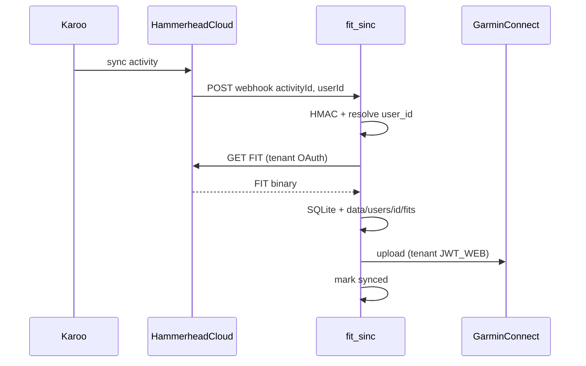

# Архитектура fit_sinc

> **Статус (2026-05-25):** production — фазы 0–5; доработка кабинета — [PLAN.md](PLAN.md) (фаза **5b**).  
> Быстрый старт — [README](../README.md).

**fit_sinc** — сервис автоматической синхронизации велотренировок с Hammerhead Karoo в Garmin Connect.

После поездки Karoo загружает активность в облако Hammerhead. Сервис получает webhook, скачивает оригинальный `.fit` через Hammerhead API и загружает его в Garmin Connect того **пользователя fit_sinc**, которому принадлежит `userId` из webhook. Данные не меняются — GPS, мощность, пульс, каденс как на Karoo.

## Зачем

Hammerhead и Garmin — разные экосистемы без встроенной синхронизации активностей. fit_sinc переносит поездки в Garmin Connect в фоне, в том числе для нескольких аккаунтов (tenants) на одном инстансе.

## Как работает

1. Тренировка на Karoo → Hammerhead Cloud
2. `POST /webhooks/hammerhead` — JSON `{ activityId, userId }`, HMAC `X-Hmac-Signature`
3. `userId` → строка `users.hammerhead_user_id` → `user_id` tenant
4. Скачивание `.fit` (retry 5 / 15 / 30 с) в `data/users/{id}/fits/`
5. Upload в Garmin Connect **этого** пользователя (см. [Garmin upload](#garmin-upload))
6. SQLite: `activities(user_id, activity_id)` — без дубликатов



## Технологии

| Слой | Выбор |
|------|-------|
| Язык | Python 3.11+ |
| HTTP / webhook | FastAPI + uvicorn |
| Hammerhead | OAuth 2.0 API (`activity:read`) |
| Garmin Connect | Web `JWT_WEB` + refresh по `session` cookie → Playwright / HTTP / garth-ng |
| Состояние | SQLite (`user_id` на activities, events) |
| CLI | typer (`--user <slug>`) |
| Веб-UI | Серверный HTML (`html.py`; Jinja — в **5b.2**) |
| Деплой | VPS + nginx + systemd |

## Мультипользовательность (фаза 5)

Один процесс fit_sinc, **изоляция по `user_id`**:

| Слой | Изоляция |
|------|----------|
| SQLite | `activities`, `sync_events`, `session_refresh_events` с `user_id` |
| Файлы | `data/users/{user_id}/` |
| Webhook | `payload.userId` → `users.hammerhead_user_id` |
| Sync / upload | `UserContext` → пути и сессии tenant |

```text
data/users/{user_id}/
  hammerhead_tokens.json   # OAuth Hammerhead
  garmin_web/session.json  # JWT_WEB, session, …
  garth/                   # OAuth garth-ng (fallback upload)
  fits/                    # кэш .fit
```

Миграция v1: legacy `data/*` → `data/users/default/` при старте (`users/migrate.py`).

**Пользователь в БД:** `slug`, `email`, `password_hash`, `timezone`, `telegram`, `hammerhead_user_id`, `is_admin`, `disabled`. См. [PLAN.md](PLAN.md#модель-данных).

## Garmin upload

Garmin часто блокирует чистый `garth.upload()`; основной путь — web-сессия с `JWT_WEB`.

**На каждого tenant отдельно:** свой `garmin_web/session.json` и свой `garth/`. Общий JWT на весь сервис **нет**.

**Обновление JWT** (`garmin/web_refresh.py`):

1. Фоновый цикл в `web/app.py` — по всем не-`disabled` users с каталогом `garmin_web/`
2. Сначала HTTP (`curl_cffi` + долгоживущая cookie `session`)
3. Fallback: headless Chromium **на одну операцию**, затем закрытие (`browser_upload.refresh_cookies_via_browser`)
4. Upload FIT: Playwright `/app/import-data` → HTTP → `garth.upload()`

| Миф | Факт |
|-----|------|
| «N виртуальных браузеров на N users» | Нет — cookies на диске, браузер только при refresh/upload |
| «Один JWT на сервер» | Нет — per `data/users/{id}/garmin_web/` |

**Первичная настройка (сейчас CLI, UI в 5b.4):**

```bash
fit_sinc --user <slug> garmin login
# или import-web-cookies → session.json этого tenant
fit_sinc --user <slug> garmin status   # upload_ready
```

⚠️ `GARMIN_EMAIL` / `GARMIN_PASSWORD` в `.env` — fallback при пустой сессии; для нескольких разных Garmin-аккаунтов не использовать (см. PLAN 5b.4).

Подробности: [API_GARMIN.md](API_GARMIN.md).

## Компоненты

| Компонент | Назначение |
|-----------|------------|
| `hammerhead/` | OAuth, API, FIT download |
| `garmin/session.py` | Оркестрация upload в контексте `UserContext` |
| `garmin/web_session.py` | Cookies, HTTP upload, `session.json` per tenant |
| `garmin/web_refresh.py` | Refresh `JWT_WEB`, фон + ручной trigger |
| `garmin/browser_upload.py` | Playwright upload / refresh cookies |
| `sync/service.py` | Webhook, backfill, `sync_activity(..., user_id)` |
| `users/context.py` | `UserContext`, пути `data/users/{id}/` |
| `users/bootstrap.py` | Первый admin (`BOOTSTRAP_ADMIN_EMAIL`) |
| `state/store.py` | SQLite, миграции, users CRUD |
| `web/app.py` | FastAPI, webhook, JWT refresh loop |
| `web/app_routes.py` | Кабинет `/app/*` |
| `web/admin_routes.py` | Админка `/app/admin/*` (`is_admin`) |
| `web/auth.py` | Сессия cookie, guard |

**Hammerhead API:** [API_HAMMERHEAD.md](API_HAMMERHEAD.md).  
**Webhook:** HMAC-SHA256, маршрутизация по `userId`.

## Веб-интерфейс

| Путь | Кто | Описание |
|------|-----|----------|
| `/webhooks/hammerhead` | Hammerhead | Приём событий |
| `/health` | Мониторинг | Health check |
| `/app/login` | Гость | Вход email + password |
| `/app/*` | Пользователь | Дашборд, activities, log, session |
| `/app/admin/*` | `is_admin` | CRUD users |
| `/admin/*` | — | 301 → `/app/admin/*` |

Кабинет: user bar (имя, email, slug, logout), re-sync активностей, статус HH/Garmin.

**Планируется (5b):** `/register`, `/app/settings` (профиль, HH/Garmin без CLI).

FIT: `data/users/{user_id}/fits/{activity_id}.fit` (или путь из SQLite).

## CLI

```bash
fit_sinc user list
fit_sinc user create <slug> --email ... --hammerhead-user-id ...

fit_sinc --user <slug> hammerhead auth
fit_sinc --user <slug> garmin login
fit_sinc --user <slug> garmin status
fit_sinc --user <slug> sync --since 2025-01-01

fit_sinc serve
```

## Безопасность

| Механизм | Сейчас | Цель (5b.5) |
|----------|--------|-------------|
| Webhook | HMAC | без изменений |
| Кабинет | Сессия `fit_sinc_session` (HttpOnly) | + `https_only` на prod |
| Снаружи | nginx → `127.0.0.1` | без изменений |
| UI снаружи | **Basic Auth** на nginx (двойной вход) | только сессия приложения |
| Админ | `users.is_admin` + `/app/admin/*` | без отдельного пароля в `.env` |
| Секреты | `.env` на сервере | per-tenant Garmin **не** в общем `.env` |

Админ **не** видит пароли Garmin/Hammerhead пользователей — только статусы и поддержка `hammerhead_user_id`.

## Ограничения (актуальные)

- nginx Basic Auth + `/app/login` (5b.5)
- Нет `/app/settings` и `/register` — HH/Garmin через CLI или админку (5b.3–5b.4)
- Даты в UI в основном MSK (`timeutil.py`); `users.timezone` — поле есть, полное форматирование в TZ — позже
- Только активности Hammerhead → Garmin (не routes)
- Неофициальный Garmin API (web + garth-ng)

## Реализованные фазы

| Фаза | Содержание |
|------|------------|
| **0** | VPS, nginx, certbot, systemd — [CI-CD.md](CI-CD.md) |
| **1** | Hammerhead OAuth, Garmin auth, webhook HMAC |
| **2** | `sync_activity()`, backfill, UI log/activities |
| **3** | Web JWT, Playwright / HTTP / garth |
| **4** | CI: [test.yml](../.github/workflows/test.yml), [deploy.yml](../.github/workflows/deploy.yml) |
| **5** | Tenants, `user_id`, `/app`, `/app/admin`, webhook routing |
| **5b** | Единый кабинет, settings, без Basic Auth — в работе — [PLAN.md](PLAN.md) |

**Production (Hammerhead portal):**

- Redirect: `http://127.0.0.1:8765/callback`
- Webhook: `https://fit.romansegalla.online/webhooks/hammerhead`

**Конфиги:** [`deploy/nginx/fit.conf`](../deploy/nginx/fit.conf), [`deploy/fit-sinc.service`](../deploy/fit-sinc.service).

## Связанная документация

| Документ | Содержание |
|----------|------------|
| [README](../README.md) | Быстрый старт |
| [PLAN.md](PLAN.md) | Roadmap 5b, 6, 7, 8 |
| [CI-CD.md](CI-CD.md) | Деплой |
| [API_HAMMERHEAD.md](API_HAMMERHEAD.md) | OAuth, webhook |
| [API_GARMIN.md](API_GARMIN.md) | JWT, upload |
