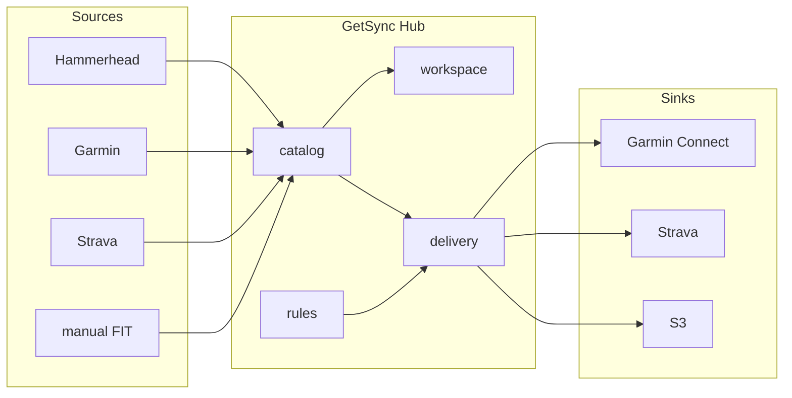
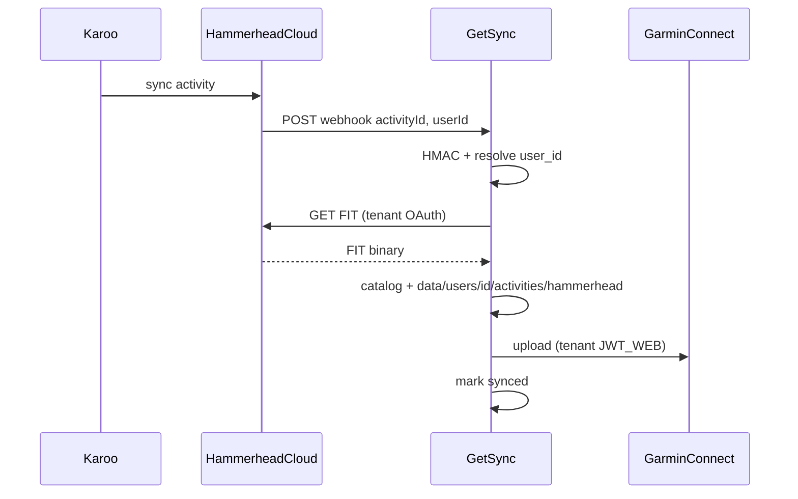

# Архитектура GetSync

> **Создано:** 2026-05-25 · **Обновлено:** 2026-05-28 · **Версия:** 0.7.0  
> **Product model:** [ACTIVITY-HUB.md](ACTIVITY-HUB.md) · **Modules:** [MODULES.md](MODULES.md)  
> **Статус:** production — activity hub foundation (**catalog** + **workspace**, **3.9.3** ✅); bootstrap delivery HH→Garmin — [PLAN.md](PLAN.md).  
> UI: [APP-UI.md](APP-UI.md) · connections: [CONNECTIONS.md](CONNECTIONS.md) · FIT: [STORAGE.md](STORAGE.md) · БД: [DATABASE.md](DATABASE.md)

**GetSync** — **personal activity hub**: единый каталог тренировок tenant'а и доставка в подключённые системы по правилам. Внешние платформы — providers (ingress/egress); canonical store — **catalog** GetSync.

## Activity hub (целевая модель)



| Поток | Путь | Модули |
| ----- | ---- | ------ |
| **Ingress** | source → metadata/FIT → catalog | `providers`, `catalog.refresh` |
| **Presentation** | catalog → list/calendar | `workspace` (read-only) |
| **Egress** | catalog/FIT → sink по rule | `sync` (delivery), `providers` sink |

Подробнее: [ACTIVITY-HUB.md](ACTIVITY-HUB.md).

## Bootstrap recipe: Hammerhead → Garmin

> **Не product definition** — первый production-сценарий (v0.6–v0.7). Implicit rule до **3.1**: `hammerhead → garmin`.

После поездки Karoo загружает активность в Hammerhead Cloud. GetSync получает webhook, скачивает `.fit`, сохраняет в **catalog** + disk и доставляет в Garmin Connect tenant'а.



Шаги:

1. Тренировка на Karoo → Hammerhead Cloud  
2. `POST /webhooks/hammerhead` — JSON `{ activityId, userId }`, HMAC  
3. `userId` → `users.hammerhead_user_id` → `user_id` tenant  
4. Скачивание `.fit` (retry **5 / 15 / 30** с) → `ActivityStorage.put_fit()` → catalog  
5. Upload в Garmin Connect ([Garmin upload](#garmin-upload))  
6. SQLite `activities` + `storage_key` — dedup и UI  

## Зачем (origin story)

Hammerhead и Garmin не синхронизируют активности между собой. GetSync родился как автоматизация этого сценария; продукт эволюционирует в **hub** для любых sources/sinks — см. [VISION.md](VISION.md).

## Технологии

| Слой | Выбор |
|------|-------|
| Язык | Python 3.11+ |
| HTTP / webhook | FastAPI + uvicorn |
| Hammerhead | OAuth 2.0 API (`activity:read`) |
| Garmin Connect | Web `JWT_WEB` + refresh по `session` cookie → Playwright / HTTP / garth-ng |
| Состояние | SQLite (`user_id` на activities и events) |
| CLI | typer (`getsync`; CLI `getsync`) |
| Email | `getsync/mail` — Resend / null / console; verify flows — **2.6** / **2.1e** 📋 |
| Веб-UI | Jinja2 + HTMX + Bootstrap 5 ([UI.md](UI.md)) |
| Деплой | VPS + nginx + systemd ([CI-CD.md](CI-CD.md)) |

## Данные и изоляция tenant

Один процесс GetSync, **изоляция по `user_id`**:

| Слой | Изоляция |
|------|----------|
| SQLite | `activities` (PK `user_id, source, activity_id`), `sync_events`, `session_refresh_events` |
| Файлы | `data/users/{user_id}/` — OAuth, Garmin session, `connections/garmin/` (encrypted), `activities/{source}/*.fit` |
| Webhook | `payload.userId` → `users.hammerhead_user_id` |
| Delivery / upload | `UserContext` → `StorageBackend`, provider paths |
| UI activities | `workspace` ← **catalog** (read-only); refresh → `catalog.refresh_from_providers` |

```text
data/
  getsync.db
  users/{user_id}/
    activities/                 # артефакты каталога (FIT, позже GPX)
      hammerhead/{id}.fit
      garmin/…
    hammerhead_tokens.json      # OAuth Hammerhead
    connections/garmin/         # encrypted credentials (**2.16**)
    garmin_web/session.json     # JWT_WEB, session, …
    garth/                      # OAuth garth-ng (fallback upload)
```

Каталог в SQLite: `activities(user_id, source, activity_id)` + `storage_key`, `activity_type`, … — [DATABASE.md](DATABASE.md) · файлы — [STORAGE.md](STORAGE.md).  
Бэкенд: `getsync.storage.StorageBackend` — **local** ✅; S3 — roadmap **3.3**.

Данные tenant: `data/users/{user_id}/` — см. [STORAGE.md](STORAGE.md), [DATABASE.md](DATABASE.md).

**Пользователь в БД:** `slug`, `email`, `password_hash`, `timezone`, `telegram`, `hammerhead_user_id`, `is_admin`, `disabled`. Подробнее — [PLAN.md](PLAN.md).

**Важно:** общего `garmin_web` или `garth` на весь сервер **нет** — только per-tenant каталоги.

## Garmin upload

Garmin часто блокирует чистый `garth.upload()`; основной путь — web-сессия с `JWT_WEB`.

**На каждого tenant отдельно:** `garmin_web/session.json` и `garth/`.

**Обновление JWT** ([`getsync/garmin/web_refresh.py`](../getsync/garmin/web_refresh.py)):

1. Фоновый цикл в [`getsync/web/app.py`](../getsync/web/app.py) — по всем не-`disabled` users с каталогом `garmin_web/`  
2. Сначала HTTP (`curl_cffi` + cookie `session`)  
3. Fallback: headless Chromium **на одну операцию** ([`browser_upload.py`](../getsync/garmin/browser_upload.py))  
4. Upload FIT: Playwright `/app/import-data` → HTTP → `garth.upload()`

| Миф | Факт |
|-----|------|
| «N браузеров на N users» | Нет — cookies на диске, браузер только при refresh/upload |
| «Один JWT на сервер» | Нет — per `data/users/{id}/garmin_web/` |

**Настройка в UI:** `/app/settings` — профиль, **Connections** (sources/destinations), Garmin status/refresh, **`#garmin-session`** (монитор JWT/cookies). **Первичный** Garmin login — CLI (**2.12** — UI в roadmap).

```bash
getsync --user <slug> garmin login
# или import-web-cookies → session.json этого tenant
getsync --user <slug> garmin status   # upload_ready
```

`GARMIN_EMAIL` / `GARMIN_PASSWORD` в `.env` — fallback при пустой сессии; для нескольких разных Garmin-аккаунтов **не использовать**.

Подробности: [API_GARMIN.md](API_GARMIN.md).

## Компоненты

| Компонент | Назначение |
|-----------|------------|
| [`getsync/credentials/`](../getsync/credentials/) | Encrypted per-user secrets (**2.16**) |
| [`getsync/mail/`](../getsync/mail/) | Outbound email (infra; verify — **2.1e**) |
| [`getsync/catalog/`](../getsync/catalog/) | Activity catalog owner, ingest (`refresh_from_providers`) |
| [`getsync/workspace/`](../getsync/workspace/) | List/calendar UI — read catalog only |
| [`getsync/providers/`](../getsync/providers/) | Source/sink registry (**3.9.3b**) |
| [`getsync/hammerhead/`](../getsync/hammerhead/) | OAuth, API, FIT download, HMAC (→ provider adapter) |
| [`getsync/garmin/`](../getsync/garmin/) | Web session, upload, list (→ provider adapter) |
| [`getsync/garmin/web_refresh.py`](../getsync/garmin/web_refresh.py) | Refresh `JWT_WEB`, фон + ручной trigger |
| [`getsync/garmin/browser_upload.py`](../getsync/garmin/browser_upload.py) | Playwright upload / refresh cookies |
| [`getsync/sync/service.py`](../getsync/sync/service.py) | Delivery orchestrator (bootstrap: HH→Garmin) |
| [`getsync/storage/`](../getsync/storage/) | `StorageBackend`, keys, `ActivityStorage` |
| [`getsync/users/context.py`](../getsync/users/context.py) | `UserContext`, пути tenant |
| [`getsync/web/connections.py`](../getsync/web/connections.py) | Registry sources/sinks для Settings |
| [`getsync/users/bootstrap.py`](../getsync/users/bootstrap.py) | Первый admin (`BOOTSTRAP_ADMIN_EMAIL`) |
| [`getsync/state/store.py`](../getsync/state/store.py) | SQLite, миграции, users CRUD |
| [`getsync/web/app.py`](../getsync/web/app.py) | FastAPI, webhook, JWT refresh loop |
| [`getsync/web/app_routes.py`](../getsync/web/app_routes.py) | Кабинет `/app/*` |
| [`getsync/web/admin_routes.py`](../getsync/web/admin_routes.py) | Админка `/app/admin/*` |
| [`getsync/web/settings_routes.py`](../getsync/web/settings_routes.py) | `/app/settings` |
| [`getsync/web/auth.py`](../getsync/web/auth.py) | Cookie-сессия, guards |

**Hammerhead:** [API_HAMMERHEAD.md](API_HAMMERHEAD.md).

## Веб-интерфейс

| Путь | Кто | Описание |
|------|-----|----------|
| `/` | Все | Лендинг ([`site_routes.py`](../getsync/web/site_routes.py)) |
| `/webhooks/hammerhead` | Hammerhead | Приём событий |
| `/health` | Мониторинг | `{"service":"getsync","version":"0.7.0"}` (dev) |
| `/app/login` | Гость | Вход email + password |
| `/app/activities` | Пользователь | **Главный экран:** List \| Calendar, unified sources; sync summary внизу |
| `/app/` | Пользователь | **303** → `/app/activities` |
| `/app/settings` | Пользователь | Profile, Connections, Password, `#garmin-session` |
| `/app/log` | — | **303** → `/app/admin/sync-log` |
| `/app/session` | — | **303** → `/settings#garmin-session` |
| `/app/admin/` | `is_admin` | Users CRUD |
| `/app/admin/sync-log` | `is_admin` | Sync events (все tenants, `#sync-log`) |
| `/app/admin/log` | `is_admin` | Garmin JWT refresh log |

**Nav (app):** Activities · Settings (+ Admin в topbar). Спека: [APP-UI.md](APP-UI.md). Вёрстка: [UI.md](UI.md).

**Регистрация:** `/register` при `REGISTRATION_OPEN=true` — [2.1-REGISTER.md](2.1-REGISTER.md); email verify — **2.1e**.

```text
catalog.refresh (ingress) ──► SQLite activities + storage_key
workspace (list/calendar) ◄── catalog.list_*  (read-only)
delivery (egress) ──► ActivityStorage + sink upload ──► catalog.mark_synced
```

FIT: `data/users/{user_id}/activities/{source}/{id}.fit` · download — `GET /app/activities/{id}/fit`.

## CLI

```bash
getsync user list
getsync user create <slug> --email ... --hammerhead-user-id ...

getsync --user <slug> hammerhead auth
getsync --user <slug> garmin login
getsync --user <slug> garmin login --save-credentials   # **2.16**
getsync --user <slug> garmin status
getsync --user <slug> sync --since 2025-01-01
getsync mail test --to you@example.com                  # Resend smoke

getsync serve
```

## Безопасность

| Механизм | Реализация |
|----------|------------|
| Webhook | HMAC-SHA256 (`HAMMERHEAD_WEBHOOK_SECRET`) |
| Кабинет | Cookie `getsync_session` (HttpOnly) |
| Production cookie | `SESSION_COOKIE_SECURE=true`, длинный `SESSION_SECRET` |
| Сеть | nginx TLS → `127.0.0.1:8080` |
| Админ | `users.is_admin` + `/app/admin/*` (без отдельного пароля в `.env`) |
| Секреты | `.env` на сервере; Garmin/Hammerhead tokens — в `data/users/{id}/`, не в git |

Админ **не** видит пароли Garmin/Hammerhead пользователей — только статусы и `hammerhead_user_id`.

Тесты доступа: `tests/test_security_auth.py`, `tests/test_app_auth.py`.

## Ограничения (актуальные)

- Подтверждение email не реализовано — mail infra ✅, product flows **2.1e** / **2.6** (`REGISTRATION_OPEN=false` на prod по умолчанию)  
- Garmin auto re-login ✅ при сохранённых credentials (**2.16**); **первичный** login в UI — **2.12** (пока CLI)  
- List/calendar — **catalog snapshot**; свежесть облачных sources = moment of last **refresh**  
- Календарь — дни из SQLite-каталога; облачные дни без ingest не видны  
- **Delivery:** bootstrap HH→Garmin в коде; explicit rules — **3.1**  
- Garmin в activities — source (metadata) + sink; не auto-sync «обратно» без rule  
- Неофициальный Garmin API (web + garth-ng)  
- MVP: один инстанс, несколько tenants; не полноценный multi-tenant SaaS  

## Production и инфраструктура

| Параметр | Значение |
|----------|----------|
| App (целевой) | `https://app.getsync.me` |
| Webhook | `https://app.getsync.me/webhooks/hammerhead` |
| OAuth redirect (UI) | `https://app.getsync.me/app/settings/hammerhead/callback` |
| CLI OAuth (локально) | `http://127.0.0.1:8765/callback` |
| VPS | `/opt/getsync`, user `getsync`, unit `getsync.service` |
| nginx | [`deploy/nginx/getsync.conf`](../deploy/nginx/getsync.conf) |

Cutover DNS и legacy host: [1.5-RENAME.md](archive/1.5-RENAME.md), [CI-CD.md](CI-CD.md).

## Реализованные фазы

| Фаза | Содержание |
|------|------------|
| **0** | VPS, nginx, certbot, systemd |
| **1** | Hammerhead OAuth, Garmin auth, webhook HMAC |
| **2** | `sync_activity()`, backfill, UI log/activities |
| **3** | Web JWT, Playwright / HTTP / garth |
| **4** | GitHub Actions test + deploy |
| **5** | Tenants, `user_id`, `/app`, `/app/admin`, webhook routing |
| **5b** | Settings, security tests, без nginx Basic Auth |
| **2.3** (часть) | Unified activities, SQLite catalog, calendar tab, sync summary, admin sync log, connections UI |
| **11.0** (часть) | `StorageBackend` local, `storage_key`, per-user `activities/{source}/` |
| **1.5** | Rename GetSync — A+B+C ✅ ([1.5-RENAME.md](archive/1.5-RENAME.md)) |
| **2.16** | CredentialStore, Garmin auto re-login backend ✅ ([CREDENTIALS.md](CREDENTIALS.md)) |

## Связанная документация

| Документ | Содержание |
|----------|------------|
| [README.md](README.md) | Индекс документации |
| [README](../README.md) | Быстрый старт |
| [PLAN.md](PLAN.md) | Тактический roadmap |
| [ACTIVITY-HUB.md](ACTIVITY-HUB.md) | Product model: hub, ingress/egress |
| [VISION.md](VISION.md) | Стратегия |
| [MODULES.md](MODULES.md) | Modularity rules |
| [DOMAIN-MODEL.md](DOMAIN-MODEL.md) | Canonical entities |
| [APP-UI.md](APP-UI.md) | Страницы `/app`, компоненты |
| [CONNECTIONS.md](CONNECTIONS.md) | Sources / destinations |
| [STORAGE.md](STORAGE.md) | FIT, `storage_key`, backends |
| [DATABASE.md](DATABASE.md) | SQLite: `users`, `activities`, журналы |
| [CI-CD.md](CI-CD.md) | Деплой |
| [API_HAMMERHEAD.md](API_HAMMERHEAD.md) | OAuth, webhook |
| [API_GARMIN.md](API_GARMIN.md) | JWT, upload |
| [UI.md](UI.md) | Шаблоны и Bootstrap |
| [1.5-RENAME.md](archive/1.5-RENAME.md) | Переименование |
