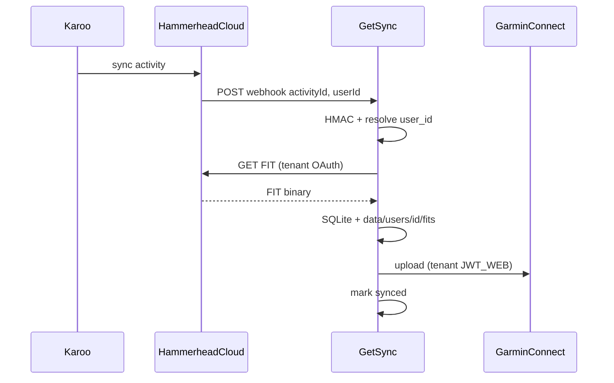

# Архитектура GetSync

> **Статус (2026-05-26):** production — фазы 0–5; кабинет и settings — фаза **5b** ([PLAN.md](PLAN.md)).  
> Быстрый старт — [README](../README.md) · индекс документов — [README.md](README.md).

**GetSync** — сервис автоматической синхронизации велотренировок с **Hammerhead Karoo** в **Garmin Connect**.

После поездки Karoo загружает активность в Hammerhead Cloud. Сервис получает webhook, скачивает оригинальный `.fit` через Hammerhead API и загружает его в Garmin Connect **того tenant**, которому соответствует `userId` из webhook. Трек не меняется — GPS, мощность, пульс, каденс как на Karoo.

## Зачем

Hammerhead и Garmin — разные экосистемы без встроенной синхронизации активностей. GetSync переносит поездки в Garmin Connect в фоне, в том числе для нескольких аккаунтов (tenants) на одном инстансе.

**Долгосрочно** (roadmap): хаб активностей — много источников, каталог, правила доставки в приёмники ([PLAN.md](PLAN.md)). **Сейчас в production:** срез **Hammerhead → Garmin** (webhook + backfill).

## Как работает

1. Тренировка на Karoo → Hammerhead Cloud  
2. `POST /webhooks/hammerhead` — JSON `{ activityId, userId }`, HMAC `X-Hmac-Signature`  
3. `userId` → `users.hammerhead_user_id` → `user_id` tenant (или `default`, если не найден)  
4. Скачивание `.fit` (retry **5 / 15 / 30** с) в `data/users/{id}/fits/`  
5. Upload в Garmin Connect **этого** tenant ([Garmin upload](#garmin-upload))  
6. SQLite: `activities(user_id, activity_id)` — без дубликатов  



## Технологии

| Слой | Выбор |
|------|-------|
| Язык | Python 3.11+ |
| HTTP / webhook | FastAPI + uvicorn |
| Hammerhead | OAuth 2.0 API (`activity:read`) |
| Garmin Connect | Web `JWT_WEB` + refresh по `session` cookie → Playwright / HTTP / garth-ng |
| Состояние | SQLite (`user_id` на activities и events) |
| CLI | typer (`getsync`; CLI `getsync`) |
| Веб-UI | Jinja2 + HTMX + Bootstrap 5 ([UI.md](UI.md)) |
| Деплой | VPS + nginx + systemd ([CI-CD.md](CI-CD.md)) |

## Данные и изоляция tenant

Один процесс GetSync, **изоляция по `user_id`**:

| Слой | Изоляция |
|------|----------|
| SQLite | `activities`, `sync_events`, `session_refresh_events` с `user_id` |
| Файлы | `data/users/{user_id}/` |
| Webhook | `payload.userId` → `users.hammerhead_user_id` |
| Sync / upload | `UserContext` → пути и сессии tenant |

```text
data/
  getsync.db                    # предпочтительно; legacy: fit_sinc.db
  users/{user_id}/
    hammerhead_tokens.json      # OAuth Hammerhead
    garmin_web/session.json     # JWT_WEB, session, …
    garth/                      # OAuth garth-ng (fallback upload)
    fits/                       # кэш .fit
```

**Миграция v1:** плоские `data/hammerhead_tokens.json`, `data/garth/`, … копируются в `data/users/default/` при старте ([`getsync/users/migrate.py`](../getsync/users/migrate.py)).

**Пользователь в БД:** `slug`, `email`, `password_hash`, `timezone`, `telegram`, `hammerhead_user_id`, `is_admin`, `disabled`. Подробнее — [PLAN.md](PLAN.md).

**Важно:** общего `garmin_web` или `garth` на весь сервер **нет** — только per-tenant каталоги.

## Garmin upload

Garmin часто блокирует чистый `garth.upload()`; основной путь — web-сессия с `JWT_WEB`.

**На каждого tenant отдельно:** `garmin_web/session.json` и `garth/`.

**Обновление JWT** ([`getsync/garmin/web_refresh.py`](../getsync/garmin/web_refresh.py)):

1. Фоновый цикл в [`getsync/web/app.py`](../getsync/web/app.py) — по всем не-`disabled` users с каталогом `garmin_web/`  
2. Сначала HTTP (`curl_cffi` + cookie `session`)  
3. Fallback: headless Chromium **на одну операцию** ([`browser_upload.py`](../getsync/garmin/browser_upload.py))  
4. Upload FIT: Playwright `/app/import-data` → HTTP → `garth.upload()`

| Миф | Факт |
|-----|------|
| «N браузеров на N users» | Нет — cookies на диске, браузер только при refresh/upload |
| «Один JWT на сервер» | Нет — per `data/users/{id}/garmin_web/` |

**Настройка в UI:** `/app/settings` — профиль, Hammerhead OAuth, Garmin status/refresh/disconnect. **Первичный** Garmin login — CLI (или import cookies).

```bash
getsync --user <slug> garmin login
# или import-web-cookies → session.json этого tenant
getsync --user <slug> garmin status   # upload_ready
```

`GARMIN_EMAIL` / `GARMIN_PASSWORD` в `.env` — fallback при пустой сессии; для нескольких разных Garmin-аккаунтов **не использовать**.

Подробности: [API_GARMIN.md](API_GARMIN.md).

## Компоненты

| Компонент | Назначение |
|-----------|------------|
| [`getsync/hammerhead/`](../getsync/hammerhead/) | OAuth, API, FIT download, HMAC |
| [`getsync/garmin/session.py`](../getsync/garmin/session.py) | Оркестрация upload в `UserContext` |
| [`getsync/garmin/web_session.py`](../getsync/garmin/web_session.py) | Cookies, HTTP upload, `session.json` |
| [`getsync/garmin/web_refresh.py`](../getsync/garmin/web_refresh.py) | Refresh `JWT_WEB`, фон + ручной trigger |
| [`getsync/garmin/browser_upload.py`](../getsync/garmin/browser_upload.py) | Playwright upload / refresh cookies |
| [`getsync/sync/service.py`](../getsync/sync/service.py) | `sync_activity`, backfill, webhook routing |
| [`getsync/users/context.py`](../getsync/users/context.py) | `UserContext`, пути tenant |
| [`getsync/users/bootstrap.py`](../getsync/users/bootstrap.py) | Первый admin (`BOOTSTRAP_ADMIN_EMAIL`) |
| [`getsync/state/store.py`](../getsync/state/store.py) | SQLite, миграции, users CRUD |
| [`getsync/web/app.py`](../getsync/web/app.py) | FastAPI, webhook, JWT refresh loop |
| [`getsync/web/app_routes.py`](../getsync/web/app_routes.py) | Кабинет `/app/*` |
| [`getsync/web/admin_routes.py`](../getsync/web/admin_routes.py) | Админка `/app/admin/*` |
| [`getsync/web/settings_routes.py`](../getsync/web/settings_routes.py) | `/app/settings` |
| [`getsync/web/auth.py`](../getsync/web/auth.py) | Cookie-сессия, guards |

**Hammerhead:** [API_HAMMERHEAD.md](API_HAMMERHEAD.md).

## Веб-интерфейс

| Путь | Кто | Описание |
|------|-----|----------|
| `/` | Все | Лендинг ([`site_routes.py`](../getsync/web/site_routes.py)) |
| `/webhooks/hammerhead` | Hammerhead | Приём событий |
| `/health` | Мониторинг | `{"service":"getsync","version":"0.5.0"}` |
| `/app/login` | Гость | Вход email + password |
| `/app/settings` | Пользователь | Профиль, HH/Garmin |
| `/app/*` | Пользователь | Дашборд, activities, log, session |
| `/app/admin/*` | `is_admin` | CRUD users |

Кабинет: user bar, Settings в nav, баннер HH/Garmin на дашборде, re-sync активностей. Вёрстка: [UI.md](UI.md).

**Регистрация:** `/register` при `REGISTRATION_OPEN=true` — [2.1-REGISTER.md](2.1-REGISTER.md); подтверждение email — **2.1e**.

FIT на диске: `data/users/{user_id}/fits/{activity_id}.fit` (путь дублируется в SQLite `fit_path`).

## CLI

```bash
getsync user list
getsync user create <slug> --email ... --hammerhead-user-id ...

getsync --user <slug> hammerhead auth
getsync --user <slug> garmin login
getsync --user <slug> garmin status
getsync --user <slug> sync --since 2025-01-01

getsync serve
```

## Безопасность

| Механизм | Реализация |
|----------|------------|
| Webhook | HMAC-SHA256 (`HAMMERHEAD_WEBHOOK_SECRET`) |
| Кабинет | Cookie `getsync_session` (HttpOnly); legacy `fit_sinc_session` читается 14 дней ([`legacy_session.py`](../getsync/web/legacy_session.py)) |
| Production cookie | `SESSION_COOKIE_SECURE=true`, длинный `SESSION_SECRET` |
| Сеть | nginx TLS → `127.0.0.1:8080` |
| Админ | `users.is_admin` + `/app/admin/*` (без отдельного пароля в `.env`) |
| Секреты | `.env` на сервере; Garmin/Hammerhead tokens — в `data/users/{id}/`, не в git |

Админ **не** видит пароли Garmin/Hammerhead пользователей — только статусы и `hammerhead_user_id`.

Тесты доступа: `tests/test_security_auth.py`, `tests/test_app_auth.py`.

## Ограничения (актуальные)

- Подтверждение email не реализовано — **2.1e** (`REGISTRATION_OPEN=false` на prod по умолчанию)  
- Garmin **первичный** login — CLI; в settings — status/refresh/disconnect  
- Даты: UTC в SQLite, отображение в `users.timezone`  
- Только **активности** Hammerhead → Garmin (не routes / workouts)  
- Неофициальный Garmin API (web + garth-ng)  
- MVP: один инстанс, несколько tenants; не полноценный multi-tenant SaaS  

## Production и инфраструктура

| Параметр | Значение |
|----------|----------|
| App (целевой) | `https://app.getsync.me` |
| Webhook | `https://app.getsync.me/webhooks/hammerhead` |
| OAuth redirect (UI) | `https://app.getsync.me/app/settings/hammerhead/callback` |
| CLI OAuth (локально) | `http://127.0.0.1:8765/callback` |
| VPS | `/opt/getsync`, user `getsync`, unit `getsync.service` |
| nginx | [`deploy/nginx/getsync.conf`](../deploy/nginx/getsync.conf) |

Cutover DNS и legacy host: [1.5-RENAME.md](1.5-RENAME.md), [CI-CD.md](CI-CD.md).

## Реализованные фазы

| Фаза | Содержание |
|------|------------|
| **0** | VPS, nginx, certbot, systemd |
| **1** | Hammerhead OAuth, Garmin auth, webhook HMAC |
| **2** | `sync_activity()`, backfill, UI log/activities |
| **3** | Web JWT, Playwright / HTTP / garth |
| **4** | GitHub Actions test + deploy |
| **5** | Tenants, `user_id`, `/app`, `/app/admin`, webhook routing |
| **5b** | Settings, security tests, без nginx Basic Auth |
| **1.5** | Rename GetSync — A+B в коде; **C** DNS/certbot на prod |

## Связанная документация

| Документ | Содержание |
|----------|------------|
| [README.md](README.md) | Индекс документации |
| [README](../README.md) | Быстрый старт |
| [PLAN.md](PLAN.md) | Roadmap |
| [CI-CD.md](CI-CD.md) | Деплой |
| [API_HAMMERHEAD.md](API_HAMMERHEAD.md) | OAuth, webhook |
| [API_GARMIN.md](API_GARMIN.md) | JWT, upload |
| [UI.md](UI.md) | Шаблоны и Bootstrap |
| [1.5-RENAME.md](1.5-RENAME.md) | Переименование |
