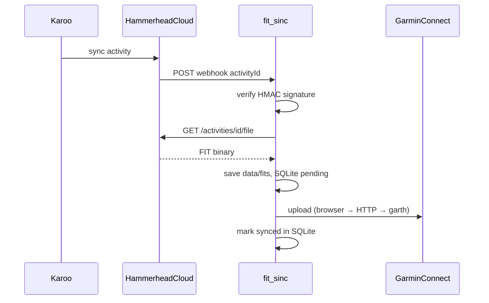

# Архитектура fit_sinc (v1)

> Текущее состояние production. Планы развития — в [PLAN.md](PLAN.md). Быстрый старт — в [README](../README.md).

**fit_sinc** — сервис автоматической синхронизации велотренировок с Hammerhead Karoo в Garmin Connect.

После поездки Karoo загружает активность в облако Hammerhead. Сервис получает webhook о новой тренировке, скачивает оригинальный `.fit` через официальный Hammerhead API и загружает его в Garmin Connect. Данные передаются без изменений — GPS, мощность, пульс, каденс остаются как записал Karoo.

## Зачем

Hammerhead и Garmin — разные экосистемы без встроенной двусторонней синхронизации активностей. Если основной анализ и история тренировок ведутся в Garmin Connect, каждую поездку с Karoo приходится переносить вручную. fit_sinc делает это автоматически в фоне.

## Как работает

1. Тренировка завершена → Karoo синхронизируется с Hammerhead Cloud
2. Hammerhead отправляет webhook на `POST /webhooks/hammerhead` (HMAC `X-Hmac-Signature`)
3. fit_sinc скачивает `.fit` по API (retry 5 / 15 / 30 с)
4. FIT загружается в Garmin Connect (цепочка upload — см. ниже)
5. ID активности сохраняется в SQLite — повторная загрузка не создаёт дубликат

## Технологии

| Слой | Выбор |
|------|-------|
| Язык | Python 3.11+ |
| HTTP / webhook | FastAPI + uvicorn |
| Hammerhead | Официальный OAuth 2.0 API (`activity:read`) |
| Garmin Connect | Web JWT (`JWT_WEB`) + Playwright `/app/import-data` → HTTP upload → garth-ng fallback |
| Состояние | SQLite (дедупликация, история sync) |
| CLI | typer |
| Веб-UI | Jinja2 + HTMX (серверный рендер, без SPA) |
| Деплой | VPS + **nginx** + systemd |

## Архитектура



### Компоненты

| Компонент | Назначение |
|-----------|------------|
| `hammerhead/` | OAuth, API client, скачивание FIT |
| `garmin/session.py` | Оркестрация upload, `garmin_login` |
| `garmin/web_session.py` | Web cookies, HTTP upload |
| `garmin/web_refresh.py` | Обновление `JWT_WEB` по `session` cookie |
| `garmin/browser_upload.py` | Playwright upload на connect.garmin.com |
| `sync/service.py` | id → FIT → upload → state, backfill |
| `web/app.py` | FastAPI: webhook + веб-UI |
| `state/store.py` | SQLite: activities, sync_events |
| `data/fits/` | Кэш FIT-файлов |
| `data/garth/` | OAuth session garth-ng |
| `data/garmin_web/` | Web cookies для upload |

**Hammerhead API:** OpenAPI `https://api.hammerhead.io/v1/docs/openapi.yml` — см. [API_HAMMERHEAD.md](API_HAMMERHEAD.md).

**Webhook:** JSON `{ activityId, userId }`, подпись `X-Hmac-Signature` (HMAC-SHA256).

## Garmin upload

Garmin Connect часто отклоняет прямой `garth.upload()`; upload идёт через web-интерфейс.

**Цепочка** (`garmin/session.py` → `upload_fit`):

1. `ensure_web_session()` — refresh `JWT_WEB` при необходимости
2. Playwright: `/app/import-data` (`browser_upload.py`)
3. Fallback: HTTP multipart (`web_session.py`)
4. Fallback: `garth.upload()` + `garth.save()`

| Команда | Когда |
|---------|--------|
| `garmin login` | Первичная настройка (OAuth + web) |
| `garmin status` | Проверка `upload_ready` |
| `garmin refresh-web` | Истёк JWT, есть `session` cookie |
| `garmin import-web-cookies` | Ручной импорт cookies из DevTools |

Подробности: [API_GARMIN.md](API_GARMIN.md).

## Веб-интерфейс

| Путь | Описание |
|------|----------|
| `/` | Дашборд — дата, название, статус sync |
| `/activities` | Таблица HH/Garmin, фильтры по дате/статусу/имени |
| `/log` | Webhook, download FIT, upload Garmin, ошибки |
| `/session` | Статус Garmin web-сессии |
| `/activities/{id}/fit` | Скачать `.fit` |
| `POST /app/activities/{id}/retry` | Re-sync одной активности (force, confirm если уже synced) |
| `POST /app/activities/retry-errors` | Re-sync всех `error` в SQLite (до 50) |

FIT на диске: `data/fits/{activity_id}.fit`.

## CLI

```bash
# Hammerhead
fit_sinc hammerhead auth
fit_sinc hammerhead status

# Garmin
fit_sinc garmin login
fit_sinc garmin status          # upload_ready = web JWT валиден
fit_sinc garmin refresh-web
fit_sinc garmin import-web-cookies '{"JWT_WEB":"...","session":"Fe26..."}'

# Sync
fit_sinc sync --since 2025-01-01
fit_sinc sync --activity-id <id> [--force]

# Production
fit_sinc serve
```

## Безопасность (v1)

- Секреты и токены — только в `.env` на сервере
- Приложение слушает `127.0.0.1`, снаружи — только nginx
- Webhook — HMAC `X-Hmac-Signature`
- Веб-панель — Basic Auth на nginx

Целевая модель безопасности v2 (admin / user, изоляция данных) — в [PLAN.md](PLAN.md#фаза-5-мультипользовательность--разделение-админ--пользователь).

## Ограничения v1

- Один логический пользователь: один `data/hammerhead_tokens.json`, один Garmin, одна БД без `user_id`
- Webhook передаёт `userId`, но сервис его **не использует** для маршрутизации
- Только **активности** Hammerhead → Garmin (не routes / workouts)
- Garmin через неофициальный API (web + garth-ng)

## Реализованные фазы (0–4)

| Фаза | Содержание |
|------|------------|
| **0 DevOps** | VPS, nginx, certbot, systemd, пользователь `fit_sinc`, `/opt/fit_sinc` — [CI-CD.md](CI-CD.md) |
| **1 Auth** | Hammerhead OAuth, Garmin OAuth + web-сессия, webhook HMAC, dashboard |
| **2 Sync** | `sync_activity()`, backfill, webhook → background sync, UI log/activities |
| **3 Upload** | Web JWT, Playwright / HTTP / garth fallback |
| **4 CI** | GitHub Actions: test + deploy на `main` — [`.github/workflows/ci.yml`](../.github/workflows/ci.yml) |

**Hammerhead Developer Portal (production):**

- Redirect URL: `http://127.0.0.1:8765/callback`
- Webhook URL: `https://fit.romansegalla.online/webhooks/hammerhead`

**Конфиги в репо:** [`deploy/nginx/fit.conf`](../deploy/nginx/fit.conf), [`deploy/fit-sinc.service`](../deploy/fit-sinc.service).

## Связанная документация

| Документ | Содержание |
|----------|------------|
| [README](../README.md) | Описание, быстрый старт, setup |
| [PLAN.md](PLAN.md) | Roadmap v2, будущие фазы |
| [CI-CD.md](CI-CD.md) | Деплой, сервер, nginx |
| [API_HAMMERHEAD.md](API_HAMMERHEAD.md) | OAuth, webhook, REST |
| [API_GARMIN.md](API_GARMIN.md) | Web JWT, upload, garth-ng |
