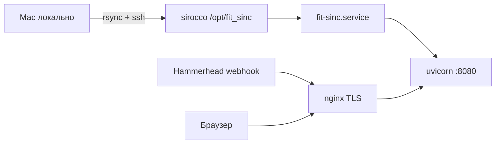
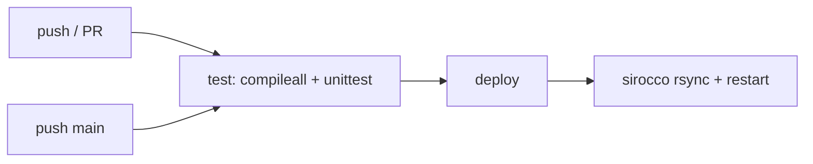

# CI/CD и деплой fit_sinc

> Личный сервис на одном VPS. **CI:** GitHub Actions — [`test.yml`](../.github/workflows/test.yml) (push/PR) и [`deploy.yml`](../.github/workflows/deploy.yml) (sirocco после успешного Test на `main`). Отдельные badges в README. Альтернатива: [`.gitlab-ci.yml`](../.gitlab-ci.yml). Ручной deploy с Mac — ниже.

## Схема



| Компонент | Значение |
|-----------|----------|
| Сервер | `sirocco.romansegalla.online` (`134.209.133.187`) |
| SSH | `ssh -i ~/.ssh/id_ed25519 root@sirocco.romansegalla.online` |
| Домен app (legacy) | `fit.romansegalla.online` (DNS only, без Cloudflare proxy) |
| **GetSync (целевой)** | `getsync.me` + `app.getsync.me` — см. [DNS](#dns-и-домены) |
| Лендинг | `romansegalla.online` — proxy на `:8080`, публичный `/` с формой входа |
| Каталог приложения | `/opt/fit_sinc` |
| Пользователь сервиса | `fit_sinc:fit_sinc` |
| Python venv | `/opt/fit_sinc/.venv` |
| Конфиг | `/opt/fit_sinc/.env` (не в git) |
| Данные | `/opt/fit_sinc/data/` (tokens, garth session, fits, SQLite) |

---

## DNS и домены

### GetSync — `getsync.me`

| Роль | Где | Значение |
|------|-----|----------|
| **Регистратор** | GoDaddy | домен `getsync.me` (оплата/владелец) |
| **DNS-зона** | **Cloudflare** (Free) | NS делегированы с GoDaddy → Cloudflare |
| **Приложение** | `app.getsync.me` | A/AAAA → `134.209.133.187` (sirocco), **DNS only** |
| **Лендинг** | `getsync.me` | A/AAAA → sirocco (рекомендуется **DNS only** на старте) |

Детали бренда и cutover: [1.5-RENAME.md](1.5-RENAME.md).

### Зачем Cloudflare при регистрации в GoDaddy

- Регистратор остаётся **GoDaddy**; переносится только **управление DNS** (смена nameservers).
- Удобные записи, редиректы (`thefitsync.com` → `getsync.me`), один аккаунт для нескольких зон.
- **Не обязательно** включать orange-cloud (proxy) на `app.*`.

### Политика proxy (как у `fit.romansegalla.online`)

| Host | Cloudflare proxy | Причина |
|------|------------------|---------|
| **`app.getsync.me`** | **Выкл.** (DNS only, серое облако) | Webhook Hammerhead, `/app`, долгие POST; меньше сюрпризов с TLS и IP |
| **`getsync.me`** | Выкл. на старте; proxy опционально для статики | Проще certbot HTTP-01 и отладка |

Orange-cloud на `app.*` без теста **не включать** — возможны лишние hop, блокировки, отличия TLS от origin.

### Подключение зоны (один раз)

1. [Cloudflare](https://dash.cloudflare.com) → **Add a site** → `getsync.me` → план **Free**.
2. Cloudflare покажет **2 nameserver** (например `xxx.ns.cloudflare.com`).
3. **GoDaddy:** Domain → `getsync.me` → **DNS** → **Nameservers** → **Change** → **Enter my own nameservers** → вставить NS Cloudflare → Save.
4. Дождаться статуса **Active** в Cloudflare (от минут до 24 ч).
5. В Cloudflare → **DNS** → **Records**:

| Type | Name | Content | Proxy |
|------|------|---------|-------|
| A | `@` | `134.209.133.187` | DNS only |
| A | `app` | `134.209.133.187` | DNS only |
| AAAA | `@`, `app` | при наличии IPv6 на VPS — опционально | DNS only |

6. **На sirocco:** nginx-конфиг для `getsync.me` / `app.getsync.me` (см. [1.5-RENAME.md](1.5-RENAME.md) этап C), затем certbot:

```bash
certbot --nginx -d getsync.me -d app.getsync.me
```

7. **Hammerhead Developer:** webhook URL и OAuth redirect URI на `https://app.getsync.me/...` **после** рабочего HTTPS.

### Редиректы (портфель доменов)

Пока зоны `thefitsync.com` / `fitnesssync.io` на других DNS — **Page Rule** или **Redirect Rules** в Cloudflare (или nginx на sirocco), цель `https://getsync.me`. После cutover: `fit.romansegalla.online` → `https://app.getsync.me` (301).

### Альтернатива без Cloudflare

DNS только в GoDaddy: A-записи `@` и `app` → IP sirocco. Работает; редиректы и несколько зон менее удобны.

---

## Первичная настройка сервера (один раз)

```bash
# На сервере
apt install -y python3.12-venv apache2-utils nginx certbot python3-certbot-nginx

useradd -r -d /opt/fit_sinc -s /usr/sbin/nologin fit_sinc
mkdir -p /opt/fit_sinc/data/fits
chown -R fit_sinc:fit_sinc /opt/fit_sinc

cp deploy/nginx/fit.conf /etc/nginx/conf.d/fit.conf
cp deploy/fit-sinc.service /etc/systemd/system/fit-sinc.service
nginx -t && systemctl reload nginx
systemctl enable --now fit-sinc
```

Certbot для `fit.romansegalla.online` — отдельно, если cert ещё не выпущен.

---

## Continuous Deployment (текущий процесс)

### 1. Код приложения

Перед rsync собирается Tailwind (`scripts/ci/build-frontend-css.sh` → `fit_sinc/web/static/app.css`). Нужны Node.js и `npm` локально.

```bash
cd /Users/roman/fit_sinc

./scripts/ci/build-frontend-css.sh   # опционально отдельно

rsync -avz --delete --exclude-from=.rsyncignore \
  -e "ssh -i ~/.ssh/id_ed25519" \
  ./ root@sirocco.romansegalla.online:/opt/fit_sinc/

# или: ./scripts/ci/deploy.sh (те же исключения)

ssh -i ~/.ssh/id_ed25519 root@sirocco.romansegalla.online <<'EOF'
set -euo pipefail
chown -R fit_sinc:fit_sinc /opt/fit_sinc
sudo -u fit_sinc bash -c 'cd /opt/fit_sinc && .venv/bin/pip install -e .'
systemctl restart fit-sinc
sleep 2
systemctl is-active fit-sinc
curl -sf http://127.0.0.1:8080/health
EOF
```

**Не синхронизируем через rsync** (список в [`.rsyncignore`](../.rsyncignore)):

| Путь | Причина |
|------|---------|
| `.env`, `data/` | Секреты и runtime на сервере |
| `.venv`, `.git` | Локальное / создаётся на VPS |
| `frontend/node_modules/` | Сборка CSS на Mac/CI (`build-frontend-css.sh`); на сервер — только `fit_sinc/web/static/app.css` |

С `--delete` лишние каталоги на сервере (например старый `frontend/node_modules`) удаляются при следующем deploy.

### 2. Секреты и сессии (при смене или первом деплое)

```bash
# .env — client_id, webhook secret (без пароля Garmin, если уже есть session)
scp -i ~/.ssh/id_ed25519 .env root@sirocco.romansegalla.online:/opt/fit_sinc/

# OAuth tokens и Garmin session — после локального auth
scp -i ~/.ssh/id_ed25519 data/hammerhead_tokens.json \
  root@sirocco.romansegalla.online:/opt/fit_sinc/data/
scp -i ~/.ssh/id_ed25519 -r data/garth \
  root@sirocco.romansegalla.online:/opt/fit_sinc/data/

ssh -i ~/.ssh/id_ed25519 root@sirocco.romansegalla.online \
  'chown -R fit_sinc:fit_sinc /opt/fit_sinc && systemctl restart fit-sinc'
```

### 3. Локальная настройка auth (на Mac)

```bash
cd /Users/roman/fit_sinc
cp .env.example .env   # заполнить Hammerhead credentials
.venv/bin/fit_sinc hammerhead auth
.venv/bin/fit_sinc garmin login
```

Затем — шаг 2 (копирование `data/` на сервер).

---

## Проверка после деплоя

```bash
# Health (без auth)
curl -sk https://fit.romansegalla.online/health

# Webhook без подписи → 403
curl -sk -o /dev/null -w "%{http_code}\n" -X POST \
  https://fit.romansegalla.online/webhooks/hammerhead \
  -H "Content-Type: application/json" \
  -d '{"activityId":"test","userId":"192184"}'

# Лендинг + логин (без Basic Auth на romansegalla.online)
curl -sk https://romansegalla.online/ | head -20

# UI fit (session login, без nginx Basic Auth)
curl -sk -o /dev/null -w "%{http_code}\n" https://fit.romansegalla.online/app/login
# ожидается 200

# На сервере
ssh root@sirocco.romansegalla.online \
  'systemctl status fit-sinc; journalctl -u fit-sinc -n 20 --no-pager'
```

---

## nginx: маршрутизация и auth

| Path | Auth | Назначение |
|------|------|------------|
| `/webhooks/*` | нет | Hammerhead webhook (HMAC в приложении) |
| `/health` | нет | Healthcheck |
| `/`, `/static/*`, `/favicon.ico` | нет (сессия в приложении) | UI и статика |

Конфиг: [`deploy/nginx/fit.conf`](../deploy/nginx/fit.conf)

**Production `.env`:** `SESSION_SECRET` (длинная случайная строка) и `SESSION_COOKIE_SECURE=true`.

**romansegalla.online** — лендинг и тот же uvicorn без Basic Auth:

```bash
scp -i ~/.ssh/id_ed25519 deploy/nginx/romansegalla.conf \
  root@sirocco.romansegalla.online:/etc/nginx/sites-available/romansegalla.online
ssh -i ~/.ssh/id_ed25519 root@sirocco.romansegalla.online \
  'nginx -t && systemctl reload nginx'
```

Конфиг: [`deploy/nginx/romansegalla.conf`](../deploy/nginx/romansegalla.conf). Статический fallback: [`deploy/www/index.html`](../deploy/www/index.html) (если proxy не включён — форма ведёт на fit).

---

## systemd

Конфиг: [`deploy/fit-sinc.service`](../deploy/fit-sinc.service)

```bash
systemctl restart fit-sinc
systemctl status fit-sinc
journalctl -u fit-sinc -f
```

Приложение слушает только `127.0.0.1:8080` — порт 8080 наружу не открыт.

---

## Rollback

```bash
# На сервере — откат к предыдущей версии кода (если есть бэкап или git)
cd /opt/fit_sinc
# git checkout <prev-commit>  # когда появится git на сервере
sudo -u fit_sinc .venv/bin/pip install -e .
systemctl restart fit-sinc
```

Секреты и `data/` при rollback не трогаем.

---

## GitHub Actions (основной)

Конфиг: [`.github/workflows/test.yml`](../.github/workflows/test.yml), [`.github/workflows/deploy.yml`](../.github/workflows/deploy.yml), деплой: [`scripts/ci/deploy.sh`](../scripts/ci/deploy.sh).

**Badges:** `Tests` — compile + unittest; `Deploy` — rsync + systemd на sirocco. Красный Deploy при падении SSH/restart не означает, что тесты сломаны.



| Job | Когда | Действие |
|-----|--------|----------|
| `test` | push и pull_request | `pip install -e .`, `compileall`, `tests/test_smoke.py` |
| `deploy` | push в `main` / `master` после test | rsync → `/opt/fit_sinc`, `pip install -e .`, `systemctl restart fit-sinc`, `/health` |

### Secrets и variables (GitHub → Settings → Secrets and variables → Actions)

| Имя | Тип | Описание |
|-----|-----|----------|
| `SSH_PRIVATE_KEY` | **Secret** | Полный текст приватного ключа (`~/.ssh/id_ed25519` или deploy-only key) |
| `FIT_SINC_SSH_HOST` | Variable (optional) | По умолчанию `sirocco.romansegalla.online` |
| `FIT_SINC_SSH_USER` | Variable (optional) | По умолчанию `root` |
| `FIT_SINC_DEPLOY_PATH` | Variable (optional) | По умолчанию `/opt/fit_sinc` |

Environment **production** (опционально): защита ветки / approval перед deploy.

**Не хранить в CI:** `.env`, `data/`, пароли Garmin — только на сервере.

**На сервере один раз:** venv, `.env`, tokens в `data/` (см. «Первичная настройка» и «Секреты»).

### Первый запуск

1. Репозиторий: https://github.com/segallar/fit-sinc
2. Secret `SSH_PRIVATE_KEY` в Settings → Secrets and variables → Actions.
3. Push в `main` — в Actions появятся `test` и `deploy`.

## GitLab CI (альтернатива)

Если зеркалируете на GitLab: [`.gitlab-ci.yml`](../.gitlab-ci.yml) — те же job'ы, переменная `SSH_PRIVATE_KEY` (тип File) в Settings → CI/CD → Variables.

### Локально прогнать то же, что CI

```bash
cd /Users/roman/fit_sinc
pip install -e .
python -m compileall -q fit_sinc
python -m unittest discover -s tests -p "test_*.py" -v
```

### Ручной deploy (без CI)

```bash
FIT_SINC_SSH_HOST=sirocco.romansegalla.online SSH_PRIVATE_KEY="$(cat ~/.ssh/id_ed25519)" ./scripts/ci/deploy.sh
```

Auth tokens (Hammerhead/Garmin) по-прежнему обновляются вручную через CLI, не через pipeline.

---

## Чеклист релиза

- [ ] Код задеплоен (`rsync` + `pip install -e .`)
- [ ] `systemctl is-active fit-sinc` → `active`
- [ ] `/health` → 200
- [ ] Webhook без HMAC → 403, с HMAC → 200
- [ ] `SESSION_COOKIE_SECURE=true` в `/opt/fit_sinc/.env` на prod
- [ ] Dashboard открывается по `/app/login` (без nginx Basic Auth)
- [ ] `fit_sinc hammerhead status` и `garmin status` на сервере → connected
