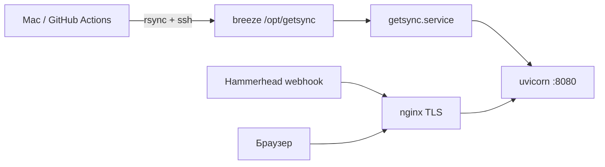

# CI/CD и деплой GetSync

> **Создано:** 2026-05-25 · **Обновлено:** 2026-05-28 · **Версия:** 0.7.0  
> Личный сервис на одном VPS. **CI/CD:** [GitHub Actions](#github-actions) — основной путь; репозиторий [github.com/segallar/getsync](https://github.com/segallar/getsync). Альтернатива: [GitLab CI](#gitlab-ci).  
> Индекс документации: [docs/README.md](README.md).

## Содержание

- [Схема](#схема)
- [DNS и домены](#dns-и-домены)
- [Первичная настройка сервера](#первичная-настройка-сервера-один-раз)
- [Continuous Deployment](#continuous-deployment) — [GitHub Actions](#основной-путь-github-actions) (основной) · [ручной deploy](#ручной-deploy-fallback)
- [GitHub Actions](#github-actions) — workflow, secrets, оптимизации
- [GitLab CI](#gitlab-ci) — legacy/alternative
- [Проверка после деплоя](#проверка-после-деплоя)
- [nginx](#nginx) · [systemd](#systemd) · [Rollback](#rollback)
- [Чеклист релиза](#чеклист-релиза)

## Схема



| Компонент | Значение |
|-----------|----------|
| **Prod (app)** | Hetzner **breeze** — `188.245.89.95` · `getsync.me`, `app.getsync.me` |
| SSH prod | `ssh -i ~/.ssh/id_ed25519 root@breeze.romansegalla.online` |
| Legacy VPS | `sirocco.romansegalla.online` — **снят** 2026-05-28 (`getsync` stopped/disabled, nginx `getsync.conf` off) |
| Staging URL | `breeze.romansegalla.online` (тот же хост, отдельный vhost) |
| Лендинг (личный) | `romansegalla.online` — proxy на `:8080` |
| Каталог приложения | `/opt/getsync` |
| Пользователь сервиса | `getsync:getsync` |
| Python venv | `/opt/getsync/.venv` |
| Конфиг | `/opt/getsync/.env` (не в git) |
| Данные | `/opt/getsync/data/` (`getsync.db`, `users/{id}/…`) |

---

## DNS и домены

### GetSync — `getsync.me`

| Роль | Значение |
|------|----------|
| **Регистратор** | GoDaddy — `getsync.me` |
| **DNS** | GoDaddy NS `ns37` / `ns38.domaincontrol.com` |
| **Приложение** | `app.getsync.me` → A `188.245.89.95` (breeze) |
| **Лендинг** | `getsync.me` → A `@` `188.245.89.95` (breeze) |
| **nginx** | [`deploy/nginx/getsync.conf`](../deploy/nginx/getsync.conf) |

#### A-записи

| Type | Name | Value |
|------|------|-------|
| A | `@` | `188.245.89.95` |
| A | `app` | `188.245.89.95` |

Проверка:

```bash
dig +short getsync.me A
dig +short app.getsync.me A
```

#### nginx + TLS на breeze (prod)

```bash
scp -i ~/.ssh/id_ed25519 deploy/nginx/getsync.conf \
  root@breeze.romansegalla.online:/etc/nginx/conf.d/getsync.conf

ssh -i ~/.ssh/id_ed25519 root@breeze.romansegalla.online \
  'nginx -t && systemctl reload nginx'

# при первом выпуске: HTTP-only vhost, затем
ssh -i ~/.ssh/id_ed25519 root@breeze.romansegalla.online \
  'certbot --nginx -d getsync.me -d www.getsync.me -d app.getsync.me'
```

Smoke:

```bash
curl -sk https://getsync.me/health
curl -sk https://app.getsync.me/health
curl -sk -o /dev/null -w "%{http_code}\n" https://app.getsync.me/app/login
```

#### Hammerhead (после HTTPS)

| Поле | URL |
|------|-----|
| Webhook | `https://app.getsync.me/webhooks/hammerhead` |
| OAuth redirect (UI) | `https://app.getsync.me/app/settings/hammerhead/callback` |

В `.env` на prod: `HAMMERHEAD_WEB_REDIRECT_URI`, при необходимости обновить webhook secret в Developer Portal.

#### Чеклист DNS (prod на breeze)

- [x] A `@` и `app` → `188.245.89.95` (breeze, 2026-05-28)
- [x] `getsync.conf` + certbot на breeze (2026-05-28)
- [x] `/health` prod + staging (`verify-hosts.sh`)
- [ ] Hammerhead webhook URL в Developer Portal (если ещё старый хост)

### Тестовый сервер breeze

| Роль | Значение |
|------|----------|
| Хост | Hetzner **breeze** — `188.245.89.95` |
| URL | [https://breeze.romansegalla.online](https://breeze.romansegalla.online) |
| DNS (romansegalla) | `breeze.romansegalla.online` → A `188.245.89.95` |
| Deploy одного хоста | `GETSYNC_SSH_HOST=breeze.romansegalla.online ./scripts/ci/deploy.sh` |
| Deploy (default) | `GETSYNC_SSH_HOST=breeze.romansegalla.online ./scripts/ci/deploy.sh` или `deploy-all.sh` |
| **Prod cutover** | ✅ GoDaddy → breeze (2026-05-28); CI только breeze |

Legacy `fit.romansegalla.online` на breeze **не** поднимается (снят 2026-05-28).

nginx: [`deploy/nginx/breeze.conf`](../deploy/nginx/breeze.conf) → `/etc/nginx/conf.d/breeze.conf`, затем `certbot --nginx -d breeze.romansegalla.online`.

#### Чеклист миграции breeze (staging) — ✅ 2026-05-28

| Шаг | Статус |
|-----|--------|
| Hetzner VPS + SSH (`root@breeze`) | ✅ |
| DNS A `breeze.romansegalla.online` | ✅ |
| Bootstrap: `python3.11-venv`, user `getsync`, nginx | ✅ |
| Копия `.env` + `data/` со sirocco | ✅ [`sync-from-prod.sh`](../scripts/ci/sync-from-prod.sh) |
| CI deploy только **breeze** | ✅ (sirocco снят 2026-05-28) |
| `breeze.conf` + certbot TLS | ✅ |
| `/health`, `/app/login` по HTTPS | ✅ |
| Playwright Chromium (Ubuntu 22.04) | ✅ |
| Legacy `fit.romansegalla` не поднимать | ✅ |

Проверка с Mac: `./scripts/ci/verify-hosts.sh`

Повторная настройка после rebuild VPS:

```bash
GETSYNC_SSH_HOST=breeze.romansegalla.online ./scripts/ci/bootstrap-host.sh
./scripts/ci/sync-from-prod.sh
scp deploy/nginx/breeze.conf root@breeze:/etc/nginx/conf.d/breeze.conf
ssh root@breeze 'nginx -t && systemctl reload nginx && certbot --nginx -d breeze.romansegalla.online'
SSH_PRIVATE_KEY="$(cat ~/.ssh/id_ed25519)" GETSYNC_SSH_HOST=breeze.romansegalla.online ./scripts/ci/deploy.sh
```

---

## Первичная настройка сервера (один раз)

```bash
apt install -y python3-venv nginx certbot python3-certbot-nginx
# Ubuntu 22.04: default python3 is 3.10 — нужен >=3.11:
# apt install -y python3.11 python3.11-venv

useradd -r -d /opt/getsync -s /usr/sbin/nologin getsync
mkdir -p /opt/getsync/data/users/default/fits
chown -R getsync:getsync /opt/getsync

python3.12 -m venv /opt/getsync/.venv
sudo -u getsync /opt/getsync/.venv/bin/pip install -e /opt/getsync

cp deploy/nginx/getsync.conf /etc/nginx/conf.d/getsync.conf
cp deploy/getsync.service /etc/systemd/system/getsync.service
nginx -t && systemctl reload nginx
systemctl enable --now getsync
```

Playwright (для Garmin upload):

```bash
sudo -u getsync /opt/getsync/.venv/bin/playwright install chromium
```

---

## Continuous Deployment

### Основной путь (GitHub Actions)

**Репозиторий:** [github.com/segallar/getsync](https://github.com/segallar/getsync) · badge CI в [README](../README.md).

Push или merge в `main` / `master` / `hotfix/*` → workflow [**CI**](../.github/workflows/test.yml) → jobs **lint**, **unit**, **integration** (параллельно) → **deploy** → breeze.

| Триггер | `test` | `deploy` |
|---------|--------|----------|
| push `main` / `master` / `hotfix/*` | да | да (после успешного `test`) |
| pull_request | да | **нет** |
| `workflow_dispatch` | да | **нет** (deploy только при `push`) |

Подробности: [GitHub Actions](#github-actions) (secrets, concurrency, оптимизации). Экстренный деплой без CI — [ручной deploy](#ручной-deploy-fallback).

### Ручной deploy (fallback)

UI: Bootstrap 5 с CDN в шаблонах; [`getsync/web/static/app.css`](../getsync/web/static/app.css) — только переопределение темы (коммитится). Node.js для деплоя **не нужен**. Скрипт [`scripts/ci/build-frontend-css.sh`](../scripts/ci/build-frontend-css.sh) — заглушка для совместимости.

```bash
cd /path/to/getsync

./scripts/ci/build-frontend-css.sh

# полный цикл как в CI
SSH_PRIVATE_KEY="$(cat ~/.ssh/id_ed25519)" ./scripts/ci/deploy.sh
# или
SSH_PRIVATE_KEY="$(cat ~/.ssh/id_ed25519)" ./scripts/ci/deploy-all.sh

# один хост:
# GETSYNC_SSH_HOST=breeze.romansegalla.online ./scripts/ci/deploy.sh
```

**Не синхронизируем** ([`.rsyncignore`](../.rsyncignore)):

| Путь | Причина |
|------|---------|
| `.env`, `data/` | Секреты и runtime на сервере |
| `.venv`, `.git` | Создаётся / живёт на VPS |
| `frontend/node_modules/` | CSS собирается до rsync |

После rsync на сервере (в CI делает [`deploy.sh`](../scripts/ci/deploy.sh)):

- при первом деплое или отсутствии `.playwright-chromium.ok` — `playwright install chromium` под пользователем `getsync` в `/opt/getsync/.cache/ms-playwright` (см. `PLAYWRIGHT_BROWSERS_PATH` в unit);
- однократно на VPS при ошибках запуска браузера: `sudo .venv/bin/playwright install-deps chromium` (системные lib).


```bash
# rsync от root с --chown=getsync:getsync — отдельный chown -R не нужен
# pip install -e . — только если изменился pyproject.toml (editable install)
systemctl restart getsync
curl -sf http://127.0.0.1:8080/health
```

### Секреты и сессии

```bash
scp -i ~/.ssh/id_ed25519 .env root@breeze:/opt/getsync/

# per-tenant (пример: default)
scp -i ~/.ssh/id_ed25519 data/users/default/hammerhead_tokens.json \
  root@breeze:/opt/getsync/data/users/default/
scp -i ~/.ssh/id_ed25519 -r data/users/default/garth data/users/default/garmin_web \
  root@breeze:/opt/getsync/data/users/default/

ssh root@breeze 'chown -R getsync:getsync /opt/getsync/data && systemctl restart getsync'
```

### Локальная настройка auth (Mac)

```bash
cd /path/to/getsync
cp .env.example .env
pip install -e .
getsync hammerhead auth
getsync garmin login
```

Затем — копирование `data/users/default/` на сервер (шаг 2).

---

## Проверка после деплоя

```bash
curl -sk https://app.getsync.me/health

curl -sk -o /dev/null -w "%{http_code}\n" -X POST \
  https://app.getsync.me/webhooks/hammerhead \
  -H "Content-Type: application/json" \
  -d '{"activityId":"test","userId":"192184"}'
# без HMAC → 403

curl -sk -o /dev/null -w "%{http_code}\n" https://app.getsync.me/app/login
# → 200

ssh root@breeze \
  'systemctl status getsync; journalctl -u getsync -n 20 --no-pager'
```

---

## nginx

| Path | Auth | Назначение |
|------|------|------------|
| `/webhooks/*` | нет | Hammerhead (HMAC в приложении) |
| `/health` | нет | Healthcheck |
| `/`, `/static/*`, `/app/*` | сессия приложения | UI |

Конфиг: [`deploy/nginx/getsync.conf`](../deploy/nginx/getsync.conf).

Legacy: `fit.romansegalla.online` снят; **sirocco** — `getsync` stopped/disabled, `getsync.conf` → `.disabled` (2026-05-28).

**Production `.env`:**

- `SESSION_SECRET` — длинная случайная строка  
- `SESSION_COOKIE_SECURE=true`  

**romansegalla.online** (личный лендинг): [`deploy/nginx/romansegalla.conf`](../deploy/nginx/romansegalla.conf).

---

## systemd

[`deploy/getsync.service`](../deploy/getsync.service)

```bash
systemctl restart getsync
journalctl -u getsync -f
```

Приложение слушает **только** `127.0.0.1:8080`.

### Логи приложения

| Назначение | Куда |
| ---------- | ---- |
| Отладка, webhook, ошибки | **journald** (`journalctl -u getsync`) |
| Файл (ротация 5×5 MB) | **`{data_dir}/logs/getsync.log`** (prod: `/opt/getsync/data/logs/getsync.log`) |
| События синка (UI) | SQLite `sync_events` → Admin → Sync log |
| Audit-дубль sync/session | та же строка в файле/journald: `getsync.audit` |

Переменные `.env` (опционально):

| Переменная | По умолчанию |
| ---------- | ------------ |
| `GETSYNC_LOG_TO_FILE` | `true` |
| `GETSYNC_LOG_FILE` | `data/logs/getsync.log` (относительно `data_dir`) |
| `GETSYNC_LOG_LEVEL` | `INFO` |

Отключить файл, оставить только journald: `GETSYNC_LOG_TO_FILE=false`.

```bash
tail -f /opt/getsync/data/logs/getsync.log
grep garmin_duplicate /opt/getsync/data/logs/getsync.log
```

---

## Rollback

```bash
cd /opt/getsync
# откат к предыдущему rsync-снимку или git checkout
sudo -u getsync .venv/bin/pip install -e .
systemctl restart getsync
```

`data/` и `.env` при rollback не трогаем.

---

## GitHub Actions

Workflow: [`.github/workflows/test.yml`](../.github/workflows/test.yml) — pipeline **CI** (`actions/checkout@v6`, `actions/setup-python@v6`).

| Job | Когда | Действие |
|-----|--------|----------|
| `lint` | push, PR, schedule, release, `workflow_dispatch` | `ruff check tests/…`, `compileall getsync` |
| `unit` | push, PR, … | `unittest discover -s tests/unit` |
| `integration` | push, PR, … | `unittest discover -s tests/integration` |
| `e2e` | **не** на PR; push `main`/`master`, nightly, label `e2e`, release | Playwright + `unittest discover -s tests/e2e` |
| `deploy` | push `main` / `master` / `hotfix/*` после **lint + unit + integration** | rsync → `/opt/getsync`, restart, `/health` |

Jobs **lint / unit / integration / e2e** без `needs` между собой — максимальный параллелизм. **e2e не блокирует deploy.**

E2E variables (опционально): `GETSYNC_STAGING_URL`; secret `E2E_WEBHOOK_SECRET`.

Поведение workflow:

- **`concurrency`** — группа `ci-<workflow>-<ref>`, `cancel-in-progress: true` (новый push отменяет предыдущий run на той же ветке).
- **`environment: production`** — job `deploy` привязан к GitHub Environment (опционально protection rules).
- **PR** — lint + unit + integration; prod не трогаем; e2e только с label `e2e`.
- **`GETSYNC_DEPLOY_NUMBER`** — `github.run_number` в metadata деплоя.

Скрипт деплоя: [`scripts/ci/deploy.sh`](../scripts/ci/deploy.sh).

### Ускорение deploy

| Оптимизация | Эффект |
|-------------|--------|
| **Один workflow** (без `workflow_run`) | Нет второго запуска runner и паузы ~30–90 с между Test и Deploy |
| **pip cache** в jobs | Быстрее установка зависимостей в CI |
| **rsync без tests/docs/.github** | Меньше файлов на wire (см. [`.rsyncignore`](../.rsyncignore)) |
| **`rsync --chown=getsync:getsync`** | Без `chown -R /opt/getsync` (в т.ч. не трогаем `data/`) |
| **skip `pip install -e .`** если `pyproject.toml` не менялся | Обычный код-фикс: rsync + restart (~10–30 с на сервере) |
| **health poll** — первая попытка сразу, далее до 10× с `sleep 2` | Быстрый happy-path; retry при медленном старте uvicorn |

Прогон только тестов: Actions → **CI** → **Run workflow** (deploy не запустится). Экстренный деплой: [ручной deploy](#ручной-deploy-fallback).

### Secrets / variables

| Имя | Тип | По умолчанию |
|-----|-----|--------------|
| `SSH_PRIVATE_KEY` | Secret | — |
| `GETSYNC_SSH_HOST` | Variable | `breeze.romansegalla.online` |
| `GETSYNC_SSH_USER` | Variable | `root` |
| `GETSYNC_DEPLOY_PATH` | Variable | `/opt/getsync` |
| `GETSYNC_STAGING_URL` | Variable | URL для e2e (напр. `https://breeze.romansegalla.online`) |
| `E2E_WEBHOOK_SECRET` | Secret | HMAC secret для e2e webhook на staging |

Переменные в GitHub (после `gh auth login`):

```bash
./scripts/ci/sync-github-vars.sh
```

Скрипт выставляет `GETSYNC_SSH_*` и удаляет legacy `FIT_SINC_*`. В `deploy.sh` fallback на старые имена остаётся, пока vars не обновлены.

**Не хранить в CI:** `.env`, `data/`, пароли Garmin.

### Локально как CI

```bash
pip install -e ".[dev]"
ruff check tests/unit tests/integration tests/e2e
python -m compileall -q getsync
pytest tests/unit -q
pytest tests/integration -q
```

Полная стратегия, каталог тестов и назначение скриптов: [TESTING.md](TESTING.md). Метаданные документов: [DOC-CONVENTION.md](DOC-CONVENTION.md).

---

## GitLab CI

**Статус:** legacy / alternative — основной pipeline на GitHub. Файл [`.gitlab-ci.yml`](../.gitlab-ci.yml) сохранён для зеркала или миграции; job'ы те же по смыслу (`test` → `deploy`), общий [`deploy.sh`](../scripts/ci/deploy.sh).

| | GitHub Actions | GitLab CI |
|--|----------------|-----------|
| Основной | да | нет |
| Deploy branches | `main`, `master`, `hotfix/*` | `main`, `master`, `hotfix/*` |
| Deploy number | `github.run_number` | `CI_PIPELINE_IID` |
| pip cache в test | да | нет |
| Secret SSH | `SSH_PRIVATE_KEY` (Secret) | `SSH_PRIVATE_KEY` (File, masked) |
| Environment URL | — | `https://app.getsync.me` |

Переменные (Settings → CI/CD → Variables): `SSH_PRIVATE_KEY` (File); опционально `GETSYNC_SSH_HOST`, `GETSYNC_SSH_USER`, `GETSYNC_DEPLOY_PATH`.

---

## Чеклист релиза

- [ ] rsync + `pip install -e .`
- [ ] `systemctl is-active getsync` → `active`
- [x] `https://app.getsync.me/health` → 200
- [ ] Webhook без HMAC → 403
- [ ] `SESSION_COOKIE_SECURE=true` в `/opt/getsync/.env`
- [ ] `/app/login` без nginx Basic Auth
- [ ] `getsync hammerhead status` и `getsync garmin status` на сервере (от пользователя `getsync`)
