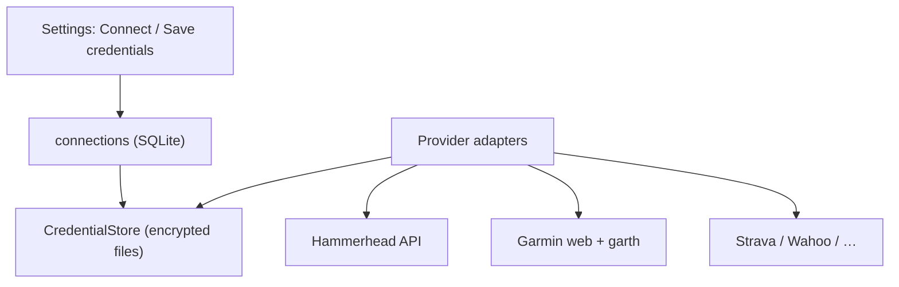

# Учётные данные интеграций (per user)

> **Создано:** 2026-05-26 · **Обновлено:** 2026-05-27 · **Версия:** 0.7.0  
> **Статус:** **2.16** backend ✅ · **2.12** Garmin login UI 📋  
> **Связано:** [CONNECTIONS.md](CONNECTIONS.md) · [DATABASE.md](DATABASE.md) · [PLAN.md](PLAN.md) (**2.7**, **2.12**, **2.16**) · [API_GARMIN.md](API_GARMIN.md)

Цель: **авто-перелогин** при протухании сессий и **единое хранение секретов** для Garmin, Hammerhead и будущих систем — **отдельно на каждого tenant**, без общего `GARMIN_*` в `.env`.

---

## Требования

| Требование | Пояснение |
| ---------- | --------- |
| Per user | У `roman` и `default` разные Garmin/HH аккаунты |
| Auto re-login | При 400/401 refresh — попытка восстановить сессию без CLI |
| Много систем | Один контракт для Hammerhead, Garmin, Strava, S3, … |
| Безопасность | Секреты не в plaintext в SQLite, не в логах |
| Совместимость | Текущие пути `garth/`, `garmin_web/` — миграция, не ломать prod |

---

## Слои (целевая архитектура)



| Слой | Ответственность |
| ---- | ---------------- |
| **`connections`** | Реестр: `user_id`, `provider`, `role` (source/sink), `enabled`, публичный `config_json` |
| **CredentialStore** | Шифрование/чтение секретов по `connection_id` |
| **Адаптер провайдера** | `ensure_session()` → токены/cookies; `login(email, password)` при необходимости |
| **Jobs / sync** | Вызывают только `ensure_session()`, не знают про пароли |

См. черновик таблицы в [CONNECTIONS.md](CONNECTIONS.md#целевая-модель-фаза-7).

---

## Типы секретов (по провайдеру)

Один connection может иметь **несколько артефактов** (как сейчас у Garmin):

| `credential_kind` | Пример | Авто-обновление |
| ----------------- | ------ | ---------------- |
| `oauth2_tokens` | Hammerhead, garth | refresh_token → access (пока Garmin принимает) |
| `session_cookies` | `garmin_web/session.json` | HTTP refresh JWT → Playwright → **re-login** |
| `username_password` | Garmin email + password (опционально) | Только для **fallback** re-login, если refresh OAuth/JWT не удался |
| `api_key` | будущие API | по TTL / 401 |
| `oauth1` | legacy garth | не использовать для новых |

**Правило:** пароль третьей стороны **не обязателен**, если живут refresh-токены; хранение пароля — **opt-in** в UI («сохранить для автоматического восстановления»).

---

## Хранение на диске (v1 реализации)

До полной таблицы `connections` — нормализованный каталог под tenant:

```text
data/users/{user_id}/
  connections/
    hammerhead/
      meta.json              # provider, role, enabled, external_user_id, …
      secrets.enc            # Fernet blob: { "oauth_tokens": {…} }
    garmin/
      meta.json              # email (не секрет), flags
      secrets.enc            # { "password": "…", optional }
      artifacts/
        oauth2_token.json    # garth (как сейчас, или внутри blob)
        web_session.json     # garmin_web (или symlink/copy)
```

| Поле | Где |
| ---- | --- |
| Публичные настройки | `meta.json` или `connections.config_json` |
| Пароли, refresh, client secrets | только `secrets.enc` |
| Ключ шифрования | **только** env `GETSYNC_SECRETS_KEY` (32 url-safe bytes), **не** в git |

Миграция с текущих путей:

1. При старте: если есть `hammerhead_tokens.json` → импорт в `connections/hammerhead/`.
2. `garth/` + `garmin_web/` → `connections/garmin/artifacts/`.
3. После миграции старые файлы читать как fallback один релиз.

---

## Авто-перелогин (Garmin, эталон)

```text
ensure_garmin_session(user):
  1. web_resume() → JWT valid? → return
  2. refresh_web_session() → OK? → return
  3. garth resume + API ping → OK? → return
  4. если в secrets.enc есть email+password → garmin_login(email, password)
  5. иначе → ConnectionError("reconnect in Settings") + запись в sync_events / UI banner
```

Триггеры шага 4:

- `DI-OAuth2 exchange failed` (400) при `Activity.list`
- истёк `refresh_token` (проверка `refresh_token_expires_at` **до** запроса)
- фоновый job `GARMIN_JWT_REFRESH` после неудачного HTTP refresh

**События:** `session_refresh_events` + тип `oauth_relogin` / `auto_login_ok` / `auto_login_failed` (без пароля в payload).

---

## UI и CLI

| Канал | Поведение |
| ----- | --------- |
| **2.12** Settings | Форма Garmin: email, password, чекбокс «хранить для авто-восстановления», Connect |
| CLI `garmin login` | Как сейчас + флаг `--save-credentials` (default true для admin?) |
| Disconnect | Удалить `connections/garmin/` целиком (уже близко к `garmin/disconnect`) |
| Admin | Не видеть пароли; только `connected` / `last_error` / `expires_at` |

Убрать из prod `.env`: `GARMIN_EMAIL`, `GARMIN_PASSWORD` после миграции на per-user store.

---

## Новые провайдеры (шаблон)

Для каждой системы в [CONNECTIONS.md](CONNECTIONS.md):

1. Запись в реестре `PROVIDERS` (id, role, auth kinds).
2. Адаптер: `connect()`, `disconnect()`, `ensure_session()`, `status()`.
3. Схема `meta.json` / полей в `config_json`.
4. Документ `API_*.md` + тесты с mock HTTP.

Примеры:

| provider | role | Секреты |
| -------- | ---- | ------- |
| `hammerhead` | source | OAuth2 only |
| `garmin` | sink (+ source в 3.11) | cookies + oauth2 + optional password |
| `strava` | source | OAuth2 |
| `s3` | sink | access_key + secret |

---

## Roadmap (задачи)

| ID | Содержание | Зависимости |
| -- | ---------- | ----------- |
| **2.16** | CredentialStore (Fernet), `secrets.enc`, env key | ✅ код |
| **2.16.1** | Garmin: сохранение email/password (opt-in), убрать `.env` fallback | ✅ CLI; legacy `.env` fallback остаётся |
| **2.16.2** | `ensure_garmin_session()` + auto re-login + понятные ошибки в UI | ✅ код; UI форма — **2.12** |
| **2.7** | Таблица `connections` в SQLite, миграция файлов | **2.16** |
| **2.7.1** | Hammerhead credentials через тот же store | **2.7** |

**2.12** (Garmin login UI) и **2.16** можно вести параллельно: UI пишет в store, sync вызывает `ensure_*`.

---

## Безопасность и compliance

- Пароли Garmin — **чувствительные данные**; бэкапы `data/` — с осторожностью.
- MFA Garmin: auto-login может потребовать ручной ввод — фиксировать `mfa_required` в статусе.
- Ротация `GETSYNC_SECRETS_KEY` — отдельная ops-процедура (re-encrypt all `secrets.enc`).
- Не логировать: password, access_token, refresh_token, cookies.

---

## Ссылки

| Документ | Тема |
| -------- | ---- |
| [CONNECTIONS.md](CONNECTIONS.md) | Sources/sinks, UI |
| [API_GARMIN.md](API_GARMIN.md) | JWT, garth, upload |
| [5b-DECISIONS.md](archive/5b-DECISIONS.md) | multi-tenant |
