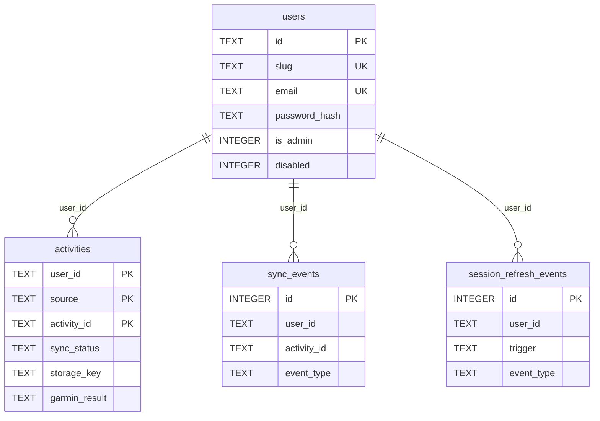

# База данных SQLite

> **Создано:** 2026-05-26 · **Обновлено:** 2026-05-27 · **Версия:** 0.7.0  
> **Код:** [`getsync/state/store.py`](../getsync/state/store.py) — схема, миграции, CRUD.  
> **Файлы FIT:** [STORAGE.md](STORAGE.md) · **Архитектура:** [ARCHITECTURE.md](ARCHITECTURE.md).

---

## Расположение и доступ

| Параметр | Значение |
| -------- | -------- |
| Движок | SQLite 3 |
| Путь по умолчанию | `data/getsync.db` |
| Файл | `data/getsync.db` ([`config.db_path`](../getsync/config.py)) |
| Каталог данных | `DATA_DIR` / `getsync.data_dir` (см. `.env.example`) |
| API в коде | `Store(db_path)` — один файл на инстанс сервиса |

Схема создаётся и обновляется **при старте** `Store` (нет отдельных Alembic-миграций): `CREATE TABLE IF NOT EXISTS`, `ALTER TABLE` для добавления колонок, пересоздание `activities` при крупных версиях.

---

## Обзор таблиц (production)

| Таблица | Назначение |
| ------- | ---------- |
| `users` | Tenants: учётные записи, профиль, флаги admin/disabled |
| `activities` | Каталог активностей (метаданные + статус sync) по `(user_id, source, activity_id)` |
| `sync_events` | Журнал pipeline HH→Garmin (admin UI: все tenants) |
| `session_refresh_events` | Журнал обновления Garmin JWT (admin UI: Garmin log) |

**Не в SQLite:** OAuth-токены Hammerhead, сессия Garmin, garth — JSON под `data/users/{user_id}/`.  
**FIT-файлы:** на диске по `storage_key` — [STORAGE.md](STORAGE.md).

---

## `users`

Учётные записи кабинета и CLI `--user`.

| Колонка | Тип | Описание |
| ------- | --- | -------- |
| `id` | TEXT PK | Внутренний id (`default`, slug или явный при создании) |
| `slug` | TEXT UNIQUE | URL-safe идентификатор (`a-z0-9_-`, 2–63 символа) |
| `display_name` | TEXT | Имя в UI |
| `email` | TEXT UNIQUE | Логин (нормализуется в lower case) |
| `telegram` | TEXT | Опционально |
| `timezone` | TEXT | IANA TZ, default `Europe/Moscow` |
| `locale` | TEXT | `en` / `ru` / `de`, default `en` |
| `hammerhead_user_id` | TEXT UNIQUE | Привязка webhook/API Hammerhead → tenant |
| `password_hash` | TEXT | bcrypt (см. `getsync/users/passwords.py`) |
| `disabled` | INTEGER | `0` / `1` — вход запрещён |
| `is_admin` | INTEGER | `0` / `1` — доступ `/app/admin/*` |
| `created_at` | TEXT | ISO 8601 UTC |
| `updated_at` | TEXT | ISO 8601 UTC |

**Связи:** webhook Hammerhead резолвит tenant по `hammerhead_user_id` (`get_user_by_hammerhead_id`). Bootstrap: `ensure_default_user()` создаёт `id=default`, `is_admin=1`.

---

## `activities`

Единый каталог для UI (list/calendar) и статуса синхронизации HH→Garmin.  
Первичный ключ: **`(user_id, source, activity_id)`**.

| Колонка | Тип | Описание |
| ------- | --- | -------- |
| `user_id` | TEXT | FK → `users.id` (логически, без SQLite FK) |
| `source` | TEXT | Провайдер: `hammerhead`, `garmin`, … |
| `activity_id` | TEXT | Внешний id активности у провайдера |
| `name` | TEXT | Название |
| `activity_date` | TEXT | Дата/время начала (строка из API; для календаря и сортировки) |
| `distance` | REAL | Метры (или как отдаёт API) |
| `duration` | REAL | Секунды |
| `activity_type` | TEXT | Тип (ride, run, …) |
| `sync_status` | TEXT NOT NULL | См. [статусы](#sync_status-activities) |
| `storage_key` | TEXT | Логический ключ FIT в `StorageBackend` |
| `fit_path` | TEXT | **Не используется** (остаётся в старых БД после миграций схемы); канон — `storage_key` |
| `garmin_result` | TEXT | JSON ответа upload Garmin (id, status, …) |
| `synced_at` | TEXT | ISO UTC успешного sync |
| `error_message` | TEXT | Текст ошибки (до ~2000 символов в upsert) |
| `created_at` | TEXT | ISO UTC |
| `updated_at` | TEXT | ISO UTC |

### Поведение по `source`

| `source` | Кто пишет | Содержимое строки |
| -------- | --------- | ----------------- |
| `hammerhead` | Webhook + `sync_activity`, browse | Полный цикл: FIT, upload Garmin, `garmin_result` |
| `garmin` | `persist_browse_rows` после browse API | В основном **metadata** для списка; FIT локально — [**3.11**](3.11-GARMIN-PULL.md) |

`build_sync_index(user_id)` читает только `source='hammerhead'` — индекс для сопоставления HH-активностей с Garmin при browse.

### `sync_status` (activities)

| Значение | Смысл |
| -------- | ----- |
| `pending` | Ожидает или идёт sync |
| `synced` | FIT загружен и отправлен в Garmin (HH pipeline) |
| `error` | Ошибка download/upload; см. `error_message` |
| `not synced` | В каталоге, но не синхронизировалось (browse) |
| `skipped` | Дедуп / уже synced (логика sync) |

Дополнительные значения для Garmin pull планируются в **3.11** (`imported`, `no_file`, …) — [3.11-GARMIN-PULL.md](3.11-GARMIN-PULL.md).

### Индексы

| Индекс | Колонки |
| ------ | ------- |
| `idx_activities_user_date` | `(user_id, activity_date DESC)` |
| `idx_activities_user_source_date` | `(user_id, source, activity_date DESC)` — после миграции multi-source |

---

## `sync_events`

Аудит pipeline синхронизации (таблица в **Admin → Sync log**).  
`user_id=NULL` в старых строках после миграции заполнено `default`.

| Колонка | Тип | Описание |
| ------- | --- | -------- |
| `id` | INTEGER PK AUTOINCREMENT | |
| `user_id` | TEXT | Tenant; `list_events(user_id=None)` — все пользователи |
| `activity_id` | TEXT | HH activity id (может быть пустым) |
| `event_type` | TEXT NOT NULL | См. ниже |
| `message` | TEXT | Детали (обрезка ~2000 символов) |
| `created_at` | TEXT | ISO UTC |

### Типичные `event_type` (sync)

| `event_type` | Когда |
| ------------ | ----- |
| `webhook_received` | POST `/webhooks/hammerhead` |
| `sync_started` | Начало `sync_activity` |
| `fit_retry` | Повтор скачивания FIT |
| `fit_saved` | FIT записан в storage |
| `garmin_uploaded` | Успешный upload в Connect |
| `skipped` | Уже synced, force не задан |
| `error` | Ошибка на любом этапе |
| `duplicate` | (планируется явнее в **2.14**) |

Сортировка в UI: `ORDER BY id DESC` (новые сверху).

### Индекс

`idx_sync_events_created` на `(created_at DESC)`.

---

## `session_refresh_events`

Журнал обновления Garmin web JWT (**Admin → Garmin log**), не путать с `sync_events`.

| Колонка | Тип | Описание |
| ------- | --- | -------- |
| `id` | INTEGER PK AUTOINCREMENT | |
| `user_id` | TEXT | Tenant |
| `trigger` | TEXT NOT NULL | Например `background`, `manual`, `JWT_WEB` |
| `event_type` | TEXT NOT NULL | `refreshed`, `ok`, `failed`, `error`, … |
| `message` | TEXT | Детали |
| `created_at` | TEXT | ISO UTC |

Запись: `Store.log_session_refresh()` из [`garmin/web_refresh.py`](../getsync/garmin/web_refresh.py) и фонового job в [`web/app.py`](../getsync/web/app.py).

### Индекс

`idx_session_refresh_created` на `(created_at DESC)`.

---

## Планируемые таблицы (не в production)

Описаны в roadmap; **код `Store` их пока не создаёт**.

### Wellness — **3.11.3**

[`3.11-GARMIN-PULL.md`](3.11-GARMIN-PULL.md): `daily_steps`, `daily_sleep` — PK `(user_id, calendar_date)`.

### OAuth login — **3.4**

[`3.4-OAUTH-LOGIN.md`](3.4-OAUTH-LOGIN.md): `user_oauth_identities` — привязка Google/Apple к `users.id`.

### Прочее (backlog)

| Таблица | Документ | Назначение |
| ------- | -------- | ---------- |
| `connections` | [CONNECTIONS.md](CONNECTIONS.md) **2.7b** | Реестр sources/sinks в БД |
| `activity_objects` | [STORAGE.md](STORAGE.md) | Несколько артефактов на активность |
| `outbound_emails` | [2.1e-EMAIL.md](2.1e-EMAIL.md) | Очередь/лог писем **2.6** |

---

## Изоляция tenant

- Все запросы каталога и sync в приложении передают **`user_id`** из сессии (`UserContext`).
- Админский sync log намеренно без фильтра: `user_id IS NULL` в `list_events` / `count_events`.
- Файлы на диске изолированы по `data/users/{user_id}/` — вне SQLite, но тот же `user_id`.

Security-тесты: `tests/test_security_auth.py` (доступ к чужим FIT/каталогу).

---

## Миграции (история схемы)

Выполняются внутри `Store._init_schema()`:

| Версия | Что произошло |
| ------ | ------------- |
| v1 | `activities` без `user_id` → таблица `activities_v2`, все строки `user_id='default'` |
| multi-tenant | Колонка `user_id`, таблица `users` |
| multi-source | `activities_catalog` → rename `activities`, колонка `source`, PK `(user_id, source, activity_id)` |
| storage | `storage_key`, `activity_type` |
| events | `sync_events.user_id`, `session_refresh_events.user_id` |
| users | `is_admin`, `locale` через `ALTER TABLE` |

Проверка миграций: `tests/test_store_migration.py`.

---

## Типовые операции (код)

| Операция | Метод `Store` |
| -------- | ------------- |
| Создать/обновить активность | `upsert_activity`, `mark_synced`, `mark_error` |
| Каталог из browse | `persist_browse_rows` → `upsert_activity` |
| Календарь | `list_activity_calendar_rows`, `list_activity_catalog_for_calendar` |
| Счётчики на Activities | `count_activities_by_status`, `count_catalog` |
| Sync log | `log_event`, `list_events`, `count_events` |
| Garmin JWT log | `log_session_refresh`, `list_session_refresh_events` |
| Пользователи | `create_user`, `update_user`, `verify_user_password`, `list_users` |

---

## Связанные документы

| Документ | Тема |
| -------- | ---- |
| [STORAGE.md](STORAGE.md) | `storage_key`, пути FIT, `StorageBackend` |
| [CONNECTIONS.md](CONNECTIONS.md) | Sources/sinks (пока в коде, не в БД) |
| [ARCHITECTURE.md](ARCHITECTURE.md) | Поток webhook → sync → UI |
| [PLAN.md](PLAN.md) | **3.11**, **2.7b**, **3.4** — будущие таблицы |
