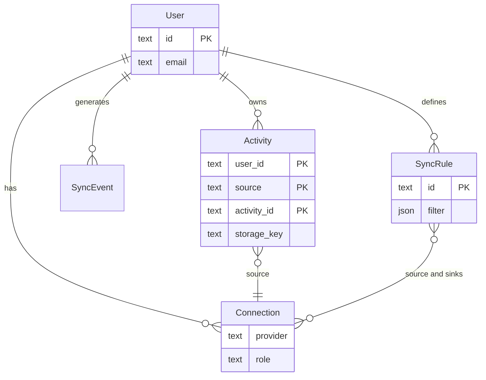

# Domain Model (v0)

> **Создано:** 2026-05-27 · **Обновлено:** 2026-05-28 · **Версия:** 0.7.0 · **2.17** UUID tenant id — [PLAN.md](PLAN.md#217--tenant-id-uuid)  
> **Product model:** [ACTIVITY-HUB.md](ACTIVITY-HUB.md) · **Стратегия:** [VISION.md](VISION.md) · **SQLite:** [DATABASE.md](DATABASE.md)

Черновик **canonical domain model** для GetSync **activity hub**. Mapping на текущую реализацию; SQL — [DATABASE.md](DATABASE.md).

Hub: **catalog** = canonical activities; **providers** = ingress/egress; **rules** = N→M delivery. См. [ACTIVITY-HUB.md](ACTIVITY-HUB.md).

---

## Принципы v0

| Принцип | Реализация |
| ------- | ---------- |
| **Hub / canonical store** | GetSync `catalog`; providers — not source of truth |
| **Canonical ID** | `(user_id, source, activity_id)` для activities |
| **Raw + normalized** | FIT на диске (`storage_key`); метаданные в SQLite |
| **Ingress / egress** | Source adapters → catalog; rules → sinks |
| **Per-tenant** | Все сущности scoped by `user_id` |
| **Evolution** | Новые поля без big-bang; миграции в owner infra (**3.9.7**) |
| **Cross-module DTO** | `NormalizedActivity` — [MODULES.md](MODULES.md) |

---

## Сущности

### Athlete / User

Учётная запись tenant. Таблица `users`.

| Поле (concept) | Сейчас | Примечание |
| -------------- | ------ | ---------- |
| id | `users.id` | PK; сейчас часто = `slug` (`default`); **roadmap:** UUID (**2.17**) |
| slug | `users.slug` | UNIQUE, human-readable; не меняется после создания |
| email, profile | ✅ | |
| timezone, locale | ✅ | |
| hammerhead_user_id | ✅ | webhook routing |
| is_admin, disabled | ✅ | |

**Roadmap:** `email_verified` — **2.1e** / **2.6**.

---

### Activity

Нормализованная тренировка из любого source.

| Поле (concept) | Сейчас | Примечание |
| -------------- | ------ | ---------- |
| user_id | ✅ | |
| source | ✅ | `hammerhead`, `garmin`, … |
| activity_id | ✅ | id у провайдера |
| sync_status | ✅ | **delivery status** (transitional: «→ Garmin»); target: per sink / **3.1** |
| storage_key | ✅ | путь FIT в [STORAGE.md](STORAGE.md) |
| activity_type, timestamps | ✅ | browse/calendar |
| garmin_result | ✅ | bootstrap sink outcome (Garmin upload); target: generic delivery log |

**Artifact:** `{storage_key}` → `.fit` under `data/users/{id}/activities/{source}/`.

**Roadmap:** `raw_payload_ref`, conflict flags — H2; duplicate detection rules — **3.1**.

### NormalizedActivity (cross-module DTO)

Typed contract in `getsync/contracts/` (**3.9.2**). Used between modules; provider payloads never cross boundaries.

| Field | Type | Notes |
| ----- | ---- | ----- |
| `user_id` | str | tenant |
| `source` | str | `hammerhead`, `garmin`, … |
| `activity_id` | str | provider id |
| `name` | str \| None | |
| `activity_date` | str \| None | ISO or API string |
| `distance` | float \| None | meters |
| `duration` | float \| None | seconds |
| `activity_type` | str \| None | |
| `sync_status` | str \| None | pipeline status (from catalog) |
| `storage_key` | str \| None | FIT key in [STORAGE.md](STORAGE.md) |

UI-only fields (`sync_detail`, `fit_available`, …) stay in `ActivityBrowseRow` (`workspace` module).

---

### Connection (Source Integration)

Привязка tenant к провайдеру (source или sink).

| Поле (concept) | Сейчас | Примечание |
| -------------- | ------ | ---------- |
| user_id + provider + role | файлы + UI registry | [CONNECTIONS.md](CONNECTIONS.md) |
| enabled, config | partial | |
| credentials | **2.16** ✅ encrypted | `connections/garmin/` |

**Roadmap:** таблица `connections` — **2.7**; Hammerhead в vault — **2.7.1**.

---

### Sync Event

Запись журнала **delivery pipeline** (webhook, download, upload, error). Audit log; не domain EventBus.

| Поле | Сейчас |
| ---- | ------ |
| user_id, activity_id, event_type, message, created_at | `sync_events` ✅ |

Admin UI: `/app/admin/sync-log`. Target: generic «delivery events» per sink (**3.1**).

### Domain events (**3.9.4**)

In-process typed events (not SQLite rows). Immutable; provider-agnostic. See [MODULES.md](MODULES.md) §7.

| Event | When |
| ----- | ---- |
| `ActivityReceived` | webhook / backfill / manual import |
| `ActivityIngested` | metadata in catalog |
| `ActivityDelivered` | sink upload success |
| `ActivityDeliveryFailed` | delivery error |
| `AdminLogChanged` | admin UI refresh signal |

SQLite `sync_events` remains audit log (subscriber).

---

### Session Refresh Event

Журнал обновления Garmin JWT.

| Поле | Сейчас |
| ---- | ------ |
| user_id, trigger, event_type, … | `session_refresh_events` ✅ |

Admin UI: `/app/admin/log`.

---

### Sync Rule

Правило маршрутизации hub: source → sink(s) с фильтрами.

| Статус | Сейчас |
| ------ | ------ |
| Implicit bootstrap | `hammerhead` → `garmin` (hardcoded in `sync/service.py`) |

**Roadmap:** таблица + UI — **3.1**; infra — **3.9.5**. Примеры: HH→Garmin, Garmin→Strava, any→S3.

Пример (target):

```text
rule: default_cycling
  when: source=hammerhead AND activity_type=cycling
  then: sink=garmin

rule: archive_strava
  when: source=garmin AND storage_key IS NOT NULL
  then: sink=strava
```

---

### Wellness Event / WellnessDay

Дневные метрики: steps, sleep, body.

| Статус | Сейчас |
| ------ | ------ |
| 📋 | — |

**Roadmap:** `daily_steps`, `daily_sleep` — **3.11.3**; UI widget — **3.11.4**.

---

### Route / Planned Workout / Device

| Сущность | H1 | H2+ |
| -------- | -- | --- |
| **Route** | — | courses **3.2**, Komoot integration |
| **Planned Workout** | — | workspace H2 |
| **Device** | — | optional metadata H3 |

Не моделировать в v0 — только зафиксировать как future entities в [VISION.md](VISION.md).

---

## Диаграмма (v0)



`Connection` и `SyncRule` — **design**; в SQLite появятся в **2.7** / **3.1**.

---

## Horizons: что вводить когда

| Entity | H1 (сейчас) | H2 | H3 |
| ------ | ----------- | -- | -- |
| Activity (extend) | ✅ + refine | conflict, raw ref | |
| Connection | **2.7** | multi-provider | |
| SyncRule | design | **3.1** impl | |
| WellnessDay | **3.11.3** | | |
| Route, PlannedWorkout | — | spike | |
| Device | — | — | optional |

---

## Следующие шаги (H1)

1. **3.9.*** — [MODULES.md](MODULES.md) rules + contracts + refactor
2. **2.7** — `connections` table + migrate file-based HH/Garmin refs
3. **3.11.1** spike — after **3.9.3** (Garmin adapter in registry)
4. Contract tests — **3.9.6**

См. [PLAN.md](PLAN.md) · [VISION.md §11](VISION.md#11-план-по-трём-горизонтам).
