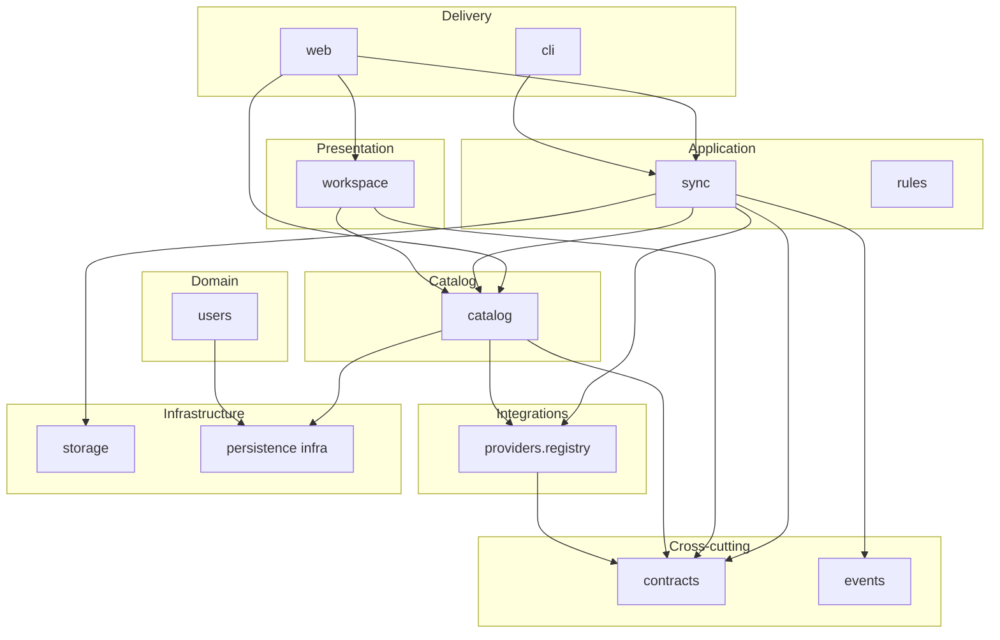

# Правила модульной архитектуры GetSync

> **Создано:** 2026-05-28 · **Обновлено:** 2026-05-28 · **Версия:** 0.8.0  
> **ID roadmap:** **3.9** модульность · **Product model:** [ACTIVITY-HUB.md](ACTIVITY-HUB.md)  
> **Стратегия:** [VISION.md](VISION.md) · **Tactical:** [PLAN.md](PLAN.md) §3.9 · **Domain:** [DOMAIN-MODEL.md](DOMAIN-MODEL.md)

Normative document: enforceable rules для modular monolith GetSync. **Product model:** [ACTIVITY-HUB.md](ACTIVITY-HUB.md). Vision — *зачем*; этот документ — *как* и *что запрещено*. Runtime — [ARCHITECTURE.md](ARCHITECTURE.md).

**Deployment model:** один FastAPI process + systemd; без microservices.

---

## Карта модулей

| Модуль | Пакет (сейчас) | Public API (целевое) |
| ------ | -------------- | -------------------- |
| catalog | `getsync/catalog/` | `get_catalog`, `refresh_from_providers`, `ActivityCatalog` port |
| workspace | `getsync/workspace/` | `fetch_activities_page`, `build_activity_calendar`, filters/rows |
| activities | `getsync/activities/` | **shim** → re-export catalog + workspace (**3.9.3**, удалить в след. release) |
| sync | `getsync/sync/` | `sync_activity`, `backfill_since`, webhook resolve |
| users | `getsync/users/` | `UserContext`, bootstrap, auth helpers |
| providers | `getsync/providers/` (+ `hammerhead/`, `garmin/`) | `registry.get_source`, `get_sink` |
| storage | `getsync/storage/` | `StorageBackend`, `ActivityStorage` |
| web | `getsync/web/` | routes, templates (delivery only) |
| cli | `getsync/cli.py` | typer commands (delivery) |
| contracts | `getsync/contracts/` | Protocols + cross-module DTO |
| events | `getsync/events/` | EventBus, DomainEvent (**3.9.4**) |
| rules | `getsync/rules/` | RuleEngine infra (**3.9.5**) |

Persistence сегодня — `getsync/state/store.py` (god object); split — **3.9.7**.

---

# 1. Правила зависимостей

## 1.1. Зависимости только вниз

Разрешённое направление:

```text
delivery (web, cli)
  → application (sync, workspace, catalog ingest)
    → domain (workspace filters/rows, users)
      → integrations (providers)
        → infrastructure (storage, catalog infra)
contracts / events — cross-cutting (no business logic, no infra imports)
```

Запрещено:

- domain → web
- domain → provider internals (`getsync.hammerhead.client`, …)
- providers → web
- cyclic dependencies

## 1.2. Запрещены cross-module internal imports

Разрешено:

- import через **public API** модуля (`api.py`, `contracts/`)

Запрещено:

- import внутренних implementation details
- import internal repositories
- import provider internals
- import hidden infrastructure

## 1.3. Модули общаются только через contracts

Разрешены:

- Protocols (`getsync/contracts/`)
- DTO (`NormalizedActivity`, `ConnectionStatus`, …)
- domain events (**3.9.4+**)

Запрещены:

- shared mutable state
- прямые SQL вызовы между модулями
- filesystem access между модулями (кроме через ports / `UserContext`)

### Import matrix (summary)

| From ↓ | contracts | module api | providers registry | storage | Store direct |
| ------ | --------- | ---------- | ------------------ | ------- | ------------ |
| web | ✅ | ✅ workspace, catalog.refresh | ✅ | via ports | ❌ |
| sync | ✅ | ✅ catalog | ✅ | ✅ | ❌ (activities via port) |
| workspace | ✅ | ✅ catalog (read) | ❌ | ❌ | ❌ |
| catalog | ✅ | internal | ingest only | ❌ | infra adapter only |
| providers | ✅ | ❌ | internal | ✅ | ❌ |
| users | ✅ | ❌ | ❌ | paths | infra only |

**Import rules (3.9.3):**

```text
workspace  → catalog (read api only)
workspace  → ✗ providers, Store, sync
catalog    → providers (ingest: hammerhead/garmin clients until registry adapters)
catalog    → contracts, Store infra adapter
sync       → catalog (ActivityCatalog write methods)
web        → workspace, catalog.refresh
```

Enforcement: import-linter (**3.9.6**).

---

# 2. Правила ownership

## 2.1. Каждый модуль владеет своими данными

### SQLite — single writer per table

| Таблица | Owner module | Writer port | Readers |
| ------- | ------------ | ----------- | ------- |
| `users` | **users** | `UserRepository` | web/auth, admin, sync (webhook resolve) |
| `activities` | **catalog** | `ActivityCatalog` | sync (via port), workspace (read) |
| `sync_events` | **sync** | `SyncEventLog` | web/admin, audit |
| `session_refresh_events` | **providers/garmin** | `GarminSessionLog` | web/admin |
| `admin_audit_events` | **users** | `AuditLog` | web/admin |

**Правило:** one table — one writer module. Cross-module write = вызов port method.

**§6.1:** sync orchestrates pipeline, но **не пишет SQL** в `activities` — вызывает `ActivityCatalog` (owner = **catalog**).

### Filesystem (per tenant)

| Path | Owner | Writers |
| ---- | ----- | ------- |
| `data/users/{id}/` layout | **users** | `UserContext` defines paths |
| `…/activities/**` (FIT bytes) | **storage** | `ActivityStorage`; metadata via `ActivityCatalog` |
| `…/hammerhead_tokens.json` | **providers/hammerhead** | hammerhead adapter |
| `…/garmin_web/**`, `…/garth/**` | **providers/garmin** | garmin adapter |
| `…/connections/**` | **users** | `CredentialStore` |

### Semantic ownership

- **catalog** — `activities` table, provider ingest (`refresh_from_providers`), sync index
- **workspace** — list/calendar presentation, filters; **read-only** from catalog
- **users** — tenant paths, credentials, audit log table
- **providers** — provider API payloads (не покидают module)

## 2.2. Запрещён shared business ownership

Не должно существовать:

- shared business services
- shared repositories (`Store` как global writer — transitional anti-pattern)
- shared domain models вне `contracts/`

### Placement: вспомогательные пакеты

| Пакет | Роль |
| ----- | ---- |
| `mail/` | shared infra (§11), outbound email |
| `ops/` | web/admin infra или shared ops |
| `audit.py` | facade → `AuditLog` port (users infra) |
| `credentials/` | users infra (→ `users/infra/` в **3.9.7**) |

---

# 3. Правила contracts

## 3.1. Contracts стабильны

- typed (`Protocol`, frozen dataclasses)
- backward-compatible changes preferred (additive fields)
- breaking change в Protocol → bump contracts minor + note in this doc
- deprecation: one release with shim imports

## 3.2. Contracts не зависят от infrastructure

Запрещены зависимости от:

- FastAPI, SQLite, Playwright, provider SDK, httpx clients

Допустимо: `UserContext` type in Protocol signatures (tenant handle from users module).

## 3.3. Contracts содержат только normalized models

Между модулями запрещено передавать:

- raw provider payloads (HH/Garmin JSON)
- ORM / Row objects from `Store`
- HTTP requests/responses

Cross-module activity DTO: **`NormalizedActivity`** — см. [DOMAIN-MODEL.md](DOMAIN-MODEL.md).

Wellness (**3.11.3**): отдельный `WellnessSource` / `WellnessDayRecord`, не смешивать с Activity.

---

# 4. Правила domain layer

## 4.1. Domain layer не знает infrastructure

Domain не должен знать: SQL, HTTP, filesystem, browser automation, provider SDK.

## 4.2. Domain logic pure

Domain: deterministic, testable, side-effect free.

## 4.3. Layers внутри модуля (**3.9.7**)

```text
api/          — public exports only
domain/       — pure logic (filters, invariants)
application/  — use cases, I/O orchestration within module
infra/        — SQL, HTTP clients, Store adapters
```

Сегодня `workspace/application/browse.py` = list use case (+ in-memory cache on catalog snapshot); `catalog/application/refresh.py` = provider ingest.

---

# 5. Правила providers

## 5.1. Providers — adapters

Providers: преобразуют payloads → `NormalizedActivity`; реализуют `ActivitySource` / `ActivitySink`; не содержат orchestration.

Registry: `getsync/providers/registry.py` — `get_source("hammerhead")`, `get_sink("garmin")`.

## 5.2. Providers не знают business rules

Providers не решают: куда отправлять activity, какие actions/retry запускать.

**Grey-area APIs (VISION §7):** Garmin web, Hammerhead — integration boundary; candidate for closed/plugin packaging при open-source.

---

# 6. Правила sync / orchestration

## 6.1. Sync координирует, но не владеет domain state

Sync: запускает flows, вызывает actions, публикует events (**3.9.4+**).

Sync **не**:

- пишет SQL в чужие таблицы (uses ports)
- знает provider internals
- import `web.*`

## 6.2. Текущий pipeline (transitional)

HH webhook → `sync_activity` → download (source port) → FIT (storage) → upload (sink port) → `ActivityCatalog.mark_synced` (**catalog** port) → `SyncEventLog` (sync port).

UI list/calendar → **workspace** (read catalog). Explicit refresh (`?refresh=1`) → **catalog.refresh_from_providers** → ingest → workspace reads updated snapshot.

---

# 7. Правила events

## 7.1. Events immutable

Events: readonly, append-only semantics, typed dataclasses.

## 7.2. Events описывают факт

Event сообщает что произошло; не содержит orchestration logic.

## 7.3. Events provider-agnostic

Используют normalized domain language; не provider-specific payloads.

**Разделение:** domain events (EventBus) ≠ SQLite audit journals (`sync_events` — subscriber, **3.9.4**).

Planned events: `ActivityReceived`, `ActivityFetched`, `ActivityUploaded`, `ActivityFailed`, `AdminLogChanged`.

---

# 8. Правила rule engine

## 8.1. Rules декларативны

Rules: conditions + actions; без infrastructure logic в rule definitions.

## 8.2. Rules не знают providers internals

Rules работают с normalized models и domain events.

## 8.3. Actions isolated

Каждый action: independent, idempotent where possible, testable.

**Scope **3.9.5**:** infra skeleton для delivery rules (bootstrap HH→Garmin → explicit rule).  
**Product **3.1**:** user SyncRules, UI, БД — H2, после **2.7** + multi-source.

---

# 9. Правила web layer

## 9.1. Web — только delivery layer

Web: HTTP, templates, forms, serialization, WebSocket UI (subscriber on events).

Web **не** содержит: business orchestration, provider logic, rule execution, direct `Store()` writes (**3.9.3**).

## 9.2. Feature-oriented routes

Routes рядом с feature modules (целевое: `web/features/activities/` — **3.9.7**).  
Запрещён monolithic global routes layer без границ (`app_routes.py` — split incremental).

---

# 10. Правила storage

## 10.1. Storage — infrastructure abstraction

Storage хранит файлы; не знает business semantics (activity types, sync rules).

## 10.2. Storage не знает providers

Эталон: [`StorageBackend`](../getsync/storage/backend.py) Protocol.  
Layout: `data/users/{user_id}/{key}` — [STORAGE.md](STORAGE.md).

---

# 11. Правила shared layer

## 11.1. Shared минимален

Разрешено: logging, utils, typing helpers, event infrastructure.

## 11.2. Shared не содержит бизнес-логики

Запрещено: shared services, shared business models, shared orchestration.

---

# 12. Правила тестирования

## 12.1. Каждый модуль тестируется отдельно

| Tier | Каталог | CI |
| ---- | ------- | -- |
| unit | `tests/unit/` | every push |
| integration | `tests/integration/` | every push |
| contract | `tests/contract/` | **3.9.6** |
| e2e | `tests/e2e/` | main / nightly / label |

См. [TESTING.md](TESTING.md).

## 12.2. Providers обязаны проходить contract tests

Все providers: одинаковые contracts; единый test suite с fakes.

## 12.3. E2E минимальны

E2E: только критические production flows; не gate на каждый PR.

---

# 13. Правила CI/CD

## 13.1. Affected tests (optional **3.9.6**)

pytest-testmon для local / opt-in CI job.

## 13.2. Parallel execution

Lint ∥ unit ∥ integration — ✅ ([CI-CD.md](CI-CD.md)).  
pytest-xdist для integration — optional **3.9.6**.

---

# 14. Правила эволюции архитектуры

## 14.1. Сначала logical modularity

Порядок эпика **3.9**:

```text
3.9.1  правила (этот документ)
3.9.2  contracts + ports
3.9.3  adapters + redirect writes
3.9.4  events
3.9.5  rules infra
3.9.6  import-linter + contract tests
3.9.7  physical modules (optional)
```

## 14.2. Без premature microservices

Modular monolith до operational need for distribution.

**Порядок H3 (roadmap):** `3.9.* → 3.11.* → 3.1 product`.  
**2.8** (Source/Sink spike) поглощён **3.9.2**.

---

# 15. Главные архитектурные запреты

Checklist для PR review:

- [ ] cyclic dependencies
- [ ] provider-specific domain logic outside providers/
- [ ] shared business layer / shared repository writes
- [ ] giant web module additions without feature boundary
- [ ] direct infrastructure coupling (Store, raw SQL) outside owner infra
- [ ] leaking provider payloads across modules
- [ ] hidden cross-module imports (internal paths)
- [ ] orchestration inside providers
- [ ] business logic / orchestration inside web routes
- [ ] SQL writes outside owning module's port/infra
- [ ] domain → web import
- [ ] sync/state → web import

---

## Dependency graph



---

## Эпик 3.9 — статус подзадач

| ID | Содержание | Статус |
| -- | ---------- | ------ |
| **3.9.0** | Dependency graph (§ выше) | ✅ |
| **3.9.1** | MODULES.md + doc reconciliation | ✅ |
| **3.9.2** | `contracts/` + registry; closes **2.8** | ✅ |
| **3.9.3** | catalog + workspace split; sync/web via ports; activities shim | ✅ |
| **3.9.3b** | provider adapters (HH, Garmin, Strava) + registry bootstrap | ✅ |
| **3.9.4** | `events/` EventBus | 📋 |
| **3.9.5** | `rules/` infra | 📋 |
| **3.9.6** | import-linter + contract tests | 📋 |
| **3.9.7** | physical layout + Store split | 📋 |

---

## Ссылки

| Документ | Тема |
| -------- | ---- |
| [ARCHITECTURE.md](ARCHITECTURE.md) | Runtime flows |
| [CONNECTIONS.md](CONNECTIONS.md) | Source/sink model |
| [DATABASE.md](DATABASE.md) | SQLite schema |
| [STORAGE.md](STORAGE.md) | FIT paths |
| [TESTING.md](TESTING.md) | Test tiers |
