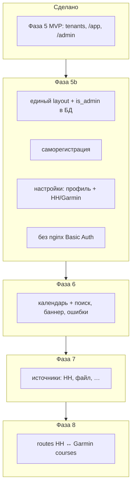
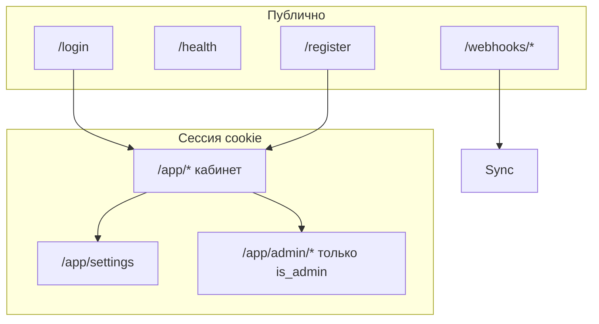

# Roadmap fit_sinc

> **Статус (2026-05-25):** MVP (фазы 0–4) в production.

**Текущее состояние:** [README](../README.md) · [ARCHITECTURE.md](ARCHITECTURE.md)  
**Операции:** [CI-CD.md](CI-CD.md) · [API Hammerhead](API_HAMMERHEAD.md) · [API Garmin](API_GARMIN.md)

**Репозиторий:** https://github.com/segallar/fit-sinc

---

## Прогресс

| Фаза | Статус |
|------|--------|
| 0a–0c DevOps (sirocco, certbot, nginx) | ✅ |
| 0d fit_sinc deploy (stub, systemd, HTTPS) | ✅ |
| 1 Hammerhead OAuth + Garmin auth | ✅ |
| 2 Sync core + webhook sync + UI | ✅ |
| 3 Garmin upload (web JWT, browser, fallback) | ✅ код / ⚠️ ops на сервере |
| 4 CI (GitHub Actions test + deploy main) | ✅ |
| 5 Мультипользовательность (tenants, `/admin`, `/app`) | ✅ MVP |
| **5b** Единый кабинет, регистрация, настройки, без Basic Auth | 📋 5b.0 ✅ |
| 6 UI v2 (календарь, поиск, баннер, failed) | 📋 план |
| 6.1 Алерты (Telegram / email) | 📋 план |
| — Ops: README + тесты CI | ✅ README / 📋 расширить тесты |
| 7 Синхронизация из нескольких источников | 📋 план |
| 8 Маршруты (routes) | 📋 план / исследование |

---

## Roadmap v2

Порядок работ: **5 (MVP) ✅ → 5b (единый кабинет + регистрация) → 6 (UI v2) → 7/8**. Routes — в конце (исследование Garmin).



### Фаза 5: Мультипользовательность (MVP) — ✅

**Сделано (2026-05):** `user_id` в БД и sync; `data/users/{id}/`; webhook → tenant; `/app/login` + кабинет; `/admin` CRUD users; сессии cookie; CLI `--user`.

**Ограничения MVP (закрывает Фаза 5b):**

- nginx **Basic Auth** на весь UI (двойной вход)
- Админка — отдельный URL `/admin` и пароль из `.env` (`ADMIN_PASSWORD`), не роль в БД
- Пользователей создаёт только админ; нет `/register`
- Профиль и HH/Garmin в кабинете не редактируются (или только через админку)

Ниже — **целевая** модель Phase 5 (частично уже в коде); детальный план доработки — **Фаза 5b**.

#### Две зоны доступа (целевая, после 5b)

| Зона | URL | Кто | Auth |
|------|-----|-----|------|
| **Публичное API** | `/webhooks/*`, `/health` | Hammerhead, мониторинг | HMAC / без auth |
| **Публичный UI** | `/login`, `/register` | Гость | — |
| **Кабинет** | `/app/*` | Владелец аккаунта | Сессия (email + password) |
| **Админ внутри кабинета** | `/app/admin/*` | `users.is_admin = 1` | та же сессия + проверка роли |

> **Устарело:** отдельный `/admin/login` и nginx `auth_basic` на `/` — убираем в 5b.

#### nginx (целевая схема, после 5b)

```
/webhooks/     → без auth
/health        → без auth
/              → proxy в FastAPI (только сессия приложения)
```

#### Роли (целевая, после 5b)

| Роль | Права |
|------|--------|
| **admin** | Пункты меню **Admin** в том же `/app`: users CRUD, disable, promote admin, логи по всем; **не** видит пароли Garmin/Hammerhead |
| **user** | Свой кабинет, **Настройки** (профиль, пароль, HH/Garmin connect/disconnect), sync |

#### Профиль пользователя

**После 5b:** пользователь редактирует сам в `/app/settings`; админ — disable, promote, сброс чужого пароля, поддержка `hammerhead_user_id`.

| Поле | Назначение |
|------|------------|
| `slug` | URL/id: `/app` после логина, пути в CLI `--user slug` |
| `display_name` | Имя в UI |
| `email` | Логин в кабинет (unique), уведомления (опционально) |
| `telegram` | `@username` или `chat_id` — алерты об ошибках sync (Phase 6+), контакт для админа |
| `timezone` | IANA, напр. `Europe/Moscow`, `Europe/Berlin` — **все даты в кабинете** пользователя |
| `password` | Регистрация / смена в кабинете; админ может сбросить; в БД только `password_hash` |
| `is_admin` | **5b:** флаг в БД; пункты меню Admin только при `is_admin=1` |
| `hammerhead_user_id` | Связь с webhook `userId`; заполняется после OAuth Hammerhead в настройках |
| `disabled` | Запрет входа и sync (только админ) |

**Логин в кабинет:** `email` + пароль (сессия cookie, HttpOnly). Telegram — не замена пароля на старте, а канал связи и push-уведомлений.

**Часовой пояс:** сейчас в коде всё в MSK ([`timeutil.py`](../fit_sinc/timeutil.py)); в v2 — `format_* (iso, tz=user.timezone)`, «Updated …» и таблицы activities/log в TZ пользователя. UTC хранить в SQLite как сейчас.

#### Модель данных

```text
users(
  id TEXT PK,              -- uuid или slug
  slug TEXT UNIQUE,
  display_name TEXT,
  email TEXT UNIQUE,
  telegram TEXT,           -- nullable
  timezone TEXT NOT NULL DEFAULT 'Europe/Moscow',
  hammerhead_user_id TEXT UNIQUE,
  password_hash TEXT NOT NULL,
  is_admin INTEGER DEFAULT 0,   -- 5b
  created_at, updated_at,
  disabled INTEGER DEFAULT 0
)

activities(user_id, activity_id, …)   -- PK (user_id, activity_id)
sync_events(user_id, …)
session_refresh_events(user_id, …)

data/users/{id}/
  hammerhead_tokens.json
  garth/
  garmin_web/
  fits/
```

Отдельная таблица `user_credentials` не нужна, если hash в `users`.

**Webhook:** `userId` из payload → `users.hammerhead_user_id` → `sync_activity(..., user_id=…)`.

**Миграция v1:** один пользователь `default` из текущего `tokens.user_id` + перенос `data/*` → `data/users/default/`.

#### CLI

```bash
fit_sinc user create roman --hammerhead-user-id 192184
fit_sinc user list
fit_sinc --user roman hammerhead auth
fit_sinc --user roman garmin login
fit_sinc --user roman sync --since 2025-01-01
```

#### Админка (MVP: `/admin` — ✅; цель 5b: `/app/admin`)

| Страница | Действия |
|----------|----------|
| **Users** | Таблица: имя, email, Telegram, TZ, HH id, HH/Garmin status, последний sync, disabled |
| **User → New** | Форма (при закрытой регистрации); иначе только promote/disable |
| **User → Edit** | disable/enable, promote admin, сброс пароля, правка HH id (поддержка) |
| **User → Log** | sync_events / session_refresh по `user_id` |
| **System** | версия, health, сводка `upload_ready` по пользователям |

В **5b** те же страницы под `/app/admin/*`, пункты меню **Admin** видны только `is_admin`.

#### Кабинет `/app` (MVP — ✅; цель 5b — настройки)

- `GET/POST /app/login` — email + password ✅
- Дашборд, activities, log, session ✅
- **5b:** `GET/POST /register` — саморегистрация (`REGISTRATION_OPEN` в `.env`)
- **5b:** `/app/settings` — профиль (email, telegram, timezone), смена пароля, Hammerhead/Garmin (connect / disconnect / status)

Позже (6.1): Telegram bot для алертов (`/start` → `chat_id`).

---

### Фаза 5b: Единый кабинет, регистрация, настройки, без Basic Auth

**Цель:** одно приложение и одна сессия; админ — часть UI по привилегии; пользователи сами регистрируются и управляют профилем и подключениями HH/Garmin; nginx без Basic Auth.



| Требование | Решение |
|------------|---------|
| Админка «часть системы» | Один layout `/app`; в nav блок **Admin** (Users, System) только если `user.is_admin` |
| Саморегистрация | `GET/POST /register` (+ `REGISTRATION_OPEN=true` в `.env`) |
| HH/Garmin на пользователя | Уже `data/users/{id}/`; UI **Настройки → Подключения** + OAuth в контексте сессии |
| Профиль | **Настройки → Профиль** — email, telegram, timezone, display_name; смена пароля |
| Без Basic Auth | Убрать `auth_basic` в `deploy/nginx/fit.conf`; cookie `https_only` на prod |

#### Подфазы и оценка

| Подфаза | Содержание | Оценка |
|---------|------------|--------|
| **5b.0** | Решения: открытая регистрация / invite-only; bootstrap первого admin (`BOOTSTRAP_ADMIN_EMAIL` или CLI `user promote-admin`) | ✅ [5b-DECISIONS.md](5b-DECISIONS.md) |
| **5b.1** | `users.is_admin`; один логин; убрать `SESSION_ADMIN_KEY` + `/admin/login`; guard `/app/admin/*`; миграция `default` → admin | 1 вечер |
| **5b.2** | Единый Jinja layout; nav Dashboard / Activities / Log / Session / **Settings**; Admin-* для `is_admin`; перенос `admin_routes` → `/app/admin` (алиас `/admin` → 301) | 1–2 вечера |
| **5b.3** | `/register`: slug/email/password/timezone, rate limit, auto-login → `/app/settings` | 1 вечер |
| **5b.4** | `/app/settings`: профиль + пароль; HH OAuth callback с привязкой к сессии; Garmin connect/status; admin edit — disable, promote, сброс | 2 вечера |
| **5b.5** | nginx: снять Basic Auth; `SESSION_SECRET` + `https_only`; обновить [CI-CD.md](CI-CD.md), README | ½ дня |
| **5b.6** | Тесты: register, settings, `/app/admin` 403/200; зачистка `ADMIN_PASSWORD` из docs | 1 вечер |

**Порядок:** `5b.1` → `5b.5` (можно сразу после ролей) → `5b.2` → `5b.3` → `5b.4` → `5b.6`.

**MVP «можно пользоваться»:** 5b.1 + 5b.5 + 5b.3 + 5b.4 (только подключения) + 5b.2 (меню).

#### `/app/settings` (детально)

| Секция | Поля / действия |
|--------|------------------|
| **Профиль** | `display_name`, `email`, `telegram`, `timezone` |
| **Безопасность** | смена пароля (старый + новый) |
| **Hammerhead** | статус; «Подключить» / «Отключить»; OAuth → `hammerhead_user_id` + `data/users/{id}/hammerhead_tokens.json` |
| **Garmin** | `upload_ready`, JWT TTL; «Подключить» (garmin login / import cookies / refresh); пароль в UI не показывать |

**Техника OAuth Hammerhead:** callback с `state` (подписанный `user_id`); redirect URI production; не писать в глобальный `data/`.

#### Риски 5b

| Риск | Mitigation |
|------|------------|
| Спам-регистрации | `REGISTRATION_OPEN=false` по умолчанию на prod; rate limit; позже captcha |
| Снятие Basic Auth до готового login | 5b.5 только после 5b.1 |
| Смена email | UNIQUE + понятная ошибка |
| HH OAuth без привязки к сессии | signed `state` в callback |

**Не переписывать:** `user_id` в store/sync, `data/users/{id}/`, webhook routing, per-user JWT refresh.

См. также каркас UI v2: [UI.md](UI.md).

---

### Фаза 6: UI v2 (в кабинете пользователя)

После Phase 5 — UI в контексте `user_id` (`/app/...`), timezone пользователя.

#### Календарь + поиск (главный экран активностей)

**Сейчас (v1):** `/activities` — таблица + поля `date_from` / `date_to` + `q` (имя). Календаря нет, даты не видны «с высоты месяца».

**Цель:** быстро найти поездку по дню и по названию.

| Элемент | Поведение |
|---------|-----------|
| **Поиск** | Одна строка сверху (`q`): имя активности, substring; Enter / debounce → обновить таблицу; сохранять в query string |
| **Календарь** | Месяц в TZ пользователя; на каждом дне — метки: есть активности, цвет по worst `fit_sinc_status` (synced / error / pending / none) |
| **Клик по дню** | `date_from` = `date_to` = выбранный день → таблица под календарём |
| **Навигация** | ‹ › месяц; «Сегодня»; опционально неделя |
| **Связка с фильтрами** | status (error / synced), source (HH/Garmin), type — как сейчас, не сбрасывать при смене дня |

**Данные для календаря:**

- **v6.0 (быстро):** агрегат из SQLite `activities` по `user_id` + `DATE(activity_date)` — counts и max severity (уже синкнутые в fit_sinc)
- **v6.1 (полнее):** опционально подгрузка HH/Garmin за месяц для дней «только в облаке, ещё не в SQLite» — тяжелее, по кнопке «Обновить месяц»

**Техника (без SPA):** Jinja2 + HTMX или отдельный `GET /app/activities/calendar?year=&month=` → HTML fragment; клик дня — `GET /app/activities?...&date_from=...`. Стили в `html.py` / static CSS.

**Макет:**

```text
[ 🔍 Поиск по названию________________________ ]

     [ ‹ ]   Май 2026   [ › ]   [Сегодня]

   Пн Вт Ср Чт Пт Сб Вс
        ·  ●  ●  ○  ·     ← точки/цвета статуса
   ...

   [ Hammerhead | Garmin ]  status ▼  type …

   ┌─ таблица активностей (как сейчас) ─┐
```

#### Остальное UI v2

- Баннер: Hammerhead + Garmin `upload_ready` + TTL JWT
- Карточки: synced / error / pending (дашборд)
- Вкладка/быстрый фильтр «только ошибки», понятный лог (`duplicate` vs error)
- Re-sync / force с подтверждением (частично уже есть `retry` на `/activities`)

Админ-раздел (`/app/admin`) — без календаря райдеров (таблица пользователей + лог); общий shell с кабинетом (после 5b).

**Оценка календарь + поиск:** ~1 вечер (SQLite aggregate + шаблон); +0.5 вечера с HTMX и полировкой.

---

### Надёжность и ops

> **Не путать с Фазой 5 (tenants).** Здесь — меньше сюрпризов ночью и порядок в репозитории.

| Задача | Фаза | Статус | Зависимости |
|--------|------|--------|-------------|
| Smoke-тесты в CI (`compileall`, unittest) | 4 | ✅ | — |
| README на GitHub | ops | ✅ | — |
| Тесты: webhook HMAC endpoint, `sync_activity` с моками HH/Garmin | ops | ✅ | webhook, tenant, /app login, sync skip |
| **Баннер статуса** на дашборде | 6 | 📋 | лучше после 5 (`/app`) |
| **Очередь failed** — фильтр `status=error`, retry | 6 | 📋 | retry уже в коде |
| Понятный sync log (`duplicate` ≠ error) | 6 | 📋 | — |
| **Алерты Telegram** при `sync_status=error` или N ошибок подряд | **6.1** | 📋 | поле `telegram` из Фазы 5 |
| Email-алерты | 6.1+ | 📋 | опционально |

**Порядок:** Фаза **5** ✅ → **5b** → Фаза **6** (баннер, failed, **календарь**, поиск) → **6.1** (бот).

UI v2 (Tailwind) можно вести параллельно с **5b.2** (общий `layouts/app.html`).

---

### Фаза 7: Несколько источников (activities)

Абстракция, чтобы не плодить `if hammerhead` в `sync/service.py`:

```text
Source (download ActivityPayload + external_id)
  → Sink Garmin (upload FIT)
  → Store (dedup по user_id + source + external_id)
```

| Источник | Приоритет | Триггер | Формат |
|----------|-----------|---------|--------|
| Hammerhead | ✅ есть | webhook + backfill | FIT API |
| Manual upload | средний | UI/CLI | `.fit` файл |
| Wahoo / Strava / … | низкий | исследование API | TBD |

Каждый источник настраивается **per user** в кабинете; в админке — только вкл/выкл и диагностика.

---

### Фаза 8: Маршруты (routes)

**Hammerhead API** (OpenAPI):

- `route:read` — `GET /routes` (список, polyline в summary)
- `route:write` — `POST /routes/file` (GPX, FIT, TCX, KML, KMZ → Karoo)
- Webhook **только для activities**, не для routes

**Garmin Connect:** отдельный продукт (Courses). Официального upload courses для личного аккаунта нет; нужен **spike**: GPX → Connect (web UI?), garth, ограничения.

**Варианты направления (выбрать до кода):**

1. **Garmin → Hammerhead** — курс в Garmin экспорт GPX → push в Karoo (`route:write`) — проще для v1 routes
2. **Hammerhead → Garmin** — список routes HH → дублировать в Garmin courses — сложнее (нет GET file в API, только upload в HH)
3. **Двусторонняя** — позже

Рекомендация: Phase 8.0 = spike Garmin courses + прототип GPX; Phase 8.1 = HH `route:write` из файла.

---

### Зависимости и оценка

| Фаза | Зависит от | Оценка |
|------|------------|--------|
| 5 tenants + admin (MVP) | — | ✅ |
| **5b** единый кабинет, регистрация, settings, nginx | 5 | 6–8 вечеров |
| 6 UI v2 (календарь, поиск, баннер, failed) | 5b | 2–3 дня |
| 6.1 алерты Telegram | 5, 6 | 0.5–1 день |
| 7 multi-source | 5 | 2–4 дня на источник |
| 8 routes | 5, spike Garmin | 1–2 недели с исследованием |

---

## Риски

| Риск | Mitigation |
|------|------------|
| Garmin меняет auth / upload UI | Web JWT + Playwright + HTTP + garth fallback; pin `garth-ng`, `playwright` |
| Playwright на VPS (RAM, headless) | HTTP и garth fallback; cookies refresh без браузера |
| Дубликаты в Garmin | SQLite dedup по `activityId` |
| FIT ещё не готов на Hammerhead | retry 5/15/30 с |
| Потеря tokens | Hammerhead refresh; `garmin refresh-web`; backup `data/` |
| Webhook повторы | idempotency в `store.is_synced()` |

---

## TODO

### Выполнено (v1)

- [x] DevOps: sirocco, nginx, certbot, systemd
- [x] Stub + deploy fit.romansegalla.online
- [x] Hammerhead OAuth + API client
- [x] Garmin auth (garth-ng + web session)
- [x] Webhook HMAC
- [x] Favicon + dashboard
- [x] Sync service + SQLite
- [x] Webhook → background sync
- [x] Backfill CLI
- [x] UI: лог, активности, скачивание .fit
- [x] Документация деплоя → [CI-CD.md](CI-CD.md)
- [x] Garmin upload: web JWT, refresh, browser/HTTP/garth chain
- [x] Проверить на sirocco: `garmin status` → `upload_ready`, sync работает (2026-05-25)
- [x] CI pipeline: GitHub Actions, `scripts/ci/deploy.sh`, smoke tests
- [x] Secret `SSH_PRIVATE_KEY` в GitHub
- [x] README GitHub + разделение docs (ARCHITECTURE / PLAN)

### Roadmap v2 (план)

- [x] Фаза 5: tenants, `user_id` в БД, webhook → user, `data/users/{id}/`
- [x] Фаза 5: `/admin` — CRUD users (email, telegram, timezone, password, HH id)
- [x] Фаза 5: `/app` — login email+password, сессия, UI в TZ пользователя
- [x] **Фаза 5b.0:** `is_admin`, bootstrap, `REGISTRATION_OPEN`, CLI `promote-admin` — [5b-DECISIONS.md](5b-DECISIONS.md)
- [x] **Фаза 5b.1:** один логин, `/app/admin/*`, убрать `/admin/login` + `ADMIN_PASSWORD`
- [ ] **Фаза 5b.2:** единый layout + меню (Admin только для admin)
- [ ] **Фаза 5b.3:** `/register` + `REGISTRATION_OPEN`
- [ ] **Фаза 5b.4:** `/app/settings` — профиль, пароль, Hammerhead/Garmin
- [ ] **Фаза 5b.5:** nginx без Basic Auth; `https_only` cookie
- [ ] **Фаза 5b.6:** тесты register/settings/admin guard
- [ ] Фаза 6: календарь + поиск на `/app/activities`, баннер, failed, лог
- [ ] Фаза 6.1: Telegram-алерты при ошибках sync
- [x] Ops: расширить smoke (webhook endpoint, tenant routing, /app login, sync skip)
- [ ] Фаза 7: абстракция Source/Sink, manual FIT
- [ ] Фаза 8: spike routes / Garmin courses

### Открыто (мелочи v1)

- [x] Push в `main` → https://github.com/segallar/fit-sinc
- [x] UI: re-sync в кабинете (Re-sync, force + confirm, retry all errors, redirect `next`)
