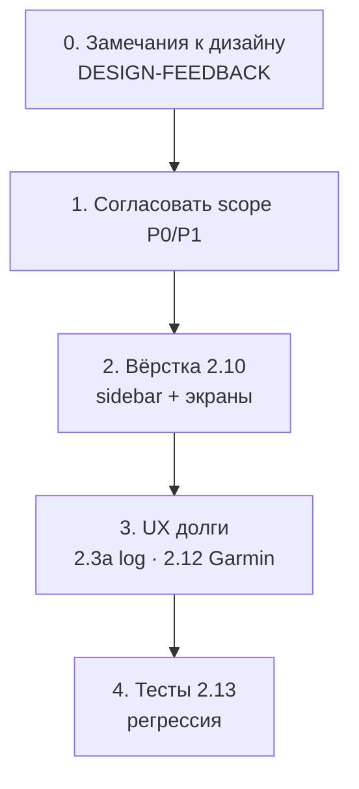
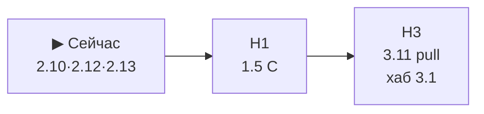
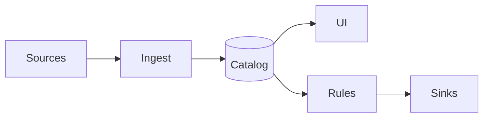

# Roadmap GetSync

> **Обновлено:** 2026-05-26 · **Фокус сейчас:** [дизайн-ревью кабинета → вёрстка **2.10**](#фокус-сейчас-тестирование-и-кабинет-app) · замечания → [DESIGN-FEEDBACK.md](design/DESIGN-FEEDBACK.md).  
> Выполненное (фазы 0–5, 5b, ядро **2.3**) — [PLAN-ARCHIVE.md](PLAN-ARCHIVE.md). **~124** тестов · prod: HH→Garmin.

**Документы:** [APP-UI.md](APP-UI.md) · [design/SCREENS.md](design/SCREENS.md) · [CONNECTIONS.md](CONNECTIONS.md) · [STORAGE.md](STORAGE.md) · [3.11-GARMIN-PULL.md](3.11-GARMIN-PULL.md)

---

## Базовая линия (уже в production)

Не в backlog — контекст для приоритетов:

| Область | Состояние |
| ------- | --------- |
| Sync | Webhook HH → FIT → Garmin; dedup SQLite; re-sync |
| Tenants | `user_id`, `data/users/{id}/`, session auth, security tests |
| Кабинет | Activities (List \| Calendar, HH+Garmin, sync summary + retry), Settings; Admin: users, sync log, Garmin JWT log |
| Garmin | **Upload** FIT ✅ · **list** активностей в browse ✅ · **pull** FIT / шаги / сон 📋 [**3.11**](3.11-GARMIN-PULL.md) |
| Хранение | `StorageBackend` local, `storage_key`, `activities/{source}/` — [STORAGE.md](STORAGE.md) |
| Регистрация | `/register` при `REGISTRATION_OPEN` — без email verify (**2.6**) |
| Бренд в коде | Пакет `getsync`, cookie dual-read — **A+B** ✅ |
| Домен prod (сейчас) | `romansegalla.online` / legacy hosts до **1.5 C** |

---

## Идея продукта (цель)

**GetSync** — хаб спортивных активностей: **источники** → каталог + хранение → **анализ в UI** → доставка в **приёмники** по правилам.

```text
Источники ──► Ingest ──► Каталог (SQLite + файлы) ──► UI (list, calendar, log)
                              │
                              └──► Правила ──► Приёмники (Garmin, S3, …)
```

**Сейчас в prod:** один pipeline **Hammerhead → Garmin** (Garmin — приёмник). Список активностей Garmin в UI — metadata only; локальные `.fit` и wellness — [**3.11**](3.11-GARMIN-PULL.md).

**Не в фокусе:** тренировочный планировщик (TP/Intervals), соцсеть. Приоритет — **надёжный ingest + статус + self-service**.

---

## Снимок кабинета /app

> Спека экранов: [APP-UI.md](APP-UI.md) · карта URL: [design/SCREENS.md](design/SCREENS.md)

| Экран | URL | Роль |
| ----- | --- | ---- |
| **Activities** | `/app/activities` | Главный: `view=list\|calendar`, unified sources, **sync summary** внизу |
| **Settings** | `/app/settings` | Profile, connections, `#garmin-session`, password |
| **Admin** | `/app/admin/` | Users CRUD · **Sync log** (все tenants) · **Garmin log** (JWT refresh) |

**Layout кабинета (2026-05):** все страницы `/app` и `/app/admin` — **на всю ширину экрана**, контент **к левому краю** (без центрированной колонки 64rem). Спека: [APP-UI.md §1](APP-UI.md#1-принятые-решения-qa-2026-05).

Редиректы: `/app/` → `/app/activities` · `/app/log` → `/app/admin/sync-log` · `/app/session` → `/settings#garmin-session`.  
**Убрано (2026-05):** отдельный Dashboard и sync log на Activities — журнал только в admin.

---

## Фокус сейчас: тестирование и кабинет `/app`

**Цель волны (2–3 недели):** довести **основной интерфейс** `/app` до согласованного дизайна и стабильного поведения.

**Сейчас (шаг 0):** сбор **замечаний к дизайну** — [design/DESIGN-FEEDBACK.md](design/DESIGN-FEEDBACK.md). Можно прислать большим списком в чат или править файл напрямую.

**Не в этой волне:** **1.5 C**, **3.x** хаб, лендинг SEO (**2.11**).

### Критерий «кабинет готов»

| Критерий | Проверка |
| -------- | -------- |
| Все экраны без регрессий | Activities (list+calendar), Settings, Admin (users + logs) |
| Сценарии из [SCREENS.md](design/SCREENS.md) проходят вручную | login → activities → day filter → re-sync → settings |
| Автотесты зелёные | CI + новые тесты на routes/calendar/browse |
| Известные UX-долги закрыты или в backlog с приоритетом | sync log UX (фильтры), sidebar, Garmin login UI |
| [APP-UI.md](APP-UI.md) §11 чеклист | 2.10.1–2.10.2 минимум для prod |

### План волны (порядок)



| Этап | ID | Содержание | Оценка |
| ---- | -- | ---------- | ------ |
| **0** | — | Сбор замечаний → [DESIGN-FEEDBACK.md](design/DESIGN-FEEDBACK.md) | пока идёт |
| **1** | **2.10** | Sidebar prod + правки по замечаниям (activities, settings, admin) | 4–7 дней |
| **2** | **2.3a** | Sync log UX: фильтры duplicate/error (лог в admin ✅) | 0.5 вечера |
| **3** | **2.12** | Garmin login в UI | 1–2 вечера |
| **4** | **2.13** | Автотесты + регрессия **после** дизайна | 2–4 дня |
| **5** | **2.5** | i18n (опционально) | 1–2 вечера |

### Замечания к дизайну (шаг 0)

Файл: **[design/DESIGN-FEEDBACK.md](design/DESIGN-FEEDBACK.md)** — таблицы по экранам, приоритет P0–P3.

Присылай в любом виде, например:

- экран (Activities / Settings / …)
- что не так
- как хочешь (если есть)
- prod или ui-preview

Локально: [UI.md](UI.md).

---

## Горизонты (после текущей волны)

| Горизонт | Когда | Содержание |
| -------- | ----- | ---------- |
| ⏸ **H1 — Запуск** | После стабильного кабинета | **1.5 C** — getsync.me, certbot, HH redirect |
| 🟡 **H2 — остаток продукта** | Параллельно/следом | **2.11** SEO/скрины · **2.4** алерты · **2.6** email |
| 🔵 **H3 — Платформа** | 1–3 месяца+ | **2.8** → **3.11** (Garmin pull) → **3.9** → **3.1** · **3.3** → **3.5** |



---

## Реестр открытых задач

| ID | Приоритет | Задача | Оценка | Зависимости |
| -- | --------- | ------ | ------ | ----------- |
| **—** | **▶** | **Сбор замечаний к дизайну** — [DESIGN-FEEDBACK.md](design/DESIGN-FEEDBACK.md) | сейчас | — |
| **2.10** | **P0** | Вёрстка по замечаниям: sidebar + activities/settings/admin — [APP-UI.md](APP-UI.md) §11 | 4–7 дней | после шага 0 |
| **2.3a** | **P1** | Sync log UX: фильтры/типы (таблица в `/app/admin/sync-log` ✅) | 0.5 вечера | — |
| **2.13** | **P1** | Тесты и регрессия **после** 2.10 | 2–4 дня | **2.10** |
| **2.12** | **P1** | Garmin login в Settings (не CLI) | 1–2 вечера | **2.10.2** |
| **2.5** | **P2** | i18n тел страниц кабинета; lang в шапке | 1–2 вечера | лучше с **2.10** |
| **2.3b** | **P3** | Календарь v6.1: дни только в облаке | 1 вечер | browse API |
| **?** | **Обсуждение** | **Кэш browse/calendar:** нужен ли server-side кэш каталога (SQLite + повторные HH/Garmin API) при infinite scroll и фильтрах? | — | **не делать до решения** |
| **1.5 C** | ⏸ H1 | DNS getsync.me, certbot — [1.5-RENAME.md](1.5-RENAME.md) | 1–2 дня | после волны UI |
| **2.11** | ⏸ | Лендинг SEO/скрины (**2.11.3–4**) | 2–3 вечера | **1.5 C**, **2.10** |
| **2.4** | ⏸ | Telegram-алерты | 1–2 вечера | стабильный log UX |
| **2.6** | ⏸ | Email confirm, invite — [2.1e-EMAIL.md](2.1e-EMAIL.md) | 2–4 вечера | перед публичным register |
| **2.7b** | ⏸ | Правила + реестр connections в БД | 1–2 недели | **3.1** |
| **2.8** | 🔵 | Spike ActivityRecord, Source/Sink | 2–3 вечера | — |
| **2.9** | 🔵 | Manual FIT upload | 1–2 вечера | storage ✅ |
| **3.1** | 🔵 | Rule engine, реестр источников/приёмников в БД | ~1 неделя | **2.8**, **3.9** |
| **3.2** | 🔵 | Маршруты в хабе; spike Garmin courses | 1–2 недели | **3.1** |
| **3.3** | 🔵 | S3 adapter, миграция FIT, signed URL — [STORAGE.md](STORAGE.md) | 3–5 дней | local ✅ |
| **3.4** | 🔵 | OAuth/OIDC (Google, …) — [3.4-OAUTH-LOGIN.md](3.4-OAUTH-LOGIN.md) | 2–3 вечера | **1.5 C**, **2.6** |
| **3.5** | 🔵 | Полный хаб: Strava/Wahoo, архив, сложные правила | 2–3 недели | **3.1**, **3.3** |
| **3.6** | 🔵 | Языки fr/…; перевод docs/CLI | по запросу | **2.5** |
| **3.8** | 🔵 | Email-алерты, очередь Playwright (много tenants) | post-scale | — |
| **3.9** | 🔵 | Модули, контракты, границы — [§ 3.9](#39-модульность) | 1–2 недели | **2.8** |
| **3.10** | 🔵 | Расширенные метрики тренировок, карты | backlog | **3.5** |
| **3.11** | 🔵 | Garmin pull: FIT, шаги, сон — [3.11-GARMIN-PULL.md](3.11-GARMIN-PULL.md) | 5–8 вечеров | **2.12**, browse ✅ |

**Admin:** Users · Sync log (все tenants) · Garmin JWT log ✅ · Statistics — 📋 H2.

---

## ⏸ H1 — Запуск (после кабинета)

### 1.5 C — Cutover getsync.me

> **Отложено** до завершения [фокуса на кабинете](#фокус-сейчас-тестирование-и-кабинет-app). Cutover на «сыром» UI дороже откатом.

| Шаг | Статус |
| --- | ------ |
| Код A+B, `deploy/nginx/getsync.conf` | ✅ |
| DNS A → sirocco | 📋 |
| certbot | 📋 |
| Hammerhead OAuth redirect | 📋 |
| Smoke: webhook, login, sync, **все экраны /app** | 📋 |

[1.5-RENAME.md](1.5-RENAME.md).

---

## Детали текущей волны (кабинет)

### 2.13 — Тестирование

См. [таблицу выше](#213--тестирование-кабинета-новая-задача-волны). Приоритетные автотесты:

- `GET /app/activities?view=calendar&year=&month=`
- redirects `/app/`, `/app/log`, `/app/session`
- `test_activities_calendar`, browse/catalog (расширить)
- smoke: login → activities → settings (TestClient)

### 2.3a — Sync log UX

| Задача | Статус |
| ------ | ------ |
| Перенос журнала в admin (`/app/admin/sync-log`, все tenants, колонка User) | ✅ 2026-05 |
| Фильтры / визуал duplicate vs error | 📋 **2.3a** |
| **2.3b** Calendar облачные дни | **P3** |

### 2.10 — Дизайн UI/UX

Цель: prod = sidebar + плотный SaaS-кабинет (сейчас nav-pills).

| Подзадача | Содержание | Оценка |
| --------- | ---------- | ------ |
| **2.10.1** | Перенос `cabinet.html` → `cabinet_sidebar.html` на все `/app` | 1–2 вечера |
| **2.10.2** | Полировка activities, settings, admin; **2.12** в Connections; infinite scroll; **?** кэш — [реестр](#реестр-открытых-задач) | 3–5 дней |
| **2.10.3** | Admin, mobile, a11y | 2–3 дня |

Прототип: `/app/ui-preview` · [design/README.md](design/README.md).

### 2.12 — Garmin login в UI

**P1** в текущей волне — часть «основного интерфейса» Settings.  
**Блокер для [3.11](#311--garmin-pull-fit-шаги-сон):** без стабильной сессии tenant pull FIT/wellness упирается в CLI.

### 2.5 — i18n

**P2** — в конце волны или сразу после **2.10.2** (один проход по шаблонам).

### Отложено (H2 остаток)

| ID | Когда |
| -- | ----- |
| **2.11** | После **1.5 C** + стабильный кабинет |
| **2.4** | После **2.3a** |
| **2.6** | Перед публичным register на getsync.me |
| **2.9** | По запросу |
| **2.7b** | С **3.1** |

---

## 🔵 H3 — Платформа

### Целевая архитектура хаба



Каталог MVP в UI уже есть (HH+Garmin); не хватает **rule engine**, **Garmin как source** ([**3.11**](#311--garmin-pull-fit-шаги-сон)) и вторых адаптеров.

**Порядок H3 (рекомендация):**

```text
2.8 (spike моделей)
  → 3.11.0 spike download FIT
  → 3.11a FIT pull + 3.11b wellness (можно параллельно после spike)
  → 3.11c UI (steps/sleep widget)
  → 3.9 ∥ 3.3
  → 3.1 rule engine
  → 3.5 полный хаб
  → 3.4 OAuth login (после 1.5 C + 2.6)
```

| ID | Кратко | Детали |
| -- | ------ | ------ |
| **3.11** | Garmin **source**: download `.fit`, `daily_steps`, `daily_sleep` | [3.11-GARMIN-PULL.md](3.11-GARMIN-PULL.md) |
| **3.11a** | FIT → `activities/garmin/` | spike auth, CLI backfill, Download в UI |
| **3.11b** | Wellness SQLite + daily job | garth `DailySteps`, `DailySleepData` |
| **3.11c** | Widget шагов/сна в UI | шаги + сон; i18n с **2.5** |

### 3.11 — Garmin Pull (FIT, шаги, сон)

> **Детали:** [3.11-GARMIN-PULL.md](3.11-GARMIN-PULL.md)

Расширить Garmin Connect: не только **destination** (upload HH), но и **source** — скачивание артефактов и ежедневных wellness-метрик.

| Поток | Сейчас | После 3.11 |
| ----- | ------ | ----------- |
| HH → Garmin upload | ✅ | ✅ |
| Garmin activities в browse | metadata ✅ | + локальный `.fit` |
| Шаги / сон | ❌ | SQLite + UI |

**Зависимости:** **2.12** (login в Settings), browse ✅, [STORAGE.md](STORAGE.md) (`activities/garmin/`).  
**Не блокирует:** **3.1** rule engine — можно выпустить раньше хаба.  
**Связь с 3.10:** дедуп HH↔Garmin одной поездки — backlog, не в 3.11.

**Оценка:** 5–8 вечеров (FIT ~2–3, wellness+UI ~3–5).

### 3.9 — Модульность

| Шаг | Содержание |
| --- | ---------- |
| 3.9.0 | Граф импортов, hot spots |
| 3.9.1 | `docs/MODULES.md` — целевая схема |
| 3.9.2 | Protocols: Source, Sink, Store, Storage |
| 3.9.3 | Рефактор pipeline без смены поведения |
| 3.9.4 | Контрактные тесты на границах |

**Порядок H3 (сводка):** **2.8** → **3.11** → **3.9** → **3.1** ∥ **3.3** → **3.5** · **3.4** после **1.5 C** + **2.6**.

### 3.3 — S3

Local `StorageBackend` ✅. Открыто: boto3 adapter, migrate CLI, signed download URL.

### 3.4 — OAuth/OIDC

Детали: [3.4-OAUTH-LOGIN.md](3.4-OAUTH-LOGIN.md). После email/identity (**2.6**) и cutover домена.

### 3.5 — Полный хаб

Strava/Wahoo, импорт архива, сложные правила — только после **3.1** + **3.9**.  
Garmin как **source** (FIT archive, wellness) — [**3.11**](#311--garmin-pull-fit-шаги-сон), до Strava/Wahoo.

---

## Ops и качество (открытое)

| Задача | ID | Примечание |
| ------ | -- | ---------- |
| Garmin upload на sirocco: `upload_ready` в мониторинге | ops | Код ✅, проверка на VPS |
| Убрать prod-зависимость от `GARMIN_EMAIL` в `.env` | ops | Multi-tenant |
| Admin: Statistics | H2 | Отдельная страница (sync/Garmin logs ✅) |

Закрыто (не трекать): CI smoke, security tests, build footer, legacy cookie — см. [PLAN-ARCHIVE.md](PLAN-ARCHIVE.md).

---

## Риски

| Риск | Mitigation |
| ---- | ---------- |
| Garmin меняет auth/upload | JWT + HTTP + Playwright + garth; pin versions |
| Garmin download/wellness API (**3.11**) | Spike **3.11.0**; обёртка `getsync/garmin/`; pin `garth-ng` |
| Нет FIT у manual activity в Connect | `sync_status=no_file`, не error (**3.11a**) |
| Календарь пустой до browse | Подсказка в UI; **2.3b** не блокирует волну |
| Регрессия при **2.10** | Сначала **2.13**, потом sidebar — тесты до merge |
| Регистрация без **2.6** | `REGISTRATION_OPEN=false` на prod |
| Cutover до готовности UI | **1.5 C** только после чеклиста кабинета |

---

## Ссылки

| Документ | Назначение |
| -------- | ---------- |
| [PLAN-ARCHIVE.md](PLAN-ARCHIVE.md) | История фаз 0–5, 5b, выполненные чеклисты |
| [ARCHITECTURE.md](ARCHITECTURE.md) | Поток данных, tenants, модули |
| [APP-UI.md](APP-UI.md) | Страницы и компоненты `/app` |
| [1.5-RENAME.md](1.5-RENAME.md) | Cutover бренда |
| [2.1-REGISTER.md](2.1-REGISTER.md) | Регистрация (реализовано) |
| [2.1e-EMAIL.md](2.1e-EMAIL.md) | Email (**2.6**) |
| [3.11-GARMIN-PULL.md](3.11-GARMIN-PULL.md) | Garmin pull: FIT, steps, sleep (**3.11**) |

---

## Чеклист открытого (сводка)

| ID | Задача | Статус |
| -- | ------ | ------ |
| **2.10**–**2.13** | Кабинет: дизайн, Garmin login UI, тесты | ▶ волна |
| — | Sync log в admin (не на Activities) | ✅ |
| **1.5 C** | DNS getsync.me | ⏸ H1 |
| **2.6** | Email verify | ⏸ [2.1e-EMAIL.md](2.1e-EMAIL.md) |
| **3.11** | Garmin pull: FIT, шаги, сон | 📋 [3.11-GARMIN-PULL.md](3.11-GARMIN-PULL.md) |
| **3.11.0** | Spike download FIT auth | 📋 |
| **3.11a** | FIT → storage + UI download | 📋 |
| **3.11b** | Wellness tables + daily sync | 📋 |
| **3.11c** | Widget шагов/сна | 📋 |
| **3.1** | Rule engine, полный хаб | 🔵 после **3.11** / **3.9** |
