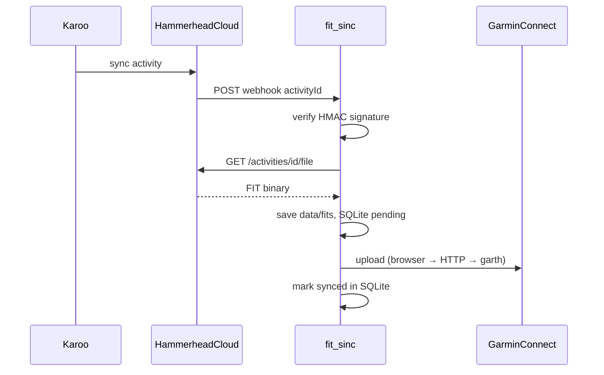

# fit_sinc: синхронизация Hammerhead → Garmin Connect

> **Статус (2026-05-25):** Phase 2 выполнен (sync, SQLite, webhook, UI). Phase 3 — надёжный Garmin upload (web-сессия, Playwright, fallback garth) реализован в коде; на sirocco — проверить `upload_ready` после деплоя.

**Документация:**
- [CI/CD и деплой](CI-CD.md)
- [Hammerhead API](API_HAMMERHEAD.md)
- [Garmin Connect API (garth-ng)](API_GARMIN.md)

## Прогресс

| Фаза | Статус |
|------|--------|
| 0a–0c DevOps (sirocco, certbot, nginx) | ✅ |
| 0d fit_sinc deploy (stub, systemd, HTTPS) | ✅ |
| 1 Hammerhead OAuth + Garmin auth | ✅ |
| 2 Sync core + webhook sync + UI | ✅ |
| 3 Garmin upload (web JWT, browser, fallback) | ✅ код / ⚠️ ops на сервере |
| 4 CI (GitHub Actions test + deploy main) | ✅ secret / ⚠️ первый push в main |

---

## Описание проекта

**fit_sinc** — личный сервис автоматической синхронизации велотренировок с Hammerhead Karoo в Garmin Connect.

После поездки Karoo загружает активность в облако Hammerhead. Сервис получает webhook о новой тренировке, скачивает оригинальный `.fit` через официальный Hammerhead API и загружает его в Garmin Connect. Данные передаются без изменений — GPS, мощность, пульс, каденс остаются как записал Karoo.

### Зачем

Hammerhead и Garmin — разные экосистемы без встроенной двусторонней синхронизации активностей. Если основной анализ и история тренировок ведутся в Garmin Connect, каждую поездку с Karoo приходится переносить вручную. fit_sinc делает это автоматически в фоне.

### Как работает

1. Тренировка завершена → Karoo синхронизируется с Hammerhead Cloud
2. Hammerhead отправляет webhook на `https://fit.romansegalla.online/webhooks/hammerhead`
3. fit_sinc проверяет HMAC-подпись, скачивает `.fit` по API (retry 5/15/30 с)
4. FIT загружается в Garmin Connect (цепочка upload — см. Phase 3)
5. ID активности сохраняется в SQLite — повторная загрузка не создаёт дубликат

### Технологии

| Слой | Выбор |
|------|-------|
| Язык | Python 3.11+ |
| HTTP / webhook | FastAPI + uvicorn |
| Hammerhead | Официальный OAuth 2.0 API (`activity:read`) |
| Garmin Connect | Web JWT (`JWT_WEB`) + Playwright `/app/import-data` → HTTP upload → garth-ng fallback |
| Состояние | SQLite (дедупликация, история sync) |
| CLI | typer |
| Веб-UI | Jinja2 + HTMX (серверный рендер, без SPA) |
| Деплой | VPS sirocco + **nginx** + systemd |

### Команды

```bash
# Hammerhead
fit_sinc hammerhead auth
fit_sinc hammerhead status

# Garmin (OAuth + web-сессия для upload)
fit_sinc garmin login
fit_sinc garmin status          # upload_ready = web JWT валиден
fit_sinc garmin refresh-web
fit_sinc garmin import-web-cookies '{"JWT_WEB":"...","session":"Fe26..."}'

# Sync
fit_sinc sync --since 2025-01-01
fit_sinc sync --activity-id <id> [--force]

# Production
fit_sinc serve
```

Деплой: см. [CI-CD.md](CI-CD.md).

### Безопасность

- Секреты и токены — только в `.env` на сервере
- Приложение слушает `127.0.0.1`, снаружи — только nginx
- Webhook — HMAC `X-Hmac-Signature`
- Веб-панель — Basic Auth на nginx

### Веб-интерфейс

- **Дашборд** — список тренировок: дата, название, статус sync
- **Лог синхронизации** — webhook, download FIT, upload Garmin, ошибки
- **Скачивание .fit** — `GET /activities/{id}/fit`
- FIT на диске: `data/fits/{activity_id}.fit`

### Ограничения v1

- Только Hammerhead → Garmin
- Только активности (не маршруты/workouts)
- Garmin через неофициальный API (web + garth-ng)

---

## Архитектура



| Компонент | Назначение |
|-----------|------------|
| `hammerhead/` | OAuth, API client, скачивание FIT |
| `garmin/session.py` | Оркестрация upload, `garmin_login` |
| `garmin/web_session.py` | Web cookies, HTTP upload |
| `garmin/web_refresh.py` | Обновление `JWT_WEB` по `session` cookie |
| `garmin/browser_upload.py` | Playwright upload на connect.garmin.com |
| `sync/service.py` | id → FIT → upload → state, backfill |
| `web/app.py` | FastAPI: webhook + веб-UI |
| `state/store.py` | SQLite: activities, sync_events |
| `data/fits/` | Кэш FIT-файлов |
| `data/garth/` | OAuth session garth-ng |
| `data/garmin_web/` | Web cookies для upload |

**Hammerhead API:** OpenAPI `https://api.hammerhead.io/v1/docs/openapi.yml`

**Webhook:** JSON `{ activityId, userId }`, подпись `X-Hmac-Signature` (HMAC-SHA256)

---

## Фаза 0: DevOps (sirocco) — выполнено

**Сервер:** `sirocco.romansegalla.online` (134.209.133.187), Ubuntu 24.04, 961M RAM + 1G swap

**Домен fit_sinc:** `fit.romansegalla.online` (DNS only, без Cloudflare proxy)

**Сделано:**
- Аудит и очистка (PM2, postfix, xray, FRR, uptime-kuma, linux-server-manager)
- Certbot: `fit.romansegalla.online` + `romansegalla.online`
- Пользователь `fit_sinc`, `/opt/fit_sinc`, venv Python 3.12
- nginx: webhook/health без auth, UI с Basic Auth
- systemd unit `fit-sinc.service`

**Deploy:** см. [CI-CD.md](CI-CD.md).

**Конфиги в репо:**
- [`deploy/nginx/fit.conf`](../deploy/nginx/fit.conf)
- [`deploy/fit-sinc.service`](../deploy/fit-sinc.service)

---

## Фаза 1: Auth — выполнено

- Hammerhead OAuth (`fit_sinc hammerhead auth`), tokens в `data/hammerhead_tokens.json`
- Garmin OAuth (`fit_sinc garmin login`), session в `data/garth/`
- Garmin web-сессия при login (`data/garmin_web/`) — для upload
- Webhook HMAC verification
- Dashboard со статусом подключений + favicon

**Hammerhead Developer Portal:**
- Redirect URL: `http://127.0.0.1:8765/callback`
- Webhook URL: `https://fit.romansegalla.online/webhooks/hammerhead`

---

## Фаза 2: Sync — выполнено

**Реализация:** `fit_sinc/sync/service.py`, `fit_sinc/state/store.py`, `fit_sinc/web/app.py`

- `sync_activity()` — dedup, metadata, download FIT с retry, upload, SQLite
- `backfill_since()` — CLI `fit_sinc sync --since YYYY-MM-DD`
- `POST /webhooks/hammerhead` → background task `sync_activity(activityId)`
- UI: `/`, `/log`, `GET /activities/{id}/fit`
- Кэш FIT: `data/fits/{activity_id}.fit`

---

## Фаза 3: Garmin upload — выполнено (код)

Garmin Connect часто отклоняет прямой `garth.upload()`; upload идёт через web-интерфейс.

**Цепочка** (`garmin/session.py` → `upload_fit`):

1. `ensure_web_session()` — refresh `JWT_WEB` при необходимости
2. Playwright: `/app/import-data` (`browser_upload.py`)
3. Fallback: HTTP multipart (`web_session.py`)
4. Fallback: `garth.upload()` + `garth.save()`

**CLI / ops:**

| Команда | Когда |
|---------|--------|
| `garmin login` | Первичная настройка (OAuth + web) |
| `garmin status` | Проверка `upload_ready` |
| `garmin refresh-web` | Истёк JWT, есть `session` cookie |
| `garmin import-web-cookies` | Ручной импорт cookies из DevTools |

**На сервере (sirocco):**

- Скопировать `data/garth/` и `data/garmin_web/` после локального `garmin login`
- Playwright: зависимость в venv; при headless-ошибках — HTTP/garth fallback
- Проверка: `fit_sinc garmin status` → `upload_ready: true`

Подробности: [API_GARMIN.md](API_GARMIN.md).

---

## Фаза 4: CI — выполнено (конфиг)

GitHub Actions: [`.github/workflows/ci.yml`](../.github/workflows/ci.yml) — `test` + `deploy` на `main`. Альтернатива: [`.gitlab-ci.yml`](../.gitlab-ci.yml).

**В GitHub:** secret `SSH_PRIVATE_KEY` добавлен. Подробности: [CI-CD.md](CI-CD.md).

Опционально позже:
- Алерт при `sync_status=error` (email/Telegram)
- UI: кнопка re-sync / force для одной активности

---

## Риски

| Риск | Mitigation |
|------|------------|
| Garmin меняет auth / upload UI | Web JWT + Playwright + HTTP + garth fallback; pin `garth-ng`, `playwright` |
| Playwright на VPS (RAM, headless) | HTTP и garth fallback; cookies refresh без браузера |
| Дубликаты в Garmin | SQLite dedup по `activityId` |
| FIT ещё не готов на Hammerhead | retry 5/15/30 с |
| Потеря tokens | Hammerhead refresh; `garmin refresh-web`; backup `data/` |
| Webhook повторы | idempotency в `store.is_synced()` |

---

## TODO

### Выполнено

- [x] DevOps: sirocco, nginx, certbot, systemd
- [x] Stub + deploy fit.romansegalla.online
- [x] Hammerhead OAuth + API client
- [x] Garmin auth (garth-ng + web session)
- [x] Webhook HMAC
- [x] Favicon + dashboard
- [x] Sync service + SQLite
- [x] Webhook → background sync
- [x] Backfill CLI
- [x] UI: лог, активности, скачивание .fit
- [x] Документация деплоя → [CI-CD.md](CI-CD.md)
- [x] Garmin upload: web JWT, refresh, browser/HTTP/garth chain
- [x] Проверить на sirocco: `garmin status` → `upload_ready`, sync работает (2026-05-25)
- [x] CI pipeline: GitHub Actions, `scripts/ci/deploy.sh`, smoke tests
- [x] Secret `SSH_PRIVATE_KEY` в GitHub

### Открыто

- [ ] Push в `main` с `.github/workflows/ci.yml` — запустить первый pipeline
- [ ] UI: ручной re-sync активности (опционально)
