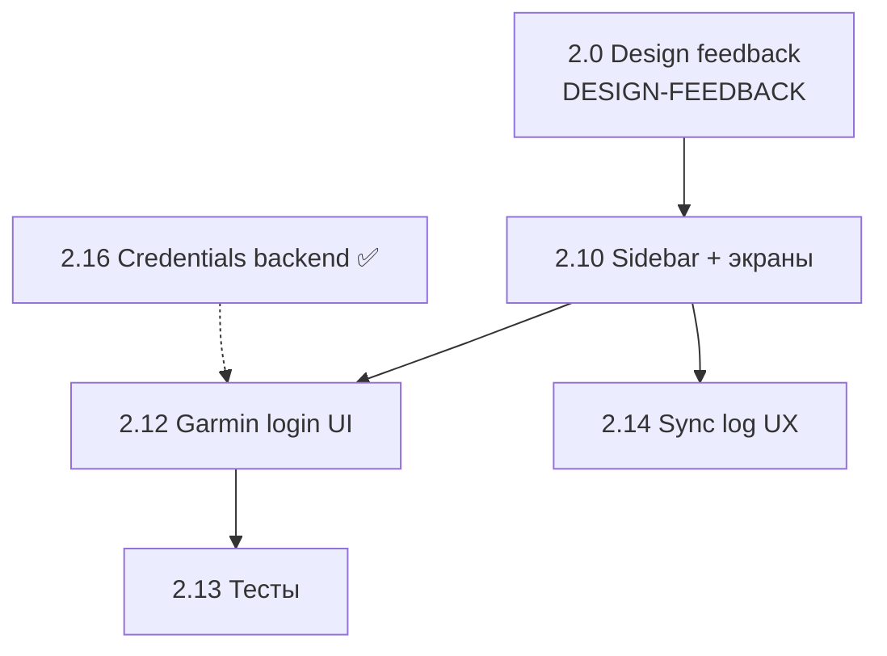
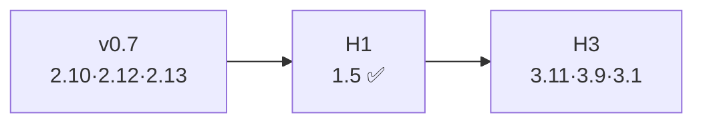

# Roadmap GetSync


> **Создано:** 2026-05-25 · **Обновлено:** 2026-05-27 · **Версия:** 0.7.0  > **Prod:** [v0.6.0](#v060--зафиксировано-2026-05-26) · **В разработке:** **v0.7.0** (кабинет / дизайн)  
> **Выполненное до v0.6** (фазы 0–5, 5b) — [PLAN-ARCHIVE.md](archive/PLAN-ARCHIVE.md) · **~112** тестов (CI `unittest discover`) · HH→Garmin на sirocco.

**Стратегия:** [VISION.md](VISION.md) (product vision, 3 горизонта) · **Domain v0:** [DOMAIN-MODEL.md](DOMAIN-MODEL.md)

**Документы:** [APP-UI.md](APP-UI.md) · [SCREENS.md](design/SCREENS.md) · [CONNECTIONS.md](CONNECTIONS.md) · [CREDENTIALS.md](CREDENTIALS.md) · [STORAGE.md](STORAGE.md) · [DATABASE.md](DATABASE.md) · [2.1e-EMAIL.md](2.1e-EMAIL.md) · [3.11-GARMIN-PULL.md](3.11-GARMIN-PULL.md) · [CHANGELOG.md](../CHANGELOG.md)

---

## Схема ID задач

| Префикс | Область | Примеры |
| ------- | ------- | ------- |
| **1.x** | Запуск, домен, инфра | **1.5** rename/cutover getsync.me ✅ |
| **2.x** | Продукт: кабинет, лендинг, алерты, i18n | **2.10** дизайн · **2.12** Garmin login |
| **2.x.y** | Подзадачи одной фичи (детали в секции фичи) | **2.10.1** sidebar |
| **3.x** | Платформа: хаб, S3, OAuth, модули | **3.1** rule engine · **3.9** модульность · **3.12** public API |
| **3.11.y** | Эпик Garmin pull (источник) | **3.11.1** spike · **3.11.2** FIT · **3.11.3** wellness · **3.11.4** UI |
| **4.x** | Долгосрочная платформа (vision) | **4.1** AI · **4.2** clubs |

**Правила:**

- В [реестре](#реестр-задач) — только **2.x** и **3.x** (и **3.11.y** для Garmin pull).
- Старые метки **2.3a** → **2.14**, **2.3b** → **2.15**, **3.11.0/a/b/c** → **3.11.1–3.11.4** (см. [таблицу переименований](#переименования-id)).
- **ops** — без номера, в [Ops](#ops-и-качество).

---

## Переименования ID

| Было | Стало | Комментарий |
| ---- | ----- | ----------- |
| 2.3 (остаток UX) | **2.3** ✅ + **2.14**, **2.15** | Ядро activities закрыто в v0.6 |
| 2.3a | **2.14** | Sync log: фильтры / типы событий |
| 2.3b | **2.15** | Календарь: дни только в облаке |
| 3.11.0 | **3.11.1** | Spike download FIT |
| 3.11a | **3.11.2** | FIT → storage + UI |
| 3.11b | **3.11.3** | Wellness SQLite + job |
| 3.11c | **3.11.4** | Widget шагов/сна |

---

## v0.6.0 — зафиксировано (2026-05-26)

См. [CHANGELOG.md](../CHANGELOG.md).

| Область | Содержание |
| ------- | ---------- |
| Sync | Webhook HH → FIT → Garmin; re-sync; Playwright на VPS |
| Кабинет | **Activities** (list \| calendar, фильтры); sync summary; **Admin** sync log + Garmin JWT log |
| IA | Нет Dashboard; `/app/` → activities; legacy runtime снят |
| Данные | `getsync.db`, `storage_key`, [STORAGE.md](STORAGE.md), [DATABASE.md](DATABASE.md) |
| Документация | PLAN, APP-UI, ARCHITECTURE, STORAGE, DATABASE |

---

## Базовая линия (prod после v0.6)

| Область | Состояние |
| ------- | --------- |
| Pipeline | **Hammerhead → Garmin** (Garmin — приёмник) |
| Кабинет | Activities · Settings · Admin (users, logs) |
| Garmin в UI | Upload ✅ · list в browse ✅ · pull FIT/wellness — **3.11** 📋 |
| Tenants | `user_id`, `data/users/{id}/`, session `getsync_session` |
| Регистрация | `/register` при `REGISTRATION_OPEN` — без email verify (**2.6**) |
| Домен | **`getsync.me`** / **`app.getsync.me`** ✅ — [1.5-RENAME.md](archive/1.5-RENAME.md) |

### Что реализовано сейчас (код + prod)

| Блок | Состояние |
| ---- | --------- |
| **Prod** | TLS, nginx, Hammerhead webhook + OAuth на `app.getsync.me` ✅ |
| **Sync** | Webhook HH → FIT → Garmin; routing по `hammerhead_user_id`; Playwright на VPS |
| **Кабинет** | Activities (list \| calendar), Settings (HH OAuth, Garmin monitor), Admin (users, sync-log, JWT log) |
| **Auth** | `/register` при `REGISTRATION_OPEN`; session `getsync_session`; bootstrap admin |
| **2.16 ✅** | Encrypted Garmin credentials per user; CLI `--save-credentials`; `ensure_garmin_session` — [CREDENTIALS.md](CREDENTIALS.md) |
| **Mail (infra)** | `getsync/mail` + Resend; `getsync mail test`; verify/register в UI — **2.6** / **2.1e** 📋 |
| **Не сделано** | **2.10** sidebar · **2.12** Garmin login в Settings · **2.6** email verify · **3.11** pull · 301 legacy host |

### Снимок кабинета `/app`

| Экран | URL |
| ----- | --- |
| Activities | `/app/activities` — list \| calendar, sync summary |
| Settings | `/app/settings` — profile, connections, `#garmin-session` |
| Admin | `/app/admin/` · `/app/admin/sync-log` · `/app/admin/log` |

Редиректы: `/app/` → activities · `/app/log` → admin sync-log · `/app/session` → settings.  
Спека: [APP-UI.md](APP-UI.md) · [SCREENS.md](design/SCREENS.md).

---

## v0.7.0 — фокус (кабинет)

**Цель:** согласованный дизайн и стабильное поведение `/app` + **Garmin login в UI** (**2.12** — UX-блокер; backend credentials **2.16** ✅).

**Не в v0.7:** **3.x** хаб · полный **3.11** · legacy 301 `fit.romansegalla.online`.



| Порядок | ID | Содержание | Оценка |
| ------- | -- | ---------- | ------ |
| 0 | — | Замечания → [DESIGN-FEEDBACK.md](design/DESIGN-FEEDBACK.md) | идёт |
| 1 | **2.10** | Sidebar prod; полировка activities / settings / admin | 4–7 дн |
| 2 | **2.12** | Garmin login в Settings (не CLI) | 1–2 веч |
| 3 | **2.13** | Автотесты + регрессия после **2.10** | 2–4 дн |
| 4 | **2.14** | Admin sync log: фильтры, duplicate ≠ error | 0.5 веч |
| опц. | **2.5** | i18n тел кабинета | 1–2 веч |
| опц. | **2.15** | Календарь: дни только в облаке | 1 веч |

### Критерий «v0.7 готов»

| Критерий | Проверка |
| -------- | -------- |
| Регрессии | Activities, Settings, Admin |
| Ручные сценарии | [SCREENS.md](design/SCREENS.md) |
| CI | тесты зелёные |
| **2.10.1–2.10.2** | [APP-UI.md](APP-UI.md) §11 |

---

## Реестр задач

| ID | Версия | Приор. | Задача | Оценка | Завис. |
| -- | ------ | ------ | ------ | ------ | ------ |
| — | **0.7** | ▶ | Design feedback — [DESIGN-FEEDBACK.md](design/DESIGN-FEEDBACK.md) | — | — |
| **2.10** | 0.7 | P0 | Sidebar + вёрстка кабинета — [APP-UI.md](APP-UI.md) §11 | 4–7 дн | feedback |
| **2.12** | 0.7 | P1 | Garmin login в Settings (форма email/password) | 1–2 веч | **2.10.2** |
| **2.16** | 0.7 | ✅ | Credentials backend: Fernet store, auto re-login Garmin | — | — |
| **2.16.1** | 0.7 | ✅ | Garmin: `--save-credentials`, per-user `connections/garmin/` | — | **2.16** |
| **2.16.2** | 0.7 | ✅ | `ensure_garmin_*`, retry OAuth, `GarminSessionError` | — | **2.16.1** |
| **2.13** | 0.7 | P1 | Тесты после **2.10** | 2–4 дн | **2.10** |
| **2.14** | 0.7 | P1 | Sync log UX (фильтры; таблица в admin ✅) | 0.5 веч | — |
| **2.5** | 0.7 | P2 | i18n кабинета | 1–2 веч | **2.10** |
| **2.15** | backlog | P3 | Календарь: облачные дни без SQLite | 1 веч | browse |
| ? | — | — | Кэш browse/calendar (обсуждение, не делать до решения) | — | — |
| **1.5** | H1 | ✅ | Cutover getsync.me — [1.5-RENAME.md](archive/1.5-RENAME.md) | — | — |
| **2.11** | H2 | ⏸ | Лендинг SEO / скрины | 2–3 веч | **2.10** |
| **2.4** | H2 | ⏸ | Telegram-алерты | 1–2 веч | **2.14** |
| **2.6** | H2 | ⏸ | Email verify — [2.1e-EMAIL.md](2.1e-EMAIL.md) | 2–4 веч | публичный register |
| **2.7** | H2 | ⏸ | Connections/rules в БД | 1–2 нед | **2.16**, **3.1** |
| **2.8** | H3 | 🔵 | Spike Source/Sink models | 2–3 веч | — |
| **2.9** | H3 | 🔵 | Manual FIT upload | 1–2 веч | storage ✅ |
| **3.11.1** | H3 | 🔵 | Spike Garmin download FIT | ½–1 веч | **2.12** |
| **3.11.2** | H3 | 🔵 | Garmin FIT pull — [3.11-GARMIN-PULL.md](3.11-GARMIN-PULL.md) | 2–3 веч | **3.11.1** |
| **3.11.3** | H3 | 🔵 | Garmin wellness (steps, sleep) | 1–2 веч | **3.11.1** |
| **3.11.4** | H3 | 🔵 | UI wellness widget | 1–2 веч | **3.11.3**, **2.5** |
| **3.9** | H3 | 🔵 | Модульность | 1–2 нед | **2.8** |
| **3.1** | H3 | 🔵 | Rule engine | ~1 нед | **3.9** |
| **3.3** | H3 | 🔵 | S3 — [STORAGE.md](STORAGE.md) | 3–5 дн | local ✅ |
| **3.4** | H3 | 🔵 | OAuth login — [3.4-OAUTH-LOGIN.md](3.4-OAUTH-LOGIN.md) | 2–3 веч | **2.6** |
| **3.5** | H3 | 🔵 | Полный хаб (Strava, …) | 2–3 нед | **3.1**, **3.3** |
| **3.2** | H3 | 🔵 | Маршруты / courses | 1–2 нед | **3.1** |
| **3.6** | H3 | 🔵 | Языки fr/… | по запросу | **2.5** |
| **3.8** | H3 | 🔵 | Email alerts, Playwright queue | post-scale | — |
| **3.10** | H3 | 🔵 | Метрики, карты | backlog | **3.5** |
| **3.12** | H2 | 🔵 | Public API (read-only, scopes) | 1–2 нед | **3.1**, **3.5** |
| **4.1** | H3 | 🔵 | AI insights / analysis layer | backlog | **3.11**, data layer |
| **4.2** | H3 | 🔵 | Clubs / teams (collaboration) | backlog | **3.12** |

**Закрыто в v0.6:** **2.1** register · **2.2** tests · **2.3** activities+calendar+admin log · rename **A+B** · legacy runtime removal.

---

## Горизонты



| Горизонт | Содержание |
| -------- | ---------- |
| **Стратегия** | Три горизонта, vision, non-goals — [VISION.md](VISION.md) |
| **v0.7** | Кабинет: дизайн (**2.10**), Garmin login UI (**2.12**), тесты (**2.13**), **2.14**; backend credentials (**2.16**) ✅ |
| **H1** | ~~**1.5** getsync.me~~ ✅ |
| **H2** | **2.11** · **2.4** · **2.6** |
| **H3** | **2.8** → **3.11.*** → **3.9** → **3.1** ∥ **3.3** → **3.5** |

**Порядок H3 (Garmin + хаб):**

```text
2.8 → 3.11.1 → 3.11.2 ∥ 3.11.3 → 3.11.4 → 3.9 ∥ 3.3 → 3.1 → 3.5 → 3.4
```

---

## Детали: v0.7 (кабинет)

### 2.10 — Дизайн UI/UX

Цель: prod = sidebar + плотный SaaS (сейчас nav-pills). Прототип: `/app/ui-preview`.

| Подзадача | Содержание | Оценка |
| --------- | ---------- | ------ |
| **2.10.1** | `cabinet_sidebar.html` на все `/app` | 1–2 веч |
| **2.10.2** | Activities, Settings, Admin; **2.12** в Connections | 3–5 дн |
| **2.10.3** | Mobile, a11y | 2–3 дн |

### 2.12 — Garmin login в UI

Блокер для **3.11.1+** без CLI. Backend **2.16** ✅ (CredentialStore, auto re-login); в Settings пока status/refresh/CLI hint. См. [APP-UI.md](APP-UI.md) §6.3 · [CREDENTIALS.md](CREDENTIALS.md).

### 2.13 — Тестирование

- `GET /app/activities?view=calendar&year=&month=`
- redirects `/app/`, `/app/log`, `/app/session`
- browse/calendar tests; smoke login → activities → settings

### 2.14 — Sync log UX (admin)

| Шаг | Статус |
| --- | ------ |
| Журнал в `/app/admin/sync-log` (все tenants) | ✅ v0.6 |
| Фильтры / duplicate vs error | 📋 v0.7 |

### 2.15 — Календарь v6.1

Дни «только в облаке» без записи в SQLite — опционально после v0.7.

---

## Детали: H1 — запуск

### 1.5 — Cutover getsync.me ✅

Закрыто **2026-05-27:** DNS, certbot, nginx, Hammerhead webhook/OAuth, prod URLs работают.

| Шаг | Статус |
| --- | ------ |
| Код rename A+B, `deploy/nginx/getsync.conf` | ✅ |
| DNS, certbot | ✅ |
| Hammerhead webhook + OAuth | ✅ |
| Браузер: getsync.me, app login | ✅ |
| E2E ride → sync | отложено |
| 301 `fit.romansegalla.online` → app | backlog |

[1.5-RENAME.md](archive/1.5-RENAME.md) — полный чеклист и backlog.

---

## Детали: H3 — платформа

### 3.11 — Garmin Pull (эпик)

> [3.11-GARMIN-PULL.md](3.11-GARMIN-PULL.md) · подзадачи **3.11.1–3.11.4**

| ID | Содержание |
| -- | ---------- |
| **3.11.1** | Spike: auth download FIT / wellness API |
| **3.11.2** | FIT → `activities/garmin/`, UI download |
| **3.11.3** | `daily_steps`, `daily_sleep`, daily job |
| **3.11.4** | Widget шагов/сна в кабинете |

### 3.9 — Модульность

3.9.0 граф · 3.9.1 MODULES.md · 3.9.2 protocols · 3.9.3 refactor · 3.9.4 contract tests

### 3.1 / 3.3 / 3.4 / 3.5

См. [CONNECTIONS.md](CONNECTIONS.md), [STORAGE.md](STORAGE.md), [3.4-OAUTH-LOGIN.md](3.4-OAUTH-LOGIN.md).

---

## Ops и качество

| Задача | Примечание |
| ------ | ---------- |
| CI GitHub Actions | `checkout@v6`, `setup-python@v6` (Node 24 runtime) |
| `upload_ready` на sirocco | мониторинг |
| Убрать `GARMIN_EMAIL` из `.env` prod | multi-tenant |
| Admin Statistics | H2 |

---

## Риски

| Риск | Mitigation |
| ---- | ---------- |
| Garmin auth/upload меняется | pin garth; JWT + Playwright |
| Garmin download (**3.11.1**) | spike до реализации |
| Manual activity без FIT | `no_file`, не error (**3.11.2**) |
| Регрессия **2.10** | **2.13** после вёрстки |
| Legacy host 301 | `fit.romansegalla.online` → `app.getsync.me` — ops backlog |

---

## Ссылки

| Документ | Назначение |
| -------- | ---------- |
| [CHANGELOG.md](../CHANGELOG.md) | Версии релизов |
| [DOC-CONVENTION.md](DOC-CONVENTION.md) | Метаданные документов |
| [PLAN-ARCHIVE.md](archive/PLAN-ARCHIVE.md) | История фаз 0–5 |
| [CREDENTIALS.md](CREDENTIALS.md) | Per-user secrets, **2.16** |
| [2.1e-EMAIL.md](2.1e-EMAIL.md) | Mail infra + verify (product 📋) |
| [ARCHITECTURE.md](ARCHITECTURE.md) | Потоки, tenants |
| [VISION.md](VISION.md) | Product vision, стратегия |
| [DOMAIN-MODEL.md](DOMAIN-MODEL.md) | Domain model v0 |
| [PLAN.md](PLAN.md) | Тактический roadmap |
| [APP-UI.md](APP-UI.md) | UI `/app` |
