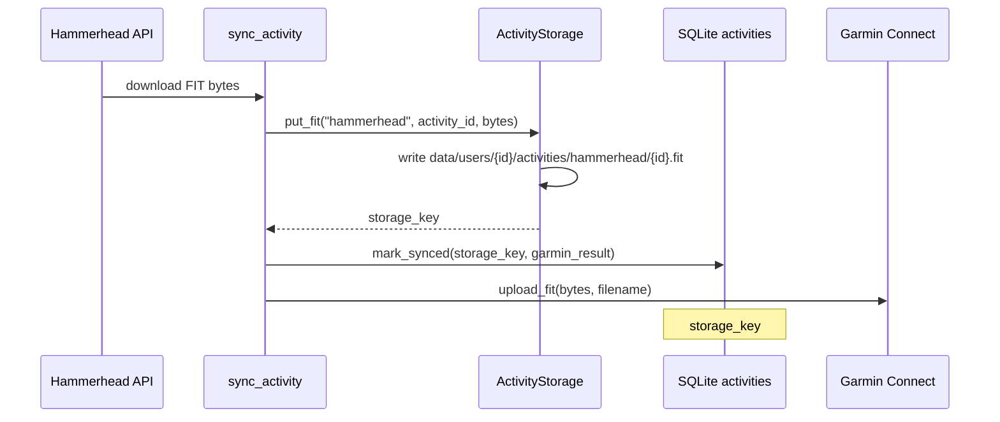

# Хранение FIT-файлов

> **Статус:** local filesystem ✅ · S3 — [PLAN.md](PLAN.md) **3.3** · Garmin pull FIT — [3.11-GARMIN-PULL.md](3.11-GARMIN-PULL.md) **3.11.2**.  
> **SQLite:** `activities.storage_key` — [DATABASE.md](DATABASE.md).

---

## Назначение

GetSync сохраняет **оригинальные `.fit`** с Hammerhead после webhook и отдаёт их:

1. **В Garmin Connect** — upload из байтов файла (HTTP / Playwright).
2. **Пользователю в UI** — скачивание `GET /app/activities/{id}/fit` (только `source=hammerhead`).

Каталог активностей Garmin в browse — пока **без локального FIT**; после **3.11** файлы появятся под `activities/garmin/`.

---

## Принципы

| # | Правило |
| - | ------- |
| 1 | **Изоляция tenant** — все артефакты только под `data/users/{user_id}/`. |
| 2 | **Логический ключ** — в БД поле `storage_key` (относительный путь), не абсолютный путь VPS. |
| 3 | **Один контракт** — `StorageBackend`; синк и UI не зависят от local vs S3. |
| 4 | **Имя файла** — `{sanitized_external_id}.fit` в каталоге `activities/{source}/`. |

---

## Поток данных (Hammerhead → диск → Garmin)



**Код:** [`getsync/sync/service.py`](../getsync/sync/service.py) — после успешного download вызывается `ActivityStorage.put_fit`, затем `upload_fit` читает те же байты (путь нужен в основном для имени файла при upload).

---

## Раскладка на диске (local)

Корень: **`{DATA_DIR}/users/{user_id}/`** (по умолчанию `data/users/default/`).

```text
data/
  getsync.db
  users/
    {user_id}/
      activities/                    ← основное хранилище FIT
        hammerhead/
          {activity_id}.fit          ← id после sanitize_external_id
        garmin/                      ← план 3.11.2 (пока обычно пусто)
          {activity_id}.fit
      hammerhead_tokens.json         ← не FIT
      garmin_web/                    ← сессия Garmin (JSON)
      garth/                         ← OAuth garth-ng
```

### Пример

| Поле | Значение |
| ---- | -------- |
| `user_id` | `default` |
| `source` | `hammerhead` |
| `activity_id` | `ride-42` (как в HH API) |
| `storage_key` | `activities/hammerhead/ride-42.fit` |
| **Файл на VPS** | `data/users/default/activities/hammerhead/ride-42.fit` |

---

## Логический ключ (`storage_key`)

Генерация: [`getsync/storage/keys.py`](../getsync/storage/keys.py)

```python
build_object_key(source, external_id, kind="fit")
# → "activities/{source}/{safe_id}.fit"
```

| Шаг | Правило |
| --- | ------- |
| `source` / `external_id` | Небезопасные символы → `_`; сегмент до 200 символов |
| `kind` | `fit` → суффикс `.fit`; зарезервировано `gpx` для будущего |
| Запрет | `..` в ключе — `LocalFilesystemBackend` отклоняет |

**S3 (позже):** объект `{user_id}/{storage_key}` (или с `s3_prefix`) — тот же ключ, другой backend.

---

## API в коде

### `StorageBackend`

[`getsync/storage/backend.py`](../getsync/storage/backend.py)

| Метод | Local | Назначение |
| ----- | ----- | ---------- |
| `put(user_id, key, data)` | `write_bytes` + `mkdir -p` | Запись FIT |
| `exists(user_id, key)` | `Path.is_file()` | Проверка перед UI |
| `open_path(user_id, key)` | абсолютный `Path` | Download, Playwright upload с файла |
| `delete(user_id, key)` | `unlink` | Пока редко используется |

Фабрика: `get_storage_backend(settings)` ← `STORAGE_BACKEND` (`local` \| `s3`).

### `ActivityStorage`

[`getsync/storage/activity.py`](../getsync/storage/activity.py) — фасад на одного tenant (`UserContext`).

| Метод | Возвращает / делает |
| ----- | ------------------- |
| `fit_key(source, id)` | строка `storage_key` без записи |
| `put_fit(source, id, bytes)` | записывает файл → `storage_key` |
| `has_fit(storage_key)` | файл есть на backend |
| `open_fit_path(storage_key)` | `Path \| None` для `FileResponse` |

---

## Связь с SQLite

Таблица `activities` ([DATABASE.md](DATABASE.md)):

| Колонка | Роль для FIT |
| ------- | ------------ |
| `storage_key` | **Каноническая** ссылка на объект в `StorageBackend` |
| `fit_path` | Колонка в старых БД; приложение **не читает/не пишет** — только `storage_key` |
| `sync_status` | `synced` обычно означает, что FIT был сохранён и upload прошёл |
| `garmin_result` | JSON ответа Garmin (не содержит сам FIT) |

При `persist_browse_rows` (Garmin metadata) **`storage_key` не перезаписывается** — только метаданные browse.

---

## Скачивание из UI

`GET /app/activities/{activity_id}/fit` — [`app_routes.download_fit`](../getsync/web/app_routes.py)

Только **`storage_key`** → `ActivityStorage.open_fit_path` (только **`source=hammerhead`**).

Ответ: `FileResponse`, `Content-Type: application/vnd.ant.fit`.  
В списке Activities кнопка «.fit» — если есть `storage_key` в индексе HH — [`browse.py`](../getsync/activities/browse.py).

**Tenant isolation:** чужой `activity_id` → 404 (`get_activity` с `user_id` из сессии).

---

---

## Конфигурация

`.env` / [`Settings`](../getsync/config.py):

```env
DATA_DIR=data
STORAGE_BACKEND=local

# Фаза 3.3 (не реализовано):
# STORAGE_BACKEND=s3
# S3_BUCKET=getsync-prod
# S3_REGION=eu-central-1
# S3_ENDPOINT_URL=https://storage.yandexcloud.net
# S3_PREFIX=
```

| Переменная | Default | Описание |
| ---------- | ------- | -------- |
| `DATA_DIR` | `data` | Корень БД и `users/` |
| `STORAGE_BACKEND` | `local` | `local` — диск; `s3` — заглушка (`NotImplementedError`) |

---

## Что хранится не в `activities/`

| Путь | Содержимое |
| ---- | ---------- |
| `hammerhead_tokens.json` | OAuth Hammerhead |
| `garmin_web/session.json` | Web-сессия Garmin |
| `garth/` | OAuth garth-ng (fallback upload) |

Это **не** FIT; не проходят через `ActivityStorage`.

---

## Garmin как source (план **3.11.2**)

После pull ожидается тот же layout:

```text
activities/garmin/{garmin_activity_id}.fit
```

`storage_key` в SQLite + опциональный Download в UI (как у HH). Детали — [3.11-GARMIN-PULL.md](3.11-GARMIN-PULL.md).

---

## Ops и бэкапы

| Задача | Рекомендация |
| ------ | ------------ |
| Бэкап tenant | Каталог `data/users/{user_id}/activities/` + строка в `getsync.db` |
| Восстановление | Совпадение `storage_key` в БД и файла на диске |
| Место на диске | ~50–500 KB на типичную поездку; рост линейно по числу synced HH-активностей |
| Права | Процесс `getsync` (systemd user) должен писать в `DATA_DIR` |

На prod FIT **не** кладутся в git и не rsync’ятся с dev — только на VPS в `GETSYNC_DEPLOY_PATH/data/`.

---

## Roadmap

| ID | Содержание |
| -- | ---------- |
| **3.3** | `S3StorageBackend`, migrate CLI, signed download URL |
| **3.11.2** | FIT pull Garmin → `activities/garmin/` |
| backlog | `activity_objects` — несколько артефактов (GPX, preview) на одну активность |
| backlog | LRU-кэш на VPS при `STORAGE_BACKEND=s3` |

---

## Модули (индекс)

| Файл | Назначение |
| ---- | ---------- |
| [`storage/keys.py`](../getsync/storage/keys.py) | `build_object_key`, `sanitize_external_id` |
| [`storage/backend.py`](../getsync/storage/backend.py) | `LocalFilesystemBackend`, `get_storage_backend` |
| [`storage/activity.py`](../getsync/storage/activity.py) | `ActivityStorage.put_fit` / `open_fit_path` |
| [`sync/service.py`](../getsync/sync/service.py) | Запись FIT после HH download |
| [`users/context.py`](../getsync/users/context.py) | `user_data_dir`, `activities_dir` |
| [`users/migrate.py`](../getsync/users/migrate.py) | `infer_hammerhead_user_id` при bootstrap |

---

## См. также

| Документ | Тема |
| -------- | ---- |
| [DATABASE.md](DATABASE.md) | `activities`, `storage_key`, `fit_path` |
| [ARCHITECTURE.md](ARCHITECTURE.md) | Webhook → sync pipeline |
| [API_HAMMERHEAD.md](API_HAMMERHEAD.md) | Download FIT API |
| [API_GARMIN.md](API_GARMIN.md) | Upload FIT в Connect |
