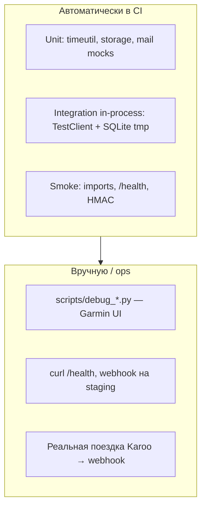

# Стратегия тестирования GetSync


> **Создано:** 2026-05-26 · **Обновлено:** 2026-05-27 · **Версия:** 0.7.0  
> **Связано:** [CI-CD.md](CI-CD.md) · [PLAN.md](PLAN.md) (**2.13**) · [ARCHITECTURE.md](ARCHITECTURE.md)

Документ описывает, **что** и **как** проверяем в репозитории: автотесты в `tests/`, прогон в CI и вспомогательные скрипты в `scripts/`.

---

## Принципы

| Принцип | Реализация |
| ------- | ---------- |
| **Без сети в CI** | Автотесты не ходят в Hammerhead, Garmin и SMTP; внешние HTTP — через `unittest.mock` |
| **Изоляция данных** | Временный `DATA_DIR`, чистый SQLite, сброс `get_settings.cache_clear()` — [`tests/helpers.py`](../tests/helpers.py) |
| **Быстрый feedback** | ~112 тестов (`python -m unittest discover -s tests`), stdlib `unittest`, без Playwright в job `test` |
| **Регрессия безопасности** | Отдельный модуль `test_security_auth.py`: сессии, admin, tenant isolation, webhook |
| **Деплой ≠ тесты** | На VPS через rsync **не** попадают `tests/`, `docs/`, `scripts/` — [`.rsyncignore`](../.rsyncignore) |

Интеграции с живым Garmin Connect и Hammerhead — **ручные** скрипты и smoke на prod/staging, не gate в GitHub Actions.

---

## Пирамида



| Уровень | Где | Примеры |
| ------- | --- | ------- |
| Unit | `tests/test_*.py` | `timeutil`, `storage`, slug email, HMAC verify |
| Integration (in-process) | `FastAPI TestClient` + temp DB | login, activities browse, webhook POST, sync idempotency |
| Smoke | `test_smoke.py`, `test_build_info.py` | импорт app, лендинг 200, footer version |
| Ручная отладка Garmin | `scripts/debug_*.py`, `test_browser_fetch.py` | Playwright, consent, upload URLs |
| E2E продукта | вне репозитория | поездка на Karoo, мониторинг sync log |

---

## CI (GitHub Actions)

Workflow: [`.github/workflows/test.yml`](../.github/workflows/test.yml).

| Шаг | Команда | Зачем |
| --- | ------- | ----- |
| Install | `pip install -e .` | зависимости из `pyproject.toml` |
| Compile | `python -m compileall -q getsync` | синтаксис всего пакета |
| Tests | `python -m unittest discover -s tests -p "test_*.py" -v` | полный набор автотестов |

Job **`deploy`** (только push `main` / `master` / `hotfix/*` после зелёного `test`): [`scripts/ci/deploy.sh`](../scripts/ci/deploy.sh) — rsync, restart, poll `/health`.

Подробности деплоя и secrets: [CI-CD.md](CI-CD.md).

---

## Локальный прогон

### Как в CI (рекомендуется)

```bash
cd /path/to/getsync
python3 -m venv .venv && source .venv/bin/activate
pip install -e .
python -m compileall -q getsync
python -m unittest discover -s tests -p "test_*.py" -v
```

### Один файл или класс

```bash
python -m unittest tests.test_webhook -v
python -m unittest tests.test_security_auth.TestTenantIsolation -v
```

### Pytest (опционально)

В `pyproject.toml` pytest **не** зафиксирован. Если установлен в `.venv`:

```bash
.venv/bin/pytest tests/ -q
```

Запускать **только каталог `tests/`**. Не делать `pytest` из корня без `-s tests`: в `scripts/` лежат standalone-скрипты (например `test_browser_fetch.py`), которые требуют локальные `data/` и Playwright.

### Переменные окружения в тестах

| Переменная | Когда нужна |
| ---------- | ----------- |
| *(по умолчанию не нужны)* | `isolated_env()` выставляет `DATA_DIR`, `SESSION_SECRET`, `HAMMERHEAD_WEBHOOK_SECRET`, … |
| `GETSYNC_GIT_COMMIT` | `test_build_info.test_git_commit_from_env` — короткий hash в footer |
| `GIT_COMMIT` | legacy alias в `build_info` (если задан на deploy) |

После изменения env в тестах вызывается `clear_build_info_cache()` / `get_settings.cache_clear()`.

---

## Инфраструктура тестов

### `tests/helpers.py`

| Утилита | Назначение |
| ------- | ---------- |
| `isolated_env(tmp_root, **extra)` | Context manager: temp `data/`, переопределение env, сброс settings |
| `webhook_hmac(body, secret)` | HMAC-SHA256 hex для подписи webhook в тестах |

Типичный паттерн:

```python
with tempfile.TemporaryDirectory() as tmp:
    with isolated_env(Path(tmp), REGISTRATION_OPEN="true"):
        client = TestClient(app)
        ...
```

### `FastAPI TestClient`

- Без реального uvicorn; запросы в том же процессе.
- Логин: `POST /app/login` с form data, cookie `getsync_session`.
- Admin: пользователь с флагом admin в SQLite (`store.ensure_default_user` / bootstrap).

### Async

`test_sync.py` использует `unittest.IsolatedAsyncioTestCase` для `sync_activity` (моки HTTP-клиентов).

---

## Каталог автотестов (`tests/`)

| Файл | Область | Что проверяет |
| ---- | ------- | ------------- |
| `test_smoke.py` | Smoke | HMAC verify, импорт app, лендинг `/`, store CRUD |
| `test_build_info.py` | Ops UI | version в footer, `GETSYNC_GIT_COMMIT`, `_build_meta.json` deploy |
| `test_security_auth.py` | Security | публичные маршруты, 401/403 без сессии, admin, tenant isolation, webhook secret |
| `test_app_auth.py` | Auth UI | login/logout, redirect после логина, admin access, i18n login |
| `test_register.py` | Register **2.1** | slug, validation, rate limit, `REGISTRATION_OPEN`, auto-login |
| `test_bootstrap.py` | Bootstrap **5b** | первый admin, политика регистрации |
| `test_webhook.py` | Webhook | routing по user, `POST /webhooks/hammerhead`, подпись |
| `test_sync.py` | Sync core | idempotency `sync_activity`, дубликаты, ошибки |
| `test_storage.py` | Storage | пути FIT, `storage_key`, `ActivityStorage` |
| `test_store_migration.py` | DB | миграция SQLite v1→v2 |
| `test_activities_browse.py` | Activities | unified browse, фильтры, dedupe |
| `test_activities_calendar.py` | Activities | календарь по месяцам |
| `test_activities_catalog_db.py` | Activities | каталог в SQLite, multi-source |
| `test_resync_ui.py` | Activities UI | re-sync кнопка, HTMX/form |
| `test_settings.py` | Settings | профиль, connections section |
| `test_connections_banner.py` | Settings | блок connections на settings (legacy id **1.8**) |
| `test_user_locale.py` | i18n user | locale в БД и settings |
| `test_site_i18n.py` | i18n site | лендинг EN/RU/DE |
| `test_ui_v2.py` | Templates | Jinja: nav, ключевые страницы без 500 |
| `test_timeutil.py` | Utils | даты, фильтры в TZ пользователя |
| `test_timezones.py` | Utils | список TZ, валидация |
| `test_mail.py` | Mail **2.1e** | NullMailer, Resend mock (без реального API) |

**Планируется (PLAN 2.13):** явные тесты redirects `/app/` → activities, `/app/log` → admin sync-log; calendar query params; сценарий login → activities → settings.

---

## Скрипты: что за что отвечает

### CI и деплой (`scripts/ci/`)

| Скрипт | Тип | Назначение |
| ------ | --- | ---------- |
| [`deploy.sh`](../scripts/ci/deploy.sh) | bash | Rsync на sirocco, venv/pip при смене `pyproject.toml`, Playwright Chromium на сервере, systemd restart, health poll; пишет `getsync/_build_meta.json` |
| [`build-frontend-css.sh`](../scripts/ci/build-frontend-css.sh) | bash | Заглушка: CSS в `getsync/web/static/app.css` вручную, Bootstrap с CDN |
| [`sync-github-vars.sh`](../scripts/ci/sync-github-vars.sh) | bash | `gh variable set` для `GETSYNC_SSH_*`, удаление legacy vars |
| [`patch-romansegalla-nginx.sh`](../scripts/ci/patch-romansegalla-nginx.sh) | bash | One-off: proxy `/webhooks/` на :8080 в nginx default (sirocco) |

Эти скрипты **не** являются тестами; их вызывает CI или ops вручную.

### Отладка Garmin upload (ручные, нужны локальные `data/`)

Все ниже — **исследование** нестабильного web UI Garmin (consent, import page, upload API). Запуск с машины разработчика, где есть `data/garmin_web/session.json` и тестовый `.fit`.

| Скрипт | Инструмент | Назначение |
| ------ | ---------- | ---------- |
| [`test_browser_fetch.py`](../scripts/test_browser_fetch.py) | Playwright + JS fetch | POST `.fit` на upload URLs из контекста браузера (CSRF, cookies) |
| [`debug_upload_browse.py`](../scripts/debug_upload_browse.py) | Playwright | Лог сетевых запросов на import/upload при обходе UI |
| [`debug_upload_posts.py`](../scripts/debug_upload_posts.py) | Playwright | Только POST-ответы при загрузке файла |
| [`debug_consent_upload.py`](../scripts/debug_consent_upload.py) | Playwright | Consent + upload flow на import-data |
| [`inspect_import_ui.py`](../scripts/inspect_import_ui.py) | Playwright | Сколько `input[type=file]` на страницах import (в т.ч. shadow DOM) |
| [`list_file_inputs.py`](../scripts/list_file_inputs.py) | Playwright | Детали file inputs (accept, hidden, parent text) |
| [`find_upload_js.py`](../scripts/find_upload_js.py) | httpx | Поиск строк `upload-service` / `import-data` в бандлах Garmin (reverse engineering) |
| [`check_upload_consent.py`](../scripts/check_upload_consent.py) | httpx | GET GDPR/consent API Garmin, попытка accept consent |

Имена с префиксом `debug_` — разовые расследования; `test_browser_fetch.py` — эксперимент, **не** входит в `unittest discover`.

### Ops / DNS (не про код приложения)

| Скрипт | Назначение |
| ------ | ---------- |
| [`check-getsync-dns.sh`](../scripts/check-getsync-dns.sh) | Cron: проверка DNS `getsync.me`, уведомление по SMTP при появлении записи |
| [`dns-notify.env.example`](../scripts/dns-notify.env.example) | Пример конфига для DNS-скрипта |

---

## Что сознательно не автоматизировано

| Область | Почему | Как проверяем |
| ------- | ------ | ------------- |
| Garmin Playwright upload | Flaky UI, captcha, сессии | `scripts/debug_*`, ручной sync после деплоя |
| Hammerhead OAuth / API | Нужны реальные токены | Settings UI, `getsync hammerhead …` |
| Email deliverability | Внешний Resend/SMTP | `test_mail` с mock; prod — тестовое письмо |
| nginx / TLS / certbot | Инфра VPS | `curl` smoke в [CI-CD.md](CI-CD.md) |
| Полный E2E Karoo→Garmin | Дорого, редко | Поездка + запись в admin sync log |

---

## Ручной чеклист (после деплоя)

Минимум перед «считаем релиз ок»:

```bash
curl -sf https://app.getsync.me/health | jq .
# или legacy:
curl -sf https://romansegalla.online/health | jq .
```

| # | Действие | Ожидание |
| - | -------- | -------- |
| 1 | `/health` | `service: getsync`, актуальная `version` |
| 2 | `/app/login` → login | redirect на `/app/activities` |
| 3 | Activities list + calendar | 200, без 500 |
| 4 | Settings → connections | HH/Garmin статусы |
| 5 | Admin sync log (admin user) | таблица событий |
| 6 | (опц.) тестовый webhook | запись в sync log, без 500 |

Сценарии по экранам: [design/SCREENS.md](design/SCREENS.md).

---

## Связь с roadmap

| ID | Содержание |
| -- | ---------- |
| **2.2** | Базовые автотесты (закрыто в v0.6) |
| **2.13** | Расширение покрытия redirects, calendar, smoke flows (**v0.7**) |

При добавлении фичи: сначала тест с `isolated_env` + `TestClient`, затем код; для security — дополнение `test_security_auth.py`.

---

## Ссылки

| Документ | Тема |
| -------- | ---- |
| [CI-CD.md](CI-CD.md) | Deploy, secrets, smoke curl |
| [DATABASE.md](DATABASE.md) | Схема для тестов store |
| [STORAGE.md](STORAGE.md) | FIT paths в `test_storage` |
| [API_GARMIN.md](API_GARMIN.md) | Контекст для debug-скриптов |
| [API_HAMMERHEAD.md](API_HAMMERHEAD.md) | Webhook HMAC, OAuth |
| [DOC-CONVENTION.md](DOC-CONVENTION.md) | Метаданные документов |
