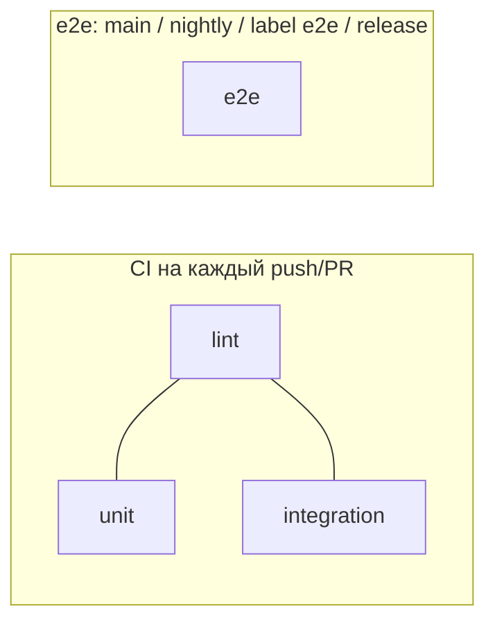

# Стратегия тестирования GetSync


> **Создано:** 2026-05-26 · **Обновлено:** 2026-05-28 · **Версия:** 0.7.0  
> **Связано:** [CI-CD.md](CI-CD.md) · [PLAN.md](PLAN.md) (**2.13**) · [ARCHITECTURE.md](ARCHITECTURE.md)

Документ описывает, **что** и **как** проверяем в репозитории: автотесты в `tests/`, прогон в CI и вспомогательные скрипты в `scripts/`.

---

## Принципы

| Принцип | Реализация |
| ------- | ---------- |
| **Без сети в CI** | Автотесты не ходят в Hammerhead, Garmin и SMTP; внешние HTTP — через `unittest.mock` |
| **Изоляция данных** | Временный `DATA_DIR`, чистый SQLite — [`tests/integration/helpers.py`](../tests/integration/helpers.py) |
| **Быстрый feedback** | ~159 тестов в 3 tier; CI jobs **параллельно** (lint ∥ unit ∥ integration) |
| **Tier-разделение** | `tests/unit/` · `tests/integration/` · `tests/e2e/` |
| **Регрессия безопасности** | `tests/integration/test_security_auth.py`: сессии, admin, tenant isolation, webhook |
| **Деплой ≠ тесты** | На VPS через rsync **не** попадают `tests/`, `docs/`, `scripts/` — [`.rsyncignore`](../.rsyncignore) |

Интеграции с живым Garmin Connect и Hammerhead — **ручные** скрипты и smoke на prod/staging, не gate в GitHub Actions.

---

## Пирамида



| Tier | Каталог | Содержание | Запрещено | CI |
|------|---------|------------|-----------|-----|
| **A. unit** | `tests/unit/` | timeutil, timezones, pure filters | SQLite, TestClient, сеть, FS I/O | каждый push/PR |
| **B. integration** | `tests/integration/` | SQLite, storage, providers (mock), auth, TestClient | Playwright, live network | каждый push/PR |
| **C. e2e** | `tests/e2e/` | Playwright, staging webhook, browser upload | — | **не** на PR; main, nightly, label `e2e`, release |
| Ручная отладка Garmin | `scripts/debug_*.py` | reverse-engineering UI | — | вне CI |
| E2E продукта | вне репозитория | поездка Karoo → sync log | — | вручную |

---

## CI (GitHub Actions)

Workflow: [`.github/workflows/test.yml`](../.github/workflows/test.yml).

Jobs **параллельно** (без `needs` между собой):

| Job | Команда | Когда |
| --- | ------- | ----- |
| **lint** | `ruff check tests/…` + `compileall getsync` | push, PR |
| **unit** | `unittest discover -s tests/unit` | push, PR |
| **integration** | `unittest discover -s tests/integration` | push, PR |
| **e2e** | `unittest discover -s tests/e2e` + Playwright | main push, nightly, label `e2e`, release |
| **deploy** | `scripts/ci/deploy.sh` | push main/master/hotfix после **lint + unit + integration** |

E2E **не блокирует** deploy. На PR без label `e2e` job e2e не запускается.

Vars/secrets для e2e: `GETSYNC_STAGING_URL`, `E2E_WEBHOOK_SECRET` — см. [CI-CD.md](CI-CD.md).

---

## Локальный прогон

### Как в CI (рекомендуется)

```bash
cd /path/to/getsync
python3 -m venv .venv && source .venv/bin/activate
pip install -e ".[dev]"
ruff check tests/unit tests/integration tests/e2e
python -m compileall -q getsync
python -m unittest discover -s tests/unit -p "test_*.py" -v
python -m unittest discover -s tests/integration -p "test_*.py" -v
```

Unit и integration можно запускать параллельно в двух терминалах.

### Один файл или класс

```bash
python -m unittest discover -s tests/integration -p "test_webhook.py" -v
python -m unittest integration.test_security_auth.TestTenantIsolation -v
```

(из корня репо, с `tests/integration` на `sys.path` через `discover -s`)

### Pytest (опционально)

В `pyproject.toml` pytest **не** зафиксирован. Если установлен в `.venv`:

```bash
.venv/bin/pytest tests/ -q
```

Запускать **только каталог `tests/`**. Не делать `pytest` из корня без `-s tests`: в `scripts/` лежат standalone-скрипты (например `test_browser_fetch.py`), которые требуют локальные `data/` и Playwright.

### Переменные окружения в тестах

| Переменная | Когда нужна |
| ---------- | ----------- |
| *(по умолчанию не нужны)* | `isolated_env()` выставляет `DATA_DIR`, `SESSION_SECRET`, `HAMMERHEAD_WEBHOOK_SECRET`, … |
| `GETSYNC_GIT_COMMIT` | `test_build_info.test_git_commit_from_env` — короткий hash в footer |
| `GIT_COMMIT` | legacy alias в `build_info` (если задан на deploy) |

После изменения env в тестах вызывается `clear_build_info_cache()` / `get_settings.cache_clear()`.

---

## Инфраструктура тестов

### `tests/integration/helpers.py`

| Утилита | Назначение |
| ------- | ---------- |
| `isolated_env(tmp_root, **extra)` | Context manager: temp `data/`, переопределение env, сброс settings |
| `webhook_hmac(body, secret)` | HMAC-SHA256 hex для подписи webhook в тестах |

### `tests/integration/flows.py`

| Утилита | Назначение |
| ------- | ---------- |
| `login(client, email, password)` | POST `/app/login`, проверка redirect |
| `logout(client)` | GET `/app/logout` |
| `assert_redirect` / `assert_redirect_prefix` | Legacy URLs и redirects без follow |
| `seed_default_user` / `seed_regular_user` | Пользователи в temp SQLite |

Сценарии из [design/SCREENS.md](design/SCREENS.md) — [`tests/integration/test_user_cases.py`](../tests/integration/test_user_cases.py) (PLAN **2.13**).

Типичный паттерн:

```python
with tempfile.TemporaryDirectory() as tmp:
    with isolated_env(Path(tmp), REGISTRATION_OPEN="true"):
        client = TestClient(app)
        ...
```

### `FastAPI TestClient`

- Без реального uvicorn; запросы в том же процессе.
- Логин: `POST /app/login` с form data, cookie `getsync_session`.
- Admin: пользователь с флагом admin в SQLite (`store.ensure_default_user` / bootstrap).

### Async

`test_sync.py` использует `unittest.IsolatedAsyncioTestCase` для `sync_activity` (моки HTTP-клиентов).

---

## Каталог автотестов

| Каталог | Файлы (основные) |
| ------- | ---------------- |
| `tests/unit/` | `test_timeutil.py`, `test_timezones.py` |
| `tests/integration/` | auth, webhook, sync, storage, settings, user_cases, security, … |
| `tests/e2e/` | `test_staging_smoke.py` (skip без `GETSYNC_E2E_BASE_URL`) |

**2.13 (частично ✅):** tier CI + `flows.py` / `test_user_cases.py`; split pure unit — 📋 фаза 2.

---

## Скрипты: что за что отвечает

### CI и деплой (`scripts/ci/`)

| Скрипт | Тип | Назначение |
| ------ | --- | ---------- |
| [`deploy.sh`](../scripts/ci/deploy.sh) | bash | Rsync на VPS (`GETSYNC_SSH_HOST`), venv/pip, Playwright, systemd, health poll |
| [`deploy-all.sh`](../scripts/ci/deploy-all.sh) | bash | Deploy на `GETSYNC_SSH_HOSTS` (по умолчанию breeze) |
| [`verify-hosts.sh`](../scripts/ci/verify-hosts.sh) | bash | `curl` /health prod + staging |
| [`bootstrap-host.sh`](../scripts/ci/bootstrap-host.sh) | bash | One-time apt, python3.11, user `getsync`, systemd unit |
| [`sync-from-prod.sh`](../scripts/ci/sync-from-prod.sh) | bash | `.env` + `data/` sirocco → breeze через `/tmp` |
| [`build-frontend-css.sh`](../scripts/ci/build-frontend-css.sh) | bash | Заглушка: CSS в `getsync/web/static/app.css` вручную, Bootstrap с CDN |
| [`sync-github-vars.sh`](../scripts/ci/sync-github-vars.sh) | bash | `gh variable set` для `GETSYNC_SSH_*`, удаление legacy vars |
| [`patch-romansegalla-nginx.sh`](../scripts/ci/patch-romansegalla-nginx.sh) | bash | One-off: proxy `/webhooks/` на :8080 в nginx default (sirocco) |

Эти скрипты **не** являются тестами; их вызывает CI или ops вручную.

### Отладка Garmin upload (ручные, нужны локальные `data/`)

Все ниже — **исследование** нестабильного web UI Garmin (consent, import page, upload API). Запуск с машины разработчика, где есть `data/garmin_web/session.json` и тестовый `.fit`.

| Скрипт | Инструмент | Назначение |
| ------ | ---------- | ---------- |
| [`test_browser_fetch.py`](../scripts/test_browser_fetch.py) | Playwright + JS fetch | POST `.fit` на upload URLs из контекста браузера (CSRF, cookies) |
| [`debug_upload_browse.py`](../scripts/debug_upload_browse.py) | Playwright | Лог сетевых запросов на import/upload при обходе UI |
| [`debug_upload_posts.py`](../scripts/debug_upload_posts.py) | Playwright | Только POST-ответы при загрузке файла |
| [`debug_consent_upload.py`](../scripts/debug_consent_upload.py) | Playwright | Consent + upload flow на import-data |
| [`inspect_import_ui.py`](../scripts/inspect_import_ui.py) | Playwright | Сколько `input[type=file]` на страницах import (в т.ч. shadow DOM) |
| [`list_file_inputs.py`](../scripts/list_file_inputs.py) | Playwright | Детали file inputs (accept, hidden, parent text) |
| [`find_upload_js.py`](../scripts/find_upload_js.py) | httpx | Поиск строк `upload-service` / `import-data` в бандлах Garmin (reverse engineering) |
| [`check_upload_consent.py`](../scripts/check_upload_consent.py) | httpx | GET GDPR/consent API Garmin, попытка accept consent |

Имена с префиксом `debug_` — разовые расследования; `test_browser_fetch.py` — эксперимент, **не** входит в `unittest discover`.

### Ops / DNS (не про код приложения)

| Скрипт | Назначение |
| ------ | ---------- |
| [`check-getsync-dns.sh`](../scripts/check-getsync-dns.sh) | Cron: проверка DNS `getsync.me`, уведомление по SMTP при появлении записи |
| [`dns-notify.env.example`](../scripts/dns-notify.env.example) | Пример конфига для DNS-скрипта |

---

## Что сознательно не автоматизировано

| Область | Почему | Как проверяем |
| ------- | ------ | ------------- |
| Garmin Playwright upload | Flaky UI, captcha, сессии | `scripts/debug_*`, ручной sync после деплоя |
| Hammerhead OAuth / API | Нужны реальные токены | Settings UI, `getsync hammerhead …` |
| Email deliverability | Внешний Resend/SMTP | `test_mail` с mock; prod — тестовое письмо |
| nginx / TLS / certbot | Инфра VPS | `curl` smoke в [CI-CD.md](CI-CD.md) |
| Полный E2E Karoo→Garmin | Дорого, редко | Поездка + запись в admin sync log |

---

## Ручной чеклист (после деплоя)

Минимум перед «считаем релиз ок»:

```bash
./scripts/ci/verify-hosts.sh
# или вручную:
curl -sf https://app.getsync.me/health | jq .
curl -sf https://breeze.romansegalla.online/health | jq .
```

| # | Действие | Ожидание |
| - | -------- | -------- |
| 1 | `/health` | `service: getsync`, актуальная `version` |
| 2 | `/app/login` → login | redirect на `/app/activities` |
| 3 | Activities list + calendar | 200, без 500 |
| 4 | Settings → connections | HH/Garmin статусы |
| 5 | Admin sync log (admin user) | таблица событий |
| 6 | (опц.) тестовый webhook | запись в sync log, без 500 |

Сценарии по экранам: [design/SCREENS.md](design/SCREENS.md).

---

## Связь с roadmap

| ID | Содержание |
| -- | ---------- |
| **2.2** | Базовые автотесты (закрыто в v0.6) |
| **2.13** | Расширение покрытия redirects, calendar, smoke flows (**v0.7**) |

При добавлении фичи: сначала тест с `isolated_env` + `TestClient`, затем код; для security — дополнение `test_security_auth.py`.

---

## Ссылки

| Документ | Тема |
| -------- | ---- |
| [CI-CD.md](CI-CD.md) | Deploy, secrets, smoke curl |
| [DATABASE.md](DATABASE.md) | Схема для тестов store |
| [STORAGE.md](STORAGE.md) | FIT paths в `test_storage` |
| [API_GARMIN.md](API_GARMIN.md) | Контекст для debug-скриптов |
| [API_HAMMERHEAD.md](API_HAMMERHEAD.md) | Webhook HMAC, OAuth |
| [DOC-CONVENTION.md](DOC-CONVENTION.md) | Метаданные документов |
