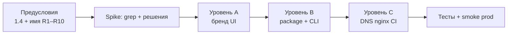

# 1.5 — Переименование приложения (бренд, пакет, домен)

> **Создано:** 2026-05-25 · **Обновлено:** 2026-05-27 · **Версия:** 0.6.0  
> **Статус:** архив — не обновлять под новые задачи; актуально [PLAN.md](../PLAN.md).  
> **ID roadmap:** **1.5** (H1) · [PLAN.md](../PLAN.md#15--cutover-getsyncme)  
> **Статус:** ✅ **Закрыто** (2026-05-27) — **A+B** в коде · **C** cutover на prod  
> **Зависимости:** **1.4** ✅ · **2.1** `/register` ✅ · **3.4** OAuth — разблокирован по домену (см. [3.4-OAUTH-LOGIN.md](../3.4-OAUTH-LOGIN.md))

## Итог cutover (2026-05-27)

| Шаг | Статус |
|-----|--------|
| DNS `getsync.me`, `app.getsync.me` → sirocco | ✅ |
| TLS (certbot) + [`deploy/nginx/getsync.conf`](../../deploy/nginx/getsync.conf) | ✅ |
| `https://getsync.me` / `https://app.getsync.me` — health, login | ✅ |
| Hammerhead webhook + OAuth redirect (Portal + `.env`) | ✅ |
| `getsync.db` на prod | ✅ |
| Resend domain `getsync.me` verified | ✅ (инфра для **2.1e**, не часть 1.5) |

**Отложено (не блокирует 1.5):**

| Шаг | Куда |
|-----|------|
| E2E smoke: поездка → webhook → Garmin | по запросу пользователя |
| 301 `fit.romansegalla.online` → `app.getsync.me` | ✅ 2026-05-27 |
| Лендинг hero/SEO полировка | **2.11** |
| PyPI / trademark check **R2–R3** | по необходимости |

---

## Цель

Сменить рабочее название **fit_sinc** на бренд **GetSync** ([getsync.me](https://getsync.me)) во всех слоях, где имя видно пользователю или влияет на интеграции — без потери данных и с предсказуемым деплоем.

**Не цель:** рефакторинг архитектуры, смена модели tenants, миграция на S3 (**3.3**) — только идентичность и связанные идентификаторы.

---

## Решения до старта (обязательно)

Зафиксировать в начале этого файла (таблица ниже — заполнить перед PR):

| # | Решение | Варианты | Выбрано |
|---|---------|----------|---------|
| R1 | **Публичное имя продукта** (UI, title, email) | FitSync, GetSync, … | **GetSync** |
| R2 | **Slug / CLI** (`fit_sinc` → …) | snake_case | **`getsync`** |
| R3 | **PyPI / package name** | kebab-case | **`get-sync`** |
| R4 | **Домен приложения** | поддомен / один host | **`app.getsync.me`** |
| R5 | **Домен лендинга (canonical)** | … | **`getsync.me`** |
| R6 | **GitHub repo** | переименовать / новый | **`getsync`** — https://github.com/segallar/getsync |
| R7 | **Cookie сессии** | hard cut / dual | **`getsync_session`** + читать `fit_sinc_session` 14 дней |
| R8 | **Файл SQLite** | symlink / rename | **`getsync.db`**; symlink `fit_sinc.db` на prod до миграции |
| R9 | **Системный user / paths на VPS** | полный rename / как есть | **`getsync`, `/opt/getsync`, unit `getsync`** ✅ |
| R10 | **Hammerhead redirect URI** | … | **`https://app.getsync.me/...`** (после **C**) |

**Tagline (черновик):** синхронизация тренировок из разных источников в выбранные сервисы.

**Рекомендация v1:** уровни **A → B → C**; на VPS пути **R9** не трогать в первом релизе; cookie **R7** dual read.

---

## Объём работ (три уровня)

| Уровень | Содержание | Оценка | Когда |
|---------|------------|--------|-------|
| **A — Бренд** | Тексты UI, logo, README, title, health `service`, nginx `auth_basic` message | ½ дня | Сразу после R1 |
| **B — Код** | Package `fit_sinc` → новый модуль, CLI, imports, tests, `pyproject.toml`, cookie, опционально `*.db` | 1 день | После R2–R3 |
| **C — Инфра** | DNS, certbot, nginx `server_name`, systemd unit, GitHub, Hammerhead webhook URL, CI paths | ½–1 день | После R4–R6 |

Уровни можно выпускать **поэтапно** (A → B → C), но OAuth (**3.4**) и публичный **2.1** — только после финального R4.

---

## Инвентарь: где сейчас «fit_sinc»

### Продукт и UI

| Место | Пример |
|-------|--------|
| Шаблоны Jinja | `<title>`, заголовки, «fit_sinc» в activities (колонка sync status) |
| [`assets/logo.svg`](../../assets/logo.svg), [`getsync/web/static/`](../../getsync/web/static/) | icon, favicon |
| [`deploy/www/index.html`](../../deploy/www/index.html) | статический fallback лендинга |
| [`getsync/web/app.py`](../../getsync/web/app.py) | `FastAPI(title="fit_sinc")`, health JSON |

### Код и конфигурация

| Место | Пример |
|-------|--------|
| Пакет Python | каталог [`getsync/`](../../getsync/), все `from getsync...` |
| CLI | [`pyproject.toml`](../../pyproject.toml) → `fit_sinc = getsync.cli:app` |
| Сессия | [`auth.py`](../../getsync/web/auth.py) → `session_cookie="fit_sinc_session"` |
| БД | [`config.py`](../../getsync/config.py) → `data/fit_sinc.db` |
| Логгер | `logging.getLogger("getsync")` |
| Frontend | [`frontend/package.json`](../../frontend/package.json) name (косметика) |

### Деплой и ops

| Место | Пример |
|-------|--------|
| systemd | [`deploy/getsync.service`](../../deploy/getsync.service), user `getsync` |
| nginx app | [`deploy/nginx/fit.conf`](../../deploy/nginx/fit.conf) — `fit.romansegalla.online` |
| nginx landing | [`deploy/nginx/romansegalla.conf`](../../deploy/nginx/romansegalla.conf) |
| CI | [`.github/workflows/`](../../.github/workflows/), [`scripts/ci/deploy.sh`](../../scripts/ci/deploy.sh) |
| VPS | `/opt/getsync`, `.htpasswd_fit_sinc` |
| Hammerhead | `HAMMERHEAD_REDIRECT_URI`, webhook URL на prod |

### Документация

| Файл |
|------|
| [README.md](../../README.md), [PLAN.md](../PLAN.md), [ARCHITECTURE.md](../ARCHITECTURE.md), [CI-CD.md](../CI-CD.md), [UI.md](../UI.md), API_*.md |

---

## Порядок выполнения



### Этап 0 — Предусловия

- [x] **1.4** выполнен: вход по session, Basic Auth снят.
- [x] Таблица решений **R1–R10** — **GetSync** + **getsync.me** (2026-05-26).
- [x] Домен **getsync.me** — регистрация в GoDaddy.
- [x] **DNS (GoDaddy):** NS `ns37` / `ns38` — [CI-CD.md](../CI-CD.md#dns-и-домены)
- [x] A `@` и `app` → `134.209.133.187`
- [x] nginx [`getsync.conf`](../../deploy/nginx/getsync.conf) + certbot на sirocco
- [x] Hammerhead webhook / OAuth URI на `app.getsync.me`
- [ ] Проверить PyPI / trademark для `getsync` / `get-sync` (**R2–R3**) — опционально

### Этап 1 — Spike (½ вечера)

- [x] Сценарий: **A+B+C** (выполнен).
- [x] План отката зафиксирован в § «Риски и откат» (при необходимости).

### Этап 2 — Уровень A (бренд)

- [x] Новое имя и tagline в шаблонах: login, dashboard, layouts, forbidden, admin.
- [x] Logo / favicon (aria-label GetSync; SVG без смены графики).
- [x] README, PLAN (ссылки) — пользовательские названия GetSync.
- [x] `FastAPI` title, `/health` → `service: getsync`, version `0.5.0`.
- [ ] Лендинг **2.11**: hero с финальным именем (согласовать с [PLAN.md § 2.11](../PLAN.md#211--лендинг)).

**Критерий готовности:** пользователь в браузере не видит «fit_sinc»; CLI и URL могут быть старыми.

### Этап 3 — Уровень B (код)

**Вариант B1 — полный rename пакета (рекомендуется до OAuth):**

- [x] Каталог пакета `getsync/` (бывший `fit_sinc/`).
- [x] Массовая замена imports в `tests/`, `scripts/`.
- [x] `pyproject.toml`: `get-sync`, `getsync` + CLI `getsync` CLI.
- [x] Старый пакет удалён (`git mv`).
- [x] Cookie: `getsync_session` + читать `fit_sinc_session` (`legacy_session.py`).
- [x] `getsync.db` на prod (файл `data/getsync.db`, без symlink legacy).

**Вариант B2 — только алиас CLI (не рекомендуется долго):**

- [ ] Новая команда `getsync` → тот же `cli:app`; `fit_sinc` deprecated warning.

**Критерий готовности:** `python -m unittest discover -s tests` зелёный; `getsync --help` работает.

### Этап 4 — Уровень C (инфра)

- [x] certbot: `getsync.me`, `app.getsync.me`; nginx — [`deploy/nginx/getsync.conf`](../../deploy/nginx/getsync.conf)
- [x] nginx: 301 с `fit.romansegalla.online` → `app.getsync.me` (2026-05-27, [`deploy/nginx/fit.conf`](../../deploy/nginx/fit.conf))
- [x] systemd: `getsync.service`, `/opt/getsync`, user `getsync` (**R9**)
- [x] GitHub: **`segallar/getsync`**; remote и badges в README
- [x] Hammerhead Developer: redirect URI, webhook URL
- [x] GitHub Actions / deploy.sh: rsync на sirocco
- [x] `.env` на prod: `HAMMERHEAD_WEB_REDIRECT_URI`, Resend/mail (опционально)

**Критерий готовности:** deploy из `main` на prod; smoke login + webhook — ✅ (E2E ride — отложено).

### Этап 5 — QA и cutover

| Проверка | Как |
|----------|-----|
| Локально | venv, login, dashboard, admin, webhook HMAC test |
| CI | `test.yml` green |
| Prod | `/health`, `/app/login`, sync webhook, `garmin status` для tenant |
| Сессии | Старый cookie → re-login или авто-принятие (по R7) |
| SEO | canonical / OG на лендинге (**2.11.3**) |

**Окно обслуживания:** 15–30 мин — `systemctl stop`, rsync/deploy, migrate db filename, `systemctl start`, smoke.

---

## Cookie и сессии (детально)

Текущее: `fit_sinc_session`, ключ `user_id` в Starlette session.

| Стратегия | Плюсы | Минусы |
|-----------|-------|--------|
| **Hard cut** | Просто | Все разлогинены |
| **Dual cookie** (7–14 дней) | Плавно для prod | Чуть сложнее middleware |
| **Только rename cookie** | Минимум кода | Старое имя в DevTools |

**Рекомендация:** dual read в `install_sessions` / `user_context_from_session` одну версию, write только новое имя; убрать чтение старого в следующем релизе.

---

## Домены (целевые схемы)

### Целевая схема — GetSync (утверждено)

```text
getsync.me                 → лендинг (GET /), SEO, login CTA
app.getsync.me             → /app/*, /webhooks/*, /health, /static
```

**Домены:**

| Домен | Роль |
|-------|------|
| **getsync.me** | Canonical — владелец, регистрация 2026-05-26 |
| **app.getsync.me** | Кабинет, webhooks, health |
| fit.romansegalla.online | 301 → app.getsync.me (legacy, ≥6 мес) |
| romansegalla.online | Личный сайт / ссылка в футере; не продукт |

**DNS (вариант A):** регистратор **GoDaddy**, зона **GoDaddy DNS** (`ns37` / `ns38.domaincontrol.com`). A `@` и `app` → sirocco. Пошагово: [CI-CD.md § вариант A](../CI-CD.md#вариант-a--godaddy-dns-основной).

- [x] NS и A-записи по чеклисту CI-CD
- [x] Записи `A` `@`, `app` → `134.209.133.187`
- [x] nginx + certbot на sirocco

### Схема 1 — как сейчас (только бренд, interim)

```text
romansegalla.online          → лендинг (имя продукта в тексте)
fit.romansegalla.online      → /app, /webhooks, /health
```

Меняется только отображаемое имя; URL и сертификаты без изменений.

### Схема 2 — новый поддомен app

```text
romansegalla.online          → лендинг
app.<новый-домен>            → приложение
```

Нужны: DNS, certbot, 301 со старого, обновление Hammerhead.

### Схема 3 — один домен

```text
example.com/                 → лендинг
example.com/app              → кабинет (уже так в приложении)
```

Проверить cookie `Domain`, CORS, разделение static.

---

## Риски и откат

| Риск | Митигация |
|------|-----------|
| Простой sync во время деплоя | Деплой вне пиков; webhook 4xx кратко — HH retry |
| Сломанный OAuth HH | Обновить redirect URI **до** первого login после cutover |
| Потеря сессий | Dual cookie или предупреждение в UI |
| Сломанный CI | Проверить deploy на staging / dry-run rsync |
| Откат | Предыдущий git tag + старый nginx unit + symlink db |

**Откат:** восстановить `/opt/getsync` из бэкапа, `systemctl restart getsync`, вернуть DNS/nginx при смене домена.

---

## Оценка

| Сценарий | Срок |
|----------|------|
| **A только** (имя в UI, домен тот же) | ½ дня |
| **A + B** (бренд + package/CLI, домен тот же) | 1–1½ дня |
| **A + B + C** (смена домена и prod cutover) | 2–2½ дня |

---

## Связь с другими задачами

| ID | Связь |
|----|--------|
| **1.4** | Снять Basic Auth до публичного бренда на том же URL |
| **2.10** | Дизайн-система — лучше после **R1** (финальные цвета/wordmark) |
| **2.11** | Лендинг hero/SEO — после **R1**; полный **2.11.2** после **A** |
| **2.1** | `/register` — redirect URI и тексты «Создать аккаунт в …» |
| **3.4** | OAuth — `redirect_uri` фиксируется после **R4** |

---

## TODO (чеклист 1.5)

- [x] Заполнить решения **R1–R10** (GetSync, getsync.me)
- [x] Этап 0: предусловия
- [x] Этап 1: spike — сценарий A+B+C
- [x] Этап 2: уровень A (бренд; лендинг polish → **2.11**)
- [x] Этап 3: уровень B (код)
- [x] Этап 4: уровень C (инфра; legacy 301 ✅)
- [x] Этап 5: QA + cutover (браузер, webhook, OAuth; ride E2E — отложено)
- [x] [PLAN.md](../PLAN.md): **1.5** ✅

---

## История

| Дата | Изменение |
|------|-----------|
| 2026-05-25 | Первый план (отделён от PLAN.md) |
| 2026-05-26 | Утверждены **GetSync**, canonical **getsync.me** / **app.getsync.me** |
| 2026-05-26 | DNS: GoDaddy — [CI-CD.md](../CI-CD.md#dns-и-домены) |
| 2026-05-27 | **1.5 C закрыт:** DNS, certbot, nginx, HH webhook/OAuth, prod URLs |
