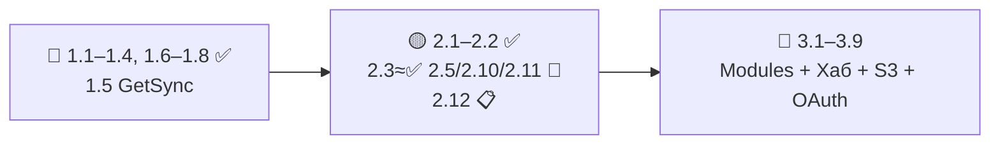
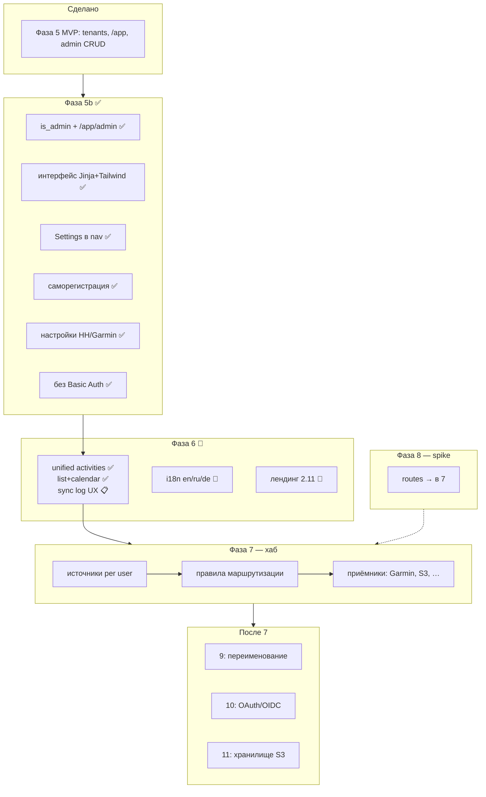
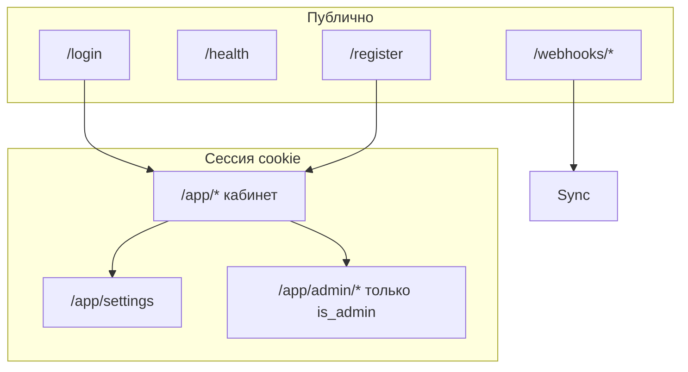
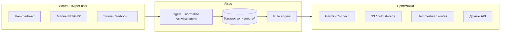
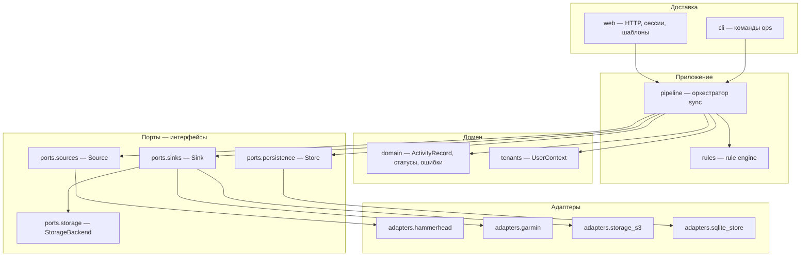

# Roadmap GetSync — архив (до рефакторинга 2026-05-26)

> **Создано:** 2026-05-25 · **Обновлено:** 2026-05-26 · **Версия:** 0.6.0  
> **Статус:** архив — не обновлять под новые задачи; актуально [PLAN.md](../PLAN.md).  
> **Не использовать как актуальный roadmap.** Открытые задачи и приоритеты — в [PLAN.md](../PLAN.md).  
> Этот файл сохранён для истории фаз 0–5, 5b и детальных чеклистов «что сделано».

---

# Roadmap GetSync (архивная копия)

> **Статус (2026-05-26):** MVP (фазы 0–5) в production на sirocco. **Горизонт 1:** почти закрыт (**1.5 C** 🔄). **Горизонт 2:** **2.1–2.2** ✅ · **2.3** почти ✅ (остался UX sync log) · **2.5** / **2.10** / **2.11** 🔄 · **2.12** 📋. Сводка — [легенда](#легенда-статусов), [реестр](#реестр-задач), [снимок кабинета](#снимок-кабинета-app-2026-05).  
> Продукт: **GetSync** / CLI `**getsync`** · i18n EN default (RU/DE) · **~117** тестов · подвал version/commit/deploy/UTC.

**Текущее состояние:** [README](../../README.md) · [ARCHITECTURE.md](../ARCHITECTURE.md) · [docs/README.md](../README.md)  
**Операции:** [CI-CD.md](../CI-CD.md) · [API Hammerhead](../API_HAMMERHEAD.md) · [API Garmin](../API_GARMIN.md)

**Репозиторий:** [https://github.com/segallar/getsync](https://github.com/segallar/getsync)

---

## Идея продукта

**Целевой продукт** — **GetSync** ([getsync.me](https://getsync.me), [1.5](1.5-RENAME.md)); пакет `**getsync`** — **единый хаб для спортивных активностей**:


| Направление       | Содержание                                                                                                                    |
| ----------------- | ----------------------------------------------------------------------------------------------------------------------------- |
| **Сбор**          | Подключение **источников**: велокомпьютеры и облака (Hammerhead, Strava, Wahoo, …), webhook и backfill, ручной импорт FIT/GPX |
| **Хранение**      | Каталог активностей (и маршрутов) per user: метаданные в БД, файлы локально → объектное хранилище (**11**)                    |
| **Анализ**        | Кабинет: список, календарь, фильтры, статусы доставки, лог синхронизации; обзор без привязки к одному вендору                 |
| **Синхронизация** | **Приёмники** по **правилам** пользователя: Garmin Connect, другие API, архив, повторная отправка при ошибках                 |


```text
Источники ──► Ingest / нормализация ──► Каталог + хранилище ──► Анализ в UI
                                              │
                                              └──► Правила ──► Приёмники (сервисы)
```

**Сейчас в production (MVP):** один срез цепочки — **Hammerhead Karoo → Garmin Connect** (webhook, FIT, upload). Остальное — roadmap: [фаза 7](#фаза-7-хаб-активностей-источники--правила--приёмники), [11](#фаза-11-хранение-активностей-объектное-хранилище), [модульность 3.9](#модульная-архитектура-39).

**Не в фокусе продукта:** замена TrainingPeaks/Intervals.icu как тренировочный планировщик; полноценная соцсеть. Приоритет — **надёжный ingest + доставка + прозрачный статус** для своих данных.

---

## Прогресс


| Фаза                                                                | Статус                                                                                              |
| ------------------------------------------------------------------- | --------------------------------------------------------------------------------------------------- |
| 0a–0c DevOps (sirocco, certbot, nginx)                              | ✅                                                                                                   |
| 0d getsync deploy (stub, systemd, HTTPS)                            | ✅                                                                                                   |
| 1 Hammerhead OAuth + Garmin auth                                    | ✅                                                                                                   |
| 2 Sync core + webhook sync + UI                                     | ✅                                                                                                   |
| 3 Garmin upload (web JWT, browser, fallback)                        | ✅ код / ⚠️ ops на сервере                                                                           |
| 4 CI (GitHub Actions test + deploy main)                            | ✅                                                                                                   |
| 5 Мультипользовательность (tenants, `/admin`, `/app`)               | ✅ MVP                                                                                               |
| **5b** Единый кабинет, регистрация, настройки, без Basic Auth       | **1.1–1.4**, **1.6–1.8** ✅ · **2.1** ✅ · **2.2** ✅ · **2.1e** email · **1.5 C** 🔄                  |
| **UI** Новый интерфейс приложения (Jinja2 + Tailwind)               | ✅                                                                                                   |
| **Design** Проектирование и улучшение UI/UX (дизайн-система)        | 🔄 **2.10** (tokens + `.getsync-app` ✅ · редизайн экранов 📋)                                       |
| **Site** Главная [romansegalla.online](https://romansegalla.online) | 🔄 **2.11** (hero/benefits/FAQ/i18n ✅ · SEO/скрины 📋)                                              |
| **Security** Тесты доступа (session auth, страницы и API)           | ✅ **1.1**                                                                                           |
| 6 UI v2 (календарь, поиск, failed)                                  | 🔄 **2.3** (unified activities + календарь ✅ · UX sync log 📋)                                      |
| 6.1 Алерты (Telegram / email)                                       | 📋 **2.4**                                                                                          |
| 6.2 Локализация (i18n)                                              | 🔄 **2.5** (nav/settings/auth/register ✅ · dashboard/activities/admin 📋)                           |
| — Ops: README + тесты CI                                            | ✅ **~117** тестов · `[build_info.py](../getsync/build_info.py)` · legacy cookie · deploy health retry |
| — Каталог + FIT layout                                              | 🔄 local `StorageBackend` ✅ ([STORAGE.md](../STORAGE.md)) · S3 📋 **3.3**                              |
| 7 Хаб активностей: сбор, хранение, анализ, sync → сервисы           | 📋 · **2.8–2.9** · **3.1**, **3.5**                                                                 |
| **Modularity** Модули и интерфейсы между ними                       | 📋 · **3.9**                                                                                        |
| 8 Маршруты (routes)                                                 | 📋 · **3.2**                                                                                        |
| **9** Переименование → **GetSync** / getsync.me                     | 🔄 **A+B** ✅ · **C** DNS/certbot                                                                    |
| **10** Внешняя авторизация (OAuth/OIDC)                             | 📋 · **3.4**                                                                                        |
| **11** Хранение активностей (объектное хранилище, S3)               | 📋 · **3.3**                                                                                        |


**Горизонты:** [🔴 1.x](#-горизонт-1--срочно-важно-небольшие) · [🟡 2.x](#-горизонт-2--средняя-срочность-и-объём) · [🔵 3.x](#-горизонт-3--далёкое-будущее) · [Реестр](#реестр-задач)

**Нумерация:** `{горизонт}.{порядок}` — **1.1**…**1.8** (срочно) · **2.1**…**2.12** (средний) · **3.1**…**3.9** (далеко). Старые метки фаз (5b.4, 7.0) сохранены в скобках.

### Легенда статусов


| Маркер | Значение                                                                     |
| ------ | ---------------------------------------------------------------------------- |
| ✅      | **Сделано** — в коде, покрыто тестами или задеплоено; критерий задачи закрыт |
| 🔄     | **Начато** — есть рабочие части; в реестре перечислено «готово / осталось»   |
| 📋     | **Не начато** — только план, нет существенного кода                          |


---

## Приоритеты: три горизонта

> Сводка всего открытого roadmap. Детали фаз — ниже по документу; чеклисты — в [TODO](#todo). ID задачи = колонка **ID** в таблицах ниже.

### Реестр задач


| ID       | Фаза       | Кратко                                                     | Статус                                          |
| -------- | ---------- | ---------------------------------------------------------- | ----------------------------------------------- |
| **1.1**  | Security   | Тесты session auth, tenant, webhook HMAC                   | ✅                                               |
| **1.2**  | 5b.4       | `/app/settings` — профиль, пароль, HH OAuth, Garmin status | ✅                                               |
| **1.3**  | 5b.2       | Пункт Settings в nav                                       | ✅                                               |
| **1.4**  | 5b.5       | Снять nginx Basic Auth                                     | ✅                                               |
| **1.5**  | 9          | **GetSync** — [1.5-RENAME.md](1.5-RENAME.md)               | A+B ✅ · **C** 🔄                                |
| **1.6**  | Docs       | ARCHITECTURE: `data/users/{id}/`                           | ✅                                               |
| **1.7**  | Ops        | Даты в UI по `users.timezone`                              | ✅                                               |
| **1.8**  | 6 мин      | Баннер HH + Garmin на дашборде                             | ✅                                               |
| **2.1**  | 5b.3       | `/register` + `REGISTRATION_OPEN`, rate limit              | ✅ · **2.1e** [2.1e-EMAIL.md](../2.1e-EMAIL.md) 📋  |
| **2.2**  | 5b.6       | Тесты register / settings / admin                          | ✅                                               |
| **2.3**  | 6          | Календарь, поиск, failed, sync log                         | 🔄 · activities/calendar ✅ · sync log UX 📋     |
| **2.4**  | 6.1        | Telegram-алерты                                            | 📋                                              |
| **2.5**  | 6.2        | i18n `en`/`ru`/`de`, `users.locale`                        | 🔄                                              |
| **2.6**  | 5b.3+      | Email confirm, invite, captcha, onboarding                 | 📋                                              |
| **2.7**  | 5b.4+      | Settings: источники / приёмники / правила                  | 📋                                              |
| **2.8**  | 7.0        | Spike ActivityRecord, Source/Sink                          | 📋                                              |
| **2.9**  | 7.3        | Manual FIT upload                                          | 📋                                              |
| **2.10** | Design     | Дизайн-система, UX, визуал кабинета                        | 🔄                                              |
| **2.11** | Site       | Лендинг romansegalla.online                                | 🔄                                              |
| **2.12** | Ops        | Первичный Garmin login в UI                                | 🔄 вместе с **2.10.2** — [APP-UI.md](../APP-UI.md) |
| **3.1**  | 7.1–7.2    | Rule engine, реестр в БД                                   | 📋                                              |
| **3.2**  | 7.4, 8     | Маршруты, Garmin courses spike                             | 📋                                              |
| **3.3**  | 11         | S3 / StorageBackend                                        | 📋                                              |
| **3.4**  | 10         | OAuth/OIDC (Google, …)                                     | 📋                                              |
| **3.5**  | 7          | Полный хаб (Strava, архив, …)                              | 📋                                              |
| **3.6**  | 6.2+       | Доп. языки, docs/CLI                                       | 🔄 (DE на лендинге/профиле)                     |
| **3.7**  | 10+        | SAML/LDAP enterprise                                       | 📋                                              |
| **3.8**  | Ops        | Email-алерты, очередь Playwright                           | 📋                                              |
| **3.9**  | Modularity | Модули, контракты, границы слоёв                           | 📋                                              |


**2.3** — что уже есть / что осталось


| Часть                                                    | Статус                                                                    |
| -------------------------------------------------------- | ------------------------------------------------------------------------- |
| **Activities** — единый список HH+Garmin, `source` колонка | ✅ `[browse.py](../getsync/activities/browse.py)` · upsert в SQLite при browse |
| Вкладки **List \| Calendar** на `/app/activities`        | ✅ `view=list\|calendar` · `[calendar.py](../getsync/activities/calendar.py)` |
| Календарь месяца (SQLite, TZ user, клик дня → list)      | ✅ `[activity_calendar.html](../getsync/web/templates/components/activity_calendar.html)` |
| Поиск `q`, фильтры `date_from`/`date_to`, status, source | ✅ `[activities.html](../getsync/web/templates/pages/app/activities.html)` |
| Re-sync / bulk retry errors                              | ✅ activities (+ summary на dashboard)                                    |
| Dashboard: sync summary + **sync log** внизу страницы    | ✅ `[sync_log_section.html](../getsync/web/templates/components/sync_log_section.html)` |
| Legacy `/app/log` → dashboard `#sync-log`                | ✅ redirect                                                               |
| Garmin session monitor в **Settings** `#garmin-session`    | ✅ · `/app/session` → redirect                                            |
| Nav: Activities, Dashboard, Settings (без log/session)     | ✅ `[cabinet.py](../getsync/web/cabinet.py)`                               |
| Connections HH/Garmin в Settings                         | ✅ [CONNECTIONS.md](../CONNECTIONS.md) · legacy banner dashboard снят |
| UX sync log (duplicate vs error, фильтры в UI)           | 📋                                                                        |
| Календарь v6.1: дни «только в облаке» (не в SQLite)      | 📋 опционально, кнопка «обновить месяц»                                 |


**2.5** — что уже есть / что осталось


| Часть                                           | Статус                                                       |
| ----------------------------------------------- | ------------------------------------------------------------ |
| `users.locale`, миграция, admin form            | ✅ `[store.py](../getsync/state/store.py)`                    |
| Nav, settings, flash                            | ✅ `[app_i18n.py](../getsync/web/app_i18n.py)` + `cabinet.py` |
| Login / register (en/ru/de)                     | ✅ `auth_strings`, `register_strings`                         |
| Лендинг EN/RU/DE                                | ✅ `[site_i18n.py](../getsync/web/site_i18n.py)`              |
| Dashboard, activities (list+calendar), sync log, connections | 📋 (строки в шаблонах EN)                        |
| Переключатель языка в шапке кабинета            | 📋 (только settings + cookie при signup)                     |


**2.10 / 2.11** — что уже есть / что осталось


| ID       | Готово                                                                               | Осталось                                          |
| -------- | ------------------------------------------------------------------------------------ | ------------------------------------------------- |
| **2.10** | `[tokens.css](../getsync/web/static/tokens.css)`, `.getsync-app`, [design/](../design/) | **2.10.2–2.10.3**: визуал экранов, admin, a11y    |
| **2.11** | **2.11.0–2.11.2**: hero, benefits, FAQ, CTA, EN/RU/DE, `layouts/site.html`           | **2.11.3** SEO/OG · **2.11.4** скриншоты кабинета |


**1.5 C** — инфра getsync.me


| Часть                                                              | Статус         |
| ------------------------------------------------------------------ | -------------- |
| Код A+B (пакет `getsync`, cookie dual read)                        | ✅              |
| `[deploy/nginx/getsync.conf](../deploy/nginx/getsync.conf)` в репо | ✅              |
| DNS A-записи, certbot на sirocco, Hammerhead redirect              | 📋             |
| Prod на `romansegalla.online` / `fit.romansegalla.online`          | ✅ (до cutover) |


### Снимок кабинета /app (2026-05)

> Зафиксированная IA после волны **2.3** (unified activities + calendar). Спека экранов — [APP-UI.md](../APP-UI.md).

| Экран | URL | Назначение |
| ----- | --- | ---------- |
| **Activities** | `/app/activities` | Главный экран: вкладки **List** / **Calendar**; HH+Garmin в одной таблице; `source` — колонка и фильтр |
| **Dashboard** | `/app/` | Сводка sync (counts), ссылка на activities, **sync log** внизу (`#sync-log`) |
| **Settings** | `/app/settings` | Профиль, locale/TZ, пароль; **Connections** (sources/destinations); **Garmin session** (`#garmin-session`) |
| **Admin** | `/app/admin/` | Users CRUD (подменю Statistics/Logs — 📋) |

**Редиректы (legacy):** `/app/log` → `/?#sync-log` · `/app/session` → `/settings#garmin-session`.

**Данные:**

```text
Browse (HH/Garmin API) ──► persist_browse_rows() ──► SQLite activities (PK user_id, source, activity_id)
Calendar ◄── aggregate по activity_date в TZ пользователя (только каталог SQLite)
Sync ──► ActivityStorage.put_fit() + storage_key (local; S3 — 3.3)
```

**Документация:** [CONNECTIONS.md](../CONNECTIONS.md) · [STORAGE.md](../STORAGE.md) · [ARCHITECTURE.md](../ARCHITECTURE.md).


### 🔴 Горизонт 1 — срочно, важно, небольшие

**Зачем:** можно нормально пользоваться prod без CLI и без двойного входа; не сломать безопасность при снятии nginx Basic Auth.

**Критерий:** до ~2 вечеров на пункт (**1.5** — до 2 дней, только после утверждения имени); блокирует эксплуатацию, деплой или публичный запуск.


| ID      | Задача                                                                                                   | Оценка           | Зависимости                        |
| ------- | -------------------------------------------------------------------------------------------------------- | ---------------- | ---------------------------------- |
| **1.1** | **[Security](#security-тесты-доступа-session-auth):** тесты session auth, tenant isolation, webhook HMAC | ✅                | 5b.1 ✅                             |
| **1.2** | **5b.4:** `/app/settings` — профиль, смена пароля, Hammerhead OAuth, Garmin status/refresh               | ✅                | UI ✅; первичный Garmin login — CLI |
| **1.3** | **5b.2:** пункт **Settings** в nav → `/app/settings`                                                     | ✅                | UI ✅                               |
| **1.4** | **5b.5:** снять nginx Basic Auth; `SESSION_SECRET`, `https_only` cookie                                  | ✅                | **1.1**                            |
| **1.5** | **9:** **GetSync** — бренд, `getsync` package, **getsync.me** ([план](1.5-RENAME.md))                    | A+B ✅ · **C** 🔄 | **1.4**; DNS ready                 |
| **1.6** | **Docs:** ARCHITECTURE — `data/users/{id}/`, без глобального `garmin_web`                                | ✅                | —                                  |
| **1.7** | **Ops:** даты в UI в `users.timezone` (убрать хардкод MSK в подписях)                                    | ✅                | **1.2**                            |
| **1.8** | **6 (мин):** баннер HH + Garmin `upload_ready` / TTL JWT на дашборде                                     | ✅                | **1.2**                            |


**Порядок выполнения:** **1.1** → **1.2**+**1.3** → **1.4** → **1.5** (сразу, если имя готово) → **1.7**–**1.8** параллельно → **1.6**.

**MVP «можно жить»:** **1.1**–**1.4**, **1.7**–**1.8**, **2.1** ✅ (кабинет + settings + `/register` при `REGISTRATION_OPEN=true`). До публичного **getsync.me** — **1.5 C**; до OAuth — **3.4**.

---

### 🟡 Горизонт 2 — средняя срочность и объём

**Зачем:** удобство кабинета, онбординг пользователей, наблюдаемость; подготовка к архитектуре хаба без полного рефакторинга.

**Критерий:** от ~1 вечера до ~1–2 недель; не блокирует sync, но заметно улучшает продукт.


| ID       | Задача                                                              | Оценка                                   |
| -------- | ------------------------------------------------------------------- | ---------------------------------------- |
| **2.1**  | **5b.3:** `/register` + `REGISTRATION_OPEN`, rate limit, auto-login | ✅                                        |
| **2.2**  | **5b.6:** функциональные тесты register / settings / admin forms    | ✅                                        |
| **2.3**  | **6:** календарь + поиск + failed + sync log                        | 🔄 · list/calendar/каталог ✅ · sync log UX 📋 |
| **2.4**  | **6.1:** Telegram-алерты при ошибках sync                           | 📋                                       |
| **2.5**  | **6.2:** i18n, весь кабинет                                         | 🔄 · nav/settings/auth ✅ · экраны 📋     |
| **2.6**  | **5b.3+:** email confirm, invite, captcha, onboarding               | 📋                                       |
| **2.7**  | **5b.4+:** settings — заглушки «Источники / Приёмники / Правила»    | 📋                                       |
| **2.8**  | **7.0:** spike `ActivityRecord`, Source/Sink                        | 📋                                       |
| **2.9**  | **7.3:** manual FIT upload                                          | 📋                                       |
| **2.10** | **[Design](#дизайн-uiux-210):** дизайн-система, визуал              | 🔄 · tokens + shell ✅ · экраны 📋        |
| **2.11** | **[Site](#главная-romansegallaonline-211):** лендинг                | 🔄 · **2.11.0–2.11.2** ✅ · SEO/скрины 📋 |
| **2.12** | Первичный **Garmin login** в UI                                     | 📋                                       |


**Порядок (рекомендация):** ~~2.1 → 2.2 → 2.3 (list+calendar)~~ ✅ → **1.5 C** → **2.10.1** → **2.11.3–2.11.4** → **2.3** (sync log UX) → **2.5** → **2.12** → **2.4** → **2.6**–**2.7** → **2.8** → **2.9**.

---

### 🔵 Горизонт 3 — далёкое будущее

**Зачем:** новая архитектура продукта, новые интеграции и масштаб; делать после стабильного кабинета (**горизонты 1–2**).

**Критерий:** крупный рефакторинг, исследования API, зависимость от spike.


| ID      | Задача                                                                                                   | Оценка     |
| ------- | -------------------------------------------------------------------------------------------------------- | ---------- |
| **3.1** | **7.1–7.2:** реестр источников/приёмников, rule engine, лог доставки                                     | ~1 неделя  |
| **3.2** | **7.4 + 8:** маршруты в хабе; spike Garmin courses; HH `route:write`                                     | 1–2 недели |
| **3.3** | **11:** хранилище S3 (`StorageBackend`, миграция FIT, signed URL)                                        | 3–5 дней   |
| **3.4** | **10:** внешняя авторизация OAuth/OIDC (Google, Apple, GitHub)                                           | 2–3 вечера |
| **3.5** | **7:** полный хаб — Strava/Wahoo, импорт архива, сложные правила                                         | 2–3 недели |
| **3.6** | **6.2+:** языки `de`, `fr`, …; полный перевод docs/CLI                                                   | по запросу |
| **3.7** | **10+:** SAML/LDAP, enterprise                                                                           | вне scope  |
| **3.8** | **Ops:** email-алерты, очередь Playwright при многих tenants                                             | post-5b    |
| **3.9** | **[Modularity](#модульная-архитектура-39):** разбить на модули, описать интерфейсы, правила зависимостей | 1–2 недели |


**Порядок (рекомендация):** **2.8** → **3.9** (схема модулей и контракты) → **3.1** → **3.3** (параллельно) → **3.2** → **3.5**; **3.4** после **1.5**; **3.6**–**3.8** по запросу.




---

## Roadmap v2

> Ниже — детализация [идеи продукта](#идея-продукта) по фазам. Порядок работ см. [три горизонта](#приоритеты-три-горизонта).

**Актуальный порядок:** см. [три горизонта](#приоритеты-три-горизонта) и [реестр](#реестр-задач). Кратко: **1.5 C** → **2.10.1** + **2.11** → **2.3** (sync log UX) → **2.5** + **2.12** → **2.7** (connections/rules) → **3.3** (S3) / **2.8** → **3.9** → хаб **3.1**+.




### Фаза 5: Мультипользовательность (MVP) — ✅

**Сделано (2026-05):** `user_id` в БД и sync; `data/users/{id}/`; webhook → tenant; `/app/login` + кабинет; CRUD users (сейчас `/app/admin`); сессии cookie; CLI `--user`.

**Ограничения MVP (ещё открыты):**

- ~~nginx Basic Auth~~ — снят (**1.4** ✅)
- ~~`/app/settings`~~ — есть (**1.2** ✅): профиль, пароль, Hammerhead OAuth; Garmin status/refresh/disconnect; **первичный** Garmin — CLI (`garmin login`)
- ~~Settings в nav, TZ в UI, баннер HH/Garmin~~ — **1.3**, **1.7**, **1.8** ✅
- ~~Нет `/register~~` — **2.1** ✅ ([2.1-REGISTER.md](../2.1-REGISTER.md))
- Публичный **getsync.me** на prod — **1.5 C** 🔄 (код и **A+B** ✅)

**Уже сделано в 5b.1:** один логин; админка `/app/admin/`* по `users.is_admin`; legacy `/admin/`* → 301; `ADMIN_PASSWORD` убран.

Ниже — **целевая** модель Phase 5 (частично уже в коде); детальный план доработки — **Фаза 5b**.

#### Две зоны доступа (целевая, после 5b)


| Зона                      | URL                      | Кто                    | Auth                         |
| ------------------------- | ------------------------ | ---------------------- | ---------------------------- |
| **Публичное API**         | `/webhooks/`*, `/health` | Hammerhead, мониторинг | HMAC / без auth              |
| **Публичный UI**          | `/login`, `/register`    | Гость                  | —                            |
| **Кабинет**               | `/app/`*                 | Владелец аккаунта      | Сессия (email + password)    |
| **Админ внутри кабинета** | `/app/admin/`*           | `users.is_admin = 1`   | та же сессия + проверка роли |

> **Устарело:** отдельный `/admin/login` и nginx `auth_basic` на `/` — убираем в 5b.

#### nginx (целевая схема, после 5b)

```
/webhooks/     → без auth
/health        → без auth
/              → proxy в FastAPI (только сессия приложения)
```

#### Роли (целевая, после 5b)


| Роль      | Права                                                                                                                          |
| --------- | ------------------------------------------------------------------------------------------------------------------------------ |
| **admin** | Пункты меню **Admin** в том же `/app`: users CRUD, disable, promote admin, логи по всем; **не** видит пароли Garmin/Hammerhead |
| **user**  | Свой кабинет, **Настройки** (профиль, пароль, HH/Garmin connect/disconnect), sync                                              |


#### Профиль пользователя

**После 5b:** пользователь редактирует сам в `/app/settings`; админ — disable, promote, сброс чужого пароля, поддержка `hammerhead_user_id`.


| Поле                 | Назначение                                                                          |
| -------------------- | ----------------------------------------------------------------------------------- |
| `slug`               | URL/id: `/app` после логина, пути в CLI `--user slug`                               |
| `display_name`       | Имя в UI                                                                            |
| `email`              | Логин в кабинет (unique), уведомления (опционально)                                 |
| `telegram`           | `@username` или `chat_id` — алерты об ошибках sync (Phase 6+), контакт для админа   |
| `timezone`           | IANA, напр. `Europe/Moscow`, `Europe/Berlin` — **все даты в кабинете** пользователя |
| `locale`             | **6.2:** язык UI, напр. `ru`, `en` — см. [Фаза 6.2](#фаза-62-локализация-i18nl10n)  |
| `password`           | Регистрация / смена в кабинете; админ может сбросить; в БД только `password_hash`   |
| `is_admin`           | **5b:** флаг в БД; пункты меню Admin только при `is_admin=1`                        |
| `hammerhead_user_id` | Связь с webhook `userId`; заполняется после OAuth Hammerhead в настройках           |
| `disabled`           | Запрет входа и sync (только админ)                                                  |


**Логин в кабинет:** `email` + пароль (сессия cookie, HttpOnly). Telegram — не замена пароля на старте, а канал связи и push-уведомлений.

**Часовой пояс:** отображение в TZ пользователя ✅ **1.7** (`[timeutil.py](../getsync/timeutil.py)`); UTC в SQLite как сейчас.

#### Модель данных

```text
users(
  id TEXT PK,              -- uuid или slug
  slug TEXT UNIQUE,
  display_name TEXT,
  email TEXT UNIQUE,
  telegram TEXT,           -- nullable
  timezone TEXT NOT NULL DEFAULT 'Europe/Moscow',
  locale TEXT NOT NULL DEFAULT 'en',   -- 6.2: BCP 47 en, ru, de
  hammerhead_user_id TEXT UNIQUE,
  password_hash TEXT NOT NULL,
  is_admin INTEGER DEFAULT 0,   -- 5b
  created_at, updated_at,
  disabled INTEGER DEFAULT 0
)

activities(user_id, activity_id, …)   -- PK (user_id, activity_id)
sync_events(user_id, …)
session_refresh_events(user_id, …)

data/users/{id}/
  hammerhead_tokens.json
  garth/
  garmin_web/
  fits/
```

Отдельная таблица `user_credentials` не нужна, если hash в `users`.

**Webhook:** `userId` из payload → `users.hammerhead_user_id` → `sync_activity(..., user_id=…)`.

**Миграция v1:** один пользователь `default` из текущего `tokens.user_id` + перенос `data/`* → `data/users/default/`.

#### CLI

```bash
getsync user create roman --hammerhead-user-id 192184
getsync user list
getsync --user roman hammerhead auth
getsync --user roman garmin login
getsync --user roman sync --since 2025-01-01
```

#### Админка (`/app/admin/*` — ✅ с 5b.1; legacy `/admin` → 301)


| Страница        | Действия                                                                             |
| --------------- | ------------------------------------------------------------------------------------ |
| **Users**       | Таблица: имя, email, Telegram, TZ, HH id, HH/Garmin status, последний sync, disabled |
| **User → New**  | Форма (при закрытой регистрации); иначе только promote/disable                       |
| **User → Edit** | disable/enable, promote admin, сброс пароля, правка HH id (поддержка)                |
| **User → Log**  | sync_events / session_refresh по `user_id`                                           |
| **System**      | версия, health, сводка `upload_ready` по пользователям                               |


В **5b** те же страницы под `/app/admin/`*, пункты меню **Admin** видны только `is_admin`.

#### Кабинет `/app` (MVP + 5b — ✅)

- `GET/POST /app/login` — email + password ✅
- `GET/POST /register` — саморегистрация (`REGISTRATION_OPEN`) ✅ **2.1**
- **Activities** (list + calendar, unified sources), dashboard (summary + sync log), settings (profile + connections + Garmin session) ✅
- Legacy `/app/log`, `/app/session` — redirect ✅
- `/app/settings` — профиль, locale, пароль, connections ✅ **1.2** · [CONNECTIONS.md](../CONNECTIONS.md)

Позже (6.1): Telegram bot для алертов (`/start` → `chat_id`).

---

### UI: Новый интерфейс приложения

> **Отдельный пункт roadmap** — визуальный слой и шаблоны, не путать с **Фазой 6** (календарь, баннер, failed).

**Цель:** единый современный интерфейс для `/app` и `/app/admin` вместо v1 (`html.py` + inline `BASE_CSS`).

**Сделано (2026-05):**


| Элемент                                                                                        | Статус                                                    |
| ---------------------------------------------------------------------------------------------- | --------------------------------------------------------- |
| Jinja2 layouts: `cabinet.html`, `auth.html`, `base.html`                                       | ✅                                                         |
| Tailwind `app.css` (сборка из `frontend/`)                                                     | ✅                                                         |
| Страницы: login, dashboard, activities (list+calendar), **settings**, admin                    | ✅ · log/session → redirect                                |
| `/register`, лендинг `layouts/site.html`                                                       | ✅                                                         |
| Admin: users, user form                                                                        | ✅                                                         |
| Компоненты: user bar, nav, pager, re-sync, timezone/locale select, status badges, build footer | ✅                                                         |
| Legacy cookie `fit_sinc_session` → `getsync_session`                                           | ✅ `[legacy_session.py](../getsync/web/legacy_session.py)` |
| Удалены: `ui_v2.py`, `/ui-preview`, `H.page()` / `BASE_CSS`                                    | ✅                                                         |
| `html.py` — только форматтеры (`esc`, `fmt`_*)                                                 | ✅                                                         |


**Остаток (не блокирует UI, идёт в 5b):**


| Элемент                                    | Фаза                                        |
| ------------------------------------------ | ------------------------------------------- |
| Пункт **Settings** в nav → `/app/settings` | ✅ **1.3**                                   |
| Баннер HH/Garmin                           | ✅ **1.8**                                   |
| Unified activities + календарь + re-sync   | ✅ **2.3** (sync log UX 📋)                  |
| Дизайн-система, визуал                     | 🔄 **[2.10](#дизайн-uiux-210)**             |
| i18n кабинета                              | 🔄 **[2.5](#фаза-62-локализация-i18nl10n)** |


**Документация:** [UI.md](../UI.md) · коммит `feat(web): мигрировать UI на Jinja2 и Tailwind`.

---

### Дизайн UI/UX (2.10)

> **Крупная задача** (🟡 горизонт 2). Базовая вёрстка есть ([UI](#ui-новый-интерфейс-приложения) ✅); цель — осмысленный продуктовый дизайн, а не только «Tailwind по умолчанию».

**Зачем:** единый визуальный язык, понятные сценарии (login → settings → sync), доверие к продукту; подготовка к **1.5** (бренд) и публичному **2.1**.

**Сейчас:** Jinja2 + Bootstrap 5; общие tokens (`[tokens.css](../getsync/web/static/tokens.css)`); кабинет — shell `.getsync-app` (`[design/README.md](../design/README.md)`); визуальный редизайн экранов — 📋 **2.10.2**.

**Целевые артефакты:**


| Артефакт                    | Содержание                                                                                                                                          |
| --------------------------- | --------------------------------------------------------------------------------------------------------------------------------------------------- |
| **UX-аудит**                | Карта экранов `/app`, `/app/admin`, auth; боли (двойной вход до **1.4**, статусы sync, settings)                                                    |
| **Дизайн-система**          | Цвета, типографика, spacing, радиусы, тени; статусы synced/error/pending; тёмная тема — опционально v2                                              |
| **Компоненты**              | Кнопки, формы, таблицы, баннеры, badges, nav — в `frontend/` → `app.css`                                                                            |
| **Макеты ключевых экранов** | Login/register, dashboard, activities (list+calendar ✅), settings (**1.2**), admin users; лендинг — **[2.11](#главная-romansegallaonline-211)** |
| **Бренд**                   | Лого, favicon, OG; согласовать с **1.5** (имя и палитра)                                                                                            |
| **Доступность**             | Контраст, focus, labels, `lang` — вместе с **2.5**                                                                                                  |


**Подзадачи:**


| ID         | Содержание                                    | Оценка                                                              |
| ---------- | --------------------------------------------- | ------------------------------------------------------------------- |
| **2.10.0** | Аудит + user flows                            | 🔄 `[docs/design/SCREENS.md](../design/SCREENS.md)`                    |
| **2.10.1** | Design tokens + app shell + компоненты        | 🔄 `[tokens.css](../getsync/web/static/tokens.css)`, `.getsync-app` |
| **2.10.2** | Редизайн dashboard, activities, settings, log | 📋                                                                  |
| **2.10.3** | Admin, mobile, полировка состояний            | 📋                                                                  |


**Зависимости:** [UI](#ui-новый-интерфейс-приложения) ✅; **2.3** list+calendar ✅; визуальная полировка activities/calendar — в **2.10.2**; **1.5** (бренд) желателен до публичного cutover.

**Не в scope v1:** нативное приложение; полный rebrand без **1.5**; иллюстрации/3D.

**Документация:** [APP-UI.md](../APP-UI.md) — единая спецификация страниц `/app`; [UI.md](../UI.md) — стек; [design/](../design/) — индекс файлов.

Лендинг корневого домена — отдельно: **[2.11](#главная-romansegallaonline-211)**.

---

### Главная romansegalla.online (2.11)

> **Крупная задача** (🟡 горизонт 2). Публичная «витрина» на **[https://romansegalla.online/](https://romansegalla.online/)** — не путать с кабинетом `/app` (сейчас тот же uvicorn, разные `server_name` в nginx).

**Зачем:** понятная точка входа для гостей и пользователей продукта GetSync; SEO и доверие; единый домен с формой входа вместо заглушки; опционально блок «обо мне» / другие проекты на romansegalla.online.

**Сейчас (MVP):**


| Элемент                                                                                                                                                                  | Статус                                |
| ------------------------------------------------------------------------------------------------------------------------------------------------------------------------ | ------------------------------------- |
| `GET /` — `[site_routes.py](../getsync/web/site_routes.py)`, `[site_i18n.py](../getsync/web/site_i18n.py)`, `[home.html](../getsync/web/templates/pages/site/home.html)` | ✅ hero, benefits, FAQ, CTA (EN/RU/DE) |
| Блок **Product preview** (скриншоты кабинета)                                                                                                                            | 📋 отключён; см. **2.11.4**           |
| nginx proxy — `[deploy/nginx/romansegalla.conf](../deploy/nginx/romansegalla.conf)`                                                                                      | ✅                                     |
| Статический fallback — `[deploy/www/index.html](../deploy/www/index.html)`                                                                                               | ✅                                     |
| Сессия: залогиненный user → redirect `/app/`                                                                                                                             | ✅                                     |


**Целевая страница (структура):**


| Секция              | Содержание                                                      | Статус |
| ------------------- | --------------------------------------------------------------- | ------ |
| **Hero**            | GetSync, value proposition, CTA login/register (**2.1**)        | ✅      |
| **Benefits**        | Сбор, хранение, синхронизация (широкая аудитория)               | ✅      |
| **FAQ**             | HH+Garmin в prod; остальное — roadmap; pricing free self-hosted | ✅      |
| **Product preview** | Скриншоты dashboard / activities / sync log — **2.11.4**        | 📋     |
| **Вход**            | Ссылки `/app/login`, `/register`                                | ✅      |
| **Футер**           | Health, build meta (version, commit, deploy #, UTC)             | ✅      |
| **SEO**             | `title`, `description`, OG, `canonical`, `lang` — **2.11.3**    | 📋     |
| **i18n**            | EN default; RU/DE в шапке (`getsync_lang`)                      | ✅      |


**Архитектура доменов (целевая):**

```text
romansegalla.online     → лендинг (2.11), публичный /
fit.romansegalla.online → app: /app/*, /webhooks/*, /health (как сейчас)
```

Вариант v1: оба `server_name` → один uvicorn; различие только в nginx и опционально `Host`-aware шаблон. Вариант v2: лендинг — статика в `deploy/www/` или отдельный сервис — только если нужна изоляция.

**Подзадачи:**


| ID         | Содержание                                                                            | Оценка     |
| ---------- | ------------------------------------------------------------------------------------- | ---------- |
| **2.11.0** | Контент и IA: тексты, блоки, CTA; согласовать с **1.5** / **2.10**                    | ✅          |
| **2.11.1** | Макет лендинга (Figma или HTML-prototype); mobile-first                               | ✅ (в коде) |
| **2.11.2** | Вёрстка: `layouts/site.html`, `home.html`, EN/RU, отделить от `auth.html`             | ✅          |
| **2.11.3** | SEO, OG-image, favicon; тесты `GET /`; smoke в [CI-CD.md](../CI-CD.md)                   | 📋         |
| **2.11.4** | Блок **Product preview**: скриншоты кабинета (dashboard, activities, sync log), EN/RU | 📋         |


**Зависимости:** **2.10.1** (tokens) и **1.5** (бренд) — до **2.11.2**; **2.11.4** — после **2.10.2** (актуальные экраны) или временные mockup-скрины; **2.1** — ссылка «Регистрация»; **1.4** — лендинг без Basic Auth (уже так на romansegalla.online).

**Связь с 2.10:** дизайн-система общая; лендинг может использовать отдельный layout `site.html` (маркетинг) vs `cabinet.html` (приложение).

**Не в scope v1:** блог, CMS; личный портфолио на все подстраницы — отдельно по запросу. Лендинг: EN/RU/DE ✅; кабинет app i18n: **2.5** (`en`/`ru`).

---

### Security: тесты доступа (session auth) — **1.1** ✅

> Регрессия авторизации; функциональные тесты settings/register — **2.2** / **5b.6**.

**Цель:** доступ к кабинету, admin и защищённым действиям — **только** с валидной cookie-сессией (`getsync_session` → `user_id` в `auth.py`); публичные эндпоинты остаются открытыми по явным правилам middleware.

**Модель (уже в коде):**


| Зона                        | Без сессии        | Обычный user | `is_admin` |
| --------------------------- | ----------------- | ------------ | ---------- |
| `/app/login`                | ✅                 | ✅            | ✅          |
| `/app/`* (кабинет)          | → `/app/login`    | ✅            | ✅          |
| `/app/admin/`*              | → `/app/login`    | **403**      | ✅          |
| `/`, `/health`, `/static/`* | ✅                 | ✅            | ✅          |
| `/webhooks/`*               | HMAC (не session) | —            | —          |


**Покрыто (`tests/test_app_auth.py`, `tests/test_security_auth.py`):**


| Область                                                                  | Статус |
| ------------------------------------------------------------------------ | ------ |
| login ok / неверный пароль; legacy `/admin/` → 301                       | ✅      |
| GET/POST `/app/`*, `/app/settings`, FIT download — без cookie → redirect | ✅      |
| Admin GET/POST — login / 403                                             | ✅      |
| Невалидная/disabled сессия                                               | ✅      |
| Tenant isolation (FIT, dashboard)                                        | ✅      |
| Публично: `/`, `/health`, `/app/login`, `/static`                        | ✅      |
| Webhook HMAC                                                             | ✅      |


**Реализация:** `tests/test_security_auth.py`; dual read cookie — см. [1.5-RENAME.md](1.5-RENAME.md) **R7**.

**Оценка:** ✅ (2026-05).

---

### Фаза 5b: Единый кабинет, регистрация, настройки, без Basic Auth

**Цель:** одно приложение и одна сессия; админ — часть UI по привилегии; пользователи сами регистрируются и управляют профилем и подключениями HH/Garmin; nginx без Basic Auth.




| Требование                | Решение                                                                              |
| ------------------------- | ------------------------------------------------------------------------------------ |
| Админка «часть системы»   | Один layout `/app`; в nav блок **Admin** (Users, System) только если `user.is_admin` |
| Саморегистрация           | `GET/POST /register` (+ `REGISTRATION_OPEN=true` в `.env`)                           |
| HH/Garmin на пользователя | Уже `data/users/{id}/`; UI **Настройки → Подключения** + OAuth в контексте сессии    |
| Профиль                   | **Настройки → Профиль** — email, telegram, timezone, display_name; смена пароля      |
| Без Basic Auth            | Убрать `auth_basic` в `deploy/nginx/fit.conf`; cookie `https_only` на prod           |


#### Подфазы и оценка


| Подфаза             | Содержание                                                                                                                  | Оценка                               |
| ------------------- | --------------------------------------------------------------------------------------------------------------------------- | ------------------------------------ |
| **5b.0**            | Решения: открытая регистрация / invite-only; bootstrap первого admin (`BOOTSTRAP_ADMIN_EMAIL` или CLI `user promote-admin`) | ✅ [5b-DECISIONS.md](5b-DECISIONS.md) |
| **5b.1**            | `users.is_admin`; один логин; убрать `SESSION_ADMIN_KEY` + `/admin/login`; guard `/app/admin/`*; legacy `/admin` → 301      | ✅                                    |
| **5b.2** → **1.3**  | Пункт **Settings** в nav → `/app/settings`                                                                                  | ✅                                    |
| **5b.3** → **2.1**  | `/register`: slug/email/password/timezone, rate limit, auto-login                                                           | ✅                                    |
| **5b.3+** → **2.6** | Доработка регистрации: email, invite, captcha, onboarding                                                                   | 1–2 вечера                           |
| **5b.4** → **1.2**  | `/app/settings`: профиль + пароль; HH OAuth; Garmin status                                                                  | ✅                                    |
| **5b.4+** → **2.7** | Settings: источники / правила / приёмники (заглушки → **3.1**)                                                              | 1–2 вечера                           |
| **5b.5** → **1.4**  | nginx: без Basic Auth; `SESSION_COOKIE_SECURE`                                                                              | ✅                                    |
| **5b.6** → **2.2**  | Функциональные тесты: register, settings, admin                                                                             | ✅                                    |


**Порядок (актуальный):** [🔴 1.x](#-горизонт-1--срочно-важно-небольшие) → [🟡 2.x](#-горизонт-2--средняя-срочность-и-объём) → [🔵 3.x](#-горизонт-3--далёкое-будущее).

**MVP «можно пользоваться»:** 5b.1 ✅ + **UI** ✅ + **1.1**–**1.4**, **1.6**–**1.8**, **2.1**–**2.2** ✅, **1.5 A+B** ✅; открыто **1.5 C** (DNS), **2.1e** (email).

#### 5b.2 — Settings в nav — ✅ **1.3**


| Элемент                                    | Статус |
| ------------------------------------------ | ------ |
| Пункт **Settings** в nav → `/app/settings` | ✅      |

> User bar, формы, Jinja layout, Tailwind — перенесены в раздел **[UI: Новый интерфейс приложения](#ui-новый-интерфейс-приложения)** ✅.

#### Garmin Connect — сессия на каждого пользователя (уже в коде)

Каждый tenant: `data/users/{id}/garmin_web/session.json` (`JWT_WEB`, `session`, …), отдельно `garth/` для OAuth fallback.


| Вопрос                    | Как сейчас                                                                                                              |
| ------------------------- | ----------------------------------------------------------------------------------------------------------------------- |
| JWT общий?                | **Нет** — свой на `user_id`; фоновый цикл в `app.py` обновляет по списку пользователей                                  |
| N виртуальных браузеров?  | **Нет** — headless Chromium **по операции** (refresh/upload), затем `browser.close()`                                   |
| Refresh JWT               | Сначала HTTP (`curl_cffi` + cookie `session`), Playwright — fallback                                                    |
| Первичная привязка Garmin | UI: refresh/disconnect + status (**1.2** ✅); **первый** login — `getsync --user <slug> garmin login` или import cookies |


**Чеклист нового пользователя (ops, до Settings UI):**

1. Создать user (админка или `getsync user create`)
2. Заполнить `hammerhead_user_id` (= `userId` в webhook)
3. `getsync --user <slug> hammerhead auth`
4. `getsync --user <slug> garmin login` (или import-web-cookies)
5. `getsync --user <slug> garmin status` → `upload_ready`

**Техдолг:** глобальные `GARMIN_EMAIL` / `GARMIN_PASSWORD` в `.env` используются как fallback при отсутствии сессии — для нескольких разных Garmin-аккаунтов **не подходит**; убрать из prod-сценария после **1.2** (логин только в контексте сессии пользователя).

#### `/app/settings` (детально)


| Секция           | Поля / действия                                                                                                |
| ---------------- | -------------------------------------------------------------------------------------------------------------- |
| **Профиль**      | `display_name`, `email`, `telegram`, `timezone`, `locale` (язык UI — см. [6.2](#фаза-62-локализация-i18nl10n)) |
| **Безопасность** | смена пароля (старый + новый)                                                                                  |
| **Hammerhead**   | статус; «Подключить» / «Отключить»; OAuth → `hammerhead_user_id` + `data/users/{id}/hammerhead_tokens.json`    |
| **Garmin**       | `upload_ready`, JWT TTL; «Подключить» (garmin login / import cookies / refresh); пароль в UI не показывать     |


**Техника OAuth Hammerhead:** callback с `state` (подписанный `user_id`); redirect URI production; не писать в глобальный `data/`.

#### 5b.3+ — доработка регистрации (после базового `/register`)


| Элемент                 | Содержание                                                               |
| ----------------------- | ------------------------------------------------------------------------ |
| **Подтверждение email** | Токен в письме; аккаунт `pending` до клика (опционально на prod)         |
| **Invite-only**         | Регистрация только с `invite_token` при `REGISTRATION_OPEN=false`        |
| **Защита от спама**     | Rate limit (есть в 5b.3), captcha (hCaptcha/Turnstile)                   |
| **Пароль**              | Минимальная длина, zxcvbn или простые правила                            |
| **Onboarding**          | После регистрации → `/app/settings` с чеклистом «подключите HH / Garmin» |
| **Связь с 10**          | Поле email обязательно для link OAuth позже                              |


#### 5b.4+ — доработка settings (после профиля и HH/Garmin)


| Секция           | Содержание                                                                       |
| ---------------- | -------------------------------------------------------------------------------- |
| **Источники**    | Список доступных адаптеров; вкл/выкл; статус OAuth; ссылка «Подключить»          |
| **Приёмники**    | Garmin, S3, … — статус и «Проверить»                                             |
| **Правила**      | Простой UI: «из Hammerhead → Garmin + архив» (полный rule engine — **7.2**)      |
| **Безопасность** | Смена email (подтверждение), привязка OAuth (**10**), активные сессии (post-MVP) |
| **Локаль**       | `locale` + timezone (**6.2**)                                                    |


#### Риски 5b


| Риск                                            | Mitigation                                                                |
| ----------------------------------------------- | ------------------------------------------------------------------------- |
| Спам-регистрации                                | `REGISTRATION_OPEN=false` по умолчанию на prod; rate limit; позже captcha |
| Снятие Basic Auth до готового login             | **1.4** после **1.1** ✅ и желательно после **1.2** (Settings)             |
| Несколько Garmin-аккаунтов                      | Не использовать общий `GARMIN`_* в `.env`; per-user cookies в **1.2**     |
| Много пользователей + частый Playwright refresh | Последовательный цикл refresh; при росте — очередь/лимиты (post-5b)       |
| Смена email                                     | UNIQUE + понятная ошибка                                                  |
| HH OAuth без привязки к сессии                  | signed `state` в callback                                                 |


**Не переписывать:** `user_id` в store/sync, `data/users/{id}/`, webhook routing, per-user JWT refresh (HTTP → Playwright fallback).

**Документация:** детали upload/JWT — [API_GARMIN.md](../API_GARMIN.md); runtime — [ARCHITECTURE.md](../ARCHITECTURE.md) (обновить схему `data/users/{id}/` при **1.2** / **1.6**).

См. **[UI: Новый интерфейс приложения](#ui-новый-интерфейс-приложения)** и [UI.md](../UI.md).

---

### Фаза 6: UI v2 (в кабинете пользователя) → **2.3**

После Phase 5 — UI в контексте `user_id` (`/app/...`), timezone пользователя. IA кабинета — [снимок](#снимок-кабинета-app-2026-05); визуальная полировка — **[2.10](#дизайн-uiux-210)**.

#### Activities (главный экран)

**Сейчас (✅ v6.0):**

| Элемент | Реализация |
| ------- | ---------- |
| **Единый список** | HH + Garmin, dedupe по `garmin_id`, сортировка по дате — `[browse.py](../getsync/activities/browse.py)` |
| **Каталог SQLite** | PK `(user_id, source, activity_id)`; `persist_browse_rows()` при browse — `[catalog.py](../getsync/activities/catalog.py)` |
| **Вкладки List \| Calendar** | `?view=list\|calendar` · List: `q`, status, source, type, dates, pager · Calendar: месяц, фильтр source |
| **Календарь** | Агрегат из SQLite, TZ user, worst status, клик дня → `view=list&date_from=&date_to=` — `[calendar.py](../getsync/activities/calendar.py)` |
| **Re-sync** | Per-row + bulk errors на activities |

**Осталось (📋):**

| Элемент | Поведение |
| ------- | --------- |
| **Календарь v6.1** | Дни «только в облаке» (ещё не в SQLite) — опционально backfill месяца |
| **Sync log UX** | Фильтры duplicate vs error; не путать с «failed activities» |

#### Dashboard и навигация

| Элемент | Статус |
| ------- | ------ |
| Sync summary + ссылка на activities | ✅ |
| Sync log внизу dashboard (`#sync-log`) | ✅ · `/app/log` redirect |
| Garmin session в Settings | ✅ · `/app/session` redirect |
| Nav: Activities · Dashboard · Settings | ✅ |

#### Остальное UI v2

| Элемент | Статус |
| ------- | ------ |
| Баннер HH + Garmin на dashboard | ✅ **1.8** |
| Connections (sources/destinations) в Settings | ✅ · [CONNECTIONS.md](../CONNECTIONS.md) |
| Re-sync / bulk retry | ✅ |
| Понятный sync log (фильтры, типы событий) | 📋 |
| Admin: подменю Users / Statistics / Logs | 📋 |

Админ-раздел — без календаря активностей; общий shell с кабинетом.

**Оценка остатка 2.3:** sync log UX ~0.5 вечера; v6.1 календаря — по запросу.

---

### Фаза 6.2: Локализация (i18n/l10n) → **2.5**

**Цель:** интерфейс кабинета и админки на нескольких языках; даты/числа — по `timezone` + `locale` пользователя.

**Сейчас (🔄):** `users.locale` (default `en`); выбор en/ru/de в settings; `[app_i18n.py](../getsync/web/app_i18n.py)` — nav, settings, flash, **login/register**; лендинг — `[site_i18n.py](../getsync/web/site_i18n.py)` (EN/RU/DE). **Остаётся:** тела dashboard, activities (list+calendar), sync log, connections, admin; lang switcher в шапке кабинета. (Отдельные страницы log/session сняты — см. [снимок кабинета](#снимок-кабинета-app-2026-05).)

**Когда:** доделать после **2.3** или параллельно **2.10.1** — иначе дважды трогать те же шаблоны.

#### Языки (приоритет)


| Этап         | Языки                                            | Примечание                         |
| ------------ | ------------------------------------------------ | ---------------------------------- |
| **6.2.0**    | `en` (default), `ru`                             | Покрыть весь `/app` + `/app/admin` |
| **6.2.1+**   | `de` (уже в `app_i18n` + лендинг), `fr`, `es`, … | По запросу                         |
| Вне scope v1 | CLI, `docs/`, логи сервера                       | Остаются EN или RU как сейчас      |


#### Хранение и выбор языка


| Источник        | Поведение                                                                                                    |
| --------------- | ------------------------------------------------------------------------------------------------------------ |
| **Профиль**     | `users.locale` (`ru` / `en` / …) — главный источник для залогиненного UI                                     |
| **Настройки**   | `/app/settings` → выпадающий список языка (рядом с timezone)                                                 |
| **Регистрация** | **5b.3:** `locale` из cookie `getsync_lang` при signup ✅; опционально поле в форме                           |
| **Гость**       | Лендинг: EN default, `/?lang=`, cookie `getsync_lang` ✅; login/register i18n ✅; Accept-Language на auth — 📋 |
| **Админ**       | Тот же `locale` что у пользователя-оператора (не отдельный «язык админки»)                                   |


#### Техника (рекомендация)

```text
getsync/locale/
  ru.json          # или ru/LC_MESSAGES/messages.po (gettext)
  en.json
getsync/web/i18n.py   # t("nav.dashboard", locale=...) → str
```


| Вариант                      | Плюсы                                            | Минусы                           |
| ---------------------------- | ------------------------------------------------ | -------------------------------- |
| **JSON-каталоги** + `t(key)` | Просто, без Babel, удобно в Jinja `{{ t('…') }}` | Нет plural/forms без доп. логики |
| **gettext (Babel)**          | Стандарт, plural, `pybabel extract`              | Тяжелее CI, `.po` для редакторов |


**Рекомендация для GetSync:** JSON + ключи `section.item` на старте; при росте — миграция на gettext.

**Jinja2:** все пользовательские строки в шаблонах (`layouts/app.html`, страницы `/app`, `/app/admin`); в Python — только `t()` для flash/ошибок валидации.

**Даты:** `timeutil` / `babel.dates` — формат по `user.timezone` + `user.locale` (не хардкод «MSK» в подписи).

#### Объём перевода (чеклист)


| Область                                              | Статус         |
| ---------------------------------------------------- | -------------- |
| Nav, logout, settings, flash                         | ✅              |
| Login / register / ошибки auth                       | ✅              |
| Лендинг                                              | ✅              |
| Dashboard: connections banner, sync summary, re-sync | 📋 (banner EN) |
| Activities: фильтры, таблица, календарь              | 📋             |
| Dashboard: sync log, summary                         | 📋             |
| Settings: connections, Garmin session                | 📋             |
| Admin: users CRUD                                    | 📋             |
| Telegram/email (**6.1**)                             | 📋             |


#### Подфазы


| Подфаза   | Содержание                                                                                                                          | Оценка     |
| --------- | ----------------------------------------------------------------------------------------------------------------------------------- | ---------- |
| **6.2.0** | `locale` в БД (`default` `en`); `[app_i18n.py](../getsync/web/app_i18n.py)` для nav/settings                                        | ✅          |
| **6.2.1** | Перенос строк dashboard, activities, admin, auth в каталоги / `t`                                                                   | 1–2 вечера |
| **6.2.2** | Лендинг EN/RU/DE; cookie при signup ✅; login/register strings ✅; lang в шапке app                                                   | 📋         |
| **6.2.3** | Тесты: `[test_user_locale.py](../tests/test_user_locale.py)`, `[test_site_i18n.py](../tests/test_site_i18n.py)`; расширить покрытие | частично ✅ |


**Порядок:** **[UI](#ui-новый-интерфейс-приложения)** ✅ → **2.5** (можно параллельно с **2.3**) → выбор языка в settings вместе с **1.2** / **2.7**.

#### UX

- Переключатель языка в шапке (рядом с user bar) **или** только в Settings — решить в **1.2** / **2.5** (не дублировать везде).
- Непереведённый ключ → показывать ключ в dev, fallback на `ru` в prod + лог warning.

#### Вне scope

- Автоперевод API (DeepL) для имён активностей с Hammerhead/Garmin
- RTL (арабский) — только если явный запрос
- Локализация README/docs на сайте — отдельно от приложения

---

### Надёжность и ops

> **Не путать с Фазой 5 (tenants).** Здесь — меньше сюрпризов ночью и порядок в репозитории.


| Задача                                                                         | Фаза        | Статус | Зависимости                            |
| ------------------------------------------------------------------------------ | ----------- | ------ | -------------------------------------- |
| Smoke-тесты в CI (`compileall`, unittest)                                      | 4           | ✅      | —                                      |
| README на GitHub                                                               | ops         | ✅      | —                                      |
| Тесты: webhook HMAC endpoint, `sync_activity` с моками HH/Garmin               | ops         | ✅      | webhook, tenant, /app login, sync skip |
| **Security-тесты:** session auth на все `/app/`*, `/app/admin/`*, webhook HMAC | **1.1**     | 📋     | 5b.1 ✅; блокер **1.4**                 |
| **Баннер статуса** на дашборде                                                 | 6 / **1.8** | ✅      | `connections_banner.html`              |
| **Очередь failed** — фильтр `status=error`, retry                              | 6           | 📋     | retry уже в коде                       |
| Понятный sync log (`duplicate` ≠ error)                                        | 6           | 📋     | —                                      |
| **Алерты Telegram** при `sync_status=error` или N ошибок подряд                | **6.1**     | 📋     | поле `telegram` из Фазы 5              |
| Email-алерты                                                                   | 6.1+        | 📋     | опционально                            |


**Порядок:** Фаза **5** ✅ → **5b** (+ **UI** ✅) → Фаза **6** (календарь, баннер, failed) → **6.2** (i18n) → **6.1** (бот).

---

### Фаза 7: Хаб активностей (источники → правила → приёмники)

> Реализация [идеи продукта](#идея-продукта): сбор из разных источников, единый каталог, анализ в UI, синхронизация с выбранными сервисами.  
> **Крупный рефакторинг.** Цель — не «ещё один if hammerhead», а единая модель: в приложении **список активностей** (и **маршрутов**) из настраиваемых **источников**; доставка в **приёмники** по **правилам** пользователя (Garmin, файловое хранилище, другие API).

**Сейчас:** жёсткая цепочка Hammerhead webhook → download FIT → upload Garmin; метаданные в SQLite `activities`.

**Целевая архитектура:**




```text
ActivityRecord { user_id, source, external_id, type: activity|route, … }
  ← SourceAdapter.pull / webhook / upload
  → Rule { when: …, then: sink_ids[] }
  → SinkAdapter.push (FIT upload, GPX route, put object, …)
  → Store (dedup, статусы, audit log)
```


| Слой          | Содержание                                                                                 |
| ------------- | ------------------------------------------------------------------------------------------ |
| **Источники** | Реестр адаптеров; включение и credentials **в `/app/settings` → Источники** (см. **2.7**)  |
| **Каталог**   | ✅ MVP: `/app/activities` HH+Garmin, SQLite `(user_id, source, activity_id)`; 📋 rule engine, все типы |
| **Правила**   | Per user: «если source=HH и type=ride → Garmin + S3»; порядок, stop-on-error, retry        |
| **Приёмники** | Garmin upload, object storage (**11**), route push (HH `route:write`), будущие API         |
| **Маршруты**  | Тот же pipeline, `type=route`; spike Garmin courses — **8**, затем в **7**                 |


| Источник           | Приоритет | Триггер              | Формат       |
| ------------------ | --------- | -------------------- | ------------ |
| Hammerhead         | ✅ есть    | webhook + backfill   | FIT API      |
| Manual upload      | высокий   | UI/CLI               | `.fit` / GPX |
| Wahoo / Strava / … | средний   | OAuth + poll/webhook | TBD          |
| Импорт архива      | низкий    | zip из облака        | FIT/GPX      |


| Приёмник            | Приоритет | Примечание          |
| ------------------- | --------- | ------------------- |
| Garmin Connect      | ✅ есть    | FIT activity upload |
| Object storage (S3) | высокий   | см. **Фаза 11**     |
| Hammerhead routes   | средний   | GPX/FIT → Karoo     |
| Strava / …          | низкий    | исследование        |


**Подфазы (черновик):**


| Подфаза           | Содержание                                                              | Оценка     |
| ----------------- | ----------------------------------------------------------------------- | ---------- |
| **7.0** → **2.8** | Spike: `ActivityRecord`, `Source` / `Sink` / `Rule`; миграция HH→Garmin | 2–3 дня    |
| **7.1** → **3.1** | Реестр в БД; settings UI (**2.7**); вкл/выкл per user                   | 2 вечера   |
| **7.2** → **3.1** | Rule engine; лог доставки в sync_events                                 | 2–3 дня    |
| **7.3** → **2.9** | Manual FIT upload в общем списке                                        | 1 вечер    |
| **7.4** → **3.2** | Маршруты в каталоге; интеграция spike **8**                             | 1–2 недели |


**Не переписывать сразу:** webhook HMAC, `user_id` tenant, per-user `data/users/{id}/` для секретов — остаются; меняется только `sync/service.py` → оркестратор над адаптерами.

**Зависимости:** **2.8** (spike моделей) → **3.9** (модули и интерфейсы) → **3.1** / **3.3**; **2.7**, **2.3** для UI.

---

### Модульная архитектура (3.9)

> **Крупная задача** (🔵 горизонт 3). Подготовка к [хабу **7](#фаза-7-хаб-активностей-источники--правила--приёмники)** и [S3 **3.3](#фаза-11-хранение-активностей-объектное-хранилище)**: явные границы модулей и **контракты** между ними, а не «всё импортирует всё».

**Зачем:** сейчас связность высокая (`sync/service.py` знает Hammerhead и Garmin; `web` тянет store и интеграции); новые источники/приёмники без формальных интерфейсов дороже и рискованнее.

**Сейчас (монолит в одном пакете `getsync/`):**


| Область    | Пакеты / файлы                  |
| ---------- | ------------------------------- |
| HTTP       | `web/` — site, app, admin, auth |
| Sync       | `sync/service.py`               |
| Интеграции | `hammerhead/`, `garmin/`        |
| Состояние  | `state/store.py`                |
| Tenants    | `users/`                        |
| CLI        | `cli.py`                        |


**Целевые модули (логические границы):**




| Модуль         | Ответственность                                                           | Не знает о                          |
| -------------- | ------------------------------------------------------------------------- | ----------------------------------- |
| **domain**     | `ActivityRecord`, `DeliveryResult`, типы активности/маршрута, коды ошибок | HTTP, SQLite, API HH/Garmin         |
| **tenants**    | `UserContext`, пути `data/users/{id}/`, resolve webhook → user            | UI, правила маршрутизации           |
| **ports.***    | `Protocol` / ABC: контракты Source, Sink, Store, StorageBackend           | Конкретные HTTP-клиенты             |
| **pipeline**   | `sync_activity`, очередь, retry, вызов rule engine                        | Jinja, FastAPI routes               |
| **rules**      | Оценка правил пользователя → список sink_id                               | Детали upload Garmin                |
| **adapters.*** | Реализации портов (HH, Garmin, S3, SQLite)                                | Шаблоны HTML                        |
| **web**        | Routes, auth middleware, render; тонкий слой                              | Playwright, SQL напрямую в handlers |
| **cli**        | Typer → вызов pipeline / admin ops                                        | —                                   |


**Ключевые интерфейсы (черновик контрактов):**

```python
# ports/sources.py
class ActivitySource(Protocol):
    source_id: str
    async def fetch(self, ctx: UserContext, external_id: str) -> ActivityRecord: ...
    async def list_pending(self, ctx: UserContext, since: datetime) -> list[str]: ...

# ports/sinks.py
class ActivitySink(Protocol):
    sink_id: str
    async def deliver(self, ctx: UserContext, record: ActivityRecord, artifact: ArtifactRef) -> DeliveryResult: ...

# ports/persistence.py
class ActivityStore(Protocol):
    def is_synced(self, user_id: str, source: str, external_id: str) -> bool: ...
    def save_activity(self, record: ActivityRecord, status: str) -> None: ...
    def log_delivery(self, user_id: str, event: DeliveryEvent) -> None: ...

# ports/storage.py
class StorageBackend(Protocol):
    async def put(self, key: str, data: bytes, content_type: str) -> str: ...
    async def get_url(self, key: str, ttl_sec: int) -> str: ...
```


| Граница           | Данные на границе                                              |
| ----------------- | -------------------------------------------------------------- |
| Source → pipeline | `ActivityRecord` + `ArtifactRef` (путь или stream FIT/GPX)     |
| pipeline → Sink   | тот же `ActivityRecord`; sink сам читает artifact              |
| pipeline → Store  | статусы, dedup keys, audit (`sync_events`)                     |
| Sink → Storage    | опционально: sink `storage_s3` пишет через `StorageBackend`    |
| web → pipeline    | `user_id`, `activity_id`, команды (retry, force) — DTO, не ORM |


**Артефакты:**


| Документ / код             | Содержание                                                                                              |
| -------------------------- | ------------------------------------------------------------------------------------------------------- |
| `**docs/MODULES.md`**      | Карта модулей, диаграммы, таблица «кто с кем говорит»                                                   |
| `**docs/ARCHITECTURE.md`** | Ссылка на модули; обновить после **3.9.1**                                                              |
| `**getsync/ports/`**       | Protocol-файлы (можно начать с **2.8**)                                                                 |
| **Правила импорта**        | `web` → `pipeline` → `ports` ← `adapters`; запрет `adapters` → `web` (опционально `import-linter` в CI) |


**Подзадачи:**


| ID        | Содержание                                                                             | Оценка     |
| --------- | -------------------------------------------------------------------------------------- | ---------- |
| **3.9.0** | Инвентаризация: граф импортов, hot spots (`sync/service`, `store`)                     | 1 вечер    |
| **3.9.1** | `docs/MODULES.md` + целевая схема; согласовать с **7** / **3.3**                       | 1–2 вечера |
| **3.9.2** | `ports/`* Protocol в коде; типы `ActivityRecord` из **2.8**                            | 1–2 дня    |
| **3.9.3** | Поэтапный вынос: `pipeline/` оркестратор, HH/Garmin как adapters (без смены поведения) | 3–5 дней   |
| **3.9.4** | Тесты на границах: mock Source/Sink, контрактные тесты                                 | 1 вечер    |


**Зависимости:** **2.8** (модель `ActivityRecord`) — до **3.9.2**; **3.1** / **3.3** / **3.5** — опираются на **3.9.1**–**3.9.2**, реализацию адаптеров вести в **3.9.3** параллельно.

**Не в scope v1:** вынос в отдельные pip-пакеты / микросервисы; Celery/Redis (очередь — **3.8**); переписывание БД с нуля.

**Критерий готовности:** новый Source/Sink добавляется реализацией порта + регистрацией в settings (**3.1**), без правок в `web/*.py`.

---

### Фаза 8: Маршруты (routes) — spike, затем в 7

**Hammerhead API** (OpenAPI):

- `route:read` — `GET /routes` (список, polyline в summary)
- `route:write` — `POST /routes/file` (GPX, FIT, TCX, KML, KMZ → Karoo)
- Webhook **только для activities**, не для routes

**Garmin Connect:** отдельный продукт (Courses). Официального upload courses для личного аккаунта нет; нужен **spike**: GPX → Connect (web UI?), garth, ограничения.

**Варианты направления (выбрать до кода):**

1. **Garmin → Hammerhead** — курс в Garmin экспорт GPX → push в Karoo (`route:write`) — проще для v1 routes
2. **Hammerhead → Garmin** — список routes HH → дублировать в Garmin courses — сложнее (нет GET file в API, только upload в HH)
3. **Двусторонняя** — позже

Рекомендация: Phase 8.0 = spike Garmin courses + прототип GPX; Phase 8.1 = HH `route:write` из файла. После **7.0** код routes живёт в **7.4**, раздел **8** остаётся только для исследования.

---

### Фаза 9: Переименование приложения → **1.5**

> **Детальный план:** [1.5-RENAME.md](1.5-RENAME.md) — **GetSync**, canonical **getsync.me** / **app.getsync.me**.


| Уровень                                                            | Статус                            |
| ------------------------------------------------------------------ | --------------------------------- |
| **A — бренд** (UI, README, health `service`)                       | ✅                                 |
| **B — код** (пакет `getsync`, CLI, cookie dual read, `getsync.db`) | ✅                                 |
| **C — инфра** (DNS, certbot, nginx prod, Hammerhead redirect)      | 🔄 конфиг в репо; prod cutover 📋 |


**Цель:** смена бренда с legacy fit_sinc на **GetSync** — имя продукта, домен, пакет Python, systemd/nginx, GitHub repo, cookie/session.

> **Приоритет:** [🔴 горизонт 1](#-горизонт-1--срочно-важно-небольшие), задача **1.5** — сразу после **1.4**, как только утверждено имя (до **2.1** регистрации и **3.4** OAuth).


| Область          | Задачи                                                                                   |
| ---------------- | ---------------------------------------------------------------------------------------- |
| **Продукт**      | Новое имя, лого (`[assets/logo.svg](../assets/logo.svg)`), тексты в UI                   |
| **Код**          | `fit_sinc` → новый package name; CLI entrypoint; `SESSION_COOKIE` / env prefixes         |
| **Инфра**        | `fit.romansegalla.online` → новый DNS; nginx `server_name`; systemd unit; GitHub Actions |
| **Данные**       | Миграция путей `data/` опционально; обратная совместимость cookie одна версия            |
| **Документация** | README, PLAN, CI-CD, ссылки                                                              |


**Когда:** сразу после **1.4**, как только имя утверждено — **до** **2.1** и **3.4** (redirect URI). Задача **1.5**.

**Оценка:** 1–2 дня (без смены домена) / +½ дня с DNS и prod cutover.

**Риск:** простой при деплое — делать в maintenance window; редиректы 301 со старого домена.

---

### Фаза 10: Внешняя авторизация (OAuth / OIDC)

**Цель:** вход и привязка аккаунта через внешние провайдеры (Google, Apple, GitHub, …) **в дополнение** к email+password (**5b**), не вместо tenant-модели.


| Требование        | Решение                                                                              |
| ----------------- | ------------------------------------------------------------------------------------ |
| Первый вход       | OAuth → создать `users` (если `REGISTRATION_OPEN`) или отказ + «обратитесь к админу» |
| Существующий user | «Привязать Google» в **Settings → Безопасность** после login по паролю               |
| Идентификация     | Таблица `user_oauth_identities(provider, subject, user_id)` UNIQUE                   |
| Сессия            | Та же cookie-сессия, что после `/app/login`                                          |
| Admin             | Те же правила `is_admin`; OAuth не даёт admin сам по себе                            |


**Провайдеры (приоритет):**


| Провайдер | Приоритет | Примечание                          |
| --------- | --------- | ----------------------------------- |
| Google    | высокий   | OIDC, типичный для спорт-приложений |
| Apple     | средний   | Sign in with Apple — если будет iOS |
| GitHub    | низкий    | для tech-audience                   |


**Подфазы:**


| Подфаза            | Содержание                                  | Оценка   |
| ------------------ | ------------------------------------------- | -------- |
| **10.0** → **3.4** | Схема БД + `authlib`/`httpx`; callback URLs | 1 вечер  |
| **10.1** → **3.4** | Login: кнопки «Войти через …»               | ½ вечера |
| **10.2** → **3.4** | Settings: link/unlink provider              | 1 вечер  |
| **10.3** → **3.4** | Тесты + Security (CSRF `state`, nonce)      | ½ вечера |


**Зависимости:** **2.6** (регистрация), **1.4** (prod HTTPS), финальный домен после **1.5**. Задача **3.4**. Детальный план: **[3.4-OAUTH-LOGIN.md](../3.4-OAUTH-LOGIN.md)**.

**Вне scope v1:** SAML enterprise, LDAP.

---

### Фаза 11: Хранение активностей (объектное хранилище)

> **Крупный рефакторинг**, тесно связан с **7** (приёмник «холодное хранилище»).

**Цель:** надёжное хранение сырых и производных артефактов (FIT, GPX, превью polyline) вне локального `data/users/{id}/fits/` — с возможностью **S3-совместимого** бэкенда (MinIO, AWS S3, Yandex Object Storage).

**Сейчас (🔄):** `StorageBackend` + `storage_key` в SQLite; FIT per-user `data/users/{id}/activities/{source}/…` — см. [STORAGE.md](../STORAGE.md). S3 adapter — 📋 **3.3**.

**Целевая модель:**

```text
activities (SQLite)     — индекс, статусы, ссылки на объекты
activity_objects        — user_id, activity_id, kind (fit|gpx|preview), storage_key, size, etag
StorageBackend          — LocalFS | S3 (boto3)
```


| Вопрос          | Решение                                                         |
| --------------- | --------------------------------------------------------------- |
| Что кладём в S3 | FIT после download; опционально GPX маршрутов; не секреты OAuth |
| Локальный кэш   | Опционально LRU на VPS для частых re-upload                     |
| Dedup           | `storage_key` = `{user_id}/{source}/{external_id}.fit`          |
| Backup          | Lifecycle policy (IA/Glacier) — ops                             |
| Multi-tenant    | Префикс bucket per env; ключи с `user_id`                       |


**Подфазы:**


| Подфаза            | Содержание                                         | Оценка  |
| ------------------ | -------------------------------------------------- | ------- |
| **11.0** → **3.3** | `StorageBackend` local ✅; `STORAGE_BACKEND=local \| s3` · S3 adapter 📋 ([STORAGE.md](../STORAGE.md)) |
| **11.1** → **3.3** | S3 adapter; upload после ingest                    | 1–2 дня |
| **11.2** → **3.3** | Миграция FIT → S3; CLI `storage migrate`           | 1 вечер |
| **11.3** → **3.3** | UI: signed URL «скачать»                           | 1 вечер |


**Правила в 7:** sink `storage_s3` — «всегда сохранять копию» или «только при ошибке Garmin».

**Зависимости:** **7.0** (контракт `ActivityRecord` + sink); prod secrets в `.env`, не в git.

**Риски:** egress cost; latency при re-sync — mitigated локальным кэшем.

---

### Зависимости и оценка


| Фаза                                       | Зависит от                | Оценка                      |
| ------------------------------------------ | ------------------------- | --------------------------- |
| 5 tenants + admin (MVP)                    | —                         | ✅                           |
| **UI** новый интерфейс (Jinja2 + Tailwind) | 5                         | ✅                           |
| **1.1** Security-тесты                     | 5b.1, UI                  | 1 вечер                     |
| **1.2–1.4** 5b settings + nginx            | 5, UI, **1.1**            | 2–4 вечера                  |
| **2.10** дизайн UI/UX                      | UI ✅, **1.5** желательно  | 1–2 недели                  |
| **2.11** лендинг                           | **2.10.1**, **1.5**       | 🔄 · SEO/скрины ~2–3 вечера |
| **2.3** UI v2                              | **1.2**, UI               | 🔄 · sync log UX ~0.5 вечера |
| **2.4** алерты Telegram                    | 5, **2.3**                | 📋                          |
| **2.5** локализация                        | UI                        | 🔄 · ~1–2 вечера            |
| **2.10** дизайн                            | UI, **1.5**               | 🔄 · 1–2 недели             |
| **2.12** Garmin login в UI                 | **1.2**                   | 📋                          |
| **3.9** модули и интерфейсы                | **2.8**                   | 1–2 недели                  |
| **2.8–3.5** хаб активностей                | **3.9**, **2.7**, **2.3** | 2–3 недели                  |
| **3.2** routes spike                       | 5, **2.8**, **3.9**       | 1–2 недели                  |
| **1.5** переименование                     | **1.4**, имя              | 1–2 дня                     |
| **3.4** OAuth/OIDC                         | **2.6**, **1.4**, **1.5** | 2–3 вечера                  |
| **3.3** хранилище S3                       | **2.8**, **3.9.2**        | 3–5 дней                    |


---

## Риски


| Риск                              | Mitigation                                                                 |
| --------------------------------- | -------------------------------------------------------------------------- |
| Garmin меняет auth / upload UI    | Web JWT + Playwright + HTTP + garth fallback; pin `garth-ng`, `playwright` |
| Playwright на VPS (RAM, headless) | HTTP и garth fallback; cookies refresh без браузера                        |
| Дубликаты в Garmin                | SQLite dedup по `activityId`                                               |
| FIT ещё не готов на Hammerhead    | retry 5/15/30 с                                                            |
| Потеря tokens                     | Hammerhead refresh; `garmin refresh-web`; backup `data/`                   |
| Webhook повторы                   | idempotency в `store.is_synced()`                                          |


---

## TODO

### Выполнено (v1)

- DevOps: sirocco, nginx, certbot, systemd
- Stub + deploy fit.romansegalla.online
- Hammerhead OAuth + API client
- Garmin auth (garth-ng + web session)
- Webhook HMAC
- Favicon + dashboard
- Sync service + SQLite
- Webhook → background sync
- Backfill CLI
- UI: лог, активности, скачивание .fit
- Документация деплоя → [CI-CD.md](../CI-CD.md)
- Garmin upload: web JWT, refresh, browser/HTTP/garth chain
- Проверить на sirocco: `garmin status` → `upload_ready`, sync работает (2026-05-25)
- CI: GitHub Actions `[test.yml](../.github/workflows/test.yml)` (test + deploy), smoke tests
- **UI:** новый интерфейс приложения (Jinja2 + Tailwind, `/app` + `/app/admin`) — [UI.md](../UI.md)
- **5b.2 (часть):** user bar, форма пользователя, IANA timezone select, тесты auth/admin form → см. **UI** выше
- Secret `SSH_PRIVATE_KEY` в GitHub
- README GitHub + разделение docs (ARCHITECTURE / PLAN)
- Push в `main` → [https://github.com/segallar/getsync](https://github.com/segallar/getsync)
- UI: re-sync в кабинете (Re-sync, force + confirm, retry all errors, redirect `next`)
- Ops: `[build_info.py](../getsync/build_info.py)` + footer (version, commit, deploy #, UTC); `/health` meta
- Ops: legacy cookie `fit_sinc_session` (`[legacy_session.py](../getsync/web/legacy_session.py)`)
- Ops: deploy health poll retry (`[scripts/ci/deploy.sh](../scripts/ci/deploy.sh)`)
- Site: лендинг EN/RU/DE — `[site_i18n.py](../getsync/web/site_i18n.py)`, `[home.html](../getsync/web/templates/pages/site/home.html)`
- i18n (часть **2.5**): `users.locale`, nav, settings, login/register, flash
- Activities: поиск `q`, фильтры дат/status (часть **2.3**)
- **2.3:** unified activities (HH+Garmin), SQLite catalog, вкладки List/Calendar, dashboard sync log, settings connections + Garmin session, local `StorageBackend` — [снимок](#снимок-кабинета-app-2026-05)

### 🔴 Горизонт 1 — срочно (TODO)

- **1.1** Security — session auth, POST `/app/`*, admin 403, tenant isolation, webhook HMAC
- **1.2** 5b.4 — `/app/settings`: профиль, пароль, Hammerhead OAuth; Garmin status (первый login — CLI)
- **1.3** 5b.2 — пункт **Settings** в nav
- **1.4** 5b.5 — nginx без Basic Auth; `SESSION_COOKIE_SECURE` (https_only cookie)
- **1.5** 9 — **GetSync**, пакет `getsync` — [1.5-RENAME.md](1.5-RENAME.md) (**A+B** ✅)
- **1.5 C** — DNS `getsync.me` / `app.getsync.me`, certbot, nginx на sirocco, Hammerhead redirect (конфиг в репо 🔄)
- **1.6** Docs — ARCHITECTURE: `data/users/{id}/`
- **1.7** Ops — даты в UI по `users.timezone`
- **1.8** 6 мин — баннер HH + Garmin на дашборде

### 🟡 Горизонт 2 — средний срок (TODO)

- **2.1** 5b.3 — `/register` + `REGISTRATION_OPEN` — [2.1-REGISTER.md](../2.1-REGISTER.md) · email verify → **2.1e**
- **2.2** register — `tests/test_register.py` · settings — `tests/test_settings.py` · admin — `test_security_auth` / `test_app_auth`
- **2.3** 🔄 — list/calendar, unified catalog, re-sync, dashboard log, connections в settings ✅
- **2.3** — UX sync log (duplicate vs error, фильтры); опционально календарь v6.1 (облако без SQLite)
- **2.4** 6.1 — Telegram-алерты
- **2.5** 🔄 — `users.locale`, nav, settings, flash, login/register, лендинг EN/RU/DE
- **2.5** — dashboard, activities (list+calendar), sync log, connections; lang в шапке app
- **2.1e** / **2.6** — email confirm, invite, captcha — [2.1e-EMAIL.md](../2.1e-EMAIL.md)
- **2.7** 5b.4+ — settings: источники / правила / приёмники
- **2.8** 7.0 — ActivityRecord, Source/Sink spike
- **2.9** 7.3 — manual FIT upload
- **2.10.0** 🔄 — [SCREENS.md](../design/SCREENS.md) (карта экранов, flows)
- **2.10.1** 🔄 — `[tokens.css](../getsync/web/static/tokens.css)`, `.getsync-app`, [design/README.md](../design/README.md)
- **2.10.2** — редизайн dashboard, activities, settings, log
- **2.10.3** — admin, mobile, a11y
- **2.11** 🔄 — **2.11.0–2.11.2** hero, benefits, FAQ, CTA, i18n, `site.html`
- **2.11** — **2.11.3** SEO/OG · **2.11.4** скриншоты кабинета
- **2.12** — Garmin login в Settings → Connections (в волне **2.10.2**, см. [APP-UI.md](../APP-UI.md))

### 🔵 Горизонт 3 — далёкое будущее (TODO)

- **3.1** 7.1–7.2 — rule engine, реестр в БД
- **3.2** 7.4 + 8 — маршруты, Garmin courses spike
- **3.3** 11 — S3 adapter поверх `StorageBackend` (local ✅ — [STORAGE.md](../STORAGE.md))
- **3.4** 10 — OAuth/OIDC (Google, Apple) — [3.4-OAUTH-LOGIN.md](../3.4-OAUTH-LOGIN.md)
- **3.5** 7 — полный хаб (Strava, архив, …)
- **3.6** 🔄 — `de` на лендинге и в `app_i18n` (кабинет частично)
- **3.6** — `fr`/…; перевод docs/CLI
- **3.7** 10+ — SAML/LDAP enterprise
- **3.8** Ops — email-алерты, очередь Playwright
- **3.9** Modularity — модули, `docs/MODULES.md`, `ports/`*, вынос pipeline (3.9.0–3.9.4)
- **3.9.0** граф импортов и hot spots
- **3.9.1** целевая схема модулей в документации
- **3.9.2** Protocol Source/Sink/Store/Storage в коде
- **3.9.3** рефакторинг: pipeline + adapters без смены поведения
- **3.9.4** контрактные тесты на границах
- 3.10.1 расширенная информация о тренировках
- 3.10.2 карты

### Выполнено (справка)

- Фаза 5: tenants, `/app`, admin CRUD, webhook → user, `data/users/{id}/`
- **5b.0–5b.1:** `is_admin`, bootstrap, единый логин — [5b-DECISIONS.md](5b-DECISIONS.md)
- **UI:** Jinja2 + Tailwind — [UI.md](../UI.md)
- Ops: smoke (webhook, tenant, /app login, sync skip)

