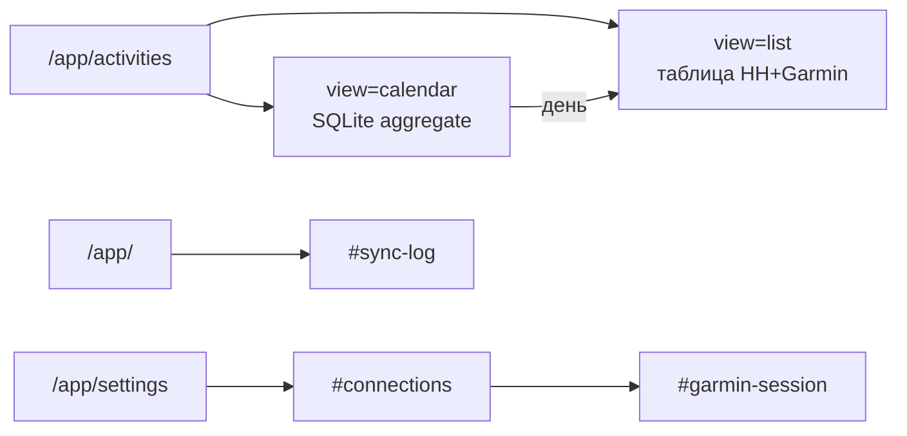

# Карта экранов `/app`

> Полная спецификация: **[APP-UI.md](../APP-UI.md)** · архитектура: [ARCHITECTURE.md](../ARCHITECTURE.md) · roadmap: [PLAN.md](../PLAN.md#снимок-кабинета-app).

**Статус (2026-05-26):** функциональная IA в prod (`cabinet.html`, nav-pills). Sidebar — прототип `/app/ui-preview`.

## User flows

```text
Гость → /register или /app/login
     → /app/activities          ← главный экран (List | Calendar)
     → /app/                    ← сводка sync + sync log (#sync-log)
     → /app/settings            ← profile, connections, garmin-session, password
     (layout: full width, left-aligned — APP-UI §1)

Просмотр поездки:
  Calendar → клик дня → /app/activities?view=list&date_from=&date_to=
  List → фильтры q / status / source / dates → re-sync / .fit

Admin → /app/admin/ (users CRUD)

Legacy (редирект):
  /app/log     → /?#sync-log
  /app/session → /settings#garmin-session
```



## Экраны (индекс)

| URL | Шаблон / компонент | § APP-UI | Примечание |
|-----|-------------------|----------|------------|
| `/app/activities` | `pages/app/activities.html` | §6.2 | `view=list` (default) \| `calendar` |
| `/app/activities` (calendar) | `components/activity_calendar.html` | §6.2 | `year`, `month`, фильтр `source` |
| `/app/` | `pages/app/dashboard.html` | §6.1 | + `sync_log_section.html` |
| `/app/settings` | `pages/app/settings.html` | §6.3 | `#profile` · `#connections` · `#password` |
| `/app/settings` | `components/garmin_session_section.html` | §6.3 | `#garmin-session` внутри Connections |
| `/app/log` | — | §6.4 | **303** → dashboard `#sync-log` |
| `/app/session` | — | §6.3 | **303** → settings `#garmin-session` |
| `/app/admin/` | `pages/admin/users.html` | §6.5 | |
| `/app/admin/users/*` | `pages/admin/user_form.html` | §6.5 | |
| `/app/login` | `pages/app/login.html` | — | `site_auth`, вне app shell |
| `/register` | `pages/site/register.html` | — | `site_auth` |
| 403 | `pages/forbidden.html` | §6.6 | |
| `/app/ui-preview` | `ui_preview_*.html` | APP-UI §2 | Wireframe sidebar + экраны |

**Удалены / не используются:** отдельные `pages/app/log.html`, `pages/app/session.html` (только redirect).

## Nav (prod)

Порядок в [`cabinet.py`](../../getsync/web/cabinet.py): **Activities** → Dashboard → Settings → Admin (если `is_admin`).

## Компоненты по экранам

| Экран | Ключевые includes |
|-------|-------------------|
| Activities | `activities_tabs`, `activity_calendar` (calendar), `filter card`, `pager`, `resync_form`, `datetime_cell`, `status_badge` |
| Dashboard | `page_header`, sync summary card, `sync_log_section` |
| Settings | `settings_subnav`, `connection_card`, `garmin_session_section`, `locale_select`, `timezone_select` |

## Wireframes (`/app/ui-preview`)

| URL | Шаблон |
|-----|--------|
| `/app/ui-preview` | `ui_preview_index.html` |
| `/app/ui-preview/dashboard` | `ui_preview_dashboard.html` |
| `/app/ui-preview/activities` | `ui_preview_activities.html` (tabs + calendar) |
| `/app/ui-preview/settings` | `ui_preview_settings.html` |
| `/app/ui-preview/admin` | `ui_preview_admin.html` |

## Боли → mitigation

| Боль | Где зафиксировано |
|------|-------------------|
| Два входа (Basic + app) | Снято **1.4** |
| HH/Garmin не на dashboard | Connections в Settings — APP-UI §1 |
| Log/session в nav | Убраны; log на dashboard, session в settings |
| Календарь без облачных дней | v6.1 в PLAN **2.3** 📋 |
| Sync log: duplicate vs error | PLAN **2.3** 📋 · APP-UI §6.4 |

Детали layout, tokens, a11y — [APP-UI.md §3–9](../APP-UI.md).
